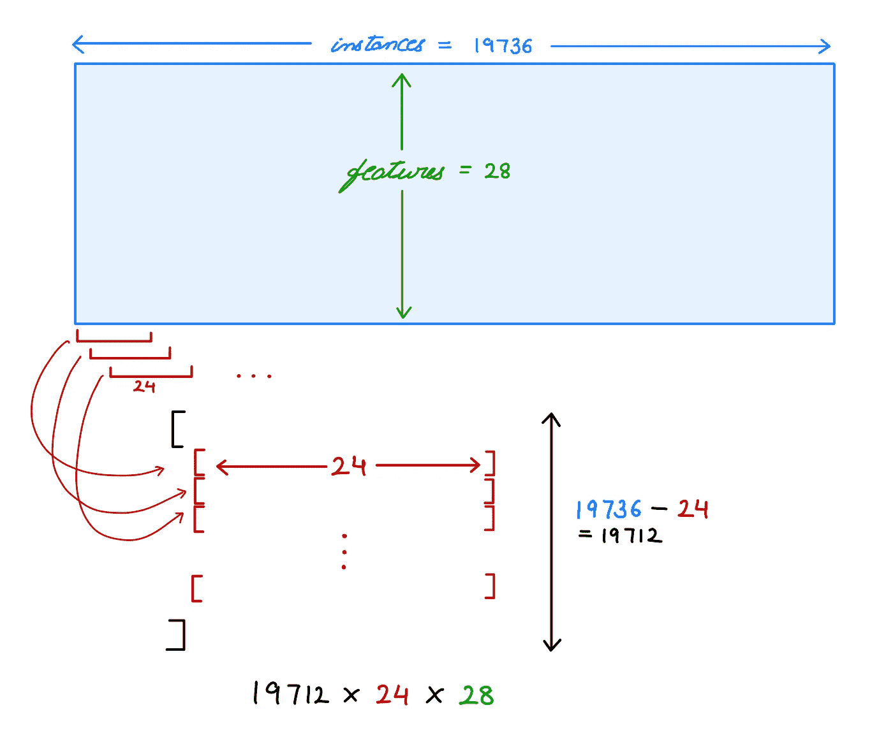
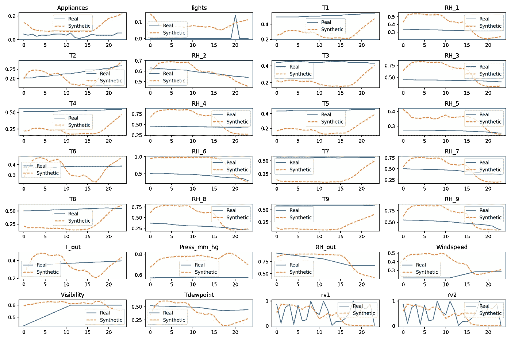
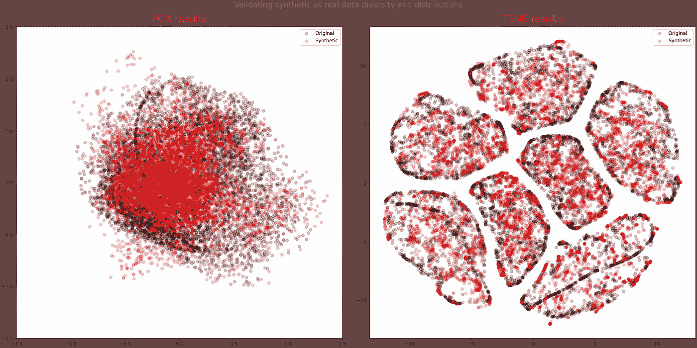

# 使用 TimeGAN 建模和生成时间序列数据

> 原文：<https://towardsdatascience.com/modeling-and-generating-time-series-data-using-timegan-29c00804f54d?source=collection_archive---------5----------------------->

## 使用具有 TimeGAN 高级实现的库生成时间序列数据


由[阿格巴洛斯](https://unsplash.com/@agebarros?utm_source=medium&utm_medium=referral)在 [Unsplash](https://unsplash.com?utm_source=medium&utm_medium=referral) 上拍摄的照片

# 1.背景

在[之前的一篇文章](/generating-expanding-your-datasets-with-synthetic-data-4e27716be218)中，我们探索了生成人工或合成数据的想法，给出了有限数量的数据集作为起点。当时取的数据是表格形式的，就像我们平时遇到的常规数据集。然而，在本文中，我们将着眼于时间序列数据，并探索一种生成合成时间序列数据的方法。

# 2.时间序列数据—简要概述

那么，时间序列数据与常规的表格数据有什么不同呢？时序数据集有一个额外的维度—时间。把它想象成一个 3D 数据集。比方说，我们有一个包含 5 个要素和 5 个输入实例的数据集。


作者图片

那么时间序列数据基本上是该表在第三维中的扩展，其中每个新表只是新时间步的另一个数据集。


作者图片

主要区别在于，与表格数据相比，时间序列数据有更多的数据点实例。

# 3.案例研究:能源数据集

如果我们查看能源数据集(此处可用[此处](https://github.com/jsyoon0823/TimeGAN/blob/master/data/energy_data.csv)，最初取自此处[的数据)，它实际上看起来只是一个常规的表格数据集，每一行都意味着一个新的时间步长，并以特征的形式拥有其相应的数据点。根据数据栏，每个条目在 10 分钟后被记录。](http://archive.ics.uci.edu/ml/datasets/Appliances+energy+prediction)

但是我们在前面的章节中已经看到它看起来像是一个 3D 表格数据集，对吗？这是我们可以利用一种聪明的采样数据点的方式来创建第三维空间的地方。

我们取一个大小为 24 的窗口，并沿着数据集的行运行它，一次移动一个位置，从而获得一定数量的 2D 矩阵，每个矩阵的长度为 24，并具有我们所有的列特征。



作者图片

在能源数据集中，有 19736 行。通过每 24 行移位采样，我们得到 19712 个条目，每个条目有 24 行和 28 个特征。然后，我们当然可以随机混合它们，以使它们独立且同分布(IID)。因此，本质上我们得到了一个维度数据集(19712，(24，28))，其中 19712 个实例中的每一个都有 24 行(即时间步长)和 28 个特征。这个实现可以在[这里](https://github.com/ydataai/ydata-synthetic/blob/master/src/ydata_synthetic/preprocessing/timeseries/utils.py)找到。

# 4.使用 TimeGAN 生成时间序列数据

TimeGAN(时序生成对抗网络)是针对合成时序数据的一种实现。它基于同一作者的一篇[论文](https://papers.nips.cc/paper/2019/hash/c9efe5f26cd17ba6216bbe2a7d26d490-Abstract.html)。YData 的 ydata-synthetic TimeGAN 实现本质上使其在一个易于使用的库中可用，该库可以作为 Python 包索引(PyPi)安装。在本文中，我们将使用撰写本文时的最新版本 0.3.0。

```
pip install ydata-synthetic==0.3.0
```

关于这个的更多细节在[ydata-synthetic repository](https://github.com/ydataai/ydata-synthetic)上。在本节中，我们将研究如何使用能源数据集作为输入源来生成时间序列数据集。

我们首先读取能量数据集，然后以数据转换的形式应用一些预处理。这种预处理实质上是在范围[0，1]内缩放数据，并应用我们在上一节中看到的数据转换。

现在，从这个时间序列数据( *energy_data* )生成实际的合成数据是最简单的部分。我们基本上是在我们的 *energy_data* 上训练 TimeGAN 模型，然后使用训练好的模型来生成更多。

其中必须根据我们的要求适当地定义要提供给 TimeGAN 构造函数的参数。我们将 *n_seq* 定义为 28(特性)，将 *seq_len* 定义为 24(时间步长)。其余参数定义如下:

现在我们已经有了生成的 *synth_data* ，让我们看看它与我们的原始数据相比，在视觉上有什么不同。我们可以为 28 个特征中的每一个绘制一个图，并观察它们随时间步长的变化。



作者图片

这些图只是稍微有点意思，可能对比较没有用处。显而易见，合成数据肯定会不同于原始(真实)数据，否则这样做没有任何意义。鉴于数据集有如此多的要素，也很难以直观的方式将它们一起可视化和解释。更有趣和更有帮助的是在一个对我们来说更容易理解和更直观的维度上可视化(和比较)这些生成的数据。

# 5.评估和可视化

我们可以利用以下两种众所周知的可视化技术:

1.  PCA —主成分分析
2.  t-SNE——t-分布随机邻居嵌入

这些技术背后的基本思想是应用降维，以便可视化那些具有大量维度(即大量特征)的数据集。主成分分析和 t-SNE 都能够实现这些，它们之间的主要区别在于，主成分分析试图保留数据的全局结构(因为它着眼于在整个数据集内全局保留数据集方差的方式)，而 t-SNE 试图保留局部结构(通过确保原始数据中靠近的点的邻居在降维空间中也靠近)。可以在[这里](https://datascience.stackexchange.com/a/36890/118385)找到详细说明差异的精彩答案。

对于我们的用例，我们将使用 sklearn 中的 PCA 和 TSNE 对象。

既然我们要绘制的数据已经准备好了，我们可以使用 matplotlib 来绘制原始的和合成的转换。 *pca_real* 和 *pca_synth* 一起给我们 pca 结果，并且 *tsne_results* 包含原始的和合成的(由于连接)t-SNE 变换。



作者图片

这些图表告诉我们什么？它们向我们展示了如果将整个数据集转换为具有较少要素的数据集(两个轴对应于两个要素)，它可能会是什么样子。主成分分析图可能不足以得出正确的结论，但 t-SNE 图似乎告诉我们，原始数据(黑色)和合成数据(红色)似乎遵循相似的分布。此外，特定于数据集的观察结果是，在整个数据集中有 7 个组(聚类)，它们的数据点彼此(明显地)相似(因此聚类在一起)。

# 6.结论

我们简要地看了时间序列数据以及它与表格数据的区别。通过 ydata-synthetic 库使用 TimeGAN 架构是为了生成更多的时序数据。笔记本中的完整实现可以在[这里](https://github.com/archity/synthetic-data-gan/blob/main/timeseries-data/energy-data-synthesize.ipynb)找到。