# 使用 Memgraph 对交通网络进行建模、可视化和导航

> 原文：<https://towardsdatascience.com/modeling-and-navigating-a-transportation-network-with-memgraph-944f84828007?source=collection_archive---------29----------------------->

## [实践教程](https://towardsdatascience.com/tagged/hands-on-tutorials)

## 了解如何通过使用 Cypher 查询语言和简单的图形算法在伦敦找到自己的路。


威尔·H·麦克马汉在 [Unsplash](https://unsplash.com/?utm_source=unsplash&utm_medium=referral&utm_content=creditCopyText) 拍摄的照片

# 介绍

如果骑自行车或步行不是一种选择，使用公共交通是在城市中旅行的最环保的方式。在公共交通系统中导航可能会令人困惑和复杂。

作为一名乘客，你通常想知道如何从一个车站到另一个车站，以及在哪里换车，以尽可能优化你的旅程。本质上，问题是在复杂的车站和线路网络中寻找最短路径。这种类型的问题是一个典型的图形用例。图表用于建模和导航各种领域的复杂网络问题，包括交通、网络安全、欺诈检测等等。

在本教程中，您将探索如何使用图表来建模和导航交通网络。您将学习如何将伦敦地铁数据集导入 Memgraph，并使用 Memgraph Lab 在地图上显示该数据集。接下来，您将学习如何使用 Cypher 查询语言和图形算法来帮助您探索伦敦地铁网络，并在城市中找到自己的路，而不会迷路或因交通堵塞而浪费时间。

# 先决条件

要完成本教程，您需要:

*   一个 [Memgraph DB](https://docs.memgraph.com/memgraph/getting-started/installation/) 的安装:一个本地的、内存中的图形数据库。要安装和设置 Memgraph DB，请遵循[安装](https://docs.memgraph.com/memgraph/getting-started/installation/)指南上的 **Docker 安装**说明。
*   一个 [Memgraph Lab](https://memgraph.com/download#Lab-download) 的安装:一个用于导入数据、开发、调试和分析数据库查询以及可视化查询结果的集成开发环境。
*   你可以在这里下载伦敦地铁网络数据集。

# 定义图形数据模型

在本教程中，您将使用由 [Nicola Greco](https://github.com/nicola/tubemaps) 发布的伦敦地铁网络数据集。它包含 302 个站(节点)和 812 个连接(边)。节点`lat`和`lng`属性表示一个站点的坐标，对于在地图上可视化数据也很重要。

如果两个站相邻，则用`:Connection`类型的边连接。因为火车是双向行驶的，所以每个方向都有优势。

每条边都有一个表示在两个站点之间旅行所需时间(以分钟为单位)的`time`属性和一个`line`属性，在本教程稍后添加一个`name`属性后，这个属性会更有意义。

既然已经定义了方案，就可以导入数据集了。

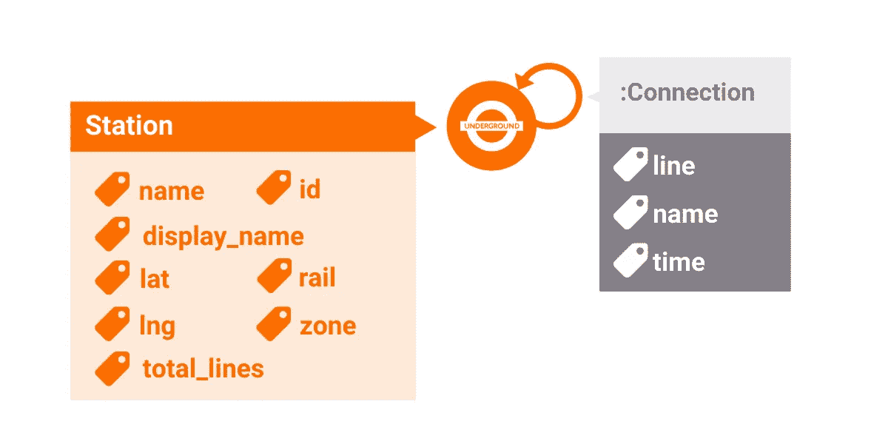

作者图片

# 使用 CVS 导入工具导入数据集

第一步是将数据加载到 Memgraph 中。Memgraph 附带了将数据导入数据库的工具。对于本教程，您将使用 **CSV 导入工具**。

CSV 导入工具应该用于将数据初始批量摄取到 Memgraph 中。在接收时，CSV 导入程序会创建一个快照，数据库将使用该快照在下次启动时恢复其状态。你可以[在这里了解快照](https://docs.memgraph.com/memgraph/concepts/storage/#durability-and-data-recovery)。

## 格式化 CSV 文件

CSV 文件的每一行代表应该导入到数据库中的单个条目。节点和关系都可以使用 CSV 文件导入数据库。

要获得所有相关数据，您需要三个文件。第一个包含关于节点的数据(`stations.csv`)，另外两个包含关于关系的数据(`connections.csv`和`connections-reverse.csv`)。每个 CSV 文件必须有一个描述数据的标题。
`stations.csv`有如下表头:

```
id:ID(STATION),lat:double,lng:double,name:string,display_name:string,zone:int,total_lines:int,rail:int
```

`ID`字段类型设置在创建关系时将用于节点的内部`ID`。这是可选的，没有指定`ID`值的节点将被导入，但不能连接到任何关系。

当导入关系时，`START_ID`字段类型将应该与关系连接的开始节点设置为带有`END_ID`的结束节点。必须指定字段，并且节点`ID`必须是节点 CSV 文件中指定的节点 id 之一。

文件`connections.csv`和`connections-reverse.csv`除了头之外是一样的。这是因为我们需要两个方向的连接，因此，与其在导入数据后创建缺失的关系，不如导入第二个文件，并在其中切换`START_ID`和`END_ID`。因此，您从第一个文件中获得了每个关系的副本，只是方向相反。

```
:END_ID(STATION),:START_ID(STATION),line:int,time:int:START_ID(STATION),:END_ID(STATION),line:int,time:int
```

## 使用 CSV 导入工具

**【注意】**如果您的 Memgraph 数据库实例正在运行，您需要在继续下一步之前停止它。

首先，您需要将 CSV 文件复制到 Docker 映像可以看到它们的地方。导航到包含数据文件的文件夹，并运行以下命令:

```
docker container create --name mg_import_helper -v mg_import:/import-data busybox
docker cp connections.csv mg_import_helper:/import-data
docker cp connections-reverse.csv mg_import_helper:/import-data
docker cp stations.csv mg_import_helper:/import-data
docker rm mg_import_helper
```

用于指定输入 CSV 文件的两个主要标志是`--nodes`和`--relationships`。
节点标签(`Station`)和关系类型(`:Connection`)需要在导入时设置，因为 CSV 文件不包含这些信息。

您可以使用以下命令运行导入程序:

```
docker run -v mg_lib:/var/lib/memgraph -v mg_etc:/etc/memgraph -v mg_import:/import-data --entrypoint=mg_import_csv memgraph --nodes Station=/import-data/stations.csv --relationships Connection=/import-data/connections.csv --relationships Connection=/import-data/connections-reverse.csv --data-directory /var/lib/memgraph true --storage-properties-on-edges true
```

现在，您可以通过运行以下命令来启动 Memgraph:

```
docker run -v mg_lib:/var/lib/memgraph -p 7687:7687 memgraph:latest --data-directory /var/lib/memgraph
```

如果您对 CSV 导入工具有其他问题，请查看我们的文档: [CSV 导入工具](https://docs.memgraph.com/memgraph/database-functionalities/import-data/#csv-import-tool)。

# 用 Memgraph Lab 可视化图形

一旦你有了 Memgraph 中的数据，用 Memgraph Lab 可视化它就相当容易了。 **Memgraph Lab** 自动检测具有数字`lat`和`lng`属性的节点。要获得图表，请运行以下 Cypher 查询:

```
MATCH (n)-[r]-(m)
RETURN n,r,m;
```

如果一切正常，您应该会得到类似于下图的可视化效果。

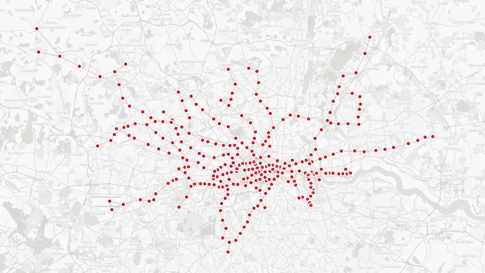

作者图片

## 向边缘添加属性

属性没有多大意义，因为我们通常通过名称或颜色来识别伦敦地铁线。除非你在边上添加一个`name`属性，否则地图会更加混乱。

下面的 Cypher 查询使用了允许列出多个谓词的`CASE`表达式。匹配第一个计算结果为`true`的表达式，在`THEN`关键字之后提供的表达式的结果用于设置关系的`name`属性的值。

```
MATCH (n)-[r]-(m)
SET r.name = CASE
WHEN r.line = 1  THEN "Bakerloo Line"
WHEN r.line = 2  THEN "Central Line"
WHEN r.line = 3  THEN "Circle Line"
WHEN r.line = 4  THEN "District Line"
WHEN r.line = 5  THEN "East London Line"
WHEN r.line = 6  THEN "Hammersmith & City Line"
WHEN r.line = 7  THEN "Jubilee Line"
WHEN r.line = 8  THEN "Metropolitan Line"
WHEN r.line = 9  THEN "Northern Line"
WHEN r.line = 10 THEN "Piccadilly Line"
WHEN r.line = 11 THEN "Victoria Line"
WHEN r.line = 12 THEN "Waterloo & City Line"
WHEN r.line = 13 THEN "Docklands Light Railway"
END;
```

## 设计图表样式

虽然数据集现在更有意义，但地图的样式仍然有点过于统一。您可以使用 Memgraph Lab 中的样式编辑器根据自己的喜好设置地图的样式。你可以在本教程中阅读更多关于样式编辑器[的内容。](https://memgraph.com/blog/how-to-style-your-graphs-in-memgraph-lab)

首先，让我们把车站变小，做成正方形。一个带黑边的白色圆圈是为换乘站预留的(在那里你可以在线路之间切换)。为此，您将使用以下样式脚本:

```
@NodeStyle HasLabel?(node, "Station") {
    size: 15
    color: black
    shape: "square"
    color-hover: red
    color-selected: Darker(red)
}@NodeStyle Greater?(Property(node, "total_lines"), 1) {
    size: 30
    shape: "dot"
    border-width: 2
    border-color: black
    color: white
    color-hover: red
    color-selected: Darker(red)
}@NodeStyle HasProperty?(node, "name") {
    label: AsText(Property(node, "name"))
}
```

现在你可以添加最重要的东西，标志性的线条颜色！为此，您将使用以下脚本:

```
@EdgeStyle HasProperty?(edge, "name") {
  label: AsText(Property(edge, "name"))
  width: 10
}@EdgeStyle Equals?(Property(edge, "line"),1)  {color: #AE6017}
@EdgeStyle Equals?(Property(edge, "line"),2)  {color: #F15B2E}
@EdgeStyle Equals?(Property(edge, "line"),3)  {color: #FFE02B}
@EdgeStyle Equals?(Property(edge, "line"),4)  {color: #00A166} 
@EdgeStyle Equals?(Property(edge, "line"),5)  {color: #FBAE34}
@EdgeStyle Equals?(Property(edge, "line"),6)  {color: #F491A8}
@EdgeStyle Equals?(Property(edge, "line"),7)  {color: #949699}
@EdgeStyle Equals?(Property(edge, "line"),8)  {color: #91005A}
@EdgeStyle Equals?(Property(edge, "line"),9)  {color: #000000}
@EdgeStyle Equals?(Property(edge, "line"),10) {color: #094FA3}
@EdgeStyle Equals?(Property(edge, "line"),11) {color: #0A9CDA}
@EdgeStyle Equals?(Property(edge, "line"),12) {color: #88D0C4}
@EdgeStyle Equals?(Property(edge, "line"),13) {color: #00A77E}
```

您的图表现在应该看起来像这样:

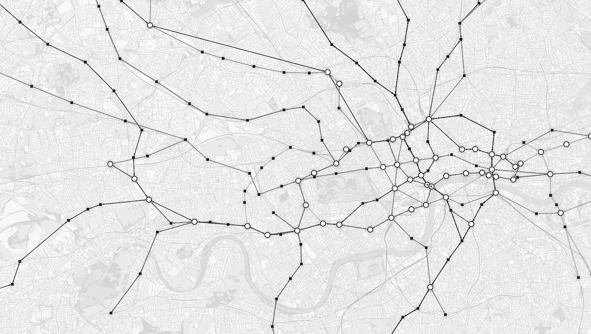

作者图片

# 探索图形网络

现在，您已经将图形数据加载到 Memgraph 中，并在 Memgraph Lab 中设置了可视化，您已经准备好开始使用图形遍历和算法来探索伦敦地铁网络。

假设你正在计划一次旅行，想在一个交通便利的车站附近找一家酒店。

通过使用以下密码查询，您将找到哪些工作站与其他工作站的连接最多:

```
MATCH (s1:Station)-[:Connection]->(s2:Station)
WITH DISTINCT s2.name as adjacent, s1.name as name
RETURN name AS Station_name, COUNT(adjacent) AS Total_connections
ORDER BY Total_connections DESC LIMIT 10;
```

对于每个桩号，查询的第一部分匹配所有相差一度的桩号。第二部分计算连接数，并返回 10 个连接最多的站的列表。

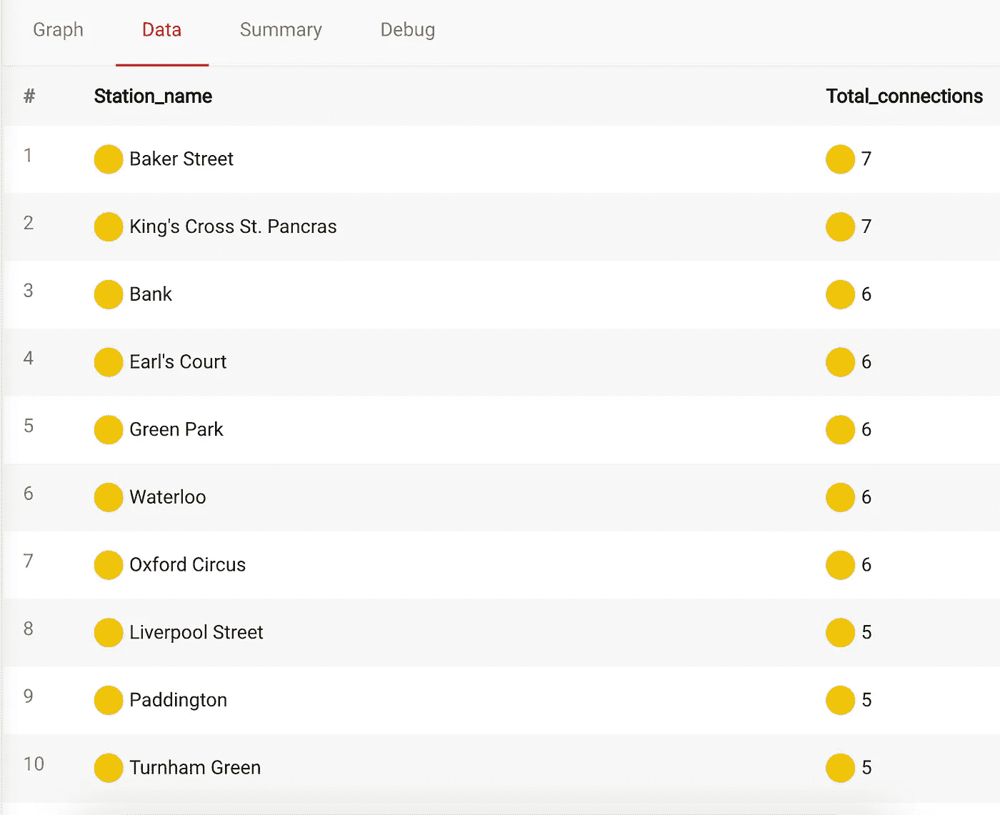

作者图片

现在你有你的清单，国王十字圣潘克拉斯是显而易见的选择。通过运行以下查询，您可以很容易地检查您可以从 King's Cross St. Pancras 访问哪些管道线路:

```
MATCH (:Station {name:"King's Cross St. Pancras"})-[r]-(:Station)
WITH DISTINCT r.name AS line
RETURN line;
```

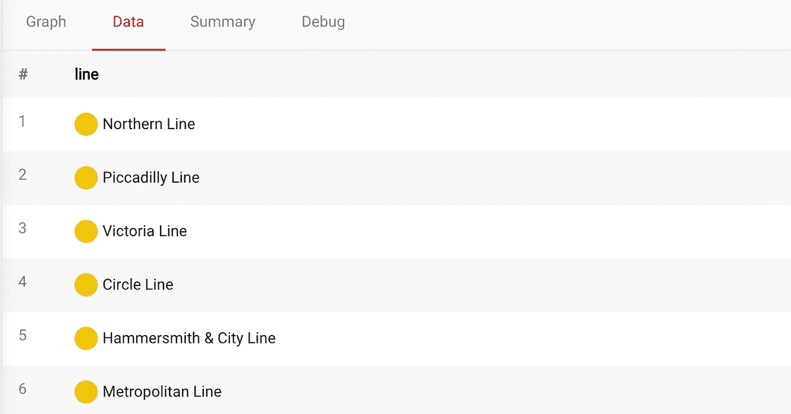

作者图片

比方说，你正在进行一次预算旅行，你想留在第一票价区，以保持较低的交通成本。在这种情况下，您可以使用广度优先算法来查找在第一票价区停留期间您可以从圣潘克拉斯到达哪些车站:

```
MATCH p = (s1:Station {name:"King's Cross St. Pancras"})
          -[:Connection * bfs (e, n | n.zone = 1)]-
          (s2:Station)    
UNWIND (nodes(p)) as rows
WITH DISTINCT rows.name as Station 
RETURN Station LIMIT 10;
```

`(e, n | n.zone = 1)`被称为*滤波器λ*。这个函数采用一个边符号`e`和一个节点符号`n`，并通过返回`true`或`false`来决定该边和节点对在广度优先扩展中是否有效。在这个例子中，如果车站在第一收费区，lambda 返回`true`。

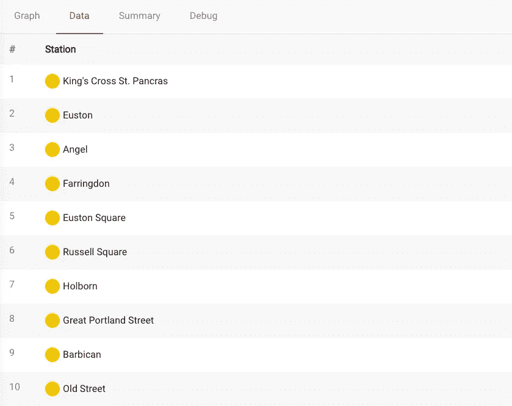

作者图片

或者，如果您更喜欢视觉，您可以通过运行以下查询来可视化您的结果:

```
MATCH p = (:Station {name:"King's Cross St. Pancras"})
          -[:Connection * bfs (e, n | n.zone = 1)]-
          (:Station)
RETURN p;
```

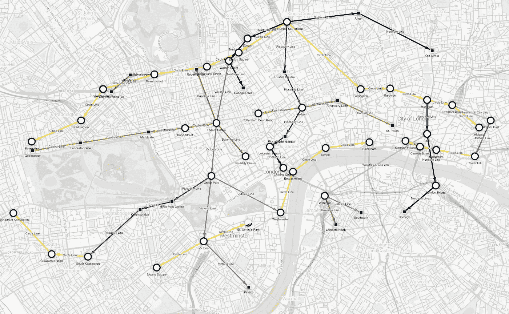

作者图片

假设你刚刚到达伦敦希思罗机场。你可能累了，急需洗个澡，打个盹儿，但是在去酒店的路上，你会想去位于威斯敏斯特地铁站的大本钟。

幸运的是，Memgraph 可以帮助你立刻找到最快的路线！

寻路算法是经典的图论问题之一，自 19 世纪以来一直被研究。最短路径算法计算图中两个节点之间的路径，使得边权重的总和最小。
这里的语法类似于广度优先搜索语法。代替一个*过滤器λ*，我们需要提供一个*权重λ*和*总权重符号*。给定一个边和节点对， *weight lambda* 必须返回使用给定边扩展到给定节点的成本(`time`)。

```
MATCH p = (s1:Station {name: "Heathrow Terminal 4"})
          -[edge_list:Connection *wShortest (e, n | e.time) time]-
          (s2:Station {name: "Westminster"})
RETURN *;
```

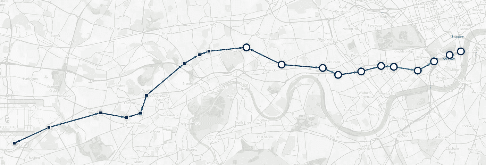

作者图片

这条路线将让你在 43 分钟内从希思罗机场到威斯敏斯特，但在环线和区线有延迟，所以你想把他们排除在搜索之外。您可以在最短路径查询中组合使用*权重*和*过滤器λs*:

```
MATCH p = (s1:Station {name: "Heathrow Terminal 4"})
          -[edge_list:Connection *wShortest (e, n | e.time) time (e, n | e.name != "Circle Line" AND e.name != "District Line")]-
          (s2:Station {name: "Westminster"})
RETURN *;
```

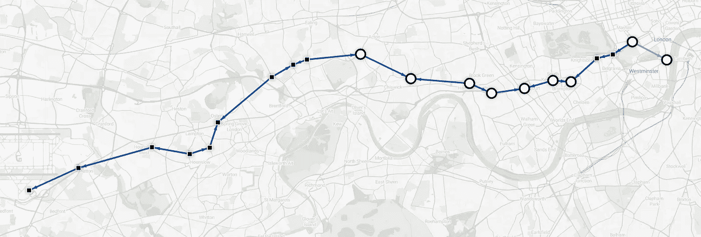

作者图片

新路线只多 3 分钟，但你会避免延误。

从威斯敏斯特出发的最短路线将在 10 分钟内带您到达酒店(不包括环线和区线)。

```
MATCH p = (s1:Station {name: "Westminster"})
          -[edge_list:Connection *wShortest (e, n | e.time) time (e, n | e.name != "Circle Line" AND e.name != "District Line")]-
          (s2:Station {name: "King's Cross St. Pancras"})
RETURN *;
```

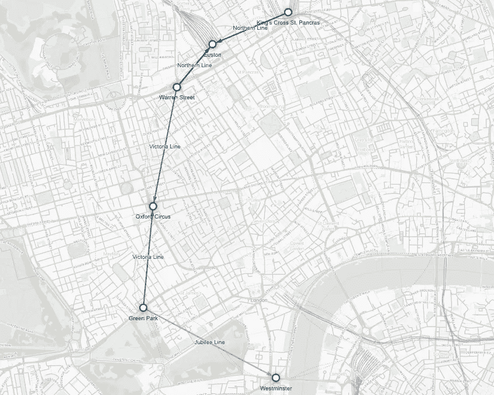

作者图片

令人惊讶的是，伦敦有多少博物馆和美术馆是免费参观的。大英博物馆绝对应该是你的首选！虽然你可以在那里呆上几个小时，但是你想什么都看一点，所以让我们再增加几个选项。

托特纳姆法院路站离大英博物馆最近，这将是您的第一站。南肯辛顿站距离三个令人惊叹的博物馆只有几步之遥:科学博物馆、自然历史博物馆和维多利亚和阿尔伯特博物馆。要找到旅行的最佳路线，您可以使用以下 Cypher 查询:

```
MATCH p = (:Station {name: "King's Cross St. Pancras"})
          -[:Connection *wShortest (e, n | e.time) time1]-
          (:Station {name: "Tottenham Court Road"})
          -[:Connection *wShortest (e, n | e.time) time2]-
          (:Station {name: "South Kensington"})
RETURN p, time1 + time2 AS total_time;
```

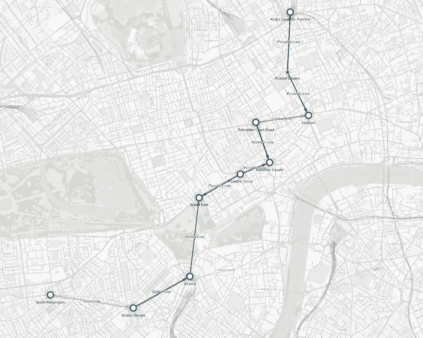

作者图片

# 结论

在本教程中，您学习了如何使用 **Memgraph** 和 **Cypher** 对复杂的交通网络进行建模和导航。在图形算法的帮助下，您找到了最佳路线，并学习了如何使用 **Memgraph Lab** 可视化数据以充分利用数据。如果你有兴趣探索另一个图形路线规划教程，你可以在 [Memgraph Playground](https://playground.memgraph.com/) 上查看[探索欧洲路网](https://playground.memgraph.com/Europe)演示。

一个朋友曾经告诉我:

在伦敦你永远不会迷路，你只要找到一个地铁站，就知道你在哪里了

我会说:

“你永远不会在伦敦迷路，你只需要用 Memgraph 找到最短的路径！”

记住，永远站在右边，别忘了注意空隙！