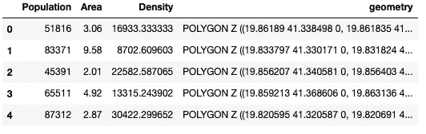
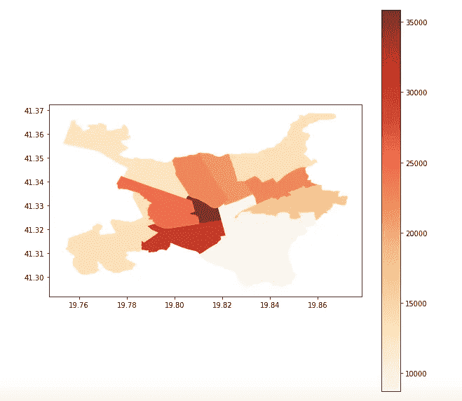
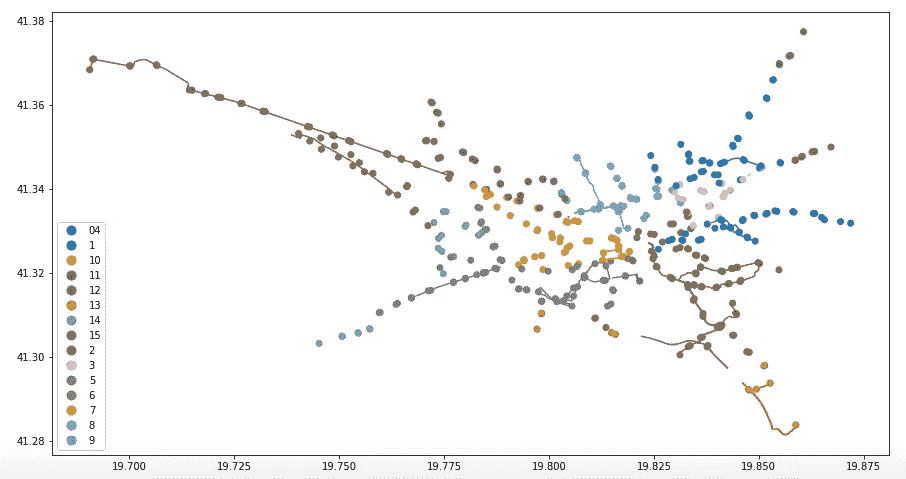
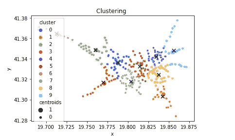
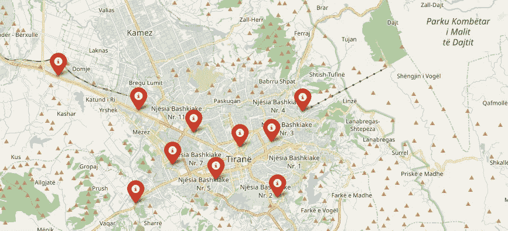
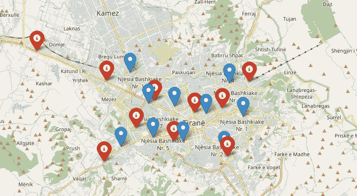
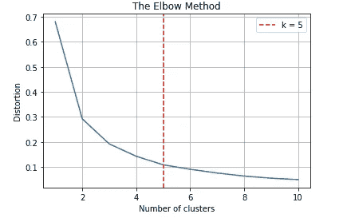
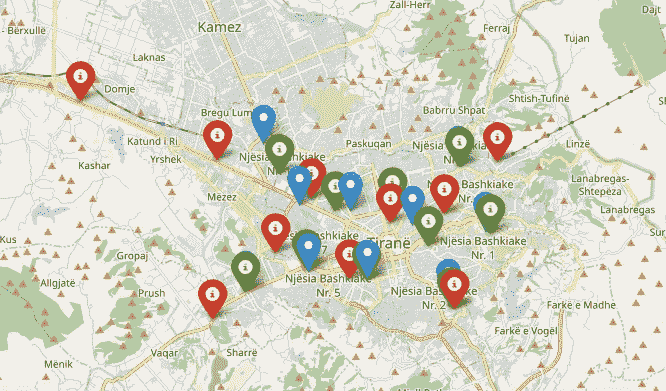

# 阿尔巴尼亚地拉那自行车共享服务模型

> 原文：<https://towardsdatascience.com/modeling-bike-share-services-in-cities-5fd2a7f78f72?source=collection_archive---------30----------------------->

## 使用无监督学习为自行车共享服务的最佳城市场所建模

在 [Unsplash](https://unsplash.com?utm_source=medium&utm_medium=referral) 上由 [Edin Murati](https://unsplash.com/@edinmuratti?utm_source=medium&utm_medium=referral) 拍摄的照片

在这个故事中，我想从数据科学的角度来看看自行车共享服务。具体来说，这篇文章是关于使用各种建模技术来找出在阿尔巴尼亚地拉那放置自行车站的最佳地点。地拉那是我的家乡，最近我受到了它的新举措的启发，这些举措将骑自行车作为一种通勤和健康活动，特别是通过增加受保护的自行车道、特别的“无车日”和一般的道路安全措施。然而，这个城市没有一个主要的自行车共享平台，所以我想使用机器学习来解决这个问题。

首先，一些设置。当考虑最佳自行车站位置时，考虑诸如人口聚集、与其他公共交通的接近程度或人们通常通勤的商业区聚集等因素是有意义的。这是因为建立一个成功的自行车共享服务将涉及到确保尽可能多的人可以使用它，并且他们可以可行和可靠地每天使用它去工作或其他地方。市长办公室提供了一些关于每个行政区域的人口以及公共交通站路线的信息。我们将首先在这两个基础上构建，并使用 K-Means 聚类和叶子来可视化我们的预测。

## 数据

这是地拉那所有 11 个行政区的人口统计数据集(摘自本网站:【https://opendata.tirana.al/?q=popullsia-e-tiran%C3%ABs-2020】T4)。为了更清楚，我还使用 GeoPandas 内置的绘图功能添加了一张地图:

包括人口数量和多边形几何的数据框(图片由作者提供)

地拉那的密度(图片由作者提供)

上面的地图实际上是绘制区域的密度，以说明不同的区域大小，我选择了红色的连续调色板，使不同值之间的区别清晰。

此外，我们还可以访问公交车站数据，这些数据代表主要的公交线路和停靠点(摘自本网站:[https://open data . Tirana . al/sites/default/files/Lin jat _ e _ autobus _ ve _ publik _ _ dhe _ stacionet . geo JSON](https://opendata.tirana.al/sites/default/files/linjat_e_autobus_ve_publik__dhe_stacionet.geojson))。地拉那没有地铁系统，所以大部分公共交通实际上是由公共汽车进行的。在下面，您可以找到公交车站地图的数据框和绘图:

地拉那的公交车站(图片由作者提供)

酷！现在让我们开始建模。首先，让我们用 K-Means 聚类模型来拟合我们的数据。模型将作为输入的要素是公交车站点的 x 和 y 坐标，并且它将输出多个聚类。以下是拟合和预测:

叠加了集群的公交车站地图(图片由作者提供)

现在我们有了一些预测，让我们在上下文中或者在地拉那的地理空间中可视化它们。为此，我们可以使用 glory，这是一个用于地图可视化的 Python 包，它允许我们添加如下弹出窗口:

星团的叶图(图片由作者提供)

然而，这种模式足够好吗？需要记住的一点是，我们当前的模型没有考虑这些站点所服务的人口规模，因此它可能不代表自行车共享服务需求最多的地方。幸运的是，我们可以向 K-Means 聚类传递一个“权重”参数，该参数在聚类数据时也会考虑人口规模:

现在让我们将两个聚类结果映射在一起，看看预测是如何变化的:

星团的叶图(图片由作者提供)

## 完善模型

从这一点出发，我们将继续使用加权 K 均值模型，并尝试对其进行改进。在我们开始之前，让我们看看如何对我们正在生产的模型进行评分。我们将使用**剪影配乐**和**卡林斯基哈拉巴斯配乐。**前者取-1(最差)到 1(最好)的值，计算为每个样本的平均类内距离和平均最近类距离。后者不受数值的限制，而是被定义为所有聚类的聚类间离差和聚类内离差之和的比值。

因此，我们可以看到，在第二个加权模型中，轮廓得分实际上是下降的，Calinski Harabasz 得分也是如此。

## 要使用多少个集群？

构建模型的另一个方面是考虑将点分成多少个聚类，因为这对于聚类的整体结构以及有多少个点进入其中有许多影响。以下是如何在代码中实现这一点，并在绘图中将其可视化:

肘法(图片由作者提供)

让我们将这一最佳聚类数应用于我们的模型，并更新我们的地图以显示它们，以绿色添加:

星团的叶图(图片由作者提供)

在这个小故事中，我们研究了如何建立一个模型来预测在大都市放置自行车站的最佳位置，在这个例子中是地拉那，我们探索并改进了我们模型的参数。在奠定基础之后，接下来的一些步骤将是让其他无人监管的模型适应数据，如自组织地图，并为数据集补充更多细节信息，如交通状况、在某个位置工作的人数，或许还有污染数据。这些可以为更复杂的模型提供信息，最终可以在现实世界中实现。

感谢您的阅读！