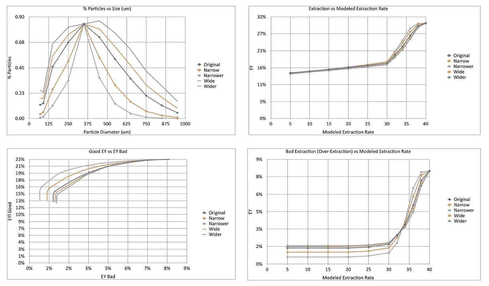

# 建模咖啡研磨机

> 原文：<https://towardsdatascience.com/modeling-coffee-gringers-afb7c4949d6b?source=collection_archive---------43----------------------->

## 咖啡数据科学

## 咖啡研磨机客观测量的首次尝试

当初买[咖啡](https://rmckeon.medium.com/a-collection-of-espresso-articles-de8a3abf9917?postPublishedType=repub)研磨机的时候，没有考虑好不好。它很便宜，而且在某种程度上很有效。这是一个 Hario 手动研磨机，它并不真的意味着浓缩咖啡。经过几年的其他几次升级，我终于准备出一些更大的账单来买一台真正好的电动研磨机。我的问题是不能区分好的磨床和坏的磨床。

我现在的研磨机。所有图片由作者提供

大多数研磨机评论集中在保留或与商业用途相关的使用方面。在过去的几年里，研磨咖啡已经被量化，但是这些并没有给出超过 500 美元的研磨咖啡质量更好的明确指标。通常，这些测试是用单个咖啡豆进行的，咖啡是拨入的。

谁说我不会拨入两个不同的磨床？冲泡方法、水温、水流、剂量或压力呢？量化分级研磨机的变量数量是巨大的。

我之前已经放弃了所有在互联网上容易找到的与浓缩咖啡相关的数据，但当它涉及到研磨机时，我等待了。最近，我又看了看，看看一个简单的模型能否预测两个研磨机将如何提取。我的模型只看表面面积和一个武断的理解研磨分布如何提取好的部分而不是坏的部分。

# 模型

当观察咖啡渣时，可用的表面积决定了提取咖啡的速度。理解表面积相对于体积的一个好方法是比值(表面积(SA)/体积(V))，如果我们假设咖啡颗粒是球形的，那么比值是 3/半径。对于其他形状，SA/V 通常是某个常数除以半径。

我们知道咖啡的最大提取率是 30%左右，所以我们要说的是，一旦你达到这个提取率，你就不能再提取了。此外，让我们假设只有前 22%的萃取物具有最好的味道。最后的 8%将被认为具有不太理想的更涩的味道。

现在，我们只需要一个任意的变量来封装流量、温度、压力和其他任何影响提取的因素。我们可以假设这些面积不变，即使当圆盘破裂时流量增加。但是为了测试的目的，我们可以扫描这个任意值的几个数字，看看它是如何影响提取的。然后我们可以看看几个不同的分布，真实的和模拟的，看看这个模型有多好地描述了我们的体验。

显然，在执行这种分析的同时还拥有一些真实世界的镜头提取数据将是惊人的，但这只是一小步。

# 样品

让我们从 EK43 研磨机的样本分布开始。粒子的百分比加起来并不是 100%，但是对于这些测试来说，这并不重要。所有的箱子都是相互关联的。幅度偏移会导致相同的结果。

首先，让我们看看提取 vs 建模率，我们也可以看看过度提取或糟糕的提取。随着总开采量的上升，过度开采最终将开始上升。请记住，更好的咖啡研磨将提取快，因此是第一个过度提取。

我们可以用这个糟糕的 EY 与总的进行比较，我们可以绘制出一个基本的 ROC 曲线。最好的研磨者会有较高的总 EY 或良好的 EY，较低的坏 EY。我添加了理论上的好的和坏的性能线，以给出性能需要根据模型如何变化的想法。

对于一些测试来说，这是一个很好的起点，在这些测试中，我们可以改变分布，扩大或缩小分布，严格限制分布，或者增加峰值。

# 粒子分布偏移

我们可以很容易地将分布向右或向左移动，以查看它们的效果。最精细的分布将给出跨速率的最高提取，但它也将给出最高的不良提取。最粗的实际上具有最高的提取能力，而不会得到提取的坏部分。这是有趣的，因为它类似于在高流速下较粗的研磨咖啡也可以实现高提取量的概念。

# 更窄/更宽

如果分布变得更窄或更宽会发生什么？对提取的影响很难看到，但是对于更窄的分布，不良提取减少。这在好的 EY vs 坏的中尤其明显。

这种想法与高端研磨机试图做的事情一致，将分布控制在更紧的范围内。

# 受限分发

我们可以通过将分布保持在三个箱来将这个概念变窄到更极端。这显示了 4 个变体之间的细微差别，但它们比原始版本有了很大的改进。

# 穗

钉鞋呢？我见过一些有尖峰的分布，粗面上的尖峰没有真正细的粒子伤害大。

这个测试对味道没有任何估计，但我们可以粗略地假设，没有坏 EY 的高 EY 会导致更好的味道。这还没有考虑到所用的浓缩咖啡机或任何其他方法。

我不确定这是查看研磨分布的最佳方式，还是模型过于简单。然而，我认为这是朝着正确方向迈出的一步，有助于回答这样一个问题，研磨者之间如何排名？

下一步是将该模型应用于可用的研磨机分布曲线，以进行比较和对比。

如果你愿意，可以在 Twitter 和 YouTube 上关注我，我会在那里发布不同机器上的浓缩咖啡视频和浓缩咖啡相关的东西。你也可以在 [LinkedIn](https://www.linkedin.com/in/robert-mckeon-aloe-01581595?source=post_page---------------------------) 上找到我。也可以关注我[中](https://towardsdatascience.com/@rmckeon/follow)。

# [我的进一步阅读](https://rmckeon.medium.com/story-collection-splash-page-e15025710347):

[浓缩咖啡系列文章](https://rmckeon.medium.com/a-collection-of-espresso-articles-de8a3abf9917?postPublishedType=repub)

[使用模式识别比较咖啡](/comparing-coffee-using-pattern-recognition-35b92cca4502)

[咖啡数据回顾:等级和风味](https://link.medium.com/1lDMQUH0Hbb)

[按地区、工艺、等级和价格分类的咖啡](/coffees-by-region-process-grade-and-price-7e17c3c44baf)

[家庭烘焙咖啡的经济学](/the-economics-of-home-roasting-coffee-93003ea31ee8)

[咖啡豆脱气](/coffee-bean-degassing-d747c8a9d4c9)

[解构咖啡:分割烘焙、研磨和分层以获得更好的浓缩咖啡](/deconstructed-coffee-split-roasting-grinding-and-layering-for-better-espresso-fd408c1ac535)

[浓缩咖啡的预浸:更好的浓缩咖啡的视觉提示](/pre-infusion-for-espresso-visual-cues-for-better-espresso-c23b2542152e)

[咖啡的形状](/the-shape-of-coffee-fa87d3a67752)

[搅拌还是旋转:更好的浓缩咖啡体验](https://towardsdatascience.com/p/8cf623ea27ef)

[香辣意式浓缩咖啡:热磨，冷捣以获得更好的咖啡](/spicy-espresso-grind-hot-tamp-cold-36bb547211ef)

[断续浓缩咖啡:提升浓缩咖啡](https://link.medium.com/vmI2zVeQabb)

[用纸质过滤器改进浓缩咖啡](/the-impact-of-paper-filters-on-espresso-cfaf6e047456)

[浓缩咖啡中咖啡溶解度的初步研究](/coffee-solubility-in-espresso-an-initial-study-88f78a432e2c)

[断奏捣固:不用筛子改进浓缩咖啡](/staccato-tamping-improving-espresso-without-a-sifter-b22de5db28f6)

[浓缩咖啡模拟:计算机模型的第一步](https://towardsdatascience.com/@rmckeon/espresso-simulation-first-steps-in-computer-models-56e06fc9a13c)

[更好的浓缩咖啡压力脉动](/pressure-pulsing-for-better-espresso-62f09362211d)

[咖啡数据表](https://towardsdatascience.com/@rmckeon/coffee-data-sheet-d95fd241e7f6)