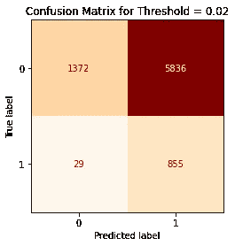

# 建模预期目标

> 原文：<https://towardsdatascience.com/modeling-expected-goals-a756baa2e1db?source=collection_archive---------10----------------------->

## 用逻辑回归预测射击成绩

作者图片

在[第一部分](https://iandragulet.medium.com/a-guide-to-expected-goals-63925ee71064)中，我们基于三个关键变量深入探究了镜头的数据和趋势；距离，角度和一个分类变量来识别头部射击。通过对数据的表示、转换和可视化，我们了解了与射门和进球相关的分布和概率。在这里，我们使用这些数据开发一个模型来预测目标。

# 分类

由于我们的响应变量(射击结果)是分类的，我们必须应用分类方法来创建一个预测模型。为了介绍这种方法，让我们看一个说明性的例子。假设我们从我们的数据中随机选择一些镜头，并根据它们的结果对它们进行分类，只考虑距离。

*图一。*作者图片

从上面我们可以看到蓝色和橙色星团之间有明显的区别。如果我们假设这是射击和距离之间关系的真实性质，并且我们想要基于该数据预测未来的射击结果，我们可以采用什么模型？

由于数据很容易分离，我们可以在两个集群之间画一条边界线。这条线将代表一个判别函数，我们将使用它来分类每一个射门结果是进球还是失误。在上面的例子中，判别函数映射出距离目标中心的距离 r。

这个以绿色绘制的判别函数是由𝑦=αx+β方程定义的，其中 x 是与目标的距离，y 是二元响应。具体针对上面的数据，y = x -12。我们可以通过将所谓的 Heaviside 函数应用于我们的判别式来将其转化为分类模型，该判别式将返回值 0 或 1，因为响应变量基于 y 的值:

Heaviside 函数是一个硬分类器，也是最简单的分类模型，但它要求数据是完全可分的。

图 2 和图 3。作者提供的图片

事实上，描述投篮的数据是不可分的，这使得进球很难准确预测。然而，亥维赛函数是进入更高级分类模型的自然进展。

如果我们取一个真实的数据样本，它可能类似于下图。

图 4。作者图片

在数据不能完全分离的情况下，我们必须对概率建模，而不是指定硬 0 和 1。我们在数据探索中已经看到，距离和角度变量的概率有明显的趋势。我们应该采用什么函数来模拟这些趋势？有许多函数可以绘制概率并拟合不可分的数据，但我们使用逻辑函数(也称为 sigmoid 函数)是因为它简单。

与 Heaviside 函数类似，逻辑函数接受我们的预测值(在这种情况下是距离)，但输出 0 到 1 之间的值。

图 5: *逻辑函数取域中的任意值(∞，+∞)并产生范围(0，1)内的值。因此，给定一个值𝑦，我们可以将 G(y)解释为射门得分的条件概率，𝐺(𝑦)≡Pr[label 就是 1|𝑦].*作者图片

逻辑函数是一条 S 形曲线，其斜率和轨迹根据系数值而变化。现在的问题是，我们如何使用逻辑函数来模拟我们的拍摄数据？嗯，对于我们使用的每个预测变量，我们优化相应的系数(α，β等。)来最好地拟合数据。我们优化什么？被称为对数似然法。最大化对数似然的过程超出了这里的范围，但是如果你对这个过程感兴趣，[这里是一个很好的起点](https://machinelearningmastery.com/logistic-regression-with-maximum-likelihood-estimation/)。对于节奏较慢的视觉演示，[stat quest](https://www.youtube.com/watch?v=BfKanl1aSG0)做得很好。

# xG 模型

我们的目标是创建一个模型，尽可能准确地描述我们现有的数据，并最终预测未来的事件。在对整个数据集应用逻辑回归之前，我们必须将数据分成训练集和测试集。训练集服务于我们构建模型所依据的数据，而测试集是我们用来评估模型性能的数据。将训练数据拟合到逻辑函数将为我们的预测器产生系数(我将通过使用 Python 中的 Scikit-learn 库来完成)。如果我们仅从拟合距离变量开始，我们应该得到描述训练数据的最佳参数:

现在，如果我们将这个函数映射到图 4 中的样本数据上:

图 6。作者图片

虽然上面的图表证明了我们的系数产生了合理的拟合，但从图形上看，这种拟合有多好还不是很清楚，尤其是考虑到这只是我们训练数据的一个小样本。让我们来看看另一个图形，而不是用数字来衡量拟合优度。正如我们在第一部分中所构建的，我们可以按距离对数据进行分类，计算每个分类中导致进球的射门比率，然后将分类散点图绘制到图形上。如果我们现在将逻辑模型叠加到散点图上，我们可以看到函数对数据的映射有多好。

图 7: *请注意，我们选择的仓数量将影响数据在该图中的轨迹。*图片作者

请记住，我们的模型并不符合图 6 和图 7 中的点，而是符合我们训练集中的 32，000 个镜头。这些图表的目的是衡量我们的模型在哪些地方表现良好，在哪些地方表现不佳。在图上绘制 32，000 个点对于可视化来说不是很好，所以我们决定绘制一个人口的样本表示。

我们可以从图 7 中看到，该模型对大于 6 米的数据预测良好，但它低估了近距离进球的概率。这是图形化方法将提供的一种优势。我们可以通过在逻辑函数中加入二次项来更好地预测更接近球门的射门。也就是说，

图 8。作者图片

这是一个进步！如果我们为距离变量添加一个二次项，我们在预测接近球门的射门方面会做得更好。数字评估不能给我们这种奢侈。这种分析更多的是一种艺术，而不是科学，所以尝试不同的选择是很重要的。当然，这仅仅是一种评估我们模型的特别方法，目的是用图形表示模型与数据的对比情况。我们将很快探索一种更具体的方法来评估模型的准确性，但让我们首先将角度预测器添加到组合中。我们将这两个变量与数据进行拟合，并通过等高线图将概率绘制到音高上:

图 9。作者图片

这代表了最简单的预期目标模型。如果我们翻回到第一部分，比较二维密度图和 xG 模型，我们看到我们的双参数模型在合理的程度上匹配概率分布。现在让我们仔细看看等高线图:

图 10。作者图片

这就是我们需要调用一些足球知识的地方。虽然中心位置的值的概率类似于第一部分的密度图，但是对于球门线附近的小角度位置来说，它们太大了。从 5 米开外射门并有效地与球门成零度角，这看起来合理吗？不要介意有 15%的机会！这是这个简化模型的一个明显缺陷。然而，这确实是一个尝试不同可能性和变量的机会。我们可以选择添加多项式项和相互作用项(如δ*距离*角度)或一起添加另一个变量。我尝试了许多选项，发现增加一个“到中心的距离”的螺距变量可以产生最合理的等高线图:

图 11。作者图片

增加这个新的变量减少了从靠近球门的小角度得分的机会，但对更远的距离几乎没有作用。这可能是因为从这些位置拍摄的镜头很少，而且在记录的镜头中，有些可能是错过的传中，导致了不太可能的进球。球员很少从这些宽阔的低角度位置投篮。如果我们有 10 个赛季的数据，我们会看到模型开始低估这些类型的镜头。我们也可以选择在球门线上以失误的形式添加人工数据来修复这个缺陷，但现在我们选择忍受它。请记住，虽然我已经尝试添加多项式因子和这个新变量来修复这个缺陷，但逻辑回归中的优化仍然会尽可能地适合训练数据。也就是说，尽管我想告诉模型低估这些类型的镜头，逻辑回归只知道如何最大化可能性。我只能给模型增加更多的灵活性，但我不能告诉它如何以及在哪里弯曲。

虽然我们已经可视化了这些模型，但我们仍然没有任何具体的东西来说明它们在预测未来数据方面的表现。如果我们还想添加更多的变量，比如分类标题变量，可视化将变得更加麻烦和困难。为此，我们需要进行一些统计分析。

# 模型评估

如果我们想评估我们的模型的准确性，我们必须测试它对未来事件的预测能力。但这引发了另一个担忧。我们如何使用新的预期目标模型对击球进行分类？与给出硬分类的 Heaviside 函数不同，逻辑回归模型返回射门导致进球的概率。

为了进行分类，我们必须定义一个阈值。这个阈值实质上分割了逻辑函数，为高于阈值的模型和低于阈值的模型分配目标。例如:

图 12。作者图片

在阈值为 0.3 的情况下，逻辑模型产生了四种可能的分类，可以在混淆矩阵中进行总结。

图 13。作者图片

从混淆矩阵中，我们可以收集模型对哪些分类给出了有希望的预测，对哪些没有。对于上面的例子，模型在预测失误方面做得很好，但在预测目标方面做得很差，如果我们检查阈值与模型的交叉点，这是可以理解的。我们可以用一个称为敏感度的指标来定义模型正确预测目标的能力:

模型正确预测缺失的能力由特异性给出。

对于我们上面检查的阈值，该模型将对整个测试数据产生以下混淆矩阵:

*敏感性=19.6%特异性= 97.4%。*作者图片

那么如果我们选择一个低得多的阈值呢？

*敏感性=* 96.7 *%特异性=* 19.0 *%。*图片作者

现在我们有了相反的效果。逻辑回归模型对目标进行了更好的分类，但对失误进行了大量的错误分类。如果我们分开差值并在前两者之间选择一个阈值:

*敏感性=* 77.8 *%特异性=* 61.0 *%。*作者图片

我们现在可以更平衡地预测目标和失误。我们已经看到，三个不同的阈值从我们的模型中产生了非常不同的预测。它们的不同之处在于它们的特异性和敏感性；也就是他们正确预测目标和失误的能力。这是一种权衡。那么，我们选择什么门槛呢？嗯，他们两个都不是，所有人都是。

让我们后退一步。如果我们使用逻辑回归模型来识别患者是否患有癌症，那么我们将采用高阈值，放弃高特异性率以支持高敏感性。我们宁愿给出假阳性结果，也不愿给出假阴性结果。我们不希望有人以为自己通过了癌症筛查，而实际上却患有癌症。当我们试图对目标概率建模时，我们没有这样的偏好。事实上，一开始就试图直接预测目标并不那么有用。正如我们将在下一部分看到的，预期目标模型的力量不在于对一次射门做出预测。那么研究阈值和混淆矩阵的目的是什么呢？我们可以用它们来比较不同的模型，使用一种叫做受试者操作者特征(ROC)图的东西。

作者图片

使用较小的步长，ROC 曲线绘制了模型正确预测目标的能力与其在不同阈值下错误预测失误的能力。当你沿着 y 轴向上移动时，模型更好地预测目标，当我们沿着 x 轴向左移动时，模型更好地预测失误。它本质上映射了预测目标和预测失误之间的权衡。虚线表示没有预测能力并且基本上无用的模型，因为对于每个正确的分类，它也预测不正确的分类。因此，我们的 ROC 曲线离 45 度线越远，它对测试数据分类的总体效果就越好。另一种方式是，曲线下的面积越大，我们的模型在描述测试数据方面就越好。这对我们很有用，因为我们可以用它来比较不同的模型，看看向我们的模型添加更多的变量是否有任何实质性的优势。

作者图片

现在我们在评估我们的模型时有了一些具体的东西。如果我们仔细观察，以距离和角度作为输入变量的模型与添加了“到中心的距离”参数的相同模型产生相同的曲线下面积(AUC)。因此，与我们之前所做的一些假设相反,“到中心的距离”预测值并没有给我们的模型增加多少性能，我们应该将其排除在外。虽然“到中心的距离”参数显示模型在接近球门线的区域有轻微的变化，但是这种变化的意义很小，因为从这些位置拍摄的镜头很少。AUC 因此告诉我们，将中心添加到距离变量是相当无用的。请注意，我们可以轻松地使用 p 值来了解中心到距离参数是否对我们的模型有用。

ROC 曲线的另一个优点是，如果我们选择使用其他分类技术，如 SVM、随机森林、神经网络等，我们可以将这些模型的性能与我们在这里创建的模型进行比较。我认为这对于手头的问题来说有些矫枉过正，但却是进一步探索的一个途径。虽然这些替代模型会产生类似的结果，但逻辑回归为我们提供了一种相当简单和易于理解的方法来描述镜头结果，而这些其他方法需要对机器学习技术有更深入和更复杂的理解。

在我们结束之前，我想简单地谈谈 R 平方值。在线性回归中，R 平方测量线性模型解释的响应变量变化的百分比。R 平方为零表示模型不能解释响应中的任何变化，R 平方为 1 表示模型能够完美地描述数据。R 平方不直接转化为分类和逻辑回归，但有许多模拟线性回归版本的伪 R 平方值。最流行的，也是我使用的，是 Mcfadden 的 R-squared，它衡量零模型(本质上只是一个截距值)相对于我们的模型的对数似然性。我们可以用类似于线性回归 R 平方的方式来解释它。接近 1 的值表示对数据进行完美分类的模型(例如我们用来引入 Heaviside 函数的示例)。对于我们基于 AUC(使用距离、角度和标题变量)的最佳模型，Mcfadden 的 R 平方约为 0.171。现在在你抛出 xG 模型之前，我们必须明白，什么值代表好模型，什么值代表坏模型，并没有确定的答案。正如我们前面所讨论的，目标大多是随机的。我们需要记住，每一个镜头都是独特的，由数百个不同的变量组成，我们试图只用三个变量来建模。因此，我们不应该期望确定地或接近确定地预测目标。这部分是由于我们无法模拟所有这些变量。考虑到虽然距离和角度使我们对射门得分的可能性有很好的感觉，但我们没有考虑守门员的位置、射门时是用弱脚还是强脚、接触点的射门高度、比赛状态、主场优势、球门和射门之间是否有许多人等等。这些只是少数有影响的可量化变量。还有一些不容易量化的变量:球场的状态如何(是崎岖不平还是地毯)，疲劳是否在起作用，士气和信心，以及其他软因素。即使忽略了这些其他变量，也有一些内在的随机性。我们试图用一个简单的 3 参数模型来模拟一个非常复杂的情况；我们不应该期望如此高的 R 平方值。尽管如此，xG 并非一无是处，事实上它对我们玩游戏的方式来说是革命性的。

在下一个也是最后一个部分，我们将探索预期目标模型的应用，它的优点，缺点，外推的危险，并希望证明预期目标是值得的。在那之前。

对于所有用于建模和绘制这些发现的代码，请参考我的 [github](https://github.com/iandragulet/xG_Model_Workflow) 。