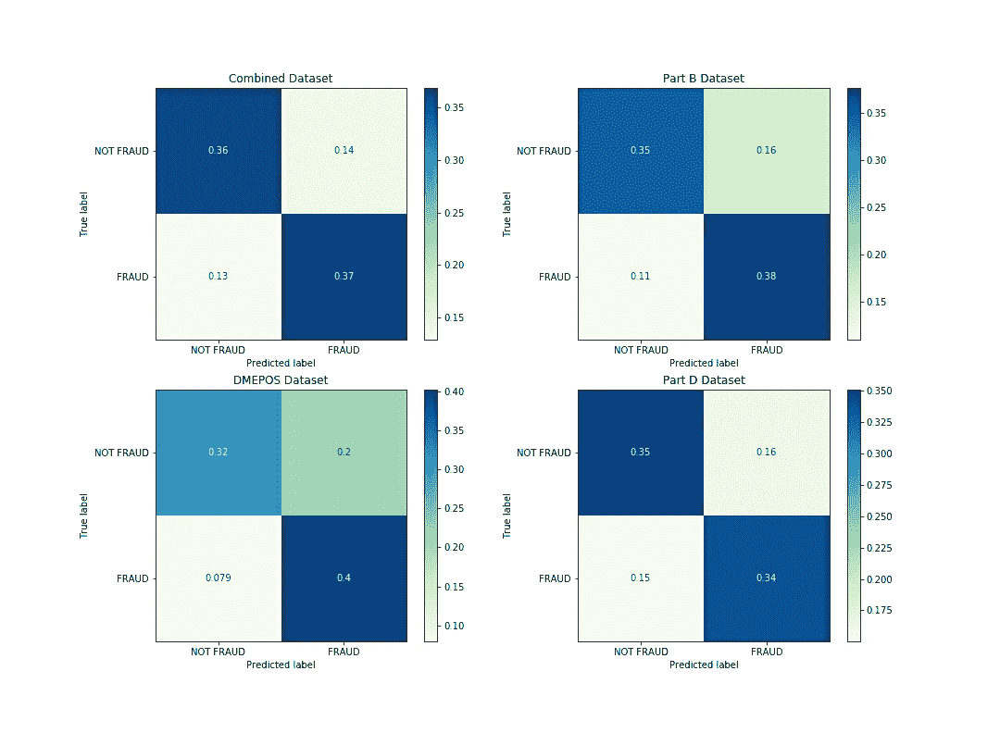
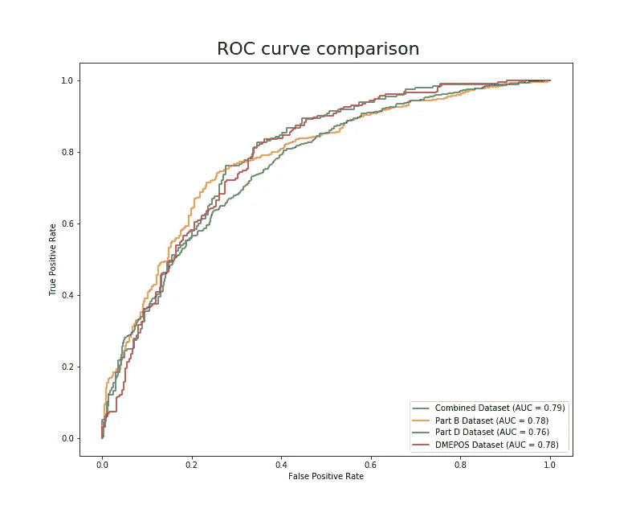
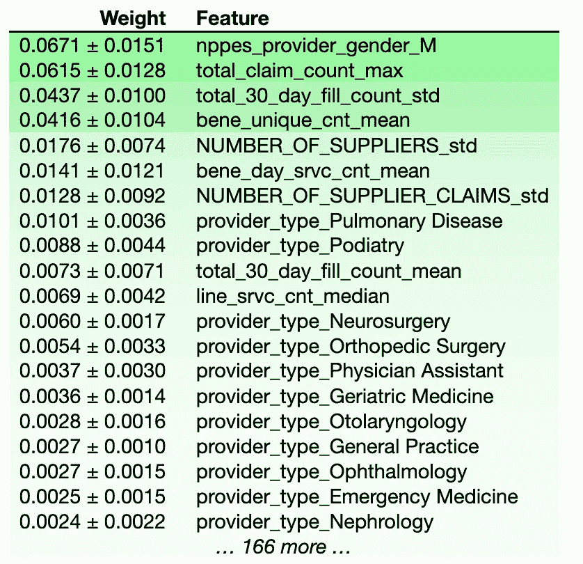
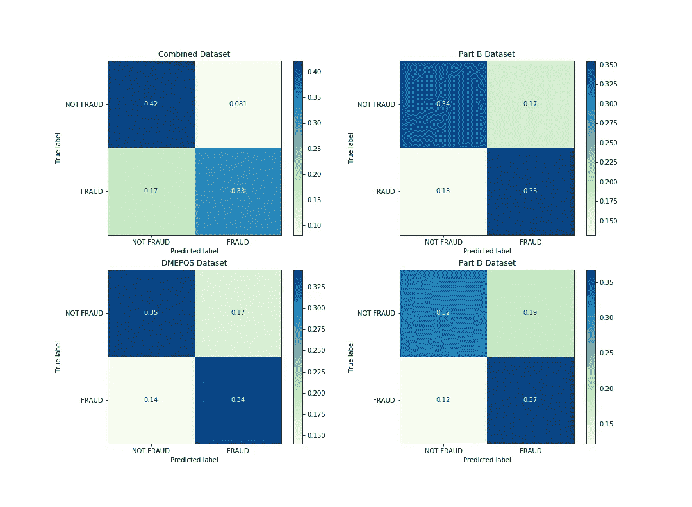
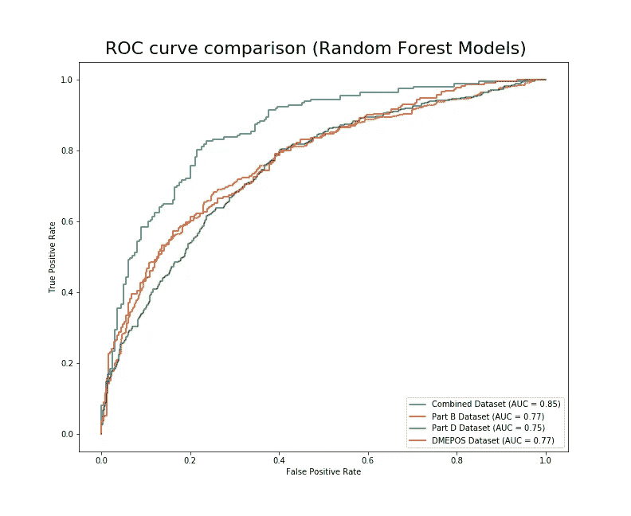
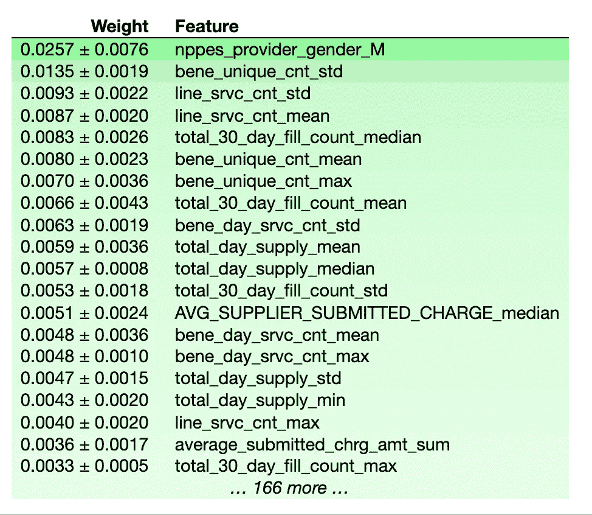

# 使用政府数据模拟医疗保险欺诈

> 原文：<https://towardsdatascience.com/modeling-medicare-fraud-using-government-data-349ea53849fd?source=collection_archive---------33----------------------->

## 医疗保险/医疗补助系统中的数据挖掘在 2013 年成为合法。当局如何利用这些数据来抓坏人？

[国家癌症研究所](https://unsplash.com/@nci?utm_source=medium&utm_medium=referral)在 [Unsplash](https://unsplash.com?utm_source=medium&utm_medium=referral) 上拍摄的照片

在美国，医疗保险是主要提供给 65 岁以上老年人的国家健康保险计划。这个项目很昂贵，部分原因是美国人口老龄化和医疗费用飞涨。其资金来源于政府总收入(43%)、工资税(36%)和受益人保险费(15%)。医疗保险计划有三个主要的*部分*:

1.  **Medicare A 部分**:主要承保住院和临终关怀。
2.  **联邦医疗保险 B 部分:**主要承保医院门诊服务，以及住院期间由医护人员开出的处方。
3.  [**医疗保险 C 部分**](https://money.cnn.com/retirement/guide/insurance_health.moneymag/index16.htm) **:** (又名医疗保险优势)是由政府补贴的私人计划，需要提供与 A 部分和 B 部分相同的保险范围，有时由私人健康保险公司管理。

对于这个项目，我们还研究了医疗保险计划的一个方面，通常在医疗保险 B 部分下计费，称为耐用医疗设备、假肢、矫形器和用品(DMEPOS)。

## 特征数据

对于我们的功能，我们将使用 D 部分、B 部分、DMEPOS 的数据。这些数据集由医疗保险和医疗补助服务中心( [CMS](https://www.cms.gov/) )每年发布一次，由特定的信息组成，这些信息被组织在一个唯一的 id 上，称为[国家医疗服务提供者标识符(NPI)](https://www.cms.gov/Regulations-and-Guidance/Administrative-Simplification/NationalProvIdentStand) 。这三个数据集的信息各不相同，但包括以下特征:提交的费用、利用率、平均付款、提供商性别、平均提交的费用等等。

本文是对该项目的高级概述，所以我不会深入讨论数据处理细节。如果你对尝试复制这些结果感兴趣(或者如果你是一个未来的读者，想要合并在撰写本文时不可用的数据)，请查看这个项目的 GitHub repo。我将在下面列出每个数据集的直接链接:

*   [D 部分数据](https://www.cms.gov/Research-Statistics-Data-and-Systems/Statistics-Trends-and-Reports/Medicare-Provider-Charge-Data/PartD2015)
*   [B 部分数据](https://www.cms.gov/Research-Statistics-Data-and-Systems/Statistics-Trends-and-Reports/Medicare-Provider-Charge-Data/Physician-and-Other-Supplier)
*   [d epos 数据](https://www.cms.gov/Research-Statistics-Data-and-Systems/Statistics-Trends-and-Reports/Medicare-Provider-Charge-Data/DME)

## 目标/标签数据

如前所述，上述所有数据集都可以加入 NPI，这是参与 Medicare 计划的每个提供者的唯一标识符。我们如何知道哪些 NPI 代表欺诈者？

幸运的是，监察长办公室公布了一份因各种原因(包括欺诈)被排除在医疗保险计划之外的供应商名单。).该清单被称为被排除的个人/实体清单(LEIE ),可在此处[下载](https://oig.hhs.gov/exclusions/exclusions_list.asp)。该列表由 NPI 组织，包括排除日期、恢复日期和排除类型等信息。排除的类型可以在[图表](https://oig.hhs.gov/exclusions/authorities.asp)中找到。任何在被排除前一年活跃的医生都被认为是骗子。这段时间是他们被抓之前的时间，这意味着这段时间的可用数据将揭示哪些欺诈活动导致这些医疗服务提供商被抓。

## 组合数据集

除了 B 部分、D 部分和 DMEPOS 数据集。创建了第四个数据集，它结合了前面提到的每个数据集的要素，并在 NPI 上连接在一起。这 4 个数据集都分别进行了建模和评估，以了解哪一个表现最好。

## 模型

对于这个项目，我使用了两个模型来了解特性的重要性和一般性能。首先，我使用逻辑回归对所有 4 个数据集进行建模。

每个数据集的标准化混淆矩阵。

正如你从上图中看到的，这可能是一个需要良好判断力的情况。你认为以上哪一款*最好*？假设我们为监察长办公室工作，我们将使用这个模型来决定调查谁。对我来说，这是一个信息丰富的视觉效果，可以大致了解每个模型在不同数据上的表现。如果你遵循 DMEPOS 模型的预测，你会比其他模型抓到更多的诈骗犯。你也会浪费更多的时间和资源去调查无辜的医生。在做出任何最终决定之前，也看看 AUC 可能是一个好主意。

现在我们可以看到，在组合数据上训练的模型有 79%的机会能够区分`FRAUD`和`NOT FRAUD`类。虽然这接近于 DMEPOS 和 B 部分数据集的 AUC (.78)，但使用这一指标，组合数据集显然是赢家。

## 特征重要性(逻辑回归)

当挑选出这些欺诈的医生时，模型认为什么是重要的特征？我们可以使用 [eli5 包](https://eli5.readthedocs.io/en/latest/overview.html)来显示在组合数据集上训练的模型的特征重要性。

有趣的是，提供者是否是男性似乎是他们是否参与欺诈活动的最佳预测者。我将在下面列出其他主要功能:

*   *total _ claim _ count _ max*= Medicare D 部分索赔的最大次数，包括再配药
*   *total _ 30 _ Day _ fill _ count _ STD*= 30 天填充次数的标准偏差，包括再填充
*   *bene _ unique _ count _ mean*=唯一医疗保险受益人的平均人数

我们可以从这些结果中推断出，大多数退休的医生正因为过度开药而陷入困境。让我们来看看我使用的第二个模型的信息，一个随机森林。

随机森林模型的归一化混淆矩阵。

从这些混淆矩阵来看，在组合数据集上训练的模型似乎比任何其他模型都更容易将欺诈医生错误分类为合法医生。在 D 部分数据集上训练的模型稍微偏向于预测欺诈，这可能导致浪费资源调查合法的医生。让我们看看这些模型的 AUC。

现在我们可以看到，在组合数据上训练的模型有 85%的机会能够区分`FRAUD`和`NOT FRAUD`类别。

## 要素重要性(随机森林)

类似于逻辑回归，随机森林模型对医生的性别给予了很大的重视。此外，下面列出了确定欺诈的最重要特征的定义。

*   *line _ srvc _ CNT _ Mean/line _ srvc _ CNT _ STD*=所提供服务数量的平均值/标准差。
*   *bene _ unique _ CNT _ mean/bene _ unique _ count _ Max*=唯一医疗保险受益人的平均/最大数量。
*   *total _ 30 _ Day _ fill _ count _ median*= 30 天填充次数的中位数，包括再填充

如果您查看逻辑回归模型中的要素重要性，并将它们与随机森林模型进行比较，您会发现逻辑回归模型似乎对其顶部要素的权重更大，而随机森林模型似乎更均匀地分布权重。

## 结论

在未来，我计划花更多的时间尝试在不同的模型上训练这些数据。我鼓励你也这样做！我相信随着时间的推移和更多数据的收集，国家打击欺诈的准确性只会提高。[联邦法规只是在 2013 年才开始允许对医疗补助数据进行数据挖掘，就像该项目中描述的那样](https://oig.hhs.gov/fraud/medicaid-fraud-control-units-mfcu/data-mining.asp)。随着每年收集的数据越来越多，我预计这些模型的预测能力会大幅提高——这有望让这些坏人在滥用系统之前三思而行。

## 来源

用于执行数据预处理的方法在本文[中有所描述，这是本项目的基础。](https://journalofbigdata.springeropen.com/track/pdf/10.1186/s40537-018-0138-3.pdf)

请随意查看我的[网站](https://brendanferris.com)💻

☛ [项目 GitHub](https://github.com/brenfrrs/medicare_fraud)