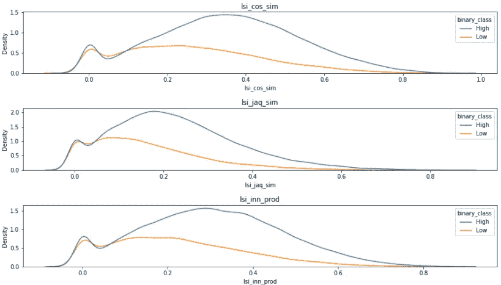

# 电子商务中产品搜索相关性建模:家得宝案例研究

> 原文：<https://towardsdatascience.com/modeling-product-search-relevance-in-e-commerce-home-depot-case-study-8ccb56fbc5ab?source=collection_archive---------4----------------------->

## [实践教程](https://towardsdatascience.com/tagged/hands-on-tutorials)

## 利用机器学习预测 homedepot.com 搜索结果的相关性

照片由来自 [Pexels](https://www.pexels.com/photo/crop-buyer-with-smartphone-and-coffee-to-go-6331238/?utm_content=attributionCopyText&utm_medium=referral&utm_source=pexels) 的 [Anete Lusina](https://www.pexels.com/@anete-lusina?utm_content=attributionCopyText&utm_medium=referral&utm_source=pexels) 拍摄

# 目录

1.  **简介** 摘要
    问题陈述
    商业问题的 ML 公式化
    数据概述
    ML 问题的目标和指标
    现实世界的约束
2.  **文献综述**
3.  **探索性数据分析:第 1 部分** ·相关性得分
    ·Product _ uid
    ·属性
    ·描述
    ·合并产品文本数据
    ·填充空值
4.  **数据清理
    基本预处理
    标准化单元
    纠正搜索中的错别字
    进一步预处理**
5.  **探索性数据分析:第二部分** 【基本文本统计】
    【单词和双词分布】
6.  **特征工程** ·集合论特征
    ·基于 VSM 的特征
    ·概率特征
    ·使用 Word2Vec 的查询扩展
7.  **特性集的性能图**
8.  **最终建模和评估** 【堆叠回归器】
    基础模型
    元模型
    ka ggle 上的性能(前 10%)
9.  **扩展成现实世界的搜索引擎**
10.  **全管道**
11.  **最终测试和结果** 测试
    运行时间
    网络应用程序演示
12.  **结论和未来工作**
13.  **致谢**
14.  **参考文献**

# 介绍

## 摘要

一切都在向数字化转变，购物体验也是如此。电子商务在过去几年中发展迅速，因此，在线产品搜索已成为为客户提供满意购物体验的最重要因素之一。在这篇博客中，我提出了一种预测给定搜索查询所需产品的可靠方法，使用了涉及机器学习、自然语言处理和信息检索的技术。

## 问题陈述

这项任务很容易理解。对于客户输入的任何搜索查询，我需要找到最相关的产品，并按照相关性的顺序显示给用户。从商业的角度来看，有几点需要考虑。首先，需要对产品进行排序，因此，即使在最相关的产品中，我们也需要能够分辨出哪一个更相关。第二，有一个时间限制，即结果需要在几秒钟内显示。

## 商业问题的机器学习公式

该任务可以表述如下:给定一个搜索和一个产品，找出它们之间的相关性分数，即该产品与手边的搜索查询有多相关。假设我的机器已经学会了如何预测(搜索-查询，产品)对的相关性分数。现在，对于用户输入的任何搜索，我可以计算该搜索与数据库中所有产品匹配的相关性分数，并向客户显示(比方说)前 10 个结果。

因此，如果我有很多带标签的数据，即很多(搜索-查询，产品)对及其相关性分数，那么我可以将此作为监督 ML 问题。这正是我在这个案例研究中所做的。我使用的数据是家得宝为 Kaggle 比赛提供的[家得宝产品搜索相关性](https://www.kaggle.com/c/home-depot-product-search-relevance)

现在，在现实世界的电子商务搜索引擎中，计算给定搜索的每个产品的相关性分数是不可能的，因为，在任何典型的电子商务网站中，产品的数量都非常大，因此计算成本很高，非常耗时。

✦因此，首先，我们使用一个允许快速查询评估的更简单的检索模型来检索一些候选产品。在第二阶段，使用更精确但计算量大的机器学习模型对这些产品进行重新排序。

为了解释这一点，假设我们有一组 100，000 个产品。而搜索查询是“太阳能灯”。第一个更简单的检索模型将检索几个候选产品。这个模型可以简单到像搜索单词和产品文本之间的 AND 操作符。所以在这里，一个由 AND operator 管理的模型将得到所有带有“solar”和“lamp”字样的产品。假设它检索了大约 500 种产品。现在，在这 500 种产品的基础上，我们可以运行复杂的机器学习算法，并计算每个(搜索，产品)对的相关性分数，其中我们的搜索词“太阳能灯”保持不变，而产品有所不同。现在，我们根据它们的相关性分数对它们重新排序，并向用户显示排名靠前的产品。这叫做[学习排名](https://en.wikipedia.org/wiki/Learning_to_rank) (LTOR)。在这篇博客中，重点将放在系统的学习排名部分。最后，我还解释了我是如何扩展它，使之成为一个成熟的搜索引擎的。

## 数据概述

数据是四个 CSV 文件的形式；train.csv，test.csv，attributes.csv，product_description.csv，你可以从[这里](https://www.kaggle.com/c/home-depot-product-search-relevance/data)下载。

**训练数据:**我们在 train.csv 文件中总共有 74067 行用于训练。一部分数据如下所示，每行对应一对

train.csv 文件

(search_term，product_title)以及说明该产品与搜索相关程度的相关性分数。相关性分数是一个从 1 到 3 的实数(1 表示不相关，3 表示完全匹配)。对于每个产品，我们通常有多个行，即多个搜索查询及其相关性得分。product_uid 是每个产品的唯一标识符。

product_description.csv 包含每个产品的文本描述。attributes.csv 文件包含一些关于产品子集的附加信息。

搜索查询是字符串形式的，产品由文本数据表示，这些文本数据以标题、描述和一些属性的形式提供给我们。在现实世界中，我们还可能有产品的其他特征，如图像、评级等。但是这里我们只有文本可以使用。

数据的相关性分数是手动标记的。每一对(搜索、产品)由至少三名人类评价者进行评估，然后将最终的相关性分数作为平均值。

**测试数据:**由于这是 Kaggle 竞赛的一部分，我们还得到一个 test.csv 文件，其中包含大约 166，000 行，我们需要预测这些行的相关性分数。训练集中大约一半的产品出现在测试集中。这两组的文氏图如下所示。

## ML 问题的目标和度量

**目标**:对于每一个给定的(搜索-查询，产品)，预测相关性得分。这将被视为一个回归问题，因为我们可以更容易地对产品进行排序。

**使用的度量:** 比赛中给出的这个度量是**均方根误差(RMSE)** 。这是回归问题中最广泛使用的度量标准，在大多数情况下效果很好。它不同于 MAE(平均绝对误差),因为它更多地惩罚大误差。RMSE 的一个问题是它的价值很难解释；它的范围可以从零到无穷大。因此，一般来说，基线得分是使用一个简单的回归模型建立的，然后我们可以使用它作为其他模型的参考。

来源:[https://S3-AP-south-1 . Amazon AWS . com/av-blog-media/WP-content/uploads/2018/05/RMSE . png](https://s3-ap-south-1.amazonaws.com/av-blog-media/wp-content/uploads/2018/05/rmse.png)

## 现实世界的约束

*   延迟限制:产品需要在几秒钟内展示。
*   产品排名是必要的。
*   可解释性是部分重要的:我们想知道为什么我们的模型向客户建议了一个特定的产品。

***注:*** *在博客中，我曾交替使用过‘搜索查询’，‘查询’，‘搜索词’和‘搜索’这几个词。*

# 文献评论

眼前的问题是搜索相关性，它大致属于信息检索领域。关于自由文本查询技术的大量研究已经发表。

传统的非机器学习模型集中于探索各种建模语言的方法。像[布尔模型](https://www.researchgate.net/profile/Arash-Habibi-Lashkari/publication/232614940_A_Boolean_Model_in_Information_Retrieval_for_Search_Engines_PDF/links/5756c52808aef6cbe35f0f5a/A-Boolean-Model-in-Information-Retrieval-for-Search-Engines-PDF.pdf)和[模糊检索](https://www.sciencedirect.com/science/article/abs/pii/S0165011409001080?via%3Dihub)这样的集合论模型是基于表示查询并记录为单词集，然后应用一些基本的集合运算来获得相关性。像 [VSM](https://en.wikipedia.org/wiki/Vector_space_model) 这样的代数模型将文档和查询表示为向量(例如[单词袋](https://en.wikipedia.org/wiki/Bag-of-words_model))，然后将它们之间的相似度计算为标量。更受欢迎的模型如 [Okapi BM25](https://www.researchgate.net/profile/Hugo-Zaragoza/publication/220613776_The_Probabilistic_Relevance_Framework_BM25_and_Beyond/links/53d9ce800cf2a19eee8807e8/The-Probabilistic-Relevance-Framework-BM25-and-Beyond.pdf) 、 [Indri](http://ciir.cs.umass.edu/pubfiles/ir-407.pdf) 和[语言模型](https://en.wikipedia.org/wiki/Language_model)都是基于[概率论](https://en.wikipedia.org/wiki/Probabilistic_relevance_model)。尽管所有这些模型都来自不同的底层理论，但它们中的大多数都使用了来自自然语言处理领域的非常相似的概念，如单词袋、余弦相似度等。

最近的方法包括[学习排序](https://en.wikipedia.org/wiki/Learning_to_rank)，其中通常查询-文档对由其特征向量表示，然后在其上训练监督或半监督机器学习模型以获得排序。这里，通常直接使用传统的检索模型作为特征。 [LSA](https://opensourceconnections.com/blog/2016/03/29/semantic-search-with-latent-semantic-analysis/) (或 LSI)将术语-文档矩阵映射到一个“概念”空间，从而得到一个密集且更好的文本表示。 [Word2Vec](https://en.wikipedia.org/wiki/Word2vec) 算法使用神经网络从大型文本语料库中学习单词关联，并将单词映射到高维向量，这些向量可以用作特征。[查询扩展](https://www.researchgate.net/profile/Saar-Kuzi/publication/310823543_Query_Expansion_Using_Word_Embeddings/links/5a94aacf0f7e9ba42970d144/Query-Expansion-Using-Word-Embeddings.pdf)是用语料库中存在的相似单词扩展查询的另一个有效想法。为了测量相似性，通常使用来自 Word2Vec 模型的单词向量。

# 探索性数据分析:第 1 部分

在这一节中，我将对手头的数据进行分析。我已经将 train.csv 文件保存为 train_df 变量中的数据帧。

火车 _df

id 列没有用。product_uid 是每个产品的唯一 id，在合并来自其他文本文件的数据时非常重要。训练数据中没有空值。

## 相关性分数

发现相关性分数本质上是分类的。这是因为大部分的分数是 3 个评分者的平均分数，每个评分者只能给出 1 或 2 或 3 的整数分。

大多数产品具有高相关性分数，即大多数产品与查询相关。由于相关性分数的分类性质，如果分类模型有助于最终排名，也可以在此基础上建立分类模型。得分{1.25，1.5，1.75，2.25，2.5，2.75}出现的频率非常低。

## 产品 _uid

许多产品在训练数据中出现多次，也就是说，我们有多个搜索术语和相同产品的相应相关性。

*   超过 10，000 种产品多次出现
*   74067 种独特产品的总数是 54667 种
*   产品出现的最大次数是 21 次

## 属性

对于产品，我们有产品标题、产品描述和属性形式的文本信息。产品标题在 train.csv 文件中。描述和属性分别从 product_description.csv 和 attributes.csv 文件中提取。

attributes.csv 文件的一个实例如下所示。字段“name”表示属性的名称，“value”表示属性文本。

属性. csv

attributes.csv 文件中的每个产品都有多个属性。产品的最小属性数为 5，最大属性数为 88。

属性数量与产品指数

但是在 attributes.csv 文件中并没有找到 train.csv 文件中的所有产品。总共 54667 个产品中有 16263 个没有属性。

train.csv 和 attributes.csv 文件中的产品集

然后，我研究了最常出现的属性，在 attributes.csv 文件的 86，250 个实例中，Brand 是最常见的属性。

最常见的属性

不仅如此，我们还观察到，大多数情况下，product_title 包含品牌信息。因此，我在我的 train_df 中添加了 brand 作为一个单独的特性。

## 描述

product_description.csv 包含产品的描述。与属性不同，我们在 train.csv 文件中有对所有产品的描述。

## 合并属性、描述和品牌特征

最后，我用 train_df 合并了所有属性、描述和品牌。*产品的所有属性首先被连接起来，然后存储为“组合属性”特征*。

合并后的 train_df

*注意:从现在开始，代表产品的文本字段，即产品标题、品牌、组合属性和产品描述，统称为“产品-文本”或“文档-字段”或“文档”。*

## 填充空值

在开始清理文本之前，我发现我们的 train_df 有很多空值。这些是在我合并属性时发生的，因为训练数据中的许多产品没有属性。

我们可以看到，空值只出现在 brand 和 combined_attr 特性中。有大量的空值，因此正确填充它们是清理过程中的重要一步。

**品牌:**据观察，产品的品牌一般出现在标题的前几个字里。例如，产品名称为“Simpson Strong-Tie 12-Gauge Angle”的产品的品牌是“Simpson Strong-Tie”。“Delta Vero 1 手柄淋浴专用水龙头”是“Delta”。此外，99%的品牌长度不超过四个单词。所以大多数情况下，品牌应该出现在标题的前四个字里。

所以，我首先将所有唯一的品牌存储在一个列表“unique_brands”中。现在，对于任何品牌为空的行，我检查该产品标题的前四个单词是否出现在 unique_brands 列表中。如果没有，那么我检查前三个单词，以此类推，直到第一个单词。这种方法非常有效，我能够填充 15003 个无效品牌。对于剩下的 2625 个值，我用标题的第一个字填充。

**描述:**为描述填充空值并不困难，因为我们发现描述文本与组合属性文本非常相似。因此，combined_attr 字段的所有空值都用相应的 product_description 值填充。

# 数据清理

这是整个案例研究中最重要的部分之一。大量的时间花在了观察文本和进行必要的预处理步骤以使其适合建模上。使用了许多自然语言处理技术。

*为什么文本预处理在这个项目中如此重要，一个非常简单的动机是因为我们在某种程度上试图找到搜索查询和产品文本之间的相似性。考虑搜索为“5 加仑桶”，产品名称为“Leaklite 5 加仑黑桶”。如果我们使用一个像普通单词数这样的衡量标准，那么在这种情况下，相似度将为零，因为没有共同的单词。现在说一点预处理，我们的搜索和标题分别成为“5 加仑桶”和“leaklite 5 加仑黑桶”。现在我们的相似性得分为 3，因为现在我们有 3 个共同的单词。因此，很少的预处理就能产生巨大的差异。*

## 基本预处理

基本的预处理步骤包括小写、删除特殊字符、删除停用词和词干。

## 标准化单位

1.  许多产品名称包含产品的尺寸。一种非常常见的表示方式是“8 英尺”。x 5 英尺。x 8 英尺。”。在产品描述中也可以观察到同样的情况。
2.  在 product_title 中，单位通常表示为{in。磅。sq。磅。奥兹。加仑 mph}，但是在 product_description 和 search_term 中，单位以多种方式表示。例如，英寸等于英寸。英寸}和加仑{gal。加仑}。因此，这些单元需要标准化。
3.  在搜索词中，指定测量值时有一些常见错误。例如“4 个架子”、“9x12”、“g135”、“5 加仑”、“1/2 英寸乘 12 英寸”。因此，需要把数字和单词分开。

**预处理步骤:**

1.  将数字和单词分开:“9x 12”→“9x 12”，“5 加仑”→“5 加仑”…
2.  将所有测量单位统一表示。对女孩来说。gals gallon}全部转换为“加仑”。类似地，{ ft fts feets foot 也转换为“英尺”。

## 纠正搜索词中的拼写错误

在浏览搜索词时，发现它包含许多拼写错误，如“割草机”被拼写为“mowe”，“厕所”被拼写为“toiled”等。这是可以理解的，因为这些搜索是由用户输入的，在在线搜索中，这样的拼写错误是常见的。但这是一个大问题，因为拼写错误的单词可能会使常用单词计数等功能变得非常无效。因此，为了纠正这一点，我使用了一个自定义的拼写纠正。结果非常积极。

不正确的搜索→正确的搜索

我使用的拼写校正器是由彼得·诺威格建造的。它基于概率理论，但是非常容易理解并且非常有效。最棒的是，你可以根据自己的数据进行调整。这非常重要，因为通用拼写校正器可能无法识别仅限于我们数据的品牌名称。我鼓励你参考这个链接并阅读更多相关内容。

我更正了所有的搜索词，出于实验目的，我还保留了原始/未更正的搜索。

## 进一步预处理

在基本的预处理中，我留下了停用词移除和词干部分，因为我想先修复不正确的搜索词。在这里，这两个步骤都被执行，清理后的文本被存储在 cleaned_df 中。

我们最终清理后的数据帧如下所示

已清理 _df

*我还创建了一个 dataframe cleaned_df2，在那里存储没有词干的文本数据。这样做是为了以后能够使用像 Word2Vec 这样预先训练好的编码。*

# 探索性数据分析:第 2 部分

清理之后，我能够从文本数据分析中做出更准确的发现。已经做了很多分析，我将在这一部分回顾最重要的发现/结论。

为了便于分析，我将相关性分数分为两类:分数> 2 的“高”和分数≤ 2 的“低”。它们也分别被称为正类和负类。虽然，这是一个回归问题，但是把分数分成两类在分析中帮助很大；一个有助于区分高等级和低等级的特征在最终的回归问题中也会很有帮助。

*我们总共有 6 个文本字段，对每个字段分别进行了分析。*

***注意:*** *经过仔细检查，我发现描述和属性文本非常相似，因此，我没有在任何进一步的分析中考虑属性文本。*

## 基本文本统计

对文本的一些基本数据进行了分析。即文本串的长度、字数和平均单词长度。对于 corrected_search，这些统计信息的分布如下所示。

基本统计分布

**观察:**

1.  大多数搜索查询的字数在 2 到 5 个词之间。
2.  这些统计数据的分布对于正类和负类都非常相似。
3.  上面提到的最重要的统计数据是字数。

请注意，当我们向右移动时，正类与负类的高度/密度比率开始下降，或者我们可以说负类开始变得更加突出。这意味着随着字数的增加，相关性高的概率降低。因此，字数给出了关于相关性分数的一些信息。

4.通过观察字数与相关性的相关性，可以证明上述说法是正确的。有一点相关性，本质上是负面的。

5.所以字数统计可能不是一个坏的特性。

6.字符数和平均单词长度与相关性的相关性
分数非常低，分别为-0.092 和 0.084，因此可能没有帮助。

*对所有这些统计数据进行了标题、描述和品牌文本分析。发现了同样的模式。唯一与相关性有显著相关性的统计数据是字数。*

除此之外，我还试验了另外两个统计数据:可读性指数和情感分数。两者的相关分数分别为-0.035 和 0.019，非常低。他们没有帮助区分这两个阶级。

## 最常见的单字和双字

**搜索文本**:corrected _ Search 最常见的单字如下:

inch 和 x 是最常用的术语。还有，很多数字是非常频繁出现的。这意味着大量的搜索词包含了所需产品的维度。这些数字和单位很重要，因为它们可以很好地表明用户想要什么样的产品。因此，我没有删除数据清理时的数字，并将保留它们作为最终的特征部分。

每类最常见的单字

然而，这两个类别中最常见的单词非常相似。在左侧，您可以看到每个类别中搜索最频繁的单词及其频率。

甚至两个阶层最常见的二元模型也非常相似。

因此，从上面的观察中，对于搜索文本，我们看到两个类中最常见的单词和双词非常相似。因此，像 simple BOW 或 TF-IDF BOW 这样的矢量化方法可能效果不太好。

**描述文字**:即使在描述文字中，也发现最常见的词是 inch，数字比较突出。

两个类别中最常见的单字和双字被发现非常相似。

对品牌和标题文本进行了同样的分析，发现了类似的趋势。文本字段本身并没有给出很多关于相关性分数的信息。

## 来自 EDA2 的结论

1.  在所有关于文本的统计数据中，字数统计是区分这两类数据最有效的方法。我们无法从其他统计数据中获得很多信息，如平均单词长度和字符串长度，这两个数据显示的相关值非常低。因此，在最后的特征化，我将只包括字数统计功能。
2.  对于这两个类，所有文本字段(搜索、标题、描述、品牌)的 unigrams 和 bigrams 分布非常相似。因此，像 BOW 和 TF-IDF BOW 这样的简单矢量化方法可能无法单独使用。

# 特征工程

这个问题的特征主要来源于[信息检索](https://en.wikipedia.org/wiki/Information_retrieval)领域。注意，这里的特征需要是搜索和产品组合的任意函数，因为我们试图找到(搜索，产品)对的相关性。一些基本的检索模型被直接用作特征。我将这些特性分为四组:

*   集合 1:集合论特征
*   集合 2:基于向量空间模型(VSM)的特征
*   集合 3:概率特征
*   集合 4:使用 Word2Vec 进行查询扩展

## 特征集 1:集合论特征

这些特征来源于简单的集合论检索模型，如[布尔模型](https://en.wikipedia.org/wiki/Boolean_model_of_information_retrieval)、[模糊检索](https://en.wikipedia.org/wiki/Fuzzy_retrieval)等。其基于将查询和文档表示为单词集，然后对它们应用某种操作来获得相关性分数。这些功能包括:

➤搜索和文档字段(标题、品牌、描述)之间的常用词计数

搜索和文档字段之间的➤余弦系数和雅克卡系数

➤搜索长度和文档字段

➤搜索中的最后一个单词是否在文档字段中

*最后一个特征很直观，因为在多词搜索查询中，最初的词通常描述了你需要的产品的属性，但最后一个词代表了产品的名词。就像在“黑色夹克”中，第一个词描述了夹克的颜色，但最后一个词是你需要的产品的名词。*

以上特征是为 corrected_search 和 raw_search 创建的。

corrected_search 和 raw_search 的比较

*   可以观察到，在相当多的行中，num-common-words 特征更多地用于 corrected_search 而不是 raw_search。因此，更正搜索词确实有所帮助。

## 功能集 1 上的 EDA

这里总共创建了 29 个特征。下面给出了一些的 PDF(概率密度函数)图。

*注:以“ST”为后缀的特征表示校正搜索与标题之间的特征，“SB”表示品牌，“SD”表示描述。对于 raw_search，我使用了“r_ST”形式的后缀。例如，“余弦 _ST”表示校正搜索和标题之间的余弦系数，而“余弦 _r_ST”表示原始搜索和标题之间的余弦系数。*

集合 1 特征的 PDF 图

除非你仔细看，否则很难理解它们。以余弦 _SD 为例。一般来说，在所有的 pdf 中，我们看到正或“高”类的曲线高于负或“低”类。这显然是由于数据不平衡，因为属于正类的点比负类的多。你可以看到在 0 标记处，正类的曲线略高于负类。当您向右移动时，正曲线仍保持在上方，但正曲线与负曲线的高度比会增加。也就是说，随着 cosine_SD 增加，正类中的点与负类中的点的比率增加。因此，该点属于正类的概率增加。现在，如果你给我两个点，那么我可以说，具有较大余弦 _SD 值的点应该具有较高的相关性分数。

因此，从上面的观察，我们可以得出结论，余弦 _SD 确实提供了一些关于(搜索，产品-文本)对的相关性分数的信息。

对该集合中的所有特征进行了相同的分析，包括 raw_search 和**的特征。主要观察结果**是:

1.  特征 num_common、余弦、Jaccard 在正负类分布上表现出相当大的差异。其中，余弦 _ST 是最有效的。
2.  以 ST 为后缀的特征，即搜索和标题之间的特征，与 SD 和 SB 相比，在正类和负类的分布中显示出更多的区别。
3.  长度特征在分布上没有显示出很大的差异。
4.  最有趣的特色之一是 islast 特色。观察到分布有相当大的差异。例如，在 islast_ST 中，负类的密度在 0 和 1 值处似乎是相似的，但是正类的密度从 0 到 1 显著增加。

✦:根据观察，余弦和伊斯特特征是最重要的特征，其次是雅克卡。其中，ST 特征应该显示最好的结果。

还构建了这些特征的相关矩阵:

集合 1 特征的相关矩阵

并且找到它们与相关性的相关分数

与相关性分数最相关的集合 1 特征

***注:*** *期望的特征集合将是这样的集合，其中所有特征具有高相关性分数和彼此低相关性分数。*

**观察和结论:**

1.  有几个特征彼此具有高度的相关性。这些相关特征可能是多余的，因此可以在建模时移除。
2.  相关分数 wrt。相关性不是很高，但是确实存在一些相关性。因此，这些功能可能是有用的。
3.  我们可以看到，cosine_ST、jaccard_ST 和 islast_ST 的相关性最高，与我们预测的完全一致。
4.  这些值也是为 raw_search 计算的，一般来说，可以看出，修正的 _search 特征与相关性的相关性大于 raw_search 特征与相关性的相关性。
5.  我还在这些特征上应用了 T-SNE，使它们在二维空间中可视化。我将嵌入的特征投影到二维空间中，并用它们各自的类给它们着色。我在之前的两个班级和七个班级中尝试过。但是它根本没有给出任何见解。没有一个类显示任何聚类。

分别用七个类和两个类可视化 TSNE 要素。

## 特征集 2:基于 VSM 的特征

[基于 VSM](https://en.wikipedia.org/wiki/Vector_space_model) 的特征通常基于将文档和查询表示为向量，然后将它们之间的相似度计算为标量。

这里，为了将文本转换成向量，我使用了[潜在语义索引](https://en.wikipedia.org/wiki/Latent_semantic_analysis)，其中[截尾 SVD](https://en.wikipedia.org/wiki/Singular_value_decomposition) 被应用于术语-文档矩阵，这样查询和文档被转换成“概念空间”中的向量。基本上，这里我首先使用 TF-IDF BOW 对文本进行矢量化，然后使用 Truncated-SVD 来降低向量的维数，并创建一个更加密集和有意义的表示。这些功能包括:

➤分别对搜索、标题和描述的术语文档矩阵应用 LSI，并直接使用低秩近似作为特征。

➤在全文(标题和描述的组合)上应用 LSI。然后，将搜索查询转换到“概念”空间，并计算它们之间的余弦相似度。

## 功能集 2 上的 EDA

余弦相似性特征的 pdf 如下所示。

集合 2 余弦相似特征的 pdf

正如您所看到的，相似性特征在两个类之间提供了相当大的区别，非常有用。发现这三个中的每一个与相关性类的相关值是 0.32，这是相当好的。

## 特征集 3:概率特征

这些特征基于[概率论](https://en.wikipedia.org/wiki/Probabilistic_relevance_model)中的核心概念，如贝叶斯定理。使用的功能有:

➤ [语言模型](https://en.wikipedia.org/wiki/Language_model)具有狄利克雷、绝对和杰利内克米勒平滑

➤ [Okapi BM25](https://en.wikipedia.org/wiki/Okapi_BM25) 排名功能

➤查询和表示为 TF-IDF Word2Vec 的字段

每个文本字段中搜索查询的(tf，idf，tf-idf)的➤ (sum，min，max)

**BM25 排名函数:** 除了这些特性，我想重点介绍 BM25 排名函数，因为它本身在传统搜索引擎中用于文本查询，并且在简单的自由文本查询中仍然非常流行。对于给定的(查询，文档)对，它计算相似性得分，如下所示:

来源:[https://en.wikipedia.org/wiki/Okapi_BM25](https://en.wikipedia.org/wiki/Okapi_BM25)

图片由作者提供，灵感来自 Victor Lavrenko 关于 IR 概率模型的[讲座](https://www.youtube.com/playlist?list=PLBv09BD7ez_56YwzSyQOOsrAE4Js7XuAB)

以上是解释整个等式的一个尝试。它基本上是 TF-IDF 加权的修改形式，其中 TF 值已经被修改以结合文档的变化长度，并在评分 wrt 项-频率的增加中带来非线性。为了更好地理解它，我鼓励你们去听一听维克多·拉夫连科的讲座。

## 功能集 3 上的 EDA

进行了类似的分析，并且所有特征都具有与相关性分数相当的相关值，但是与集合 1 和集合 2 相比稍低。有趣的是，具有最高相关性的特征被发现是 min_tf_ST，即标题文本中搜索词的最小词频。直觉上，这应该是一个好的特性；min_tf_ST = 0 意味着在搜索中有没有在标题中出现的单词，min_tf_ST ≠ 0 意味着在标题中找到了搜索中的所有单词，因此表示高度相关。

相关性最高的第 3 组特征

ST 功能的 PDF 图，即搜索和标题之间的 PDF 图如下所示。

第三组功能的 pdf

**观察和结论:**

1.  在 tf、idf、tf-idf 特征中，tf 特征即 min_tf、max_tf 和 sum_tf 是最有效的。而 idf 特征不能区分这两个类别，也没有显示出与相关性分数的高度相关性。
2.  bm25 和语言模型特性(JM，AD，Dir)显示了这两个类之间的区别。请注意，我设计的语言模型与相关性呈负相关，因此较低的值意味着高相关性
3.  所有这些特征的唯一警告是，它们彼此具有非常高的相关值，因此存在大量冗余，这可能会影响线性模型，如线性回归和 SVM。为了解决这个问题，我们可以删除这些高度相关的特征中的一个。

AD_SB 和 Dir_SB 特征高度相关

## 功能集 4:查询扩展

[查询扩展](https://en.wikipedia.org/wiki/Query_expansion)是一个很容易理解的概念。

*   首先，使用 Word2Vec 将搜索查询中的所有单词转换成单词向量。
*   然后，设 q 是一个由一包术语表示的用户查询，q = (t1，t2，.。。，t|q|)
*   为了扩展查询 q，我们遵循对于每个 t ∈ q，使用 w2v 收集与 t 最相似的 k 个术语。将新术语包含到查询集中，给出 q。

在查询扩展之后，我们可以使用扩展的搜索查询来重新计算来自特征集 1 的所有基本特征。

我确实在这个集合上执行了一点 EDA，结果观察非常类似于没有扩展的搜索，即扩展术语没有被证明是非常有帮助的。这可能是因为我在我的语料库上训练了一个定制的 word2vec 模型，该模型可能没有训练好。有了训练有素的模型，我相信查询扩展会非常有帮助。

# 功能集的性能图表

在这些特性集上，我用一些超参数调整训练了一个 [XGBoost](https://xgboost.readthedocs.io/en/latest/python/python_api.html) 模型。我不断添加特性集，检查是否有任何改进，结果非常好。训练是在具有 74067 个数据点的整个训练数据上进行的。为了评估，所用的指标是具有 5 重交叉验证的 RMSE。

功能集的性能图表

## 意见和结论:

1.  随着我们添加更多功能，错误不断减少。
2.  f1_raw 的误差为 0.4805，在 f1_corrected 后略有改善。当我们结合使用这两个特性集时，它显著提高到 0.4763。因此，原始特征集和校正后的特征集确实提高了整体性能。
3.  添加 f2_lsi 集后，误差也大幅下降至 0.471。
4.  当我们添加特征集 3 时，观察到最大的改进，其中误差从 0.471 下降到 0.4547。不仅如此，特征集 3 单独表现得非常好，误差为 0.4569。因此这是最重要的一套。
5.  f4 的查询扩展特性并没有带来很大的改进。
6.  在来自所有集合的组合的特征上观察到的最好分数是 0.4541。

# 最终建模和评估

## 堆积回归器

前一节中的 XGBoost 模型主要是为了观察和比较不同特性集的性能而构建的。对于最后的建模部分，我用 17 个基础模型和一个岭回归模型作为元模型构建了一个定制的堆叠回归器。为此，我进行了如下操作:

1.  将 train.csv 文件中的全部数据(74067 点)分成训练集和测试集(80–20)
2.  现在，我把 80%的火车分成 D1 和 D2。(50–50).所以 D1 和 D2 各有大约 29k 点。
3.  在 d1，我做了替换取样，为我的 17 个基本模型创建了 17 个样品 D1、d2、D3…d17。所用的采样比在 0.85 和 0.9 之间。因此，为了训练每个基本模型，使用了大约 25k 个数据点。
4.  然后，我创建了 17 个模型，并用这 17 个样本中的每一个来训练这些模型。
5.  我将 D2 集传递给这 17 个模型中的每一个，并从每个模型中得到 17 个对 D2 的预测。
6.  现在，使用这 17 个预测，我创建了一个新的数据集，对于 D2，我已经知道其相应的目标值，所以我用这 17 个预测作为特征来训练我的元模型。因此，用 29k 个点训练元模型，每个点具有 17 个特征。
7.  对于模型评估，我使用我在开始时保留的 20%的数据作为测试集。我将该测试集传递给每个基础模型，获得 17 个预测，用这 17 个预测创建一个新的数据集，最后，将它传递给元模型以获得最终预测。使用这个最终预测和测试集的目标，我计算了模型的性能分数。

## 基础模型

我把基本模型分成三组 M1、M2 和 M3。主要使用基于树的模型和线性模型。

*   M1 模型在总共 71 个基本特征上被训练。它们是 f1_comb(29) + f2_lsi(3) + f3(39)。各种模型(总共 7 个)在这个集合上被训练。
*   M2 模型在总共 971 个特征上被训练。其中 71 个是基本特征。其他 900 个特性来自搜索、标题和描述的 Word2Vec 嵌入。
*   M3 模型在总共 4071 个特征上被训练:71 个基本特征，其余 4000 个来自特征集 3 中的截断 SVD。对于这个集合，由于它的高维数，我只坚持线性模型。

对于交叉验证，我通常使用 5 重交叉验证。基本型号的性能报告如下所示:

基本型号的性能

## 元模型

对于元模型，我使用了一个简单的岭回归模型。

经过超参数调优，我在测试集上得到了最终的 RMSE**0.4539**。在火车上，我得到了 0.4531 的 RMSE，因此模型也没有过度拟合。

## Kaggle 上的性能

我在 Kaggle 提供的包含超过 160，000 个数据点的测试集上测试了我的最终模型，它得到了 0.46525 的私人分数**。在两千多支参赛队伍中，它名列前 10%****。**

前 10%

# 延伸到现实世界的搜索引擎

正如本文前面提到的，在现实世界的搜索引擎中，对于任何搜索查询，我们首先会使用一个更简单的检索模型来检索一些候选产品。然后，使用机器学习模型对这些产品进行重新排序。

我们已经以堆叠回归器的形式建立了机器学习模型。对于最初的检索部分，我首先用 train.csv 和 test.csv 文件中的所有产品创建了一个数据库。该数据库包含 124428 个独特的产品，其字段为 product_uid、标题、描述和属性。对于模型，我使用 [BM25](https://en.wikipedia.org/wiki/Okapi_BM25) ，这也是我们机器学习模型的一个特征。给定一个搜索查询，BM25 模型根据它的自定义排名函数检索前 100 个产品。

现在，在这 100 个产品之上，我运行我的堆叠回归器，作为输入，我给出 100 对(搜索，产品-文本),其中搜索保持不变，但产品不同。因此，我的模型会对它们进行排名，然后我们可以向客户展示相关性得分最高的产品。

# **全面铺开**

该模型的完整管道如下所示:

完整管道

# 最终测试和结果

所以现在整个搜索引擎完成了。我对它进行了一系列查询测试。结果非常有趣。我在下面附上一些结果的截图。

首先，一个简单的搜索“潘”和结果足够好。

然后我搜索“空调”，然后是一个拼写错误“AOR conditioner”。两者的结果完全相同。这意味着我们的拼写校正器工作正常！

'空调'

' aor condiotioner '

“温水”

对于“温水”，结果很有意思。没有一款产品的名称同时包含“温暖”和“水”两个词。在最上面的结果中，你可以看到所有的标题都有两个单词。那么第一个标题被赋予第一个排名的推理是什么？这是因为“Icicle”这个词的出现，它的定义是“由滴水冻结形成的一块悬挂的、逐渐变细的冰”。我们使用的单词 embeddings 一定是以类似于单词 water 的编码方式对其进行了编码。因此，我们的模型发现了“冰柱”与“水”的联系，并以这样的方式显示结果。另请注意，在接下来的三个结果中，我们得到了更多热水器方面的预期结果。在这里，单词 embeddings much 使模型知道单词“warm”与单词“heat”相关联，从而得出结果。

更多搜索的结果如下所示。

**运行时间** 不同的搜索运行时间不同。对于像“pan”这样的简单单词搜索，平均运行时间约为 5.09 秒，但对于长搜索和需要拼写纠正的搜索，运行时间在 5.5 秒和5.7 秒之间。

**注意:**本案例研究的主要目的是对产品搜索进行建模，主要关注于提出我们可以应用 ML 算法的有用特征。我们不太关注设计和优化部分。对于现实世界的使用，这个搜索引擎可以像疯了一样进行优化，并且运行时间不需要很长时间就可以减少到一秒钟以下。

**网络应用演示**

# 结论和未来工作

在这个案例研究中，我探索了信息检索领域的各种技术，以便从提供的数据中提取特征。这些技术从简单的集合操作符到潜在的语义索引。基于 LSI 的相似性和传统的检索模型如 BM25 和语言模型被证明是非常有效的。对于建模，我建立了一个具有 17 个基础模型的堆叠回归器，并将岭回归器作为元模型，在 Kaggle 上获得了 0.4652 的最终分数。此外，我通过添加 BM25 形式的初始检索模型，将其扩展为一个成熟的搜索引擎。

我的分数和排名第一的队伍的分数(0.4319)还是有很大差距的。因此，很明显，需要做更多的工作来改进模型。以下是一些建议:

1.  我们拥有的文本数据与互联网上找到的一般文本非常不同。因此，只要有可能根据我们自己的客户数据训练一个模型，我们就应该探索这种可能性。比如我们可以训练自己的 Word2Vec 模型。有了这个，也可以探索 Para2Vec 和 Sent2Vec 模型。
2.  可以实现更好的拼写校正器，因为这可以使模型更加健壮。
3.  属性文本未在任何特征中使用。可以收录。
4.  在预处理部分，可以进行词汇化。
5.  一定有品牌具有相似类型的产品，因此品牌可以被聚类，然后聚类数本身可以被用作分类特征。
6.  只有常用词的“计数”被用作特征。我们还可以尝试找到一种方法来嵌入这些常用词，以告诉我们的模型存在哪种常用词。
7.  在查询扩展中，为了计算相似的单词，可以探索更好的矢量化技术
8.  对于建模部分，可以探索 LSTMs、GRUs、BERT、CNN 等深度学习模型。

# 感谢

我要感谢整个[应用课程](https://www.appliedaicourse.com/)团队在整个案例研究中对我的指导。

# 参考

1.  [https://www . ka ggle . com/c/home-depot-product-search-relevance](https://www.kaggle.com/c/home-depot-product-search-relevance)
2.  [https://en.wikipedia.org/wiki/Information_retrieval](https://en.wikipedia.org/wiki/Information_retrieval)
3.  [搜索引擎信息检索中的布尔模型](https://www.researchgate.net/publication/232614940_A_Boolean_Model_in_Information_Retrieval_for_Search_Engines_PDF)
4.  [sławomirzadrożny 和 KatarzynaNowacka 重新研究了模糊信息检索模型](https://www.sciencedirect.com/science/article/abs/pii/S0165011409001080?via%3Dihub)
5.  [将概率模型 BM25/BM25F 集成到 Lucene 中](https://arxiv.org/abs/0911.5046)
6.  由华金·佩雷斯-伊格莱西亚斯、何塞·佩雷斯-阿圭拉等人创作的《https://en.wikipedia.org/wiki/Learning_to_rank》。
7.  Indri:一个基于语言模型的复杂查询搜索引擎，作者 Trevor Strohman，Donald Metzler，Howard Turtle 和 W. Bruce Croft。
8.  [使用线性代数进行信息检索](http://delab.csd.auth.gr/~dimitris/courses/ir_spring06/page_rank_computing/01cc99333c00501ddab030.pdf)由 Michael W. Berry 等人完成。
9.  [Saar Kuzi 等人的使用单词嵌入的查询扩展](https://www.researchgate.net/publication/310823543_Query_Expansion_Using_Word_Embeddings)。
10.  [在微软学习排序数据集上的特征选择和模型比较](https://arxiv.org/pdf/1803.05127.pdf)森磊等。
11.  [信息检索中的向量空间模型:术语加权问题](http://citeseerx.ist.psu.edu/viewdoc/download?doi=10.1.1.104.3479&rep=rep1&type=pdf)
12.  [https://opensourceconnections . com/blog/2016/03/29/semantic-search-with-latent-semantic-analysis/](https://opensourceconnections.com/blog/2016/03/29/semantic-search-with-latent-semantic-analysis/)
13.  [http://www . CCS . neu . edu/home/jaa/CSG 339.06 f/Lectures/vector . pdf](http://www.ccs.neu.edu/home/jaa/CSG339.06F/Lectures/vector.pdf)
14.  Victor Lavrenko 关于信息检索语言模型的视频讲座
15.  [http://datasciencebar . github . io/blog/home-depot-produce-relevance-review/](http://datasciencebar.github.io/blog/home-depot-produce-relevance-review/)
16.  [https://medium . com/ka ggle-blog/home-depot-product-search-relevance-winders-interview-2nd-place-Thomas-Sean-陈清-nima-68068 f 9 ffd](https://medium.com/kaggle-blog/home-depot-product-search-relevance-winners-interview-2nd-place-thomas-sean-qingchen-nima-68068f9f9ffd)
17.  https://arxiv.org/pdf/1803.05127.pdf
18.  【http://billy-inn.github.io/papers/cmput690.pdf 
19.  [https://arxiv.org/pdf/2001.04980.pdf](https://arxiv.org/pdf/2001.04980.pdf)
20.  [https://www.appliedaicourse.com](https://www.appliedaicourse.com/)

完整的代码可以在我的 Github 档案中找到:

 [## kriz 17/Home-Depot-产品-搜索-相关性

### 通过在 GitHub 上创建一个帐户，为 kriz 17/Home-Depot-Product-Search-Relevance 开发做出贡献。

github.com](https://github.com/kriz17/Home-Depot-Product-Search-Relevance) 

在 LinkedIn 上与我联系:

 [## 印度中央邦克里兹·摩西-IIT·印多尔-印多尔| LinkedIn

### 在全球最大的职业社区 LinkedIn 上查看 Kriz Moses 的个人资料。Kriz 的教育列在他们的…

www.linkedin.com](https://www.linkedin.com/in/kriz-moses/) 

**PS** :如果你认为他们可以改进这个博客，请随时提供意见/批评，我一定会努力做出必要的修改。