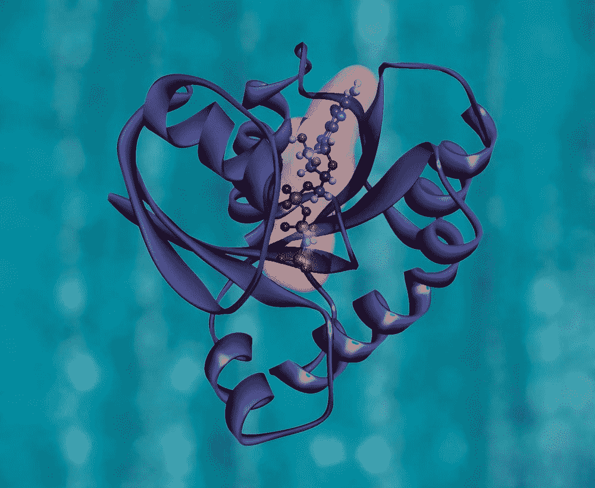
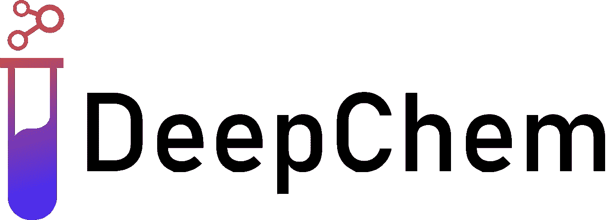
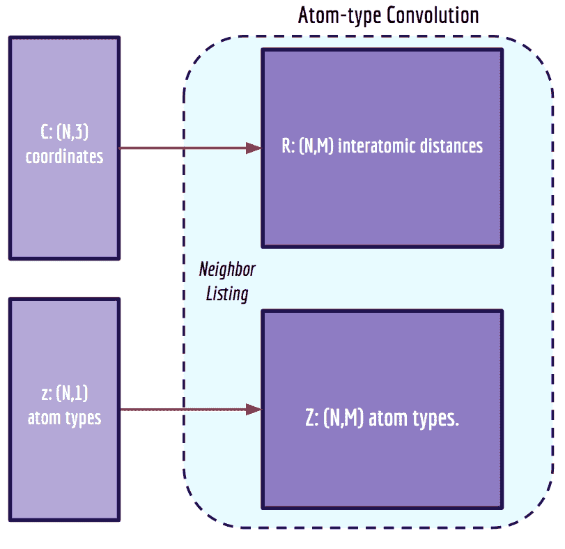
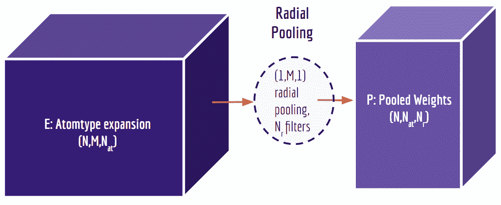
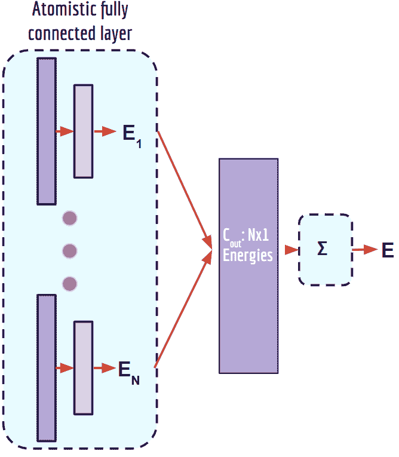
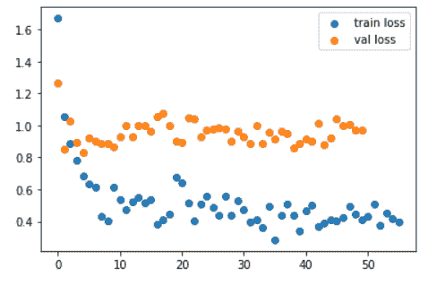

# 用原子卷积神经网络模拟蛋白质-配体相互作用

> 原文：<https://towardsdatascience.com/modeling-protein-ligand-interactions-with-atomic-convolutional-neural-networks-6be460184bae?source=collection_archive---------30----------------------->

## [思想和理论](https://towardsdatascience.com/tagged/thoughts-and-theory)

## *利用三维分子复合物的局部结构预测结合亲和力*



图片来自 [Unsplash](https://unsplash.com/photos/eeEiys6TU3c) 。

内森·c·弗雷

*本文由 DeepChem 的 Bharath Ramsundar 合著。*

[*ACNNs*](https://arxiv.org/pdf/1703.10603.pdf) *从蛋白质-配体复合物的三维结构中学习化学特征。在这篇文章中，我们展示了如何使用 DeepChem* *中的* [*ACNNs 和*](https://deepchem.readthedocs.io/en/latest/api_reference/models.html#atomicconvmodel) [*PDBbind 数据集*](http://www.pdbbind.org.cn/) *的开源实现来预测蛋白质-配体结合亲和力。*

*一个* [*互动教程*](https://github.com/deepchem/deepchem/blob/master/examples/tutorials/14_Modeling_Protein_Ligand_Interactions_With_Atomic_Convolutions.ipynb) *伴随着这篇文章，可以通过 Google Colab 运行。*

**复杂的问题**

药物发现的一个关键挑战是找到优先结合靶蛋白的小分子。我们可以使用[分子对接](https://www.ncbi.nlm.nih.gov/pmc/articles/PMC3151162/)或[自由能微扰](https://www.schrodinger.com/science-articles/free-energy-methods-fep)计算来预测候选分子的结合亲和力，但这些技术是计算密集型的，需要大量的专业知识才能应用。在这篇文章中，我们展示了如何将[卷积神经网络](/a-comprehensive-guide-to-convolutional-neural-networks-the-eli5-way-3bd2b1164a53?gi=2baa37536a10)或 ConvNets 的强大思想应用于 3D 原子坐标，以直接学习化学特征并预测结合亲和力。我们将介绍原子 ConvNet 如何工作，如何快速获得蛋白质-配体复合物的数据集，并训练一个模型来预测结合亲和力——所有这些都使用开源库 [DeepChem](https://deepchem.readthedocs.io/en/latest/) 。



Thiago Reschützegger 的图片来自 [DeepChem forums](https://forum.deepchem.io/t/refreshing-the-deepchem-logo/343/14) 。

**什么是原子通讯网？**

约瑟夫·戈麦斯、巴拉思·拉姆森达、埃文·范伯格和维贾伊·潘德在[本文](https://arxiv.org/abs/1703.10603)【1】中介绍了 ACNNs。首先，让我们来分析一下 ACNN 的架构。ACNN 的构造块是两个原始的卷积运算:原子型卷积和径向池。分子的笛卡尔原子坐标 *X* 用于构建距离矩阵 *R* 。 *R* 的元素是某个原子最大数量的最近邻的相邻原子之间的距离。还构建了一个原子类型矩阵 *Z* ，用于列出相邻原子的原子编号。

*R* 被送入深度为 *Nat、*的过滤器，其中 *Nat* 是复合体*中唯一原子类型的数量。*原子类型卷积核是一个阶跃函数，它对 *R* 进行运算，并为每种原子类型生成距离矩阵的独立副本。



*3D 原子坐标和原子类型是原子类型卷积的输入。图片由约瑟夫·戈麦斯摘自* [*戈麦斯等人的*](https://arxiv.org/pdf/1703.10603.pdf) *。*

接下来，用径向池层对原子型卷积的输出进行下采样。这种形式的维数减少防止了过度拟合，并减少了学习参数的数量。径向池层应用具有可学习参数的径向过滤器(池函数)。我们可以把径向池看作是一个特征，它总结了一个原子和所有不同类型的相邻原子之间的成对相互作用。



*原子型卷积的输出被馈送到径向池层。图片来自约瑟夫·戈麦斯* [*戈麦斯等人*](https://arxiv.org/pdf/1703.10603.pdf) *。*

原子卷积层(原子类型卷积+径向池)可以通过展平径向池层的输出并将其馈入另一个原子类型卷积来堆叠。最终的张量输出按行(每个原子)输入到一个完全连接的网络中，以预测每个原子的“能量”。通过将每个原子的能量相加，可以预测一个分子的总能量。



全连接层产生标量输出。图片由约瑟夫·戈麦斯从 [*戈麦斯等人的*](https://arxiv.org/pdf/1703.10603.pdf) *。*

这允许对输出进行有趣的解释，其中结合能被计算为 ACNN(复合物)- ACNN(蛋白质)- ACNN(配体)。也可以分解每个原子对结合能的贡献，取独立分子中的一个原子和复合物中的同一个原子的 ACNN 估算的能量之差。需要注意的是，输入维度仅取决于特征的数量(原子类型和径向过滤器的数量)，而不是分子中的原子数量，因此 ACNN 可以推广到比训练集中的系统更大的系统。

**来自 PDBbind** 的蛋白质-配体复合物数据

既然我们已经了解了 ACNN 的基本原理，让我们得到一个分子数据集并开始训练模型吧！我们将使用来自[pdb bind](http://www.pdbbind.org.cn/)【2】的高质量蛋白质-配体复合物和测量的结合亲和力的“核心”集合。由于 MoleculeNet 中的[加载器函数](https://deepchem.readthedocs.io/en/latest/api_reference/moleculenet.html#pdbbind-datasets)，我们可以用一行 python 代码从 PDBbind 中检索训练、验证和测试集。为了使计算负担最小化，我们只描述了蛋白质结合口袋(而不是整个蛋白质),并且我们只考虑了核心组中的大约 200 个复合物。如果我们想考虑来自 PDBbind 的更大的“细化”或“通用”集合，我们只需更改 **load_pdbbind()** 中的 **set_name** 。

```
tasks, datasets, transformers = load_pdbbind(featurizer=acf,pocket=True,set_name=’core’)
```

3D 原子坐标数据集使用**atomicconfeaturezer**进行特征化，其预先计算蛋白质、配体和复合物的特征(坐标矩阵、原子类型矩阵和邻居列表)。特征器控制每个分子中考虑的原子数量以及每个原子考虑的最大邻居数量。

**在蛋白质-配体复合物上训练 ACNN**

我们将建立一个 ACNN 模型，其超参数与原始论文中的模型相似。

```
acm = AtomicConvModel(n_tasks=1,frag1_num_atoms=f1_num_atoms,frag2_num_atoms=f2_num_atoms,complex_num_atoms=f1_num_atoms+f2_num_atoms,max_num_neighbors=max_num_neighbors,batch_size=12,layer_sizes=[32, 32, 16],learning_rate=0.003,)
```

这里，我们关注 **layer_sizes** ，它控制全连接网络中密集层的数量和大小。与原子数量相关的其他参数等于我们为**atomicconvertizer**指定的输入。我们将保持 15 个原子类型和 3 个径向过滤器的默认数量。

我们训练 50 个时期的模型，并可视化损失曲线。不出所料，它们不是特别光滑。使用更大的数据集可能对此有所帮助，但这是快速构建绑定亲和力预测模型的起点。



核心 PDBbind 集超过 50 个历元的训练和验证损失。图片作者。

**预测结合亲和力**

最初的 ACNN 论文在核心 PDBbind 数据集上使用了随机的 80/20 训练/测试分割。他们在训练集和测试集上分别显示了 0.912 和 0.448 的 Pearson R 值，用于预测结合亲和力。我们的简单模型在训练集(0.944)上实现了类似的性能，但在验证集(0.164)或测试集(0.250)上表现不太好。这是意料之中的，因为原始论文表明，尽管 ACNNs 成功地从小数据集学习化学相互作用，但它们容易过度拟合，并且无法在训练集之外进行推广。

有很多事情我们可以(也应该！)尝试建立一个更强大的模型:添加正则化/删除，使用更大的数据集和更大的全连接网络，改变原子类型和径向过滤器的数量，并尝试不同的分裂。我们甚至可以通过只研究配体[和完全忽略结合口袋](https://doi.org/10.3389/fphar.2020.00069)来做得很好！

非常值得注意的是，我们可以获得一个蛋白质-配体复合物的数据集，[训练一个相当复杂的深度神经网络](https://github.com/deepchem/deepchem/blob/master/examples/tutorials/14_Modeling_Protein_Ligand_Interactions_With_Atomic_Convolutions.ipynb)在不到 15 分钟的时间内预测像结合能这样复杂的物理量！然而，预测结合亲和力仍然是一个具有挑战性的问题，无论我们使用像 ACNNs 或基于物理的模拟这样的深度学习方法。关于蛋白质-配体相互作用预测的更多机器学习方法的概述，请查看这个[有用的帖子](https://medium.com/whats-next-in/speeding-up-drug-discovery-with-machine-learning-for-protein-ligand-interaction-prediction-95cfe52c6998)。希望像 DeepChem 中的 [ACNNs 这样的开源工具将使研究人员更容易进行深度学习实验，并开发出更好的方法来模拟蛋白质-配体相互作用。](https://deepchem.readthedocs.io/en/latest/api_reference/models.html#atomicconvmodel)

**取得联系**

*如果您喜欢本教程或有任何问题，请随时通过* [*电子邮件*](mailto:n.frey@seas.upenn.edu) *或连接*[*LinkedIn*](https://www.linkedin.com/in/ncfrey)*和*[*Twitter*](https://twitter.com/nc_frey)*联系内森。*

你可以在内森的 [*网站*](https://ncfrey.github.io/) *上找到更多关于他的项目和出版物的信息。*

*感谢* [*乔·戈麦斯教授*](https://thegomeslab.github.io/) *为本贴提供反馈。*

**参考文献**

[1]约瑟夫·戈梅斯、巴拉思·拉姆松达、埃文·范伯格、维贾伊·潘德。预测蛋白质-配体结合亲和力的原子卷积网络。 [arXiv:1703.10603](https://arxiv.org/abs/1703.10603) 。

[2]王，方，陆，王。PDBbind 数据库:已知三维结构的蛋白质配体复合物的结合亲和力集合。*药物化学杂志*，47(12):2977–2980，2004。