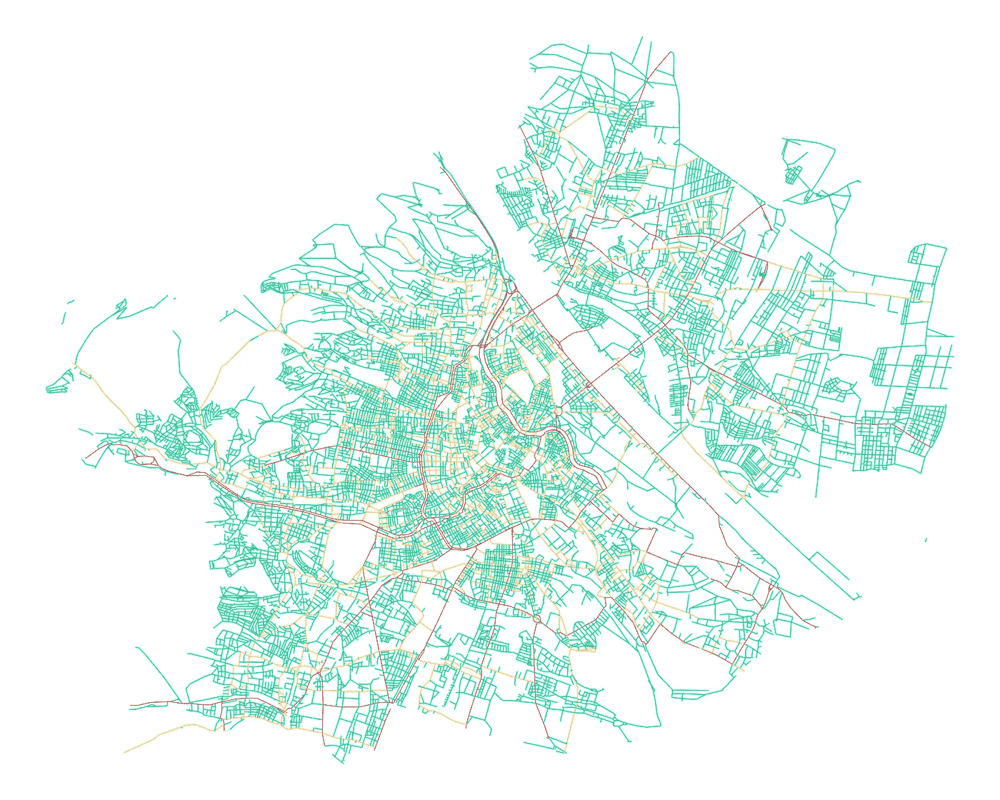

# 模拟维也纳市的交通密度

> 原文：<https://towardsdatascience.com/modeling-traffic-density-of-the-city-of-vienna-c41480c35523?source=collection_archive---------27----------------------->

## 网络分析/机器学习

## 将道路网的官方记录与优步数据连接起来


照片由[艾哈迈德·托尔巴](https://unsplash.com/@ahmgeek?utm_source=medium&utm_medium=referral)在 [Unsplash](https://unsplash.com?utm_source=medium&utm_medium=referral) 上拍摄

作为一个欧洲大城市的公民，我感觉城市地区的交通相当混乱和不可预测。然而，根据个人经验，我们每个人都建立了一些关于穿过我们家乡的某些繁忙街道和最快路线的直觉，甚至可能依赖于一天中的时间。

在本文中，我试图通过在粒度级别上分析推导维也纳市的交通密度来检验这些推测。为此，我结合了两个公开来源:

*   **道路网:**维也纳市道路网的官方记录，包含大约 30，000 个路段，每个路段都有各自的地理位置、长度和街道类型( [https:\\data.gov.at](https://www.data.gv.at/) )。
*   **优步:**优步乘车的汇总数据，显示维也纳任意分区组合之间的行程时间([https://movement.uber.com](https://movement.uber.com/?lang=en-US))。

# **选定方法**

作为第一步，道路网络能够根据每条街道上给定的最大速度限制模拟任意两点之间的最短路径。这样的路径导致一个假想的“无交通堵塞”的行驶时间。

接下来，这些“无交通”的旅行时间可以与来自优步乘坐的真实世界的“包括交通”的旅行时间进行对比。通过构造一个约束优化问题，从而获得代表网络每个路段的交通密度的系数。结果可以观察到不同情况下的交通密度和平均行驶速度。

本文中的 Python 实现可以从我各自的存储库中访问和派生。

<https://bernhard-pfann.github.io/>  

# 1.模拟路径

## 1.1.公路网

道路网络的官方记录包含城市内的所有街道段和交叉口。经过几个步骤的清理，它们可以以数据帧的形式描绘出来。


交叉表示“网络节点”

由于将应用网络分析，数据将作为“节点”和“边”加载到网络图中。两个数据帧的索引是连接对象的标识符。


街道代表连接节点的“网络边缘”

在这个项目中，我依赖于 NetworkX 包中的几个功能，它是为分析复杂的网络图而设计的。见下图数据帧中节点和边的初始化。

数据帧中节点和边的图形初始化

通过绘制图表并为不同的街道类型添加颜色代码，完整的道路网络变得可见。数据源区分三种不同类型的道路:本地街道(绿色)、主要街道(黄色)和联邦街道(红色)。街道类型充当允许的最大值的代理。速度限制，尽管它可能不会在所有情况下都与现实 1:1 对应。



按街道类型进行颜色编码的网络图

因为我们将在稍后尝试寻找从网络的不同起点到终点的路径，所以我们必须确保所有节点都连接到主网络图。

```
nodes_main = list(max(nx.connected_components(self.G)))
nodes_all  = list(self.G.nodes())
nodes_disconnect = set(nodes_all) - set(nodes_main)
```

通过所识别的断开的节点和相应的边来修剪网络留下了待分析的完全连接的网络。


由断开的节点和边进行颜色编码的网络图

## 1.2.优步地区

优步将维也纳市划分为 1370 个分区(“区域”)，以收集个人乘车的敏感数据。根据实际乘坐情况，两个地区之间任意组合的平均旅行时间是综合得出的，结果是 1400 万英里。Q1 2020 期间每日出行时间的测量。有关优步汇总方法的更多详细信息，请参见官方手册。


2020 年 Q1 期间的优步旅行时间

无论如何，要将优步骑行的数据与引入的道路网络连接起来，网络的每个节点都需要映射到其所在的相应区域。区域边界以多边形的形式提供，也可以绘制。


优步地区分割了维也纳的城市区域

通过检查单个节点并迭代地检查所有多边形是否该节点位于其边界内，可以实现所有节点的映射。

将网络节点映射到区域

## 1.3.最短路径

将网络组件成功映射到优步定义的区域后，每条边的可用属性具有以下结构:


存储为字典的随机网络边的属性

行驶时间属性是距离(米)除以速度(千米/小时)的简单除法，并转换为秒。它代表在一条街道上持续以最高限速行驶的假设时间。因此，它也可以被称为“无交通”的旅行时间。

为了估计任何区域之间通过网络的最短路径，NetworkX 算法会查找使指定边属性最小化的路径。在这种情况下，我们最小化交通自由旅行时间。

因为路径只能在节点之间计算，而不能在区域之间计算，所以需要从源区域和目的区域中随机抽取一个节点。为了避免不吉利的抽奖带来的噪音，测试了这些随机节点中的几个，同时只选择中值旅行时间的路径作为输出。

下面可以看到这种最短路径的直观表示。深蓝色线标示实际路线，正在通过的区域以浅蓝色突出显示，并标有区域编号。


可以从选择的路径中提取各种统计数据。将作为优化问题的输入的相关度量是各区域在相应路径上行进的米距离。


按路径上的区域划分的行驶米距离

# 2.约束优化

## 2.1.识别系数

我们已经非常接近找出城市每个区域的交通状况。在遍历优步数据集中的所有源区域和目的区域并收集每条路径上区域的米距离后，我们可以将获得的数据矩阵与优步乘坐的实际行驶时间相关联。数据帧分为 X 和 y 变量，如下所示。


单位面积的米距离作为独立变量来估计平均旅行时间

用简单的数学符号表示这种关系，实际的优步传播时间(y)应该等于米距离(x)乘以特定区域系数(β)的总和。


逻辑由此表明，区域“j”的β项越高，分配给该特定区域的总行驶时间越多，意味着交通密度越高。此外，由于该等式的测量单位是秒(y)和米(X)，β项表示为秒/米。这当然可以转换成 km/h，赋予它真实的意义。


## 2.2.运行优化

既然问题已经确定，就需要拟合一个模型，使给定函数的 RMSE 最小化。为了获得合理的β值，系数被限制在固定的范围内。转换成单位 km/h，这些对应于 5-120km/h 之间的带宽

经过 10 次迭代后，最小值似乎出现在大约 130 RMSE 处。通过在看不见的测试集上运行该模型，RMSE 仅略微增加到 134，这表明该模型的稳健性。


每次迭代的优化 RMSE

初始化为以 0.2 为中心的正态分布的 1370 个系数在第 10 次迭代后似乎也找到了平滑分布。


每次迭代的系数分布

在地图上绘制系数可绘制地理空间交通密度图。虽然较亮的区域表示交通流量较低，但较暗的区域与更繁忙的街道和较慢的交通流量相关。对于灰色区域，没有一条模拟路径与其边界相交。


按区域划分的交通密度

通过解释这些结果，两个观察结果与预期一致。首先，市中心的交通量最大。这种影响也扩展到了更西部的地区，那里的人口密度很高，街道也很小。第二，南部和多瑙河(流经城市的主要河流)沿线较大的明亮区域与现有的高速公路网络非常匹配，这使得旅行速度更高。

## 2.3.情况分析

虽然对整体交通密度建模已经可以识别城市中的热点，但比较一天中不同时间的交通状况或比较工作日与周末的动态也可能是有见地的。

为了获得场景结果，训练模型的优步游乐设施被简单地过滤为所选择的时间或天类别。见下面清晨(上午 0-7 点)与下午(下午 4-7 点)交通密度系数分布的比较。正如所料，早上的系数平均较低，对应于更少的交通流量和更高的平均行驶速度(如下面的子图所示)。


不同场景下系数和速度的分布

地图上两种情况下的系数差异图也在空间维度上支持了这一发现，因为红色区域意味着下午的交通密度高于清晨。


交通密度的差异(上午与下午)

# 3.最终考虑

使用所提出的方法，我们能够通过将街道网络映射到“优步定义的”城市分割，来组合两个不同的公共可用数据源。这使我们能够丰富每次优步骑行的源区域和目的区域，并获得骑行期间的路径信息。通过拟合一个将行驶路径与行驶时间联系起来的模型，可以得到交通密度的合理估计值。

然而，在此基础上，我想到了各种扩展，这些扩展可以使见解更具可操作性:

*   将单行道和红绿灯的数据纳入网络(至少后者是公开的)
*   引入人工交通堵塞，观察其对替代路线的影响
*   估计每个街道段的交通密度系数
*   比较 Covid 前后的交通动态

如果您发现任何其他有趣的应用程序，或者您想为自己的家乡重建项目，请随时使用我的工作。您可以在我各自的 GitHub 资源库中找到源代码。

<https://bernhard-pfann.github.io/>  

[1]粗略地从德语翻译过来

[2]由于计算能力有限，1400 万中只有 10 万。路径已被模拟