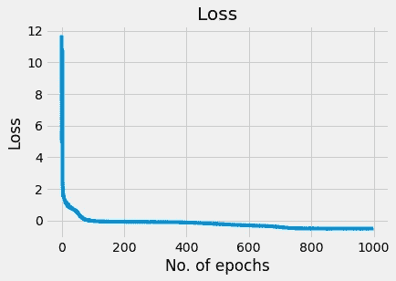

# 用张量流概率模拟神经网络中的不确定性

> 原文：<https://towardsdatascience.com/modeling-uncertainty-in-neural-networks-with-tensorflow-probability-391b29538a7a?source=collection_archive---------3----------------------->

## [实践教程](https://towardsdatascience.com/tagged/hands-on-tutorials)

## 第 4 部分:完全概率化

*本系列是使用张量流概率库对不确定性建模的简要介绍。我是作为我的*[*PyData Global 2021 talk*](https://pydata.org/global2021/schedule/presentation/13/modeling-aleatoric-and-epistemic-uncertainty-using-tensorflow-and-tensorflow-probability/)*关于神经网络中不确定性估计的补充材料写的。*

**系列文章:**

*   [**第一部分:**一个简介](/modeling-uncertainty-in-neural-networks-with-tensorflow-probability-part-1-an-introduction-2bb564c67d6)
*   [**第二部分**:任意不确定性](/modeling-uncertainty-in-neural-networks-with-tensorflow-probability-a706c2274d12)
*   [**第三部分**:认知的不确定性](/modeling-uncertainty-in-neural-networks-with-tensorflow-probability-d519a4426e9c)
*   第四部分:完全概率化

图片由[张本渝](https://www.pexels.com/@jessef11)在[像素](https://www.pexels.com/photo/green-mountain-painting-732548/)拍摄

## 介绍

我们走了这么远的路！今天，是我们最后一节课的时间了。我们将使用我们获得的所有知识，并将其应用于一个新的更具挑战性的数据集。

让我们把手弄脏吧！

## 数据

本周，我们将建立一个非线性异方差数据集。这个问题比我们之前看到的问题更难建模。

我们将使用以下流程来生成数据:

我们的数据生成过程。真实的你的形象。

让我们导入库，构建数据集并绘制它。

导入库，创建非线性训练数据并绘制它。

训练数据。请注意， *x* 的值越高，方差就越大。这是异方差的一个例子。数据也是非线性的。真实的你的形象。

如你所见，数据确实是非线性的，并且是异方差的。我们需要在我们的模型中引入一些非线性，以便更好地拟合这些数据——这是扩展我们概率工具包的一个绝好机会！

## 建模任意的*和*认知不确定性

我们的数据集已经就位。为了建立一个能够模拟任意和认知不确定性的模型，我们需要结合变化层和分布层。为了对认知不确定性建模，我们将使用两个`tfpl.DenseVariational`层和一个非线性激活函数。

首先，让我们定义*前*和*后*函数。你可能还记得[系列的前一部分](/modeling-uncertainty-in-neural-networks-with-tensorflow-probability-d519a4426e9c)，我们需要将它们传递给`tfpl.DenseVariational`以使其工作。

先从*之前的*说起吧:

先验生成函数。

先验生成函数必须以核大小、偏差大小和`dtype`为参数(后验也是如此)。我们按照与在[第 3 部分](/modeling-uncertainty-in-neural-networks-with-tensorflow-probability-d519a4426e9c)中相同的方式定义先验母函数:

*   我们使用一个不可训练的`tfd.MultivariateNormalDiag`分布对象作为我们的*先验。*
*   我们将它包装成`tfpl.DistributionLambda`，将`tfd.MultivariateNormalDiag`分布对象转换成 **Keras 兼容层**。
*   我们将这一层传递给`tf.keras.Sequential`以实现与后验生成函数的一致性。

类似地，我们按照[第 3 部分](/modeling-uncertainty-in-neural-networks-with-tensorflow-probability-d519a4426e9c)的过程定义后验生成函数:

*   我们用`tf.keras.Sequential`。
*   我们希望我们的*后验*是可训练的，所以我们使用生成可训练变量的`tfpl.VariableLayer`来参数化`tfpl.MultivariateNormalTriL`。
*   我们利用[第 2 部分](/modeling-uncertainty-in-neural-networks-with-tensorflow-probability-a706c2274d12)中介绍的一种非常方便的方法`.params_size()`来获得参数化`tfpl.MultivariateNormalTriL`所需的精确参数数，并将该层用作我们的可训练*后验层。*

我们有一切必要的参数化我们的变化层。

我们现在需要做的就是堆叠两个`tfpl.DenseVariational`层，添加一个非线性激活，并在它们上面放一个`tfpl.MultivariateNormal`层。

正如我们在[第 2 部分](/modeling-uncertainty-in-neural-networks-with-tensorflow-probability-a706c2274d12)中看到的，为了训练一个以分布层作为最后一层的模型，我们需要一个特殊的对数似然成本函数。

让我们将所有这些结合起来，定义我们的模型生成函数:

模型生成函数。我们的架构由两个“tfpl.DenseVariational”层和一个“tfpl.IndependentNormal”层组成。我们使用负对数似然成本函数来训练模型。

让我们打开它。我们使用普通的`tf.keras.Sequential`包装纸。我们将两层`tfpl.DenseVariational`放入其中，并将一层`tfpl.MultivariateNormal`放在上面。

第一个变化层有 8 个单元(或神经元)。首先，我们将输入形状定义为`(1,)`。那是因为我们的 *X* 是一维的。然后，我们将我们的先验和后验生成函数分别传递给`make_prior_fn`和`make_postrior_fn`。接下来，我们将 Kullback-Leibler 散度项归一化，通过训练样本数量的倒数对其进行加权。我们将`kl_use_exact`设置为`False`(在我们的例子中，我们也可以将其设置为`True`)。最后，我们指定非线性激活 function⁴.

第二层的参数化类似。尽管有一些不同之处。我们没有对单元的数量进行硬编码，而是使用`.params_size()`方法来确保我们获得了正确的单元数量来参数化我们的最后一个分布层。注意，我们在这里也不使用非线性。

我们的负对数似然损失函数与我们在[第 2 部分](/modeling-uncertainty-in-neural-networks-with-tensorflow-probability-a706c2274d12)中定义的函数相同。

我们现在准备好训练模型了！

让我们这样做，并绘制损失图:

我们的任意和认知不确定性估计模型的损失与时代数。真实的你的形象。

损失看起来不错，我们可以尝试进一步优化模型，以更快地收敛，但这不是我们在这篇文章中的目标。

## 结果

你的模型被训练。那是一个非常激动人心的时刻！我们准备好进行预测了。我们的预测将包含对 ***任意性*** 和 ***认知性*** 不确定性的估计。我们期望看到*一组* *最佳拟合线*和*一组* *置信区间*。为了使可视化更清晰，我们将稍微修改绘图代码，将置信区间表示为线条而不是阴影区域。与我们在[第 3 部分](/modeling-uncertainty-in-neural-networks-with-tensorflow-probability-d519a4426e9c)中所做的类似，我们将计算 15 个独立预测:

我们为最佳拟合线及其置信区间生成 15 个预测，并绘制结果。

训练数据和 15 条最佳拟合线及其各自的置信区间。该图表示对任意(置信区间)和认知(15 组最佳拟合线及其 CIs)不确定性的估计。真实的你的形象。

如您所见，我们的模型在拟合数据方面做得非常好！🚀似乎非线性和异方差都建模得很好。置信区间似乎是可靠的，覆盖了大约 95%的点。

## 摘要

在这一集的*用张量流概率* 对神经网络中的不确定性建模中，我们看到了如何使用单一模型对*任意性*和*认知不确定性*进行建模。

我们生成了一个非线性和异方差数据集，并使用具有非线性激活的更深层次架构对其建模。我们更新了如何定义参数化变化层所需的*先验*和*后验*分布。最后，我们已经看到了如何使用一个变化层来参数化一个最终的概率分布层。

这是*用张量流概率* 系列对神经网络中的不确定性建模的最后一篇文章。祝贺你完成这个系列！🎉

## 谢谢大家！

如果您对本系列涵盖的材料有任何疑问，或者对您希望在未来阅读的主题有任何建议，请随时告诉我:

*   在评论中
*   在 [LinkedIn](https://www.linkedin.com/in/aleksandermolak/) 上给我发消息
*   通过我的[网页](https://alxndr.io/)上列出的任何其他渠道联系

谢谢大家！

## 脚注

理论上，我们可以通过使用一个变分过程作为模型的最后一层来达到更高的概率。但是这超出了本系列的范围。

你可能还记得，我们将这些函数作为函数对象传递，而不调用它们。

请参考[第 3 部分](/modeling-uncertainty-in-neural-networks-with-tensorflow-probability-d519a4426e9c)进行解释。

⁴:我们在例子中使用了 sigmoid 函数。如果我们使用 ReLU，模型拟合看起来会不同吗？如果有，为什么？欢迎在评论中告诉我。

________________

❤️ *有兴趣获得更多这样的内容吗？使用此链接加入:*

 [## 通过我的推荐链接加入媒体-亚历山大·莫拉克

### 作为一个媒体会员，你的会员费的一部分会给你阅读的作家，你可以完全接触到每一个故事…

aleksander-molak.medium.com](https://aleksander-molak.medium.com/membership) 

谢谢大家！

_______________