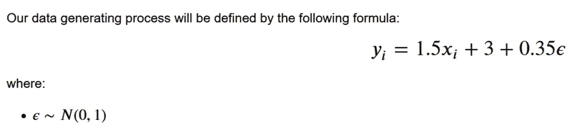
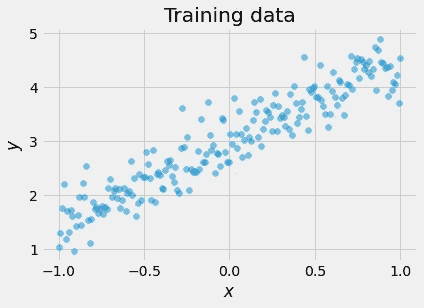
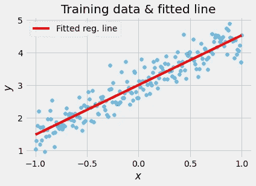
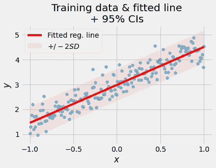

# 用张量流概率模拟神经网络中的不确定性

> 原文：<https://towardsdatascience.com/modeling-uncertainty-in-neural-networks-with-tensorflow-probability-a706c2274d12?source=collection_archive---------3----------------------->

## [实践教程](https://towardsdatascience.com/tagged/hands-on-tutorials)

## 第 2 部分:任意不确定性

*本系列是使用张量流概率库对不确定性建模的简要介绍。我是作为我的*[*PyData Global 2021 talk*](https://pydata.org/global2021/schedule/presentation/13/modeling-aleatoric-and-epistemic-uncertainty-using-tensorflow-and-tensorflow-probability/)*关于神经网络中不确定性估计的补充材料写的。*

**系列文章:**

*   [**第一部分:**一个简介](/modeling-uncertainty-in-neural-networks-with-tensorflow-probability-part-1-an-introduction-2bb564c67d6)
*   **第二部分**:任意不确定性
*   [**第三部分**:认知的不确定性](/modeling-uncertainty-in-neural-networks-with-tensorflow-probability-d519a4426e9c)
*   [**第四部分:**完全概率性](/modeling-uncertainty-in-neural-networks-with-tensorflow-probability-391b29538a7a)

图片由 [cottonbro](https://www.pexels.com/@cottonbro) 在 [Pexels](https://www.pexels.com/photo/person-wearing-silver-ring-with-white-manicure-5870547/) 拍摄

## 介绍

在本系列的第一部分[中，我们讨论了建模不确定性背后的动机，并介绍了](/modeling-uncertainty-in-neural-networks-with-tensorflow-probability-part-1-an-introduction-2bb564c67d6)[张量流概率](https://www.tensorflow.org/probability) (TFP)的基础知识。在这一部分，我们将重点讨论 ***任意不确定性*** 。我们将从定义开始，然后看看如何使用张量流概率对*随机不确定性*建模。

## 什么是随机不确定性？

*随机不确定性*代表当我们用完全相同的设置多次重复相同的实验时，结果的不可预测的差异。它与生成数据的数据生成过程有着内在的联系。

*任意*一词来源于拉丁语[***alea***](https://en.wiktionary.org/wiki/alea)*/*ˈaː.le.a*/原意为“关节骨”或“枢轴骨”。这些类型的骨头被用作骰子——你可以把它们想象成伪随机数发生器的早期版本🤯*随机不确定性*的另一个——可能更直观——名称是*(也称为*统计不确定性* ) *。***

**也许关于随机不确定性最重要的事实是，它不能通过增加更多的数据来减少**

**让我们看一个例子。**

****

**由[icon0.com](https://www.pexels.com/@freeimages9)在[像素](https://www.pexels.com/photo/green-tennis-ball-illustration-226587/)拍摄的图像**

**想象两个机器人。其中一个扔网球，另一个用球拍击球。让我们重复这个场景 1000 次，保持所有参数不变。即使我们一直使用同一个球，每次球的轨迹也会略有不同。这是因为有许多我们没有考虑到的小差异——球不是完美的球形，在电机控制中有小的不精确性，等等。观察到的轨迹差异是*随机不确定性*的本质。**

**我们说过*随机不确定性*代表我们多次重复相同实验时结果的差异。我们无法精确预测这些差异。尽管如此，还是有一些我们*可以*做的有价值的事情。让我们试着量化不可预测的。**

## **用张量流概率模拟任意不确定性**

**在[系列的前一部分](/modeling-uncertainty-in-neural-networks-with-tensorflow-probability-part-1-an-introduction-2bb564c67d6)中我们介绍了`tfp.layers`模块和各种分配方法，包括`.log_prob()`。今天，我们将在实践中使用概率层和`.log_prob()`。它们将是我们概率模型的重要组成部分。我们将保持例子非常简单，这样我们就可以专注于方法而不是复杂的问题或数据集。准备好了吗？🚀**

**首先，让我们生成一些数据。**

****

**我们的数据生成过程。请注意，如果您使用真实世界的数据，您可能希望在训练前对其进行缩放。真实的你的形象。**

**如你所见，我们的数据是嘈杂的。通过在基本线性方程中添加随机*ε*(*ε*)项来模拟其噪声。随机项正态分布，均值为 0，标准差为 1。我们将 *ε* 乘以 *0.35* ，缩小其标准偏差。因为 *ε* ，所以 *X* 和 *Y* 之间的关系并不是完全确定的。**

**让我们使用上面的公式生成 200 个点，并绘制数据。**

**导入库，生成 *X 和 Y 向量并绘制结果。***

****

**生成的数据。真实的你的形象。**

**现在，让我们建立一个简单的回归模型，并根据数据进行拟合。**

**为我们的数据建立并拟合一个简单的回归模型。**

**让我们在训练集上生成预测并绘制它们:**

**预测训练集上的值并绘制结果。**

****

**我们的训练数据和拟合的回归线。真实的你的形象。**

**拟合线似乎是对 *X* 和 *Y* 之间关系的一个很好的估计。给定 *X* 的值，该线代表 *Y* 的期望值的最佳(线性)近似值。**

**我们试着稍微延伸一下思路。我们说过我们正在估计给定 *X* 的 *Y* 的期望值。如果我们更进一步，尝试估计另一个参数——标准差，会怎么样？在我们设计的例子中，我们知道噪声项— *ε —* 通常是 distributed⁴.因此，我们可以对数据进行正态分布拟合，而不仅仅是直线拟合。这意味着我们想要修改我们的模型，这样它就不会返回一个标量值，而是返回一个分布对象。我们需要做一些修改才能使它工作。**

**到目前为止，我们使用均方误差(或`'mse'`)作为损失函数。当对连续的目标进行操作时，均方误差是一个很好的选择，但是为了学习一个分布，我们将需要一些别的东西。**

**我们将创建一个对数似然函数，它接受一些数据和一个分布对象，并根据给定的分布计算数据的对数似然。**

**用作损失函数的负对数似然函数。**

**该函数采用真值`y_true`和预测值`y_pred`。这些论点实际上与任何张量流相容损失函数的论点相同。但是有一个转折。记住，我们现在要输出一个分布。因此，我们的预测`y_pred`将是一个分布对象(而不是一个标量值)。正如我们在[第 1 部分](/modeling-uncertainty-in-neural-networks-with-tensorflow-probability-part-1-an-introduction-2bb564c67d6)中所讨论的，每个分布对象都有一个`.log_prob()`方法，在给定一些数据的情况下，计算分布的 log-PDF。我们将使用这种方法来计算对数似然性，然后我们将反转符号(或者将结果乘以-1，如果您愿意的话)。我们颠倒了符号，因为我们想最大化可能性。按照惯例，在深度学习中，我们宁愿最小化而不是最大化。最小化负对数似然和最大化似然是一样的。**

**我们的损失函数到位了。我们准备开始构建模型。**

**带有概率层的模型，允许我们模拟任意的不确定性。**

**让我们打开它。**

**从技术上讲，我们的新模型有两层。事实上，第一层的唯一目的是参数化第二层中的分布。从这个意义上说，我们的模型并不比我们之前建立的简单回归模型更深入。**

**第一层是一个普通的 T4 层。第二层是`tfpl.IndependentNormal`。TFP 中的概率层是分布对象的包装器，允许 TFP 分布与常规张量流层平滑集成。注意`tfpl.IndependentNormal`只接受一个参数— `event_shape`。在我们的例子中，事件形状等于 1，因为我们的输出是一维的。该图层将返回一维正态分布。**

**现在让我们回到第一层。您可能已经注意到，我们没有使用单个标量值来定义单位数，而是使用了下面的公式:`tfpl.IndependentNormal.params_size(event_shape)`。我们可以在这里传递一个数字，但我们是故意这样做的。静态分布方法`.params_size()`是一个非常方便的工具，尤其是在处理更复杂的模型时。这是您 TFP 工具箱中的一笔巨大资产！在给定事件形状的情况下，该方法返回参数化分布所需的多个参数。在我们的例子中，这个方法应该返回 2，因为我们想要参数化一个 1D `tfpl.IndependentNormal`，它有两个参数——均值和标准差。我鼓励你自己检查这个方法是否返回了我们期望的结果。**

**现在，让我们根据新模型进行预测，并绘制结果图。**

**获得模型预测并绘制结果。**

****

**训练数据、拟合回归线和置信区间。真实的你的形象。**

**让我们确保理解生成预测背后的过程。我们的新模型返回一个分布对象。为了从分布中获得参数估计值，我们可以从分布中取样并使用获得的样本计算感兴趣的统计数据，或者我们可以使用`.mean()`和`.stddev()`方法直接获得这些统计数据。我们选择了后者。**

**请注意，平均值给出了一条线，这条线实际上与我们之前从简单的线性回归模型中获得的线相同。这是意料之中的，如果我们的模型收敛，概率模型和非概率模型之间的这种比较可能是一个很好的检查。允许我们量化 ***随机不确定性*** 的额外信息来自标准差。我们使用经过训练的分布的标准差来生成置信区间，该置信区间量化了数据生成过程中随机项的可变性。**

> **注意:你可能会问自己:如果我们可以通过分析获得这些置信区间，为什么还要为概率层和复杂的训练程序而烦恼呢？这是一个很棒的问题！答案要求我们超越今天的例子来思考:我们在本教程中使用的方法可以很好地推广到非线性和复杂的情况，在这些情况下，分析计算置信区间可能非常困难。也就是说，许多人告诉我，对于他们来说，通过非常简单的例子来理解这些概念比通过更复杂的例子要容易得多。我希望这对你也有用。如果您想看稍微复杂一点的东西，请等到第 4 部分！**

## **摘要**

**在本集*用张量流概率* 对神经网络中的不确定性建模中，我们已经看到了如何对*任意不确定性*进行建模。**

**我们使用`.log_prob()`方法和一个概率层来实现这个目标。我们学习了如何创建负对数似然损失函数，该函数允许我们训练具有最终概率层的模型。**

**在下一部分，我们将关注 ***认知不确定性*** 。我们将看到更多的概率层在起作用，并将在第 4 部分为建立完全概率模型打下基础。**

**第三部再见！**

**— — — — — — — — — — — — — — — — —**

## **脚注**

**⁰首先假设我们的样本足够大。理论上，如果我们有一个非常小的样本，我们可能会高估随机不确定性。在这种情况下，在增加样本量后，我们可能会经历*随机不确定性*的某种程度的降低。**

**这种情况与[混沌理论](https://en.wikipedia.org/wiki/Chaos_theory)和复杂性科学中对初始条件的敏感性密切相关。**

**如果你有哲学倾向，你可能会说我们可以测量物体在不同时间点的位置和速度，并使用这些测量来减少与结果相关的不确定性。这是一个伟大的言论。它揭示了*随机不确定性*的另一个方面:假设我们不增加新的变量，它不能通过增加更多的数据**来减少。请注意，添加新的变量会将我们带到一个新的(更高维度)系统，其随机不确定性不同于原始系统的随机不确定性！根据您的场景，这可能有其局限性。尽管如此，探索它们超出了本材料的范围。****

**我们遵循一个非常简单的流程。请注意，我们不使用训练测试分割、交叉验证或其他良好的数据科学实践。这样做的唯一原因是我们希望只关注不确定性建模。在现实世界中，您很可能会对遵循这些良好实践感兴趣。**

**真实世界场景中的⁴噪声项的分布可能是(并且经常是)未知的。**

**________________**

**❤️对获得更多这样的内容感兴趣吗？使用此链接加入:**

**<https://aleksander-molak.medium.com/membership>  

_______________**