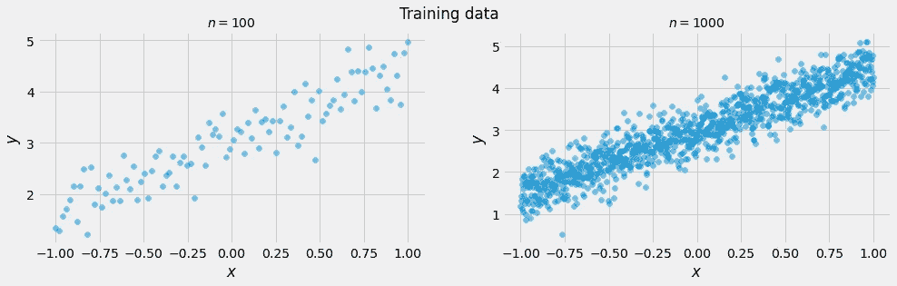
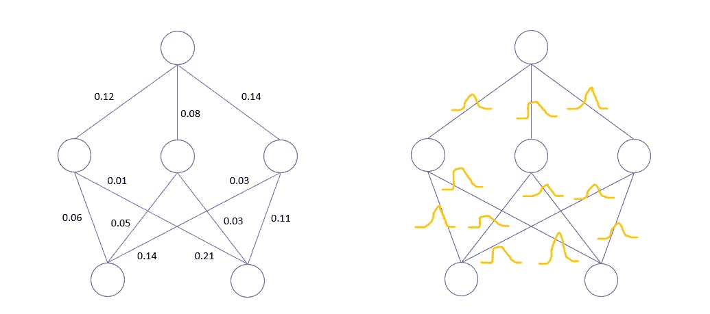
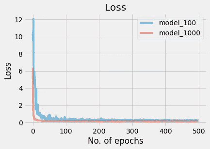
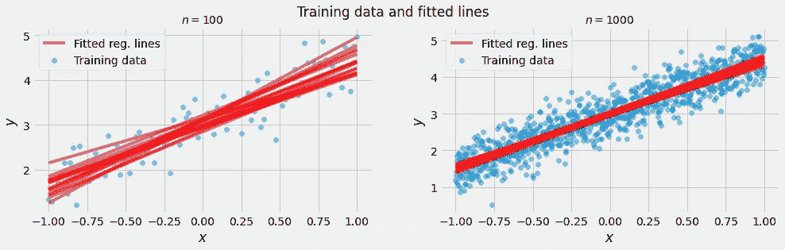

# 用张量流概率模拟神经网络中的不确定性

> 原文：<https://towardsdatascience.com/modeling-uncertainty-in-neural-networks-with-tensorflow-probability-d519a4426e9c?source=collection_archive---------5----------------------->

## 第三部分:认知的不确定性

*本系列是使用 TensorFlow 概率库对不确定性建模的简要介绍。我是作为我的*[*PyData Global 2021 talk*](https://pydata.org/global2021/schedule/presentation/13/modeling-aleatoric-and-epistemic-uncertainty-using-tensorflow-and-tensorflow-probability/)*关于神经网络中不确定性估计的补充材料写的。*

**系列文章:**

*   [**第一部分:**一个简介](/modeling-uncertainty-in-neural-networks-with-tensorflow-probability-part-1-an-introduction-2bb564c67d6)
*   [**第二部分**:任意不确定性](/modeling-uncertainty-in-neural-networks-with-tensorflow-probability-a706c2274d12)
*   **第三部分**:认知不确定性
*   [**第四部分:**完全概率性](/modeling-uncertainty-in-neural-networks-with-tensorflow-probability-391b29538a7a)

图片由[丽莎](https://www.pexels.com/@fotios-photos)在[https://www.pexels.com/photo/turned-on-led-bulb-1393363/](https://www.pexels.com/photo/turned-on-led-bulb-1393363/)拍摄

## 介绍

在本系列的[前一部分](https://medium.com/@aleksander.molak?p=a706c2274d12)中，我们谈到了 ***任意不确定性*。**我们已经展示了如何在实践中使用 [TensorFlow Probability](https://www.tensorflow.org/probability) 的概率层和自定义损失函数对其建模，该函数允许我们使用概率最终层来训练模型。

本周，我们将关注 ***认知不确定性*** 。我们将探索更高级的概率层，并了解在神经网络中估计权重不确定性的技术。先说一个定义。

## 什么是认知不确定性？

在[第 2 部分](/modeling-uncertainty-in-neural-networks-with-tensorflow-probability-a706c2274d12)中，我们说过*随机不确定性*与数据生成过程有内在联系，不能通过添加更多数据来减少。

*—另一方面，认知不确定性与我们对数据生成过程的了解(或无知)有关。这个名字来自古希腊语<https://en.wiktionary.org/wiki/%E1%BC%90%CF%80%CE%B9%CF%83%CF%84%CE%AE%CE%BC%CE%B7>*****/e . pisˇti . mi/*——这个术语被亚里士多德或柏拉图等哲学家广泛使用，大致翻译为“知识”。*认知不确定性*的另一个名称是*模型不确定性*。*****

*****关于*认知不确定性的一个重要事实是*它**可以通过增加**更多的数据**来**减少**。*******

## *****用张量流概率建模认知不确定性*****

*****先说一些数据。我们将使用与在[第 2 部分](https://medium.com/@aleksander.molak?p=a706c2274d12)中相同的数据生成过程，但这次我们将创建两个数据集，而不是一个。一个数据集较小( *n=100* )，另一个较大( *n=1000* )。这些数据集将帮助我们理解样本大小如何影响不确定性估计。*****

*****我们导入库，使用相同的数据生成过程生成两个数据集，但是样本大小不同( *n=100* 和 *n=1000* )。最后，我们绘制数据。*****

**********

*****我们两个数据集的散点图。真实的你的形象。*****

*****我们的数据准备好了。在我们开始建模之前，让我们了解需要做出什么架构决策来在我们的模型中启用*认知不确定性*估计。*****

*****从概念上讲，我们需要做的是用分布代替逐点权重估计。让我们打开它。在传统的神经网络中，每个权重由一个数字表示。在训练期间，我们最小化一些关于模型权重的损失函数。当模型表现足够好时，我们停止训练并存储权重。我们有多确定我们所学的权重是我们问题的好估计？*****

*****我们实际上不知道。*****

*****为了解决这个问题，我们需要一种方法来量化这种(不)确定性。我们将用一个分布替换每个权重，而不是学习每个权重的单个值，我们将学习每个分布的一组参数。*****

**********

*****在一个常规的神经网络(左)中，所有的权重都是点估计值(或者也可以是一个数字)。当对认知不确定性建模时(右)，每个权重被建模为分布而不是点估计。右图中的橙色线条代表发行版的 pdf。真实的你的形象。*****

*****要了解分布，我们需要从某处开始—我们需要一个初步分布，然后我们将更新它以反映最佳数据拟合。这种初步分配被称为*优先*。最终分布称为*后验*。*****

*****给定*先验*分布和我们的数据，我们将利用[贝叶斯定理](https://en.wikipedia.org/wiki/Bayes%27_theorem)的力量来学习*后验*分布。但是有一个问题，在我们的例子中，计算精确的后验概率非常困难。*****

> ********变分图层********

*****幸运的是，TensorFlow Probability 提供了通过反向投影*【1】实现 [*贝叶斯的`tfpl.DenseVariational`层——这是一种可用于神经网络中高效权重不确定性估计的方法。这是一种近似的方法——但绝对足够好，可以引导我们获得巨大的实际结果。*](https://arxiv.org/pdf/1505.05424.pdf)******

******此外，`tfpl.DenseVariational`层将为我们完成大部分繁重的工作，包括证据下限( [ELBO](https://en.wikipedia.org/wiki/Evidence_lower_bound) )的计算——我们将使用这个量在内部找到*后验*。******

******我们使用`tfpl.DenseVariational`的方式类似于常规的`tf.keras.Dense`，但是我们需要指定几个额外的参数。最重要的两个是*优先*生成函数和*p*o 优先 *g* 生成函数。这两个函数都需要带三个参数:`kernel_size`、`bias_size`和`dtype`，并且都应该返回一个分布。******

******我们来定义一下！******

******我们将从一个*先验*分布开始。******

******使用多元正态分布和“tfpl.DistributionLambda”包装器定义不可训练的先验。******

******让我们打开它。******

******我们使用平均值为零(`loc=tf.zeros(n)`)和标准差为 1 ( `scale_diag=tf.ones(n)`)的`tfd.MultivariateNormalDiag`。这个发行版被打包到`tfpl.DistributionLambda`中，它只是将一个发行版对象转换成一个 Keras 兼容的层。这一层然后被传递给一个标准的`tf.keras.Sequential`模型。这有点拗口，还有一个稍微简单一点的方法来定义这个*先于*。不过，我们将坚持上面介绍的方法，因为它更通用，更符合我们定义*后验*的方式。******

******那就让我们看看*后路*吧！******

******定义一个可训练的后验分布。` tflp.VariableLayer '生成一个可训练变量来参数化` tfpl.MultivariateNormalTriL'。******

******我们采用完全相同的一组参数——内核和偏差大小以及`dtype`。类似于我们之前所做的，我们使用`tf.keras.Sequential`。与之前的*分布不同，我们希望我们的*后*是可训练的。我们使用生成可训练变量的`tfpl.VariableLayer`来参数化`tfpl.MultivariateNormalTriL`。正如在[第 2 部分](/modeling-uncertainty-in-neural-networks-with-tensorflow-probability-a706c2274d12)中，我们使用了一种静态便利方法`.params_size()`来获得参数化`tfpl.MultivariateNormalTriL`所需的精确参数数。*******

> ********建模认知不确定性********

*****这是很多，但现在我们终于准备好定义模型了！*****

*****定义一个可以估计认知不确定性的概率模型。我们使用一个函数来定义模型，以便轻松地为每个数据集构建单独的模型。*****

*****让我们简单地研究一下变分层参数。第一个参数是单位数。这里我们只有一个单位——就像常规线性回归中一样。第二个参数— `input_shape` —看起来应该也很熟悉——它与规则密集层的情况具有完全相同的含义。接下来，我们传递先验和后验函数。注意，我们应该将这些函数作为对象**传递，而不调用**它们。*****

*****最后，我们有两个与[*kull back–lei bler 散度*](https://en.wikipedia.org/wiki/Kullback%E2%80%93Leibler_divergence) ( *KL 散度*)相关的参数。 *Kullback-Leibler 散度*是我们 ELBO 目标中的一个术语。因为这一项与 ELBO 中的第二项是在不同的数据子集上计算的，我们需要重新调整它以确保它是无偏的。这就是我们将`x_train_shape`作为参数传递给模型生成函数的原因。最后一个参数——`kl_use_exact`——控制我们是想通过分析计算 *KL 散度*还是使用经验近似法。在我们的例子中，我们可以解析地计算它，因为当我们有一个作为先验和后验的正态分布时，这很容易做到。然而，这并不总是可能的。我们将`kl_use_exact`明确设置为`False`,以证明该参数 exists⁴.*****

*****在第 2 部分的[中，我们需要两层来解决一个简单的回归问题——一层用来表示输出分布，另一层用来参数化这个分布。量化 ***认知的不确定性*** 虽然一个变分层就够了。该层返回输出的点估计值，但其权重(和偏差)是概率性的。这两个事实的后果如下:](/modeling-uncertainty-in-neural-networks-with-tensorflow-probability-a706c2274d12)*****

*   *****我们可以使用*均方误差*作为损失函数(尽管在内部，我们仍将使用 ELBO 来逼近*后验*分布)，*****
*   *****当我们要求模型进行预测时，它几乎每次都会返回不同的输出；这是因为现在每次查询模型时，我们的权重都是从学习的分布中采样的。*****

*****我们准备好安装模型了。*****

*****拟合两个模型:一个在较小的数据集上，一个在较大的数据集上。*****

*****我们对每个模型训练 500 个时期，以确保两个模型都收敛。请注意，就参数而言，这些模型是迄今为止最大的——我们需要估计偏差项和权重项的均值和标准差以及它们之间的协方差，这样我们总共有 5 个参数。*****

*****让我们画一条学习曲线。*****

**********

*****作为时代数的函数的损失。蓝线代表在较小数据集上训练的模型( *n=100* )。红线代表在更大的数据集上训练的模型( *n=1000* )。真实的你的形象。*****

*****正如你所看到的，在较小的数据集上训练的模型的损失( *n=100* )要波动得多。这是有意义的，因为模型很难在较小的数据集上找到稳定的参数估计值。*****

*****太好了！我们的模型经过训练，我们最终可以生成和绘制预测！*****

*****为更小和更大的数据集生成和绘制预测。我们为每个模型生成 15 个预测。*****

**********

*****我们两个数据集的散点图和每个数据集的 15 条拟合线。真实的你的形象。*****

*****我们为每个模型生成了 15 个预测。每次预测都是不同的，因为对于每次迭代，我们从学习到的*后验*分布中随机抽取权重。请注意，在较大数据集上训练的模型(右)在*斜率*和*截距*估计值上的方差比在较小数据集上训练的模型(左)小得多。这是一个很好的例子，说明如何通过添加更多的数据来减少认知不确定性。*****

## *****摘要*****

*****在本集*用张量流概率* 对神经网络中的不确定性建模中，我们已经看到了如何对*认知不确定性*进行建模。*****

*****我们使用了更高级的概率层，比如`tfpl.VariationalDense`。我们定义了我们的*先验*和*后验*分布。最后，我们已经看到样本大小如何影响*认知不确定性*估计。*****

*****在下一部分，我们将介绍一个**完全概率**模型，我们将在一个更复杂的非线性数据集上训练它，看看如何使概率模型更深入。*****

*****[第四部](/modeling-uncertainty-in-neural-networks-with-tensorflow-probability-391b29538a7a)见！*****

## *****脚注*****

*****ELBO 有两个分量:似然分量和 Kullback-Leibler 散度分量。更多细节请参考[1]。*****

*****变量`n`表示层中参数的总数。*****

*****`[tfpl.MultivariateNormalTriL](https://www.tensorflow.org/probability/api_docs/python/tfp/distributions/MultivariateNormalTriL)`是`tfp.distributions`模块中多元正态分布的参数之一。*****

*****⁴这个参数的默认值被设置为`False`，如果你不知道的话，很容易忽略它。*****

## *****参考*****

*****[1] C. Blundell，J. Cornebise，K. Kavukcuoglu，D. Wierstra，[神经网络中的权重不确定性](https://arxiv.org/pdf/1505.05424.pdf) (2015)。第 32 届机器学习国际会议论文集(ICML 2015)。*****

*****________________*****

*****❤️ *对获取更多这样的内容感兴趣吗？使用此链接加入:******

*****<https://aleksander-molak.medium.com/membership>  

谢谢大家！

_______________*****