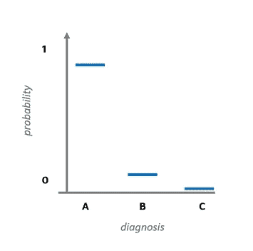
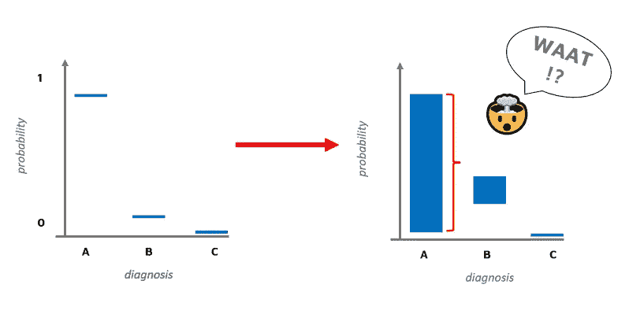

# 用张量流概率模拟神经网络中的不确定性

> 原文：<https://towardsdatascience.com/modeling-uncertainty-in-neural-networks-with-tensorflow-probability-part-1-an-introduction-2bb564c67d6?source=collection_archive---------7----------------------->

## [实践教程](https://towardsdatascience.com/tagged/hands-on-tutorials)

## 第一部分:引言

*本系列是使用张量流概率库对不确定性建模的简要介绍。我是作为我的*[*PyData Global 2021 talk*](https://pydata.org/global2021/schedule/presentation/13/modeling-aleatoric-and-epistemic-uncertainty-using-tensorflow-and-tensorflow-probability/)*关于神经网络中不确定性估计的补充材料写的。*

**系列文章:**

*   第一部分:介绍
*   [**第二部分**:任意不确定性](/modeling-uncertainty-in-neural-networks-with-tensorflow-probability-a706c2274d12)
*   [**第三部分**:认知的不确定性](/modeling-uncertainty-in-neural-networks-with-tensorflow-probability-d519a4426e9c)
*   [**第四部分:**完全概率性](/modeling-uncertainty-in-neural-networks-with-tensorflow-probability-391b29538a7a)

图像由杰曼特里[https://www.pexels.com/photo/blue-body-of-water-5412/](https://www.pexels.com/photo/blue-body-of-water-5412/)

# 为什么要对不确定性建模？

让我反过来问这个问题——为什么不对不确定性建模？

想象你正在建立一个医疗诊断系统。假设您的系统可以预测三类中的一类:(A)恶性肿瘤，(B)良性肿瘤，(C)无肿瘤。你的系统预测你的病人杰西患有恶性肿瘤。预测的 **softmax 得分**为 **0.9** 。你有多大把握你的预测是正确的？

我们设计的诊断系统的 softmax 分布。系统返回(A)类恶性肿瘤的高 softmax 值。

你会和杰西分享这个诊断吗？

在您回答这个问题之前，让我们将权重不确定性估计添加到我们的模型中。这种不确定性的另一个名字是**认知不确定性**，我们将在本系列接下来的几集里详细讨论。让我们再次看看我们模型的输出。

左图:我们设计的诊断系统的 softmax 发行版。右图:一个 softmax 分布加上 95%的置信区间，超过 10000 个来自我们模型的概率版本的预测。

刚刚发生了什么事？我们以前见过左边的情节，但是我们在右边看到了什么？在右边的图中，我们添加了 softmax 分数的 95%置信区间，该分数是通过从我们的模型的概率版本中抽取 10.000 个样本而获得的。

这样的结果有可能吗？尽管看起来有些违反直觉，简短的回答是肯定的。在关于认知不确定性的第**集**中，我们将看到真实世界系统以类似方式运行的例子。

回到我们最初的问题——为什么(不)对不确定性建模？我们将在本系列的最后一集尝试对这个问题给出一个有根据的答案。同时，我很想听听你的想法。请在下面的评论区分享它们。

现在，让我们看看一个工具包，它将帮助我们回答关于不确定性估计的问题——张量流概率。

张量流概率 [API 参考页](https://www.tensorflow.org/probability/api_docs/python/tfp)。你真实的照片。

# 张量流概率

[TensorFlow Probability](https://www.tensorflow.org/probability)(TFP)是一个概率编程库，是更广泛的 tensor flow 生态系统的一部分。它不是 core TensorFlow 库的一部分，需要单独安装导入。安装指南可在[文档](https://www.tensorflow.org/probability/install)中找到。

TFP 是一个综合库，有超过 15 个不同的**子模块**。在这个系列中，我们将关注其中的两个:

*   `tfp.distributions`
*   `tfp.layers`

## 分布

顾名思义，`tfp.distributions`为我们提供了分配对象。目前(2021 年 11 月)，你可以在那里找到超过 100 种不同的发行版。

让我们导入库，从简单的开始。我们将初始化一个均值为 100、标准差为 15 的正态分布:

导入张量流概率，初始化并检验正态***【100，15】****分布。*

*正如您在上面的代码输出中看到的，我们的分发对象有`batch_shape`和`event_shape`属性。批次大小告诉我们批次中分布对象的数量。例如，我们可能希望一批中有三个单变量高斯函数，以参数化网络中的三个独立输出层。事件形状传达不同类型的信息。您可以将事件形状视为分布的维度。让我们看一个例子:*

*初始化批量为 2 的正态分布。**注意**我们将一个两元素列表传递给构造函数的‘loc’。*

*正如你所看到的，现在我们得到了一个`batch_shape`为 2 的分布。批处理和事件形状也可能具有更高维的形状，即它们的形状可能是矩阵或张量。*

*现在，让我们将这一批两个正态分布转换成一个**单一二维** **分布**:*

*将两个分批正态分布转化为一个 2D 分布。*

*在上面的代码中，我们将我们的`normal_batched`包装到一个特殊的`tfd.Independent`类的实例中。该类将由`reinterpreted_batch_ndims`参数指定的多个批量维度转换为事件维度。`normal_2d`的批次形状现在为空，分布的事件形状为 2。*

*您可能还注意到了`normal_batched.mean()`和`normal_2d.mean()`返回了几乎相同的数组。尽管它们的意思不同。在第一种情况下，我们得到了**两个独立的均值**——一个用于批次中的每个分布。在第二种情况下，我们得到了**一个具有两个分量的单一均值**向量——一个分量对应于我们的 **2D 分布**的每一个维度。*

*为了更好地理解这种差异，让我们看看每个 TFP 发行版提供的一些基本方法，并尝试将它们应用到我们的示例中。*

*每个 TFP 分发对象都有三种基本方法:*

*   *`.sample()`*
*   *`.prob()`*
*   *`.log_prob()`*

*`.sample()`允许你从一个分布中取样，`.prob()`返回一个分布的密度(概率密度函数— PDF，[不是概率！](https://math.stackexchange.com/questions/1720053/how-can-a-probability-density-function-pdf-be-greater-than-1))和`.log_prob()`返回您输入的 PDF 日志。*

*从批量分布和二维分布中抽取三个样本。在这两种情况下，示例数组的维数是相同的，但是它们的含义是不同的。*

*在上面的代码中，我们从`normal_batched`采样了三个样本，从`normal_2d`采样了三个样本。尽管两种情况下的样本数组大小相同，但它们的含义不同。*

*当我们评估两种分布的 PDF 时，我们应该更清楚地看到这一点。请想一想，使用形状样本(3，2)评估两种分布的 PDF 时，您期望得到什么尺寸。他们会一样吗？不一样？为什么？🤔*

*让我们看一个非常简单的例子。我们将取两个值——100 和 200——并使用我们的两个分布来评估这些点的 pdf。*

*对同一样本评估“normal_batched”和“normal_2d”的 PDF 会产生不同的输出形状。*

*如您所见，`normal_batched.prob(sample)`返回了两个值，而`normal_2d.prob(sample)`只有一个值。此外，注意`normal_batched`两次返回相同的值！你知道为什么吗？如果是这样，请在下面的评论中分享你的答案。*

*批处理分布返回两个值，因为事实上**有两个独立的分布**(只是包含在单个批处理元素中)。同时，我们的第二个分布是一个二维的**单分布**，我们需要两个数字来描述 2D 空间中的一个点。*

*说到这里，我们结束了本周的节目。在下一集，我们将讨论**随机不确定性**，并了解如何使用`tfd.layers`模块对其建模。*

**

*图片由 cotton bro[https://www . pexels . com/photo/a-white-line-on-the-asphalt-road-5319516/](https://www.pexels.com/photo/a-white-line-on-the-asphalt-road-5319516/)*

## *摘要*

*恭喜你走了这么远！🎉*

*在本集*用张量流概率对神经网络中的不确定性建模* 系列中，我们看到了一个示例，展示了建模不确定性如何为我们提供有关模型性能的附加信息。*

*我们已经用 TFP 工具箱中的基本而强大的工具进行了实验。我们探索了分布基础子模块，我们看到了如何使用`tfd.Independent`将批量分布转换为多维分布。最后，我们探讨了基本的分配方法:`.sample()`和`prob()`。*

*在下一部分，我们将关注**随机不确定性**。我们将看到`tfd.layers`子模块的运行，我们将了解`.log_prob()`方法的威力。*

*感谢您的阅读，第二部分再见！*

*________________*

*❤️对获取更多这样的内容感兴趣吗？使用此链接加入:*

* [## 通过我的推荐链接加入媒体-亚历山大·莫拉克

### 作为一个媒体会员，你的会员费的一部分会给你阅读的作家，你可以完全接触到每一个故事…

aleksander-molak.medium.com](https://aleksander-molak.medium.com/membership) 

_______________*