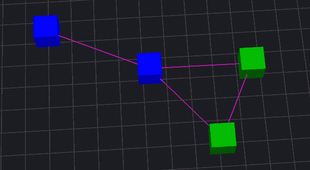
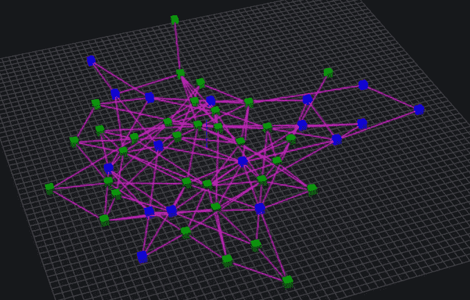
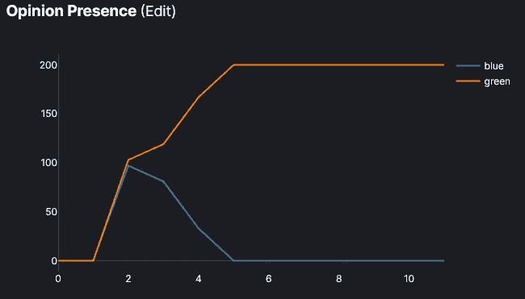
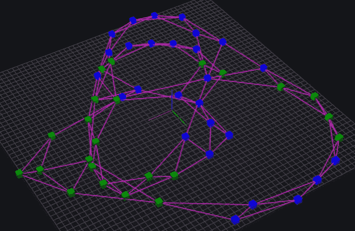
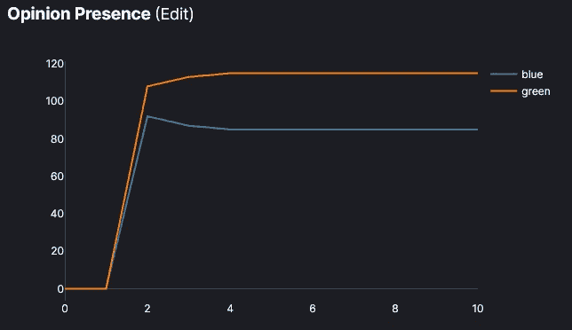
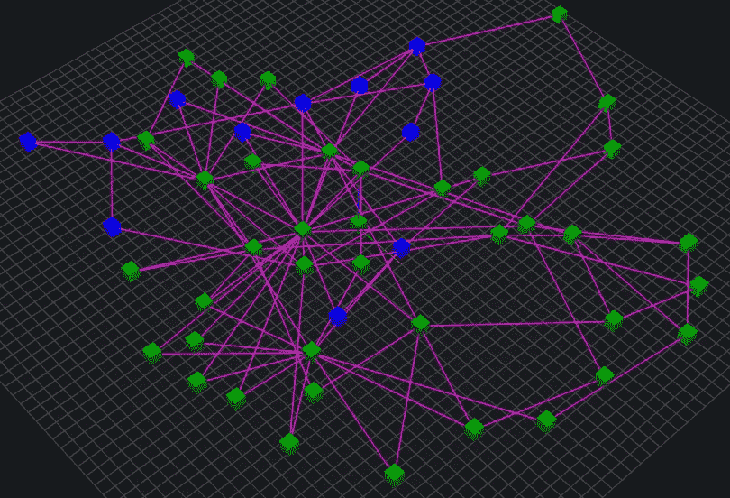
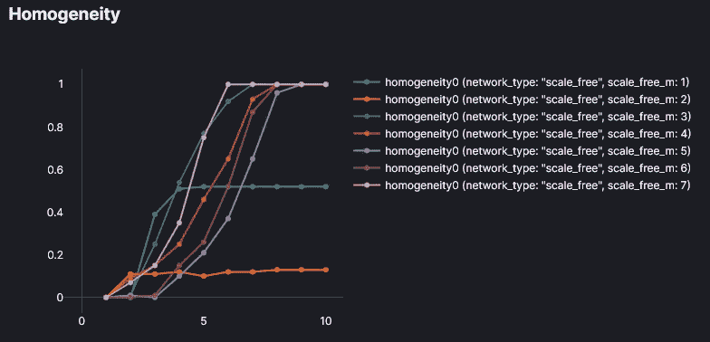

# 通过模拟探索网络

> 原文：<https://towardsdatascience.com/modeling-with-networks-6fade488847d?source=collection_archive---------32----------------------->

## 使用基于代理的建模来理解网络的形状如何影响其行为

网络在我们的生活中无处不在。你可以在我们周围的能源和交通基础设施中，在为你提供计算能力和互联网的数字系统中，在你的社会关系和社区中找到它们。

许多重要的系统都可以用网络来表示，所以我们能够在我们的模拟建模工具中探索网络的行为，并在这个过程中获得视觉直觉是至关重要的。在这篇文章中，我们将使用 [HASH](https://hash.ai/index) ，一个基于代理的在线模拟平台，来尝试和理解意见是如何通过社交网络传播的。

# 级联传播

我们将构建并探索一个简单的“观点传播”模型。让我们创建一组代理，他们根据自己的颜色(绿色或蓝色)支持或反对某个想法。代理会将他们的意见与他们大多数邻居的意见相匹配(包括他们当前的意见)。他们的邻居将被定义为那些在网络中与他们相连的代理，他们的初始意见将被随机分配。

接管网络的绿色观点(图片由作者提供)

使用这样一个简单的模型，你可以提出许多不同的问题。首先，我们将尝试看看某些网络结构是否会导致两种情况之一:允许两种观点共存，或者最终导致一种“群体思维”的情况，即一种观点被所有代理采纳。考虑一下这两种情况在一个试图产生新产品想法的公司或一个试图改进政策的立法机构中可能反映出什么。这种“观点传播”也可能代表传染病的传播，或者电网的连锁故障。

我们将使用 [NetworkX 库](https://networkx.org/)的内置函数来生成三种类型的随机网络，并探索我们最终是否会完全同质。你可以一边阅读一边[试验模拟](https://core.hash.ai/@hash/network-opinion-spread/stable)。

# 随机网络

我们将探索不同类型的随机网络，每一种都是用不同的启发式方法产生不同的形状。网络形状由节点数、边数以及这些边的位置决定，所有这些都会影响网络的行为。我们将探索三类不同的网络，每一类都以它们的发明者命名:Erdos-Renyi、Watts-Strogatz 和 Barabasi-Albert。

## 鄂尔多斯-仁义网络

在这种类型的网络中，生成*个*节点，然后创建它们之间所有可能的边的百分比 *p* 。这些边是随机选择的，这意味着在连接中没有出现特定的模式。一个 *n=50* 的随机网络可能看起来像这样:

(图片由作者提供)

您可以看到“意见”的分布似乎一开始就大致相等，我们有一个很好的混合节点，既有只有几条边的节点，也有有许多边的节点。我们可以通过运行模拟并绘制每种颜色的流行程度来观察网络中“意见”的变化:

(图片由作者提供)

这种类型的网络几乎总是收敛于 0.1，因为没有单独的“集群”或高度互联的组被创建。这阻止了任何种类的异质性的保存。当 *p* 很小时，很多节点最终没有任何边，没有真正形成一个连通的网络。

您可以在下面的嵌入中尝试在鄂尔多斯-仁义网络中传播。将`network_type`指定为`"erdos_renyi"`，并修改`erdos_renyi.p`的值。您可以在 3D 查看器和分析选项卡之间切换，以获得查看模型的两种不同方式。

  

接下来的两个网络都将具有特定的特征，这些特征将它们与这个纯粹随机的网络区分开来。

## 瓦茨-斯特罗加茨网络

这些网络是随机生成的，但使用一种算法会产生特定的模式。它们是通过修改环形网格网络创建的，该网络由排列成圆形的 *n* 个代理组成，每个代理连接到其最近邻居的 *k* 。然后，边在代理之间以某种概率 *p* 被“重新连线”，这意味着边的一个端点被移动到一个随机代理。

该网络旨在更好地模拟现实生活中网络的一些属性。值得注意的是，我们世界中的许多网络表现出“小世界”特性，其中一个节点的邻居通常是彼此的邻居，大多数节点彼此*不*连接，并且网络中每个节点之间的距离相对较小。

当使用适当的 *p* 值时(通常在 0.01 和 0.1 之间)，这种类型的网络表现出那些“小世界”特性。它们可能看起来像这样:

(图片由作者提供)

多次运行模拟，我们可以看到“小世界”特征似乎阻止了意见的同质收敛:

(图片由作者提供)

然而，如果太多的边被重新布线(在这个例子中， *p* 大于 0.2)，网络开始在视觉上类似于 er 网络，并且实际上，趋向于收敛而不是保持分离。

## 巴拉巴斯-艾伯特网络

在我们最终的网络中，节点是按顺序添加的，并以基于该节点上现有边数的概率连接到其他节点。这种方法被称为“优先附加”。

简单观察一下，与 WS 网络中可见的链模式相比，Barabasi-Albert 网络可能看起来更接近 er 网络。然而，运行模拟将表明，它也保留了异质性，不像 er 网络。

这意味着 BA 网络和 ER 网络在形状上一定有显著的不同。仔细观察，我们实际上可以看到，大多数节点都有少量的边相连(2 或 3)，极少数节点有大量的边(10+)。记住，在 er 网络中，这种分布要均匀得多。

(图片由作者提供)

每个新节点最初都连接到“m”个其他节点。如果我们运行一个扫过“m”值的实验，我们可以看到 m 的低值阻止了意见的完全同质性。同质性是以持有每种观点的代理人数量与代理人总数之差的比率来衡量的。当所有代理都有相同的意见时，同质性为 1，当有等量的代理持有两种意见时，度量为 0。

(图片由作者提供)

随着*m*的增加，网络变得无法保持异质性。网络中的节点变得过于紧密，破坏了任何集群，就像我们将 *p* 的值增加到阈值以上时 WS 网络发生的情况一样。

正如我们所见，网络中生成的同质性的数量与边的分布密切相关。当一组节点紧密互连时，它倾向于保持统一的意见，即使它连接到具有不同意见的节点。随着节点变得不那么集群化，并且更多地连接到其集群之外的网络(或者当整个网络变成单个集群时)，同质性似乎是不可避免的。

对网络结构关键特征的洞察适用于广泛的领域，适用于我们在这里遇到的三种网络类型之外的网络类型。模拟这些网络的行为是计算一组网络描述性度量的另一种方法。可视化检查和轻松修改的能力允许您(和其他建模者)对所研究的系统发展直觉。

# 进一步探索

除了修改我们提到的所有不同的参数，你还可以[在你的浏览器中打开模拟](https://core.hash.ai/@hash/network-opinion-spread/stable)并将其分叉(创建一个副本)以继续你的探索。

如果修改控制模拟行为的 **opinion_spread.js** 文件会发生什么？你可以用一个更低的门槛来代替多数采纳，引入两个以上的“观点”，并添加随机的观点变化。你甚至可以让它适应一个完全不同的领域，比如电网故障或传染病。