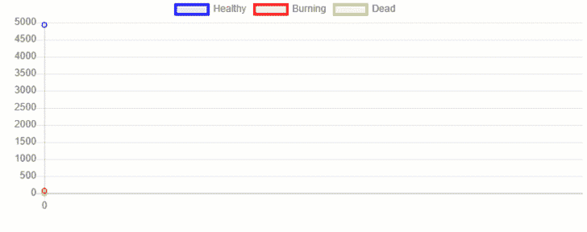
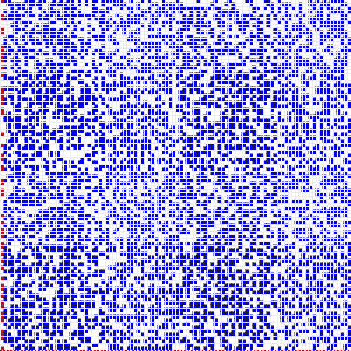
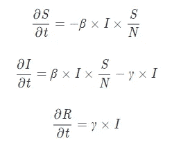
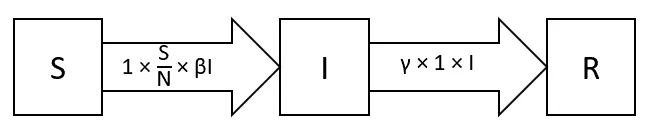

# 数据科学中的建模和模拟

> 原文：<https://towardsdatascience.com/modelling-and-simulations-in-data-science-b3f546a953d1?source=collection_archive---------17----------------------->

## [实践教程](https://towardsdatascience.com/tagged/hands-on-tutorials)

## 即使没有数据可用，也要使用数据科学和机器学习。

由[克里斯托弗·艾利森](https://unsplash.com/@kristopher_allison?utm_source=medium&utm_medium=referral)在 [Unsplash](https://unsplash.com?utm_source=medium&utm_medium=referral) 上拍摄的照片

# 介绍

机器学习和深度学习的当前状态的主要限制之一是对新数据的不断需求。但是，在我们没有任何可用数据的情况下，怎么可能做出估计和预测呢？事实上，这可能比我们通常认为的更常见。

例如，让我们考虑一个思维实验:我们是一个地方当局的数据科学家，我们被要求找到一种方法，以便在发生自然灾害(如火山爆发、地震等)时优化疏散计划。在我们的情况下，因为自然灾害往往不会发生得太频繁(幸运的是！)，我们目前没有任何可用的数据。在这一点上，我们决定创建一个模型，能够在很大程度上总结我们现实世界的关键特征，并使用它来运行不同的模拟(从中我们可以获得我们需要的所有数据)。有两种主要类型的可编程仿真模型:

*   **数学模型:**利用数学符号和关系来总结过程。流行病学中的房室模型是数学模型的典型例子(如 SIR、SEIR 等……)。
*   **过程模型:**基于设计者手工制作的一系列步骤，以表示一个环境(例如基于代理的建模)。

建模和模拟被用于许多不同的领域，如金融(如投资组合优化的蒙特卡罗模拟)、医疗/军事训练、流行病学和威胁建模[1，2]。

模拟的一些主要用途是在创建任何物理实现之前验证分析解决方案、实验策略，以及理解组成系统的不同变量的联系和相对重要性(例如，通过修改输入参数和检查结果)。因此，这些特性使得建模和模拟范例成为预测未来趋势的白盒方法。

一旦运行了许多不同的模拟并测试了所有不同的可能场景，我们就可以利用生成的数据来训练我们选择的机器学习模型，以在现实世界中进行预测。

作为本文的一部分，我现在将向您介绍您可能想要采用的不同方法，以便开始使用 Python 进行建模和模拟。本文中使用的所有代码都可以在我的 GitHub 账户上找到。

# 基于主体的建模

在基于代理的建模中，我们利用面向对象的编程(OOP)方法，以便为我们希望在我们的人工环境中拥有的每个不同类型的个体创建一个类，然后我们实例化尽可能多的代理。这些代理最终被放置在一个虚拟环境中，并让它们相互之间以及与环境进行交互，以便记录它们的动作和模拟结果。用 Python 创建基于代理的建模仿真的两种可能方式是利用 [Mesa](https://mesa.readthedocs.io/en/master/) 或 [HASH](https://hash.ai/) 。对于非 Python 用户来说， [AnyLogic](https://www.anylogic.com/) 和 [Blender](https://www.blender.org/) 是两个很好的免费替代品。

## 平顶山

为了展示 Mesa 的一些关键功能，我们现在将创建一个模型来模拟森林中的火势蔓延。其他示例可在 [Mesa 官方知识库中找到。](https://github.com/projectmesa/mesa/tree/master/examples)

首先，我们需要导入所有必要的依赖项。

现在，我们准备创建一个 Python 类( ***树*** )，它将用于在模拟中创建我们的代理。在这种情况下，我们的树可能处于三种状态之一:健康、燃烧或死亡。我们将从森林边缘少量燃烧的树木开始我们的模拟，然后这个数字将根据其他树木与已经燃烧的树木的距离而变化。一旦一棵树让所有邻近的树都着了火，它就会死去。

然后，我们可以继续前进，设计我们的树将坐落的世界(**森林模型**)。使用一个概率值( ***prob*** )，我们可以额外改变每个像元上有一棵树的可能性(以调节森林的人口密度)。

最后，我们需要创建两个辅助函数，以便从模拟中获取统计数据，并为绘图创建数据框。

一旦设计好我们的类和函数，我们现在就可以运行我们的模拟并存储所有生成的数据。

现在有两种可能的方法来可视化我们的模拟结果。我们可以使用 Python 创建绘图工具(如图 1 所示),也可以利用 MESA 可视化功能。

用于创建图 1 的所有代码都可以在[链接](https://github.com/pierpaolo28/Artificial-Intelligence-Projects/blob/master/Modelling/mesa_test.ipynb)获得(请随意与下图互动！).

图 1: Plotly 时间序列结果

使用 MESA 可视化功能，我们可以创建相同的图(图 2 ),并在本地主机地址: [http://127.0.0.1:8521/](http://127.0.0.1:8521/) 的网页上发布

图 2: MESA 时间序列图

此外，我们还可以创建一个 2D 表示法来描述森林中的火势如何蔓延(图 3)。对森林和树木密度进行不同大小的多次模拟，我们就能够创建足够的数据来执行机器学习分析。

图 3:大火蔓延森林的 2D 视图

## 混杂

HASH 是一个免费的平台，可以用 Python 或 Javascript 快速创建高度并行的基于代理的模拟。平台上有大量免费的例子，它们也可以作为你自己项目的基础。

例如，已经有了一个与我们刚刚在 MESA 编码的模型非常相似的模型([野火——再生](https://hash.ai/@hash/wildfires-regrowth)，图 4)。调整模型的不同参数，就有可能得到与我们以前得到的结果相似的结果。

图 HASH 中的森林火灾模拟

如果你有兴趣学习更多关于如何用 HASH 创建模拟的知识，他们的[文档](https://docs.hash.ai/core/)是一个很好的起点。

# **数学模型**

这些类型的模型通常使用常微分方程或随机元素来设计(例如图 5 中的 SIR 模型)。

图 5: SIR 模型方程

这种模型的图表表示对于理解模型方程如何工作以及不同允许状态之间可能的运动非常有帮助(图 6)。

图 6: SIR 示意图

流行病学中一些非常著名的数学模型是 SIR(易感-感染-康复)模型和所有其他可以从它导出的模型(如 SEIR、疫苗接种、限时免疫)。如果你有兴趣了解更多关于这种型号的信息，华盛顿邮报的这篇文章是一个很好的起点。

然后就有可能用普通的 Python 或者利用高级数学包，比如 [Scipy](https://www.scipy.org/) 和 [Simpy](https://simpy.readthedocs.io/en/latest/) 来编码这种类型的模型。例如，你可以在下面找到一个我过去项目的视频摘要，在这个项目中，我创建了一个仪表板来分析过去几个月新冠肺炎的趋势。这个项目使用的所有代码都可以在我的 GitHub 账户上找到。

# 联系人

如果你想了解我最新的文章和项目[，请在 Medium](https://pierpaoloippolito28.medium.com/subscribe) 上关注我，并订阅我的[邮件列表](http://eepurl.com/gwO-Dr?source=post_page---------------------------)。以下是我的一些联系人详细信息:

*   [领英](https://uk.linkedin.com/in/pier-paolo-ippolito-202917146?source=post_page---------------------------)
*   [个人网站](https://pierpaolo28.github.io/?source=post_page---------------------------)
*   [中等轮廓](https://towardsdatascience.com/@pierpaoloippolito28?source=post_page---------------------------)
*   [GitHub](https://github.com/pierpaolo28?source=post_page---------------------------)
*   [卡格尔](https://www.kaggle.com/pierpaolo28?source=post_page---------------------------)

# 文献学

[1]国防—高级多域合成环境 simprobabble . io .访问:[https://improbable.io/defense](https://improbable.io/defense)2020 年 8 月。

[2]威胁建模安全基础 Microsoft Learn。已访问:[https://docs.microsoft.com/](https://docs.microsoft.com/)en-us/learn/paths/TM-威胁建模-基础/2020 年 8 月。