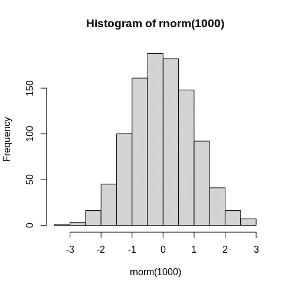
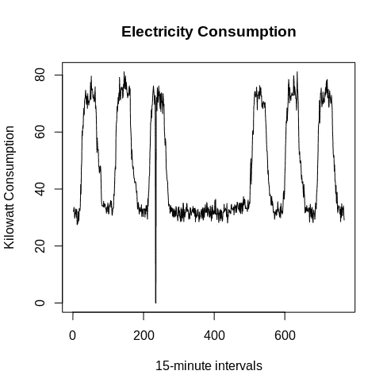
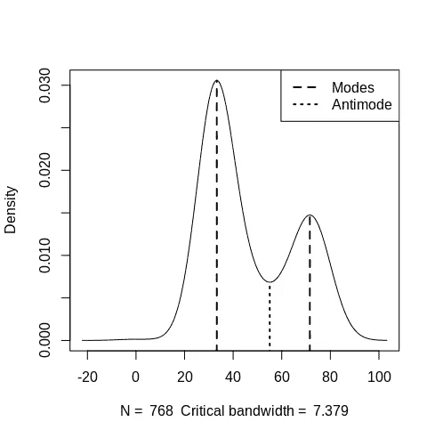

# 用 R 中的多模态模拟双峰分布

> 原文：<https://towardsdatascience.com/modelling-bimodal-distributions-with-multimode-in-r-94dbb884abc9?source=collection_archive---------8----------------------->

## 分析具有多个模式的分布


来源:图片由 [Edar](https://pixabay.com/users/edar-609103/) 从 [Pixabay](https://pixabay.com/photos/calculator-calculation-assurance-723925/) 拍摄

我们通常认为大多数发行版只有一种模式。这包括正态分布等分布，它是统计学中的标准参考。



来源:RStudio 输出

实际上，一个发行版可能有不止一种模式。在这种情况下，我们使用**模式**来指代系列中具有多个峰值的分布。

例如，如果要检查一天中的高峰时间交通，很可能会发现早晚高峰，因为车辆往返于工作/学校环境。

虽然查看简单的直方图可以为我们提供关于分布是否是双峰的视觉线索，但是最好能够正式测试这种情况。

让我们来看看如何使用 r 中的[多模式](https://cran.r-project.org/web/packages/multimode/multimode.pdf)库来实现这一点。

# 多模式用电量分析

在本例中，使用多模式软件包分析千瓦消耗。具体来说，从 2011 年 3 月 30 日到 2011 年 4 月 6 日的 15 分钟间隔内的消费模式使用爱尔兰都柏林市政局记录的数据进行分析。正在讨论的完整数据集可从 data.gov.ie 获得，并在撰写本文时获得知识共享署名 4.0 的许可。



来源:RStudio 输出

从上图中，我们可以看到消费有规律的季节性趋势。

也就是说，假设电力消耗可能是双峰的。例如，消费模式可能在一天中的特定时间达到峰值，或者一周中的特定日期可能显示比其他日期更高的消费模式。

让我们首先绘制数据的直方图。


来源:RStudio 输出

我们可以看到数据中存在两个峰值。消耗往往在 30-40 千瓦之间达到峰值，然后下降，在 70-80 千瓦再次达到峰值。

现在，我们可以正式测试分布是否确实是双峰的。

为此，我们将测试单峰性的零假设，即一个模式的存在。另一种假设认为数据有不止一种模式。

```
> library(multimode)> # Testing for unimodality
> modetest(data)Ameijeiras-Alonso et al. (2019) excess mass testdata:  data
Excess mass = 0.148, p-value < 2.2e-16
alternative hypothesis: true number of modes is greater than 1Warning message:
In modetest(data) :
  A modification of the data was made in order to compute the excess mass or the dip statistic
```

在上面的分析中，p 值实际上是 0——在 5%的显著性水平上支持数据中存在一种以上模式的替代假设。

假设数据中存在两种模式，可以获得这些模式的估计位置。此外，可以识别**反模式**，或两种模式之间最不频繁的值。

```
> locmodes(data,mod0=2,display=TRUE)Estimated location
Modes: 33.25836  71.55446 
Antimode: 55.06092Estimated value of the density
Modes: 0.03056129  0.01474216 
Antimode: 0.006843394Critical bandwidth: 7.378684
```



来源:RStudio 输出

根据以上，我们可以看到两个模式峰值在 33.25 和 71.55，反模式识别在 55.06。

# 检验双峰分布的目的

建立分布模型的全部目的首先是为了逼近总体的值。

不可能收集人们希望观察的每一种现象的数据。因此，有必要依赖数据样本。

然而，通过识别分布，这可用于识别特定数据样本中的潜在异常。

例如，假设在某一周的正常高用电期间，在某些情况下发生了假设的停电，并且电力消耗模式与上面观察到的模式显著不同。识别分布形状的变化可以提供在那一周中功耗会发生显著变化的线索，并且可以调查这种情况的潜在原因。

这种类型的分析在其他场景中也很有用。例如，假设特定产品的销售通常是正态分布的。然而，在特定品牌或公司中观察到双峰分布。这可能表明分布在更高模式中的购买者正在选择该产品的奢侈品——分析分布将允许进一步的调查。

# 结论

在本文中，您已经看到:

*   什么是双峰分布
*   这种分布所揭示的洞察力
*   如何用 R 中的*多模式*库测试双模式
*   模式和反模式值的识别

非常感谢您的阅读，非常感谢您的任何想法或反馈。

# 参考

*   [data . gov . ie:2009-2012 年能源消耗(天然气和电力)市政办公室](https://data.gov.ie/dataset/energy-consumption-gas-and-electricity-civic-offices-2009-2012/resource/6091c604-8c94-4b44-ac52-c1694e83d746)
*   [综合 R 档案网:包‘多模’](https://cran.r-project.org/web/packages/multimode/multimode.pdf)

*免责声明:本文是在“原样”的基础上编写的，没有任何担保。它旨在提供数据科学概念的概述，不应被解释为专业建议。本文中的发现和解释是作者的发现和解释，不被本文中提到的任何第三方认可或隶属于任何第三方。作者与本文提及的任何第三方无任何关系。*