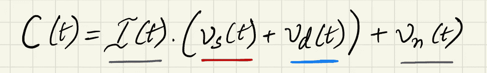

# 将生理信号估计建模为深度学习问题

> 原文：<https://towardsdatascience.com/modelling-physiological-signal-estimation-as-a-deep-learning-problem-89dde307c3c5?source=collection_archive---------21----------------------->

## 使用计算机视觉从面部视频中估计生命体征，如心率、呼吸率和 SpO2 水平。

瑞安·斯通在 [Unsplash](https://unsplash.com?utm_source=medium&utm_medium=referral) 上的照片

让我们从一个小练习开始。但首先我得请你戴上你的健身追踪器；你确实有一个，对吗？哦..你认为这个练习是精神上的？灾难性的。关键是，如果你此刻对你手腕上的健身设备有一点点观察，你会注意到背后有一个闪亮的灯(通常是绿色的)。现在，如果你很好奇或者更有观察力，你会知道这种光被用作一种媒介(双关语)来提取你手腕上的脉冲信号！这是所有重要的生理相关指标，如心率、呼吸率等。你在屏幕上看到的，是计算出来的。

在过去的一年里，我一直在生理信号估计领域工作，这是我的轶事介绍背后的巨大推动者。但愿，如今健身追踪器的无处不在让它变得有关联！

生理信号估计传统上被建模为更多的信号处理任务。然而，我们一直在通过**深度学习**的模式来评估这些生命体征；*计算机视觉*具体来说。首先，让我们用最简洁的方式来表达一些术语。

## 照片体积描记法(PPG)

**光电容积描记术在起作用**:利用反射光提取脉动 PPG 信号。图片来自维基百科( [CC BY-SA 4.0](https://creativecommons.org/licenses/by-sa/4.0) )

健身追踪器采用了一种叫做**PPG**的技术来“追踪”你的生命体征。通过手腕照射光线，这些追踪器可以通过皮肤下血管反射或吸收的光量的变化来测量心血管**血容量脉搏【BVP】**。通常，在医疗保健中，这是通过将接触式传感器放置在患者的指尖、胸部或足部来实现的。无论哪种方式，想法是提取**体积描记**信号，该信号可用于估计生理指标，如心率、呼吸率、氧饱和度等。你猜对了:photo-plethmography 中的 *photo-* 代表介质，也就是 **light** 。重要的是，PPG 是传统体积描记法的低成本替代方法，传统体积描记法涉及复杂的设备和训练有素的医疗保健专业人员来测量和理解患者的生命体征。

照片从左至右由蒂姆·谢尔曼·蔡斯(CC BY 2.0)和[弗拉迪斯拉夫·比契科夫](https://unsplash.com/@huzkky)在 [Unsplash](https://unsplash.com?utm_source=medium&utm_medium=referral) 上拍摄

在概念化了光电体积描记术的支配性原理之后，我们现在着眼于使得从反射光中提取 PPG 信号成为可能的数学模型。

## 双色反射模型(DRM)

二色性反射模型(DRM)将***【t】***即从物体表面反射的光(在传感器处接收)描述为两个主要成分的线性组合。这两个分量是**镜面(界面)反射**和**漫反射(体反射)。**

*镜面反射*是在类似镜子的表面上观察到的规则反射，光线以与其入射角相等的角度反射。另一方面，在*漫反射*的情况下，光以多个角度散射。

建模反射光 ***C(t)*** 作为其组成项的组合。图片作者。

> **注:**这些时变信号在传感器上连续记录一段时间，**T =【0，T】**。

根据 DRM，镜面反射的两个反射项 ***Vs(t)*** 和漫反射的 ***Vd(t)*** 由强度项 ***I(t)*** 调制。此外，我们还考虑了噪声项 ***Vn(t)*** ，它量化了传感器产生的噪声。

请注意，要实现这一切，测量设备(即使是相对便宜的健身可穿戴设备)仍需要与您(即患者)的身体接触。换句话说，PPG 是一种基于**接触的**方法**，**其中信号通常通过放置在指尖、手腕或脚上的接触传感器来测量。然而，这种类型的持续接触可能不适合于某些应用，例如运动和驾驶，具有引起运动受限、连续接触不便和/或注意力分散的问题。

## 在 Remote-PPG 中为“Remote-”加前缀

随着新冠肺炎疫情的爆发，当事情没有以前那么敏感，没有以前那么多接触时，我们都感觉更好。瞧啊。聚焦**远程概念——光电容积描记**，关键词*远程*。此后我们将把这个术语称为**‘r-PPG’**。

研究表明，脉动体积描记信号足够强，可以通过使用低成本的 RGB 照相机传感器从一系列图像中观察皮肤颜色的变化来捕获。

无接触地向**移动。**右边的照片由韦斯利·弗莱尔拍摄(CC BY 2.0)

扩展我在引言中提供的对*光体积描记法*的简要描述， *r-PPG* 通过允许我们从图像和视频中提取脉搏信号，而不是通过可穿戴设备上的接触传感器(见上图)，提供了一种无接触、不引人注目和伴随的测量*体积描记法*信号的方法。

> ***修正了之前的定义，r-PPG*** 允许**远程**通过皮肤下血管反射或吸收的光量变化来测量心血管血容量脉搏(BVP)。

因此，r-PPG 的前提使得能够从面部视频中提取脉动信息。这种远程估计 BVP 信号并通过扩展计算心率、呼吸率和氧饱和度等重要生理指标的能力，可以应用于世界上最普遍的相机传感器，即我们智能手机中的传感器！

因此，我们已经确定存在感兴趣的脉动信号，***【p(t)***，其可以从包含**皮肤**像素的图像序列中提取；比如面部视频。现在让我们看看这个提取实际上是如何执行的。

## **为图像临时制作 DRM**

图像由多个像素组成。将每个这样的像素视为用于提取脉动信号任务的独立传感器是有帮助的， ***p(t)*** 。跟随来自视频的一组连续图像帧的图像中的所有像素，我们得到视频时间轴上每个像素的像素强度(RGB)的时间序列。与我们之前基于信号处理的例子相关，这些时间序列数据中的每一个都可以被认为是一个单独的 ***C(t)。*** 我们现在下标***【C(t)***用一个 ***k*** 来表示属于***k***像素的像素强度的时间序列。DRM 可以针对图像输入进行如下修改:

为图像数据调整二色反射模型。图片作者。

> **注意:**这些时变信号是在视频输入中的多个图像帧上获得的，即对于由 **T** 帧组成的视频来说**T =【0，T】**。我们从图像中的每个像素获得这样的信号。

注意到***【C(t)***的所有时变分量都可以写成静态 DC 分量(不是时间函数的项)和时变交流分量的组合。对感兴趣的信号 ***p(t)*** 有了一些了解，并给出了这个模型的状态，我们对 ***C(t)的定义做了两个小的重新安排。***

**Vn(t)** 通过插值对像素进行空间平均来近似。图片作者。

首先，我们去除了考虑相机噪声和量化误差的***【Vn(t)***项。这是基于这样的假设实现的，即通过将足够多的非常接近的像素(即，它们的强度)分组(或平均)可以合理地消除相机噪声。在图像处理中，这被称为“空间平均”，通过使用插值对图像进行下采样来执行；为了简洁起见，省略了技术细节，我们有以下内容:

空间平均消除了相机量化误差的影响。图片作者。

其次，我们通过将它们分成它们的组成镜面反射和漫反射部分来重新排列***【C(t)***的分量，并基于它们的 DC/AC 性质(如前所述)对结果项进行分组。

作为简化，量化在第 k 个像素接收的颜色信号 C(t)。图片作者。

注意，为了简单起见，来自镜面反射和漫反射分量的与时间无关的 DC 项被收集到一个项中， ***Uc*** 。我们现在剩下一个集合 DC 反射项***【Uc】***和两个时变信号***【t】***和***【p(t)***的组合，所有这些都被强度项 ***i(t)*** 调制。虽然我知道这可能被认为有点过于简化，但基本的想法是从我们在相机传感器处接收的颜色信号***【C(t)***中提取感兴趣的脉动信号，即***【p(t)***。

如前所述，传统上，r-PPG 提取任务被视为信号处理问题。然而，使用基于深度学习的方法的最新进展已经显示出足够的价值来证明进一步研究的合理性。

# 进入深度学习

深度学习，特别是计算机视觉，赋予了我们开发端到端深度神经模型的能力，以解决许多复杂的任务，否则这些任务需要多级处理管道，通常涉及手工制作的特征操作。疫情给全世界的医疗保健带来了真正的变革。例如，在过去一年左右的时间里，通过远程医疗平台甚至视频会议进行远程咨询和诊断已经变得司空见惯。因此，一种用于恢复生理信号的端到端框架是合乎需要的，并且在给定的上下文中似乎是合乎逻辑的下一步。

可视化用于 r-PPG 提取的端到端深度学习管道。图片作者。

这是一个使用深度学习的端到端 r-PPG 管道的粗略可视化。在这个管道上进行了大量的研究和工作，以使其对受运动影响的视频(即，对象可能像在健身活动中一样移动)和受不良照明条件或不均匀照明影响的视频具有鲁棒性，但潜在的前提是从输入视频中最好地提取 r-PPG 脉冲信号***【p(t)***。

我建议你有保留地吸收所有这些信息(尤其是数学建模),因为为了简单起见，我特意省略了某些交互术语。我希望读者关注这样一个想法，即使是最基本的智能手机摄像头拍摄的视频也包含脉动信号***【p(t)***的痕迹，只要有一套正确的工具，就可以提取出来。该体积描记信号 ***p(t)*** 可用于确定关键的生命体征，如**心率**、**呼吸速率**和 **SpO2** 水平(血液中氧饱和度的测量)。

通过这篇介绍性文章，我希望读者能够理解深度学习在远程 PPG 估计任务中的前景和潜在应用；将其建模为一个计算机视觉任务。

*嗨！感谢您完成这篇文章。大致说来，这是我的毕业论文的题目。为了介绍这个想法和建立前提，我抽象了一些技术细节。对于更倾向于技术的人，我添加了一些有用的文章列表。另外，如果你想知道更多，请打电话给我！更多内容请关注我:)*

<https://anweshrm.medium.com/>  <https://www.noldus.com/blog/what-is-rppg>  <https://pubmed.ncbi.nlm.nih.gov/17322588/>  

## 参考资料:

1.  “光电容积描记图”，[https://en.wikipedia.org/wiki/Photoplethysmogram](https://en.wikipedia.org/wiki/Photoplethysmogram)
2.  “全息激光多普勒成像的光电容积描记法”，用户名:Micatlan，维基百科授权 [CC BY-SA 4.0](https://creativecommons.org/licenses/by-sa/4.0)
3.  基于视频的使用卷积注意网络的生理测量。2018 年欧洲计算机视觉会议(ECCV)会议录
4.  Tim Sheerman-Chase 的“EEG Brain Scan”由 CC 2.0 授权。要查看许可证副本，请访问 https://creativecommons.org/licenses/by/2.0/
5.  Wesley Fryer 的“Rachel on Facetime”获得 CC BY-SA 2.0 的许可。要查看此许可证的副本，请访问[https://creativecommons.org/licenses/by-sa/2.0/](https://creativecommons.org/licenses/by-sa/2.0/)
6.  https://www.noldus.com/blog/what-is-rppg，r-PPG 的科学博客