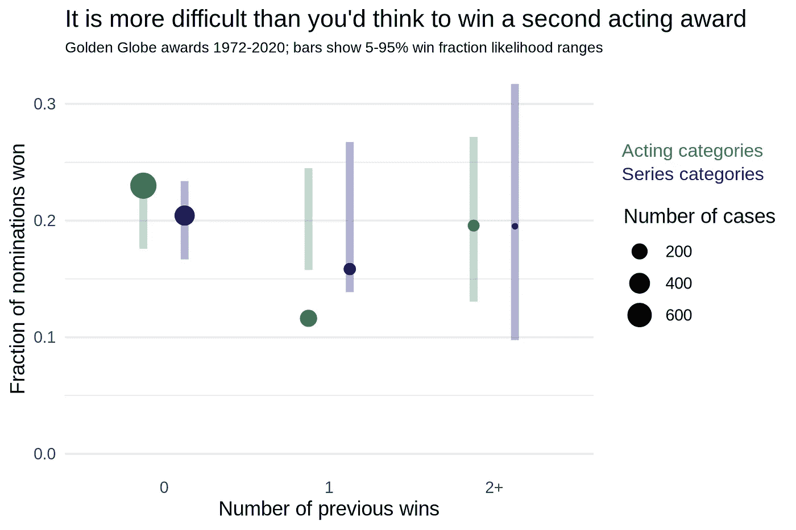

# 为金球奖做模特

> 原文：<https://towardsdatascience.com/modelling-the-golden-globe-awards-524ba1066573?source=collection_archive---------41----------------------->

## [实践教程](https://towardsdatascience.com/tagged/hands-on-tutorials)

## 或者，为什么莎拉·保罗森在 2021 年被低估了？

随着今年[金球奖奖](https://www.goldenglobes.com/)的临近，我很想知道*电视*奖存在什么样的模式，相同的男演员、女演员和节目可以连续多年获得奖项提名(一个节目的多个季节)。电视剧会在一年内很热，但在接下来的几季里很难继续获奖吗？

为了找到答案，我从维基百科[收集了 1972 年至 2020 年的金球奖提名和获奖数据，以及同期的艾美奖获奖数据，并使用](https://en.wikipedia.org/wiki/Golden_Globe_Awards) [IMDbPY](https://imdbpy.github.io/) 收集了 IMDb 所有提名节目的节目长度和 IMDb 评分。我关注的是最佳剧情类和音乐/喜剧类电视剧，以及电视类的四位男女主角(剧情类各一位，音乐/喜剧类各一位)。我按季度对 IMDb 收视率进行了平均，并通过使用颁奖前两年开始的季度平均值来链接到颁奖数据(颁奖通常在 1 月举行，对于上一日历年的电视节目，这通常意味着上一年中期开始的上半季，以及上一年的下半季，如果有的话)。使用的代码可以在[这里](https://github.com/viva-ronaldo/gglobes-vis)找到。

## 演出季节

平均而言，电视节目播出的哪几年最有可能获得奖项提名？作为参考，我采用了金球奖提名数据中所有节目的总长度分布(这种频率分布在单个季节有一个峰值，在 4-7 个季节的长度上有另一个更宽的峰值)，并计算了如果提名者每年从这个集合中随机抽取，我们预计会看到的季节数组合:这显示为下面的黑线和黄线。

作者图片

情节显示，第一季，其次是第二季和第三季，被提名的次数比预期的要多，第一季被提名的次数是预期的两倍，而第六季到第十季没有被提名，也没有像它们在电视上出现的频率那样经常获奖。相当多的电视剧长达六季或更多季，但这些年很少被提名。

## 以前的提名

在这六个类别中，53%的获奖者是第一次被提名，超过了第一次被提名的 41%。这与前几季更有可能获奖紧密相关:第一季自然比后几季更有可能获得第一次提名。

作者图片

看看第二季及以上，我们发现第一次被提名的人有大约平均(20%)的机会获胜，对于重复被提名的人，这种机会取决于前一年发生的事情。对于系列剧来说，如果前一年的提名导致了获奖，这将获奖的可能性从 10%增加到 29%，但对于男演员和女演员来说，这种影响更加温和。

在表演类别中，拥有一个以前的胜利，无论它是否发生在过去的一年，事实上似乎是进一步成功的障碍。有过一次获奖经历的男女演员只有 12%的胜算，这在统计上大大低于样本量的预期:

作者图片

对于系列，可以看到类似但较弱的效果。然而，那些取得两次或更多胜利的人，平均有 20%的机会获胜，尽管这一提名通常是针对第三季或更久的剧集。也就是说，在过去的十年里，在表演类别中，有 18 位被提名者已经获得了至少两个奖项，只有两个获得了成功(凯尔塞·格拉玛在 2012 年获得了与他之前获得的奖项不同的奖项(老板)，克莱尔·丹尼斯在 2013 年获得了与第二次和第三次(国土安全)不同的奖项(不包括她 2010 年获得的迷你剧奖)。

## IMDb 收视率

一个节目在 IMDb(最相关的一季)上的平均评分只能略微预测获胜:获胜的节目比其他被提名者的平均评分高的情况只有 56%。

作者图片

表演奖的重要性甚至更低(只有 54%的时候，获胜者的节目比其他节目的平均收视率高)。

公布的 IMDb 收视率(衡量节目粉丝受欢迎程度的一个可能指标)确实显示了历史效应(收视率高的节目更有可能获胜)，但这种效应自 2010 年以来几乎不存在，所以我认为这里发生的情况是，自 IMDb 存在以来，前几十年的经典(即获奖)节目近年来获得的收视率高于未获奖且不太被人记住的节目。

## 姓名字母顺序

这听起来可能令人惊讶，但成员投票时被提名人的名字出现的顺序重要吗？这种效应已经在[的](https://www.jstor.org/stable/2749662?seq=1)政治选举中被证明存在。

作者图片

在四个电视表演类别中，姓氏顺序*确实有统计上的显著影响:出现在(通常)五个候选人名单上的第一个或最后一个姓氏比预期多赢得大约 25%,选票上第三个(中间)位置的候选人比预期少赢得大约 30%。位置 1 到 5 的中奖号码的对称性增加了人们对这确实是一个真实效应的信心:选民似乎对选择他们从候选名单中读到的名字或姓氏有心理偏见。*

*在类似的主题上，我也检查了男演员/女演员的名字长度，认为短或长的名字可能更容易记住；从历史上看，人们对名字最短或最长的候选人有轻微的偏好，但在统计上并不显著。*

## *最佳剧集和最佳表演提名*

*在表演提名中，有一个优先选择是那些其表演也在当年被提名的人:*

**

*作者图片*

*这可能表明，表演的整体质量往往会增强人们对表演的看法。因果关系也可能反过来发生:可能是最佳表演“使节目更好”，因此获奖的男女演员比其他被提名者更有可能将他们的节目拖到提名。*

# *为 2021 年建模*

*我们可以通过拟合一个模型来预测被提名者在给定的类别和年份中是否会成功，从而综合这些影响。我在一个逻辑回归框架中使用了上述特性和其他几个特性；我安装了两个独立的模型，一个用于表演类，一个用于连续剧类。这些模型的组合显示出大约 0.45 的准确度，和 0.20 的 Brier 分数；也就是说，该模型可以在 45%的情况下从五名被提名者中正确识别出最有可能的获胜者，这比随机猜测的 20%要高得多。表演类的表现比表演类的好一点。*

*上面没有提到的最重要的特征是候选人是否在六个月前获得了艾美奖:有时，但不总是，艾美奖是根据同一季的节目颁发的，在这种情况下，它提供了一个直接的“批评意见”，而这是该模式所缺乏的。通过拟合模型得出的一些观察结果:*

*   *六个月前获得艾美奖是这部电视剧成功的一个强有力的指标，但对男演员/女演员来说却不那么重要。同样，前一年赢得了同样的金球奖奖对这个节目来说是好事，但是*不是*对男演员/女演员有帮助吗？*
*   *随着剧集和男演员/女演员过去的提名或获奖次数的增加，他们获奖的可能性越来越小，但是，特别是，以前的一次获奖对提名者不利。*
*   *一部剧集在同一年获得表演类提名的几率会增加。男演员或女演员的机会因该系列提名而增加，但由于除了他们之外的其他表演提名的存在而*减少*。*
*   *成为名单上的第一个或最后一个名字对男演员或女演员的机会的好处大致相当于前一年获得艾美奖奖。*

*这对 2021 年金球奖电视奖意味着什么？我们的组合模型的准确性不是特别高，所以我们不应该期待谁是可能的赢家的深刻见解。尽管如此:*

*   *对于**的电视音乐/喜剧**，该模型更倾向于 Schitt 的 Creek (36%的可能性)，因为它去年赢得了艾美奖奖，并且没有之前的获奖记录；然而，在第六季对它不利。博彩市场目前同意这一预测。*
*   *对于电视剧，这位模特更喜欢欧扎克(39%)，因为他是第一次被提名，有两次表演提名，并且有很高的 IMDb 评分。由于其提名和获胜历史，皇冠几乎没有获胜的机会，但博彩显示皇冠是当前的热门，领先于欧扎克。*
*   *对于音乐/喜剧类男演员，模特青睐杰森·苏戴奇斯(特德·拉索；39%)，因为节目也有提名，这是第一次提名，而且是针对第一季的。这个类别的赌注目前似乎在苏代基斯和尤金·利维之间分裂，因为 Schitt 的小溪:模型降低了他的机会，主要是因为该剧在第六季。*
*   *对于音乐/喜剧类最佳女演员，模特青睐莉莉·柯林斯(34%)，凯瑟琳·欧·哈拉第三(20%)。人们似乎普遍认为奥哈拉会赢，因为史特克里克。两位女演员都是首次获得提名；该模型更重视柯林斯的节目在第一季中的重要性，而不是奥哈拉去年在艾美奖的胜利。*
*   *对于剧情片中的**男演员，该模型对获胜者没有信心(去年的艾美奖奖得主杰瑞米·斯特朗不在候选名单上)，但预测梅森探案集的马修·瑞斯略微被看好(30%)，部分原因是他的名字按字母顺序排在最后，还因为他以前没有获奖。从博彩市场来看，这似乎是六个类别中最不确定的。***
*   *对于电视剧中的**女演员，模特非常有信心(59%)莎拉·保罗森会赢，因为该剧(Ratched)也获得了提名，提名是针对第一季的，她以前没有赢过(忽略她在迷你剧类别中的胜利)，她的名字按字母顺序排在最后。博彩市场认为奥莉薇娅·柯尔曼或艾玛·科林会赢得这个奖项，但由于同一部剧有两个表演提名者的“分裂投票”效应，该模型低估了他们两人的机会。***

*因此，该模型似乎在六个类别中的至少三个类别中与博彩市场保持了合理的一致，但可能会系统性地低估两个长期运营的节目，即 Crown 和 Schitt's Creek。这凸显了节目在第四或第六季获得成功是多么不寻常！)季节。结果将于 2 月 28 日在[揭晓！](https://www.goldenglobes.com/)*