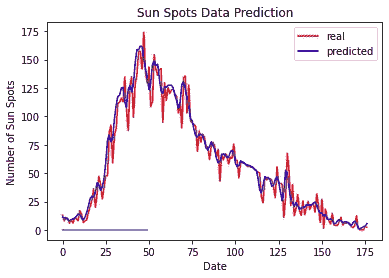

# LSTM 可以用来预测太阳黑子的数量吗？

> 原文：<https://towardsdatascience.com/modelling-the-number-of-sunspots-with-time-series-analysis-39ce7d88cff3?source=collection_archive---------19----------------------->

## 我将使用时间序列分析来预测每月太阳黑子的数量。将深入探讨的模型是 ARMA 和 LSTM 模型。


美国宇航局在 [Unsplash](https://unsplash.com?utm_source=medium&utm_medium=referral) 拍摄的照片

# 介绍

首先:什么是太阳黑子？太阳黑子是太阳光球层上的一种暂时现象，看起来比周围的区域更暗。我选择太阳黑子数据集进行时间序列分析的原因是，太阳黑子以 11 年的太阳周期出现，这意味着我们应该看到数据的季节性成分。我将使用两种不同的方法来模拟季节性趋势，ARMA 模型和 LSTM 模型。

> 太阳黑子的出现和消失周期为 11 年


图片来自[ [维基百科](https://en.wikipedia.org/wiki/Sunspot)

将使用的数据是从 1749 年到 2013 年，是每个月的月平均值。用于分析的数据可从 [kaggle](https://www.kaggle.com/robervalt/sunspots) 中找到。下面我有一小段数据。


图片由[ [作者](https://ethanskinner94.medium.com) ]提供

时间序列分析的第一步是绘制数据和自动校正图。我们这样做是为了了解任何潜在的趋势或季节性，通过识别任何趋势，可以使用适当的数学模型。

# 太阳黑子图

我首先简单地从太阳黑子数据中画出一个 600 个数据点的区块。


图片由[ [作者](https://ethanskinner94.medium.com) ]提供

从图中可以看出强烈的季节性成分。然而，每个波峰和波谷的大小不同，这将限制可以使用的数学模型。例如，使用正弦模型可能不会产生最佳结果。


图片由[ [维基百科](https://en.m.wikipedia.org/wiki/File:Sine_wave_amplitude.svg) ]提供

> 移动平均或数据科学方法将产生最佳的建模结果

# 自相关

在我开始对时间序列建模之前，我首先制作自相关图，以了解数据中是否存在任何潜在的模式。对于时间序列建模，我希望看到一个没有模式的平稳时间序列。

> 请注意，自动校正是数据点与其自身滞后版本的相关性。


图片由[ [作者](https://ethanskinner94.medium.com) ]提供

从自动校正图来看，存在很强的季节性成分。我们需要细分/分解季节性因素。

# 时间序列分解

对于任何给定的时间序列，可以分为三层。将任何时间序列[Xt]视为三个组成部分可能会有所帮助。下面我展示了一个加法模型的数学公式。


在我们的例子中，只有季节性因素。考虑到这一点，我们可以应用差分法。如果一个 11 年的太阳周期有季节性成分，那么我们可以通过减去 11 年前的值来消除它。

下面是减去季节性趋势的 python 代码。

```
from matplotlib import pyplot
X = df.values
diff = list()
cycle = 132
for i in range(cycle, len(X)):
 value = X[i] - X[i - cycle]
 diff.append(value)
pyplot.plot(diff)
pyplot.title('Sunspots Dataset Differenced')
pyplot.show()
```


图片由[ [作者](https://ethanskinner94.medium.com)

从差分图上可以看出，时间序列中仍然存在一定的季节性。接下来，我试图用一个 11 年循环的多项式来模拟季节性。


图片由[ [作者](https://ethanskinner94.medium.com)提供

二阶多项式在模拟太阳黑子时间序列方面表现不佳。

我们需要解决时间序列的一些关键问题:

*   每个 11 年周期的震级不同
*   这些周期平均相隔 11 年，但并不准确。

自回归移动平均线将很好地解决这些问题。一个不利因素是，未来的预测在展望未来的日子里会受到限制。本文将深入探讨的另一种方法是 LSTM。

> LSTM 在正向预测中表现良好，并解决了 ARMA 模型的衰落问题。

# 自回归移动平均模型

ARMA 模型是时间序列建模的有力工具。ARMA(p，q)定义如下:其中 **p** 是自回归多项式的阶，而 **q** 是移动平均多项式的阶。

自回归移动平均(ARMA)模型如下所示


ARMA 模型

在 python 中，我们能够使用 ARIMA 函数来拟合参数( **p，q** )。

函数`ARIMA()`接受两个主要参数

*   `x`:单变量时间序列
*   `order`:长度为 3 的向量，指定 ARIMA(p，d，q)模型的阶数

这里， **d** 表示时间序列的顺序。例如，如果存在底层线性趋势，则 **d** 将等于 1。

> 当拟合 ARMA 模型时，我们设置 **d** 等于 0。

```
from statsmodels.tsa.arima_model import ARIMA
y = np.array(RNN_data.value)
model = ARIMA(y, order=(1,0,1)) #ARMA(1,1) model
model_fit = model.fit(disp = 0)
print(model_fit.summary())
# Plot residual errors
residuals = pd.DataFrame(model_fit.resid)
fig, ax = plt.subplots(1,2)
residuals.plot(title="Residuals", ax=ax[0])
residuals.plot(kind='kde', title='Density', ax=ax[1])
plt.show()
# Actual vs Fitted
cut_t = 30
predictions = model_fit.predict()
plot = pd.DataFrame({'Date':date,'Actual':abs(y[cut_t:]),"Predicted": predictions[cut_t:]})
plot.plot(x='Date',y=['Actual','Predicted'],title = 'ARMA(1,1) Sunspots Prediction',legend = True)
RMSE = np.sqrt(np.mean(residuals**2))
```

ARMA(1，1)模型产生单日预测。换句话说，我们提前一天预测。

> ARMA 模型的一个缺点是向前预测的天数。


图片由[ [作者](https://ethanskinner94.medium.com) ]提供

# LSTM 模型

LSTM 是 RNN 家族中的典范。它可以被认为是一个时间序列数据的神经网络。

> LSTM 与神经网络的不同之处如下:LSTM 不是单次输入到神经网络中，而是用前 x 天进行输入。

你可能会开始理解为什么这对太阳黑子数据集有用。通过使用以前的数据作为输入，该模型将试图捕捉 11 年周期的季节性信息。

LSTM 背后的主要思想是遗忘之门，信息可以通过它传递给下一个神经网络。

这里的绿色块代表回望日，例如，如果我们的 LSTM 模型使用 3 天的回望期，下图将代表我们模型中的一天。


图片来自[ [维基百科](https://en.m.wikipedia.org/wiki/Long_short-term_memory)

> 对于 LSTM 模型，模型结构由输入数据的结构和预测特征决定

用于回顾的前几个月的数量和输入特征的数量将决定需要权重和偏差的神经元的数量。

# Python 中的 LSTM 建模

我将使用 Keras 库和包来创建 LSTM 模型。

> 创建输入数据结构是 Python 中 LSTM 建模的最重要步骤

第一步是简单地将我们的数据分成训练和测试数据集。

```
split = 0.7
#Split into test and training set (70/20 split)
length = len(dataset)
train_length = round(length*split)
test_length = len(dataset) - train_length
train = dataset[0:train_length,:]
test = dataset[train_length:length,:]
```

让我们介绍一下单日 LSTM 预报的预处理功能。

```
def preprocessing(training_set_scaled,n,train_length,days):
    y_train = []
    for i in range(days, train_length -1 ):
        y_train.append(training_set_scaled[i, 0]) # note that our predictor variable is in the first column of our array 
    y_train = np.array(y_train)

    X = np.zeros(shape=[train_length - (days+1),days,n],dtype=float)
    for j in range(n):
        for i in range(days, train_length-1):
            X[i-days,:,j] = training_set_scaled[i-days:i, j]
    return X, y_train
```


图片由[ [作者](https://ethanskinner94.medium.com)

这里我们的 numpy 数组的形状如下

*   我们训练数据中的天数
*   **3:** 我们回顾预测的天数
*   **1:** 用于预测的特征数量

## 接下来我介绍 LSTM 模型的结构

```
# Initialising the RNN
regressor = Sequential()
# Adding the first LSTM layer and some Dropout regularisation
regressor.add(LSTM(units = nodes, return_sequences = True, input_shape = (new.shape[1], new.shape[2])))
regressor.add(Dropout(0.2))
# Adding a second LSTM layer and some Dropout regularisation
regressor.add(LSTM(units = nodes, return_sequences = True))
regressor.add(Dropout(0.2))
# Adding a third LSTM layer and some Dropout regularisation
regressor.add(LSTM(units = nodes, return_sequences = True))
regressor.add(Dropout(0.2))
regressor.add(LSTM(units = nodes))
regressor.add(Dropout(0.2))
# Adding the output layer
regressor.add(Dense(units = t)) # this is the output layer so this repersetns a single node with our output value
# Compiling the RNN
regressor.compile(optimizer = 'adam', loss = 'mean_squared_error')
# Fitting the RNN to the Training set
model = regressor.fit(new, y_train, epochs = 50, batch_size = 22)
```

## LSTM 单日远期预测



图片由[ [作者](https://ethanskinner94.medium.com) ]提供

LSTM 模型预测得相当好，然而，这部分只是因为我们一次预测未来的一天。接下来，我们来看看多日远期预测。

# Python 中的多日 LSTM 建模

让我们介绍一下多日 LSTM 预报的预处理功能。

*   回顾是 3 天
*   远期预测是 5 天

> 我用之前的 3 天来预测未来 5 天的时间。

```
def preprocessing_muli(training_set_scaled,n,t,train_length,days):
    days_length = train_length - t
    y_train = np.zeros(shape=[days_length-t,t],dtype=float)
    #y_train[:,0] = training_set_scaled[t:days,0]
    #y_train = np.zeros(shape=[days_length - t,days],dtype=float)
    for i in range(t):
        y_train[:,i] = training_set_scaled[i+t:days_length+i,0] # Here each column repersents a time step.

    X = np.zeros(shape=[days_length-t,days,n],dtype=float)
    for j in range(n):
        for i in range(days):
            X[:,i,j] = training_set_scaled[i:days_length-t+i, j] 
    return X, y_train
```

# 损失函数

我探索了拟合 LSTM 模型时的损失函数，以了解模型是否收敛以及收敛速度有多快。损失函数是我们的预测与响应变量之间距离的度量。下面是一个使用 MSE 拟合线性回归模型的例子。理解从每个蓝点到线的距离是测量的，然后平方，最后除以数据点的总数。


图片由[ [维基百科](https://commons.wikimedia.org/wiki/File:Linear_regression.svg#mw-jump-to-license) ]提供

为了简单起见，我将使用均方差作为损失函数。均方误差(MSE)的计算公式如下


根据 **MSE** 公式，hat 代表变量 y 的预测值或估计值。在数学中，变量上方的 hat 代表给定随机变量的估计值。 **n** 代表我们估计的总数据点的数量。上图显示了如何计算二维简单线性回归模型的 MSE。

多日 LSTM 模型的 MSE 损失函数的结果如下所示。


图片由[ [作者](https://ethanskinner94.medium.com)

## 3 天回顾和 5 天预测的结果。


图片由[ [作者](https://ethanskinner94.medium.com)提供

# Python 中的 LSTM -太阳黑子 11 年周期预测

接下来，我研究 LSTM 模型能否预测未来一个完整的周期。对于我们的数据集，每个数据点代表一个月，我们知道我们应该预期每 11 年一个太阳黑子周期，所以我们将向前预测未来的 132 个数据点。然而，为了捕捉下一个周期的一部分，我将使用 160 天进行预测。

*   回望是 200 天
*   远期预测是 160 天


图片由[ [作者](https://ethanskinner94.medium.com) ]提供

LSTM 确实很好地捕捉了时间序列的季节性或周期性成分，但是它会偏移，并且波峰和波谷不对齐。


图片由[ [作者](https://ethanskinner94.medium.com) ]提供

试图预测未来整个 11 年的周期并没有产生最好的结果，所以接下来我试图预测未来半个周期或大约 60 天。

# Python 中的 LSTM 太阳黑子半周预测

最后，我研究了 LSTM 模型是否可以预测提前半个周期。对于我们的数据集，每个数据点代表一个月，我们知道我们应该预期每 11 年一个太阳黑子周期，所以我们将向前预测未来约 60 个数据点。

*   回望是 120 天
*   远期预测是 60 天


图片来自[ [作者](https://ethanskinner94.medium.com)

在这里，我创建了四个块，每个 60 天，用于预测测试数据集。

## 接下来我计划未来 60 天。


图片由[ [作者](https://ethanskinner94.medium.com) ]提供

# 结论

本文中展示的一切都是使用真实数据来预测太阳黑子数据集的。ARMA 和 LSTM 都得到了深入的评估。在多日远期预测方面，LSTM 远远优于 ARMA 模型，ARMA 模型可以捕捉季节性成分，而 LSTM 不能正确识别新周期的开始和结束。在预测太阳黑子数量时，给 LSTM 模型增加额外的特征可能会产生更好的结果。

> 我建议使用 LSTM 模型来模拟太阳黑子数据集。

# 关于我自己的一点点

我最近在加拿大多伦多的瑞尔森大学获得了应用数学硕士学位。我是金融数学组的一员，专业是统计学。我深入研究了波动建模和算法交易。

我之前在庞巴迪宇航公司担任工程专业人员，负责与飞机维护相关的生命周期成本建模。

本人积极训练铁人三项，热爱健身。

如果您对以下主题有任何建议，请告诉我

*   数据科学
*   机器学习
*   数学
*   统计建模

领英:[https://www.linkedin.com/in/ethanjohnsonskinner/](https://www.linkedin.com/in/ethanjohnsonskinner/)

推特:@Ethan_JS94

[通过我的推荐链接加入灵媒——伊森·约翰逊·斯金纳，理学硕士](https://ethanskinner94.medium.com/membership)