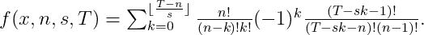

# 模拟骰子的概率分布

> 原文：<https://towardsdatascience.com/modelling-the-probability-distributions-of-dice-b6ecf87b24ea?source=collection_archive---------14----------------------->

## 统计分析和数学建模教程

如果你曾经玩过卡丹游戏，你会很快意识到当掷出两个骰子时，数字 7 是很常见的！这就引出了一个问题，内容如下:

**用两个 6 面骰子掷出和 7 的真实概率是多少？而且，用 *n* 六面骰子掷出任意数字的和的概率是多少？**

以下是我为寻找答案所做的工作。

## 实验(滚动骰子)

让我们先运行几个骰子实验(即。简单地掷骰子)。幸运的是，我们可以使用计算机在几分钟内产生数百万次骰子滚动模拟，而不是自己滚动几年。

图 1:每个分布运行 100，000 次滚动模拟得到的 1 个和 2 个骰子的概率分布(左上和右上)。通过对每个分布运行 100，000 次滚动模拟，动画显示 1 到 20 个骰子的概率分布(下图)。图片作者。

通过目测图 1 中的实验数据，我们可以看到随着骰子数量的增加，一个熟悉的形状出现了，**一个** **钟形曲线，**也被称为**正态**或**高斯分布**。我们可以这样做，试着用高斯曲线来拟合实验数据。高斯分布在数学上表示为

。两个参数μ和σ对应于**概率分布**的**均值**和**标准差**，它们分别定义了分布的中心位置和宽度。但是符合我们的 *n-* dice 实验数据的这些参数的最佳值是什么呢？嗯，我们可以通过统计分析**推断**最有可能**的**参数值。从图 1 中我们可以看到，概率分布是对称的。利用这种对称性，我们可以通过简单地定位每个分布的最大位置**来定义实验数据的**平均值**。下图 2 是随着骰子数量的增加，这些最大位置的曲线图。从图中可以看出，平均值 *μ* 与骰子数 *n* 之间存在一个**线性相关关系**，其中**的**线 *μ=3.5n*** *。*****

图 2:绘制每个概率分布的平均值(μ),作为骰子数量 n 的函数。该图显示了线性相关性，最佳拟合线 *μ=3.5n 也用红色绘制。*图片作者。

现在，有了平均值，我们可以使用最小二乘法的**方法来找到与实验数据的**最佳拟合高斯**相对应的**标准差** σ的值。**

## **最小二乘法(识别最可能的** σ值)

最小二乘法定义了一个度量标准来比较两组数据的相似程度，该度量标准称为**均方误差** *(MSE)* ，其数学表达式为

。 *MSE* 是对于给定的σ值，在实验数据 *(Xᵢ )* 和**高斯拟合 *(P(xᵢ))*** 之间的**均方差，其中 *n* 表示直方图数据中面元的数量， *i* 表示每个面元。因此，找到最小化 *MSE* 的σ值对应于最小化高斯拟合和实验数据 ie 之间的差异。最合适的。图 3 显示了识别四个骰子**的**最可能参数值**(μ= 14，σ = 3.36)的最小化过程。

图 3:四骰子情况下实验数据的高斯拟合动画(左)，高斯拟合的均方误差值的相应动画(右)，其中红色标记表示左侧的当前拟合。最小化损失的拟合(最佳拟合)具有参数值μ = 14 和σ = 3.36。图片作者。

使用均方误差来推断一系列骰子最可能的σ值，我们可以绘制σ作为骰子数量的函数 *n.* 图 4 显示了σ( *n)，*我们可以看到，实验数据描绘出了一条 *√n* 外观曲线。同样，使用最小二乘法我们可以找到与实验数据最佳拟合的 *√n* 曲线，这导致**σ(*n)= 1.75√n****。*

图 4:绘制每个概率分布的标准偏差(σ)作为骰子数量 *n* 的函数。该图显示了骰子数量与产生的标准偏差之间的相关性，确定了平方根关系。找到了σ( *n) = 1.75√n 的最佳拟合*。图片作者。

因此，给定*n*-骰子，我们现在可以使用 ***μ(n) = 3.5n*** 和**σ(*n)= 1.75√n****来预测任意数量的骰子 *n.* 的全概率分布。下面的图 5 和图 6 显示了 *n=1* 到 *n=17 的这些拟合。**

**

*图 5:骰子从 1 到 15 的最佳拟合(使用最小二乘法)。其中蓝色直方图数据是模拟结果，红线是高斯拟合。图片作者。*

**

*图 6:使用我们的近似值 ***μ(n) = 3.5n*** 和**【σ(*n)= 1.75√n****的高斯拟合，用于 1 到 20 之间的* ***n*** *。*图片作者。*

*到目前为止，我们已经表明，通过非常快速的经验努力，我们可以使用高斯函数非常好地预测数据。然而，尽管成功地拟合了更大的 *n* 种情况，我们的高斯拟合仍然只是一种近似。这就是为什么对于较小的 *n* 和前两种情况(1 和 2 个骰子)我们的高斯近似不能很好地捕捉，我们的拟合会更差。让我们看看我们是否能**推导出**给定**总和**的概率的**精确解*****n*骰子**！*

***警告:这将涉及一些数学…***

## ***推导精确解***

*让我们首先看一个这个问题的简单版本的例子。让我们考虑一个双面骰子，这是硬币的本质。所以对于硬币，我们有两种可能的结果正面或反面。现在，假设我们有三个硬币，我们会问如果我们抛这些硬币会有什么结果？**可能的结果**如下表 1 所示。*

**

*表 1:投掷 3 枚硬币的可能结果。h =正面，T =反面。*

*当硬币是**可区分的**时有 **8 种可能结果**，当我们认为硬币是**不可区分的 **4 种可能结果**。**这种**不可区分的**分布被二项分布所捕获*

**

*。这里，术语 *H* 表示 *(H，H，H)* 和 *H T* 表示观察到**两个头**和**一个尾巴**的情况，系数表示产生给定观察的组合的数量，即。1 对于 *H* 和 *T，*和 3 对于 *H T* 和 *T H.* 二项式的每一个**系数都可以通过一个简洁的小方程来确定***

**

*其中 *k* 表示翻转的正面数量，而 *(n-k)* 是反面数量。例如，2 头 1 尾(n=3，k=2)*

**

*。将二项式系数与翻转每个组合的概率结合起来，就给出了观察的概率*

********

*，其中 *H* 代表翻 a 头的概率 *(H=1/2)* ， *T* 代表翻 a 尾的概率 *(T=1/2)* 。 *n* 硬币和翻转 *k* 正面和 *(n-k)* 反面的一般二项式概率分布由下式给出*

**

*。n 个硬币的完全二项式 *(H+T)ⁿ* 可以表示为一个数列*

**

*。因此，有了这些知识，现在让我们回到考虑 6 面骰子，其中我们将每一面标记为 *xⁱ* (i 对应于该面上的数字)*。*与双面硬币类似， *n* 许多六面骰子可以用**多项式**来完全描述*

**

*。注意，我们可以用指数来表示每个可能结果的总和。例如，x x =x。这对我们很有用，因为现在我们有一种方法来确定每个组合的总和。比如*xx⁶= x⁶x = x x⁵= x⁵x =x⁴x = x x⁴=x⁷*。这些都代表*7、*的一个**总和，因此用 2 个骰子掷出 7 的概率是掷出这些概率的组合:(1，6)、(6，1)、(2，5)、(5，2)、(4，3)、(3，4)。***

*如在硬币场景中，多项式 *f(x，n)* 的每个可能因子的**系数**乘以得到该因子的概率(即 *(1/s)ⁿ，*其中 s =骰子面数 *)* 告诉我们掷出那个因子的概率。我们现在想用这个来告诉我们，作为骰子 *n* 的函数，得到任何给定总数 *T* 的概率是多少。我们可以将 f(x，n) 表示为*

**

*其中 *s* 表示骰子的边数 *(s=6)* 。注意，这里的和是一个**几何级数，**几何级数也可以表示为*

**

*所以让我们用这个替代表达式来代替总和*

**

*。由此产生的两项是**二项式**，并且可以将**扩展为**二项式级数**。我们早在考虑硬币时就看到，二项式可以展开成级数形式，如下所示***

**

*所以*(1-x****ˢ****)ⁿ***系列中的**就是*

**

*。现在 *(1-x)⁻ⁿ* 展开有点不直观，因为指数为负。我们可以通过考虑函数的 **Maclaurin 级数展开**来展开它，这是围绕点 *(x=0)的**泰勒展开**。*一般函数 *g(x)* 的泰勒展开式为*

**

*。使用**链式法则**我们可以找到 *g(x)=(1-x)⁻ ⁿ* 的导数*

**

*。按照数列的模式，我们可以概括为***l*g(x = 0)*的ᵗʰ导数***，*

**

*。所以，**全泰勒级数的*g(x)* 就是***

**

*并在 x=0 左右展开*

**

*。把从*(1-x****ˢ****)ⁿ*和 *(1-x)⁻ ⁿ* 导出的级数表达式放在一起，我们就有了一个**展开的级数表达式**来表示完整的**多项式***

**

*。回想一下， *n-* 骰子的**总和**是 *x* 的指数，所以收集这里所有的 *x* 项，总和 T 由 *T = n+sk+l* 给出。让我们将 *T* 代入到我们的级数表达式中来代替 *f(x，n)* ，目的是用 *l* 代替 *l = T-n-sk**

**

*，清除分子以获得*

**

*。但是条件 *T-sk-n > 0* **必须永远为真**也就是说*T-n*sk*((T-n)/s)>k*，这个不等式翻转过来就是 *k < ((T-n)/s)* ，所以这就是求和 ie 的**上限。***

**

*。这个替换意味着第二次求和，*

**

*现在是多余的，因为**在求和中唯一变化的参数**是 *k* ，其已经在第一次求和中被考虑。*

*记住骰子是**离散的**，所以这意味着 *((T-n)/s)* 必须只取**整数实数值**，所以我们必须应用**底数函数⌊⌋** ，它将 *((T-n)/s)* 的结果舍入到小于 *((T-n)/s)的**最大整数。***下面的等式允许我们确定系数**集合**，该集合产生 *T* 与**n s 双面骰子**的**总和**。*

**

*假设骰子是公平的，我们可以将掷骰子总数 T 的概率表示为多项式系数和每个骰子面的概率**的**的**次方的** *n、*的**乘积***

**

*。这是我们一直期待的功能！使用这个函数 *P(n，s，T)* 我们可以绘制出*n*-骰子的精确分布，这些在图 7 和图 8 中显示为绿线。*

**

*图 7:前三个概率分布，1-骰子(左)、2-骰子(中)和 3-骰子(右)，由我们刚刚推导出的解析解精确捕捉。图片作者。*

**

*图 8:n = 1 至 n=15 骰子的绿色和高斯拟合理论预测(解析解)与实验数据的比较。这些图表明理论预测比高斯预测更好(虽然差不了多少！).图片作者。*

*从图 7、图 8 和图 9 中可以看出，我们的解析解比之前的高斯近似更符合该数据。我们现在可以捕捉**精确的概率分布，**甚至对于 *n=1* 和 *n=2* 的情况！*

**

*图 9:为 1 到 20 之间的 ***n*** *绘制的一组精确概率分布*。*图片作者。**

## *结论*

*有些人可能会说，骰子概率是普通的数学问题，他们很可能是对的！然而，我们在这里涵盖的内容包含了所有数学建模和数据科学问题的**核心的**三个重要教训**。**首先**，我们展示了计算机产生和处理实验数据的能力。例如，我们在几分钟内制作了数百万个骰子滚动模拟。**其次**，我们论证了**统计推断**和**回归分析的有效性。**我们通过将实验数据估计为高斯分布(代理模型)来说明这一点。这种近似允许我们使用简单的回归形式(**最小二乘法** ) 来找到最佳拟合高斯分布的参数。然后，我们扩展并抽象了我们的代理模型，以发现随着骰子数量的增加，参数是如何变化的。有了这些信息，我们可以在不运行模拟的情况下，推断预测大量骰子的分布。**第三**，最后，我们深入到问题的数学中，**为概率分布导出了**一个**精确且通用的解**。这些精确的概率分布和我们更简单的高斯近似之间的相似性进一步强调并证明了**统计推断**和**回归分析**在建模数据中的有用性。***

*感谢阅读，现在回到卡坦的游戏！*

## *骰子 python 笔记本的概率:*

*查看访问笔记本的链接:[https://gist . github . com/tley sh/cdcef 64 cc 271 cc 8157969 b 22 a 54 aab 0e](https://gist.github.com/tleysh/cdcef64cc271cc8157969b22a54aab0e)*

***参考文献***

*[1]比亚乔 HT。数学概率导论。JV Uspensky。第九卷，第 411 页。30 岁。1937.(麦格劳-希尔)。数学公报。1938 年 5 月；22(249):202–4.*

*[2] [魏斯斯坦，埃里克 W.](https://mathworld.wolfram.com/about/author.html) 《骰子》来自 [*MathWorld*](https://mathworld.wolfram.com/) —一个 Wolfram Web 资源。[https://mathworld.wolfram.com/Dice.html](https://mathworld.wolfram.com/Dice.html)*

*[3] [魏斯泰因，埃里克 W.](https://mathworld.wolfram.com/about/author.html) “麦克劳林系列。”来自[*MathWorld*](https://mathworld.wolfram.com/)—Wolfram 网络资源。[https://mathworld.wolfram.com/MaclaurinSeries.html](https://mathworld.wolfram.com/MaclaurinSeries.html)*