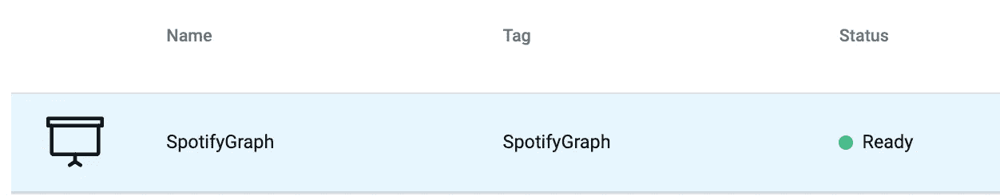
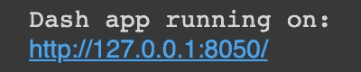
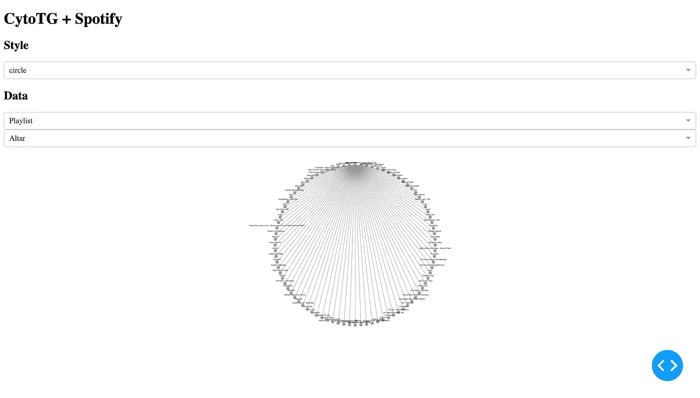
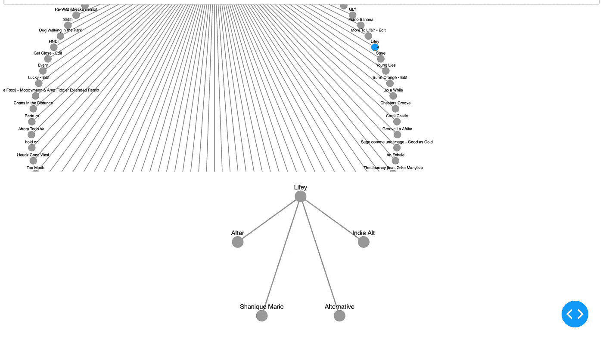
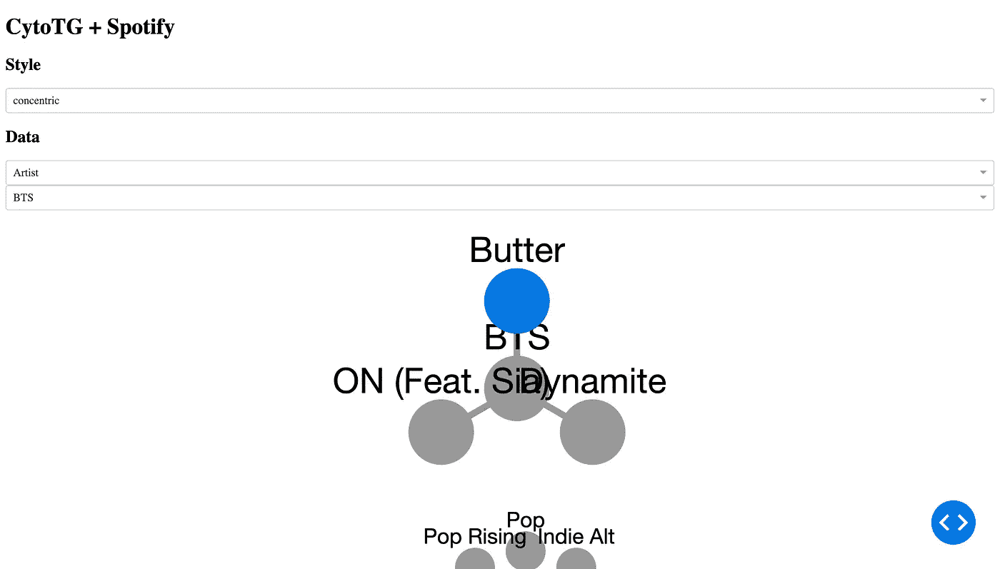

# 用 Cytoscape 对 TigerGraph Spotify 数据建模

> 原文：<https://towardsdatascience.com/modelling-tigergraph-spotify-data-with-cytoscape-9b82ea614bed?source=collection_archive---------30----------------------->

## 使用细胞图像可视化创建仪表板


记录，看起来与顶点相似([来自 Pixabay](https://pixabay.com/photos/vinyl-retro-plastic-old-black-1595847/) 的图像)

> 注:使用的 Spotify 数据可以在[这个博客](https://shreya-chaudhary.medium.com/spotify-graph-dashboard-part-i-creating-a-spotify-graph-with-tigergraph-af97c436e538)中找到。

# 概观

## 目标

有兴趣利用 TigerGraph 的图形数据库和 Cytoscape 令人惊叹的可视化功能吗？在这篇博客中，我们将使用 Cytoscape 对 TigerGraph 中的 Spotify 数据进行建模，特别是 Plotly Dash 的 Cytoscape 包。然后，我们将把这些整合到一个很酷的交互式仪表板中。Cytoscape 是为数据及其连接建模而构建的，让我们用 Cytoscape 对连接的 TigerGraph 数据建模，以便轻松地将我们的可视化集成到 Python 应用程序中。

## 工具

*   [tiger graph Cloud](https://tgcloud.io/):tiger graph 是世界上“唯一可扩展的企业级图形数据库”我们将特别使用 TG Cloud，这是一种开始使用 TigerGraph(甚至通过 GraphStudio 提供无代码解决方案)的简单方法，并免费托管您的图形！
*   [Cytoscape](https://cytoscape.org/) : Cytoscape 是一个"[开源](https://cytoscape.org/download.html)软件平台，用于可视化复杂网络，并将这些网络与任何类型的属性数据集成在一起。具体来说，我们将使用与 Plotly Dash 的集成来建模我们互连的 TigerGraph 数据。

# 第一部分:准备你的图表

## 第一步:确保图表准备就绪

首先，让我们确保我们的图表已经准备好运行。转到[https://tgcloud.io/app/solutions](https://tgcloud.io/app/solutions)并确保您可以在“状态”栏下看到一个绿点和“就绪”。



确保状态为“就绪”！

如果它有一个带有“停止”字样的蓝点，请单击“解决方案操作”，然后从下拉列表中单击“启动”。

等到状态为绿色并显示“就绪”(这可能需要几分钟)，然后您就可以继续前进了！

## 第二步:连接到您的解决方案

首先，让我们再次从我们的 Colab 笔记本连接到 TG Cloud 上的解决方案。首先，我们将安装并导入 pyTigerGraph。

```
!pip install pyTigerGraphimport pyTigerGraph as tg
```

接下来，我们将创建 TigerGraphConnection。记住用它们各自的值替换子域和密码。

```
conn = tg.TigerGraphConnection(host="https://SUBDOMAIN.i.tgcloud.io/", password="PASSWORD", graphname="SpotifyGraph")conn.apiToken = conn.getToken(conn.createSecret())
```

我的 TigerGraphConnection 将如下所示:

```
conn = tg.TigerGraphConnection(host="https://spotifygraph.i.tgcloud.io/", password="tigergraph", graphname="SpotifyGraph")conn.apiToken = conn.getToken(conn.createSecret())
```

一旦它运行，我们就准备好了！

# 第二部分:准备仪表板

## 第一步:导入库

首先，我们将安装并导入我们的库。第一个库将是 pandas，它允许我们将查询结果格式化为 cytoscape。

```
import pandas as pd
```

接下来，我们将导入所有的标准 dash 库。

```
!pip install -q jupyter-dashfrom jupyter_dash import JupyterDash
import dash_core_components as dcc
import dash_html_components as html
from dash.dependencies import Input, Output
```

最后，我们将安装这个博客的专用库:dash_cytoscape，Plotly Dash 的 cytoscape 库。

```
!pip install dash_cytoscapeimport dash_cytoscape as cyto
```

太好了！现在让我们创建应用程序的布局！

## 步骤二:创建应用程序布局

首先，让我们创建应用程序，初始化一个 JupyterDash 仪表板。

```
app = JupyterDash(__name__)
```

接下来，我们将组件添加到我们的仪表板。

```
app.layout = html.Div([
   html.H1("CytoTG + Spotify"),
   html.H2("Style"),dcc.Dropdown(id = "layout", options=[
      {"value": "preset", "label": "preset"},
      {"value": "random", "label": "random"},
      {"value": "grid", "label": "grid"},
      {"value": "circle", "label": "circle"},
      {"value": "concentric", "label": "concentric"},
      {"value": "breadthfirst", "label": "breadthfirst"},
      {"value": "cose", "label": "cose"},
   ], value="circle", clearable=False),html.H2("Data"),dcc.Dropdown(id = "opt", options=[
      {'value': "Artist", 'label': "Artist"},
      {'value': "Playlist", 'label': "Playlist"},
      {'value': 'Genre', 'label': 'Genre'},
      {'value': 'Song', 'label': 'Song'}
   ], value="Playlist", clearable=False),dcc.Dropdown(id = "artist", value="Altar", clearable=False),cyto.Cytoscape(id = "cyto", layout={'name': 'circle'}, style={'width': '100%', 'height': '400px'}),cyto.Cytoscape(id = "scape", layout={'name': 'circle'}, style={'width': '100%', 'height': '400px'}),])
```

我们来分析一下。我们将从标题和副标题开始。

```
html.H1("CytoTG + Spotify"),
html.H2("Style"),
```

然后，我们将添加不同布局类型的下拉列表。

```
dcc.Dropdown(id = "layout", options=[
      {"value": "preset", "label": "preset"},
      {"value": "random", "label": "random"},
      {"value": "grid", "label": "grid"},
      {"value": "circle", "label": "circle"},
      {"value": "concentric", "label": "concentric"},
      {"value": "breadthfirst", "label": "breadthfirst"},
      {"value": "cose", "label": "cose"},
   ], value="circle", clearable=False),
```

接下来，我们将添加另一个副标题。接下来的两个下拉列表将是顶点类型和每个顶点类型的值。

```
html.H2("Data"),dcc.Dropdown(id = "opt", options=[
      {'value': "Artist", 'label': "Artist"},
      {'value': "Playlist", 'label': "Playlist"},
      {'value': 'Genre', 'label': 'Genre'},
      {'value': 'Song', 'label': 'Song'}
   ], value="Playlist", clearable=False),dcc.Dropdown(id = "artist", value="Altar", clearable=False),
```

最后，我们将添加两张细胞图。

```
cyto.Cytoscape(id = "cyto", layout={'name': 'circle'}, style={'width': '100%', 'height': '400px'}),cyto.Cytoscape(id = "scape", layout={'name': 'circle'}, style={'width': '100%', 'height': '400px'}),
```

完美！现在格式已经准备好了，让我们用回调来进行交互。

# 第三部分:撰写回访

## 回调 I:更新布局

我们的第一个回调很简单:我们将获取布局下拉列表的值，并将其分配给细胞图。因此，如果布局下拉列表的值为“预设”，细胞图的布局值将为{“name”:“preset”}如果布局下拉列表的值改变，细胞图布局的值也会改变。

```
@app.callback(
   Output('cyto', 'layout'),
   Output('scape', 'layout'),
   Input('layout', 'value')
)def update_graph(lay):
   return {"name": lay}, {"name": lay}
```

完美！现在，我们将能够使用下拉菜单修改细胞图的布局。

## 回调 II:更新下拉列表

接下来，我们将更新下拉列表。第一个下拉列表将决定我们要查看的顶点类型，然后我们需要用该顶点类型的值填充第二个下拉列表。该函数将根据 opt 下拉列表的值运行 getArtists、getPlaylists、getGenres 和/或 getSongs 查询。最后，它将以这种形式返回该顶点的所有选项(其中 name、name1、name2 等。是歌曲、艺术家、播放列表和流派的名称，取决于 opt 下拉列表的值)。

```
[{"label": name, "value": name}, {"label": name1, "value": name1}, {"label": name2, "value": name2}]
```

让我们把它组合成一个回调:

```
@app.callback(
   Output('artist', 'options'),
   Input('opt', 'value'),
)def update_graph(opt): if opt == "Artist": artists = conn.runInstalledQuery("getArtists")
      artists = [{"label": i["attributes"]["name"], "value": i["attributes"]["name"]} for i in artists[0]["Seed"]]
      return artists elif opt == "Playlist": playlists = conn.runInstalledQuery("getPlaylists")
      playlists = [{"label": i["attributes"]["name"], "value": i["attributes"]["name"]} for i in playlists[0]["Seed"]]
      return playlists elif opt == "Genre": genres = conn.runInstalledQuery("getGenres")
      genres = [{"label": i["attributes"]["name"], "value": i["attributes"]["name"]} for i in genres[0]["Seed"]]
      return genres elif opt == "Song": songs = conn.runInstalledQuery("getSongs")
      songs = [{"label": i["attributes"]["name"], "value": i["attributes"]["name"]} for i in songs[0]["Seed"]]
      return songs
```

## 回调 III:更新第一个细胞图

这个回调比较长，可以在笔记本里查看完整的功能。但是，我们将分解关键组件。

在标题中，我们将输出作为元素(顶点和边)，接受 opt(顶点类型)和 artist(顶点类型的特定值)这两个下拉列表的输入。

```
@app.callback(
   Output('cyto', 'elements'),
   Input('artist', 'value'),
   Input('opt', 'value'),
)
def update_graph(art, opt):
```

接下来，对于前三种顶点类型，它有一个 if 语句，使用 opt 检查顶点的类型。然后，运行 getSongsByXXX，其中 XXX 是顶点类型(艺术家、播放列表和流派)。将数据格式化如下:

```
{"data": {'id': XXX, 'label': XXX, 'classes': YYY}}
```

总的来说，它看起来像这样:

```
if opt == "Artist": res = conn.runInstalledQuery("getSongsByArtist", {"artist": art})[0]["@@songs"] # Runs query
   cyto_data = [{'data': {'id': art, 'label': art, 'classes': 'artist'}}] # Adds artist vertex
   for i in res:
      cyto_data.append({"data": {'id': i['name'], 'label': i['name'], 'classes': 'song'}}) # Adds songs vertices
      cyto_data.append({'data': {'source': art, 'target': i['name']}}) # Adds edges
   return cyto_data
```

对艺术家、播放列表和流派重复此操作。然而，宋将略有不同。运行“getVerticesFromSongs”查询。然后为每种类型添加顶点和边。

```
if opt == "Song": res = conn.runInstalledQuery("getVerticesFromSongs", {"song_name": art})[0]["connectedVals"] # Runs query
   cyto_data = [{'data': {'id': art, 'label': art, 'classes': 'song'}}] # Adds song vertex for i in res: if i['vertex_type'] == 'genre':
         cyto_data.append({"data": {'id': i['name'], 'label': i['name'], 'classes': 'genre'}}) # Adds genres vertices if i['vertex_type'] == 'artist':
         cyto_data.append({"data": {'id': i['name'], 'label': i['name'], 'classes': 'artist'}}) # Adds artist vertices if i['vertex_type'] == 'playlist':
         cyto_data.append({"data": {'id': i['name'], 'label': i['name'], 'classes': 'playlist'}}) # Adds playlist vertices cyto_data.append({'data': {'source': art, 'target': i['name']}}) # Adds edges return cyto_data
```

## 回调 IV:更新第二个细胞图

太棒了。我们现在是在最后的回调！同样，这个查询对于博客来说太长了，所以它将被分段显示。

输入将是在第一个细胞图中点击的顶点，输出将是第二个细胞图的顶点和边。

```
@app.callback(
   Output('scape', 'elements'),
   Input('cyto', 'tapNodeData'),
)
def update_graph(main_data):
```

接下来，我们将只返回 main_data 存在的数据。接下来，我们将分配 art 和 opt 值，然后查询将与之前完全相同。

```
if (main_data):
   art = main_data["id"]
   opt = main_data["classes"]
```

最后，如果 main_data 不存在(没有点击任何东西)，就返回一个空列表。

```
else:
   return []
```

就这样，你完成了！现在让我们运行应用程序！

# 第四部分:运行应用程序！

最后，我们将运行一行代码来激活我们所有的辛勤工作:

```
app.run_server(mode='external')
```

您将看到一个链接，您可以点击该链接查看控制面板。



点击链接

然后…瞧！您的仪表板处于活动状态！



实时仪表板

如果单击某个顶点，下图将显示该顶点的连接。



两种细胞骨架

最后，您可以切换不同的选项来创建不同的图和子图。



更改使用的选项和数据

# 第五部分:祝贺+资源

恭喜你。您已经用 TigerGraph 数据正式创建了细胞图！

如果您有任何问题，请在 Discord 或社区论坛中提问。

[](https://discord.gg/gRHWBZNpxW) [## 加入 TigerGraph Discord 服务器！

### 查看 Discord 上的 TigerGraph 社区-与 595 名其他成员一起玩，享受免费的语音和文本聊天。

不和谐. gg](https://discord.gg/gRHWBZNpxW) [](https://community.tigergraph.com/) [## 老虎图

### 一个学习、提问、展示酷项目以及与其他 TigerGraph 开发人员交流的地方！

community.tigergraph.com](https://community.tigergraph.com/) 

最后，这是对原始细胞景观论文的引用:

```
Shannon P, Markiel A, Ozier O, Baliga NS, Wang JT, Ramage D, Amin N, Schwikowski B, Ideker T.Cytoscape: a software environment for integrated models of biomolecular interaction networksGenome Research 2003 Nov; 13(11):2498-504
```

您可以在这个 Colab 笔记本中跟随:

[](https://colab.research.google.com/drive/1zXSVNFe1f26UdFIXZisfRZ4TWH9sbdX9?usp=sharing) [## 谷歌联合实验室—TG+细胞图

### TigerGraph 和细胞图整合

colab.research.google.com](https://colab.research.google.com/drive/1zXSVNFe1f26UdFIXZisfRZ4TWH9sbdX9?usp=sharing) 

接下来，使用您自己的数据创建您自己的 TigerGraph-Cytoscape 集成！一旦你这样做了，一定要分享它，让你的条纹在社区贡献计划！

[](https://www.tigergraph.com/community-contribution/) [## 图表分析用例|图表数据库解决方案

### 使用 TigerGraph 的图形数据库解决方案连接、分析和学习数据。探索图表分析使用…

www.tigergraph.com](https://www.tigergraph.com/community-contribution/) 

非常感谢你阅读这个博客，我迫不及待地想看到你创造的很酷的项目！

> 注:除非另有说明，所有图片均由作者(Shreya Chaudhary)创作。