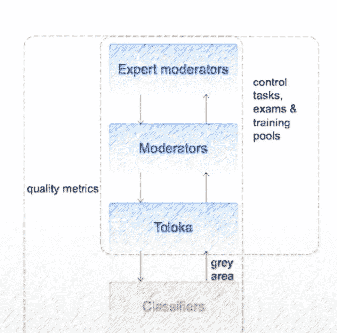

# 用户生成内容的审核渠道

> 原文：<https://towardsdatascience.com/moderation-pipeline-for-user-generated-content-59e7f3c320e0?source=collection_archive---------32----------------------->

## 欧洲科技巨头如何利用 Toloka 的人群来调节其内容

图片由[皮克斯拜](https://pixabay.com/?utm_source=link-attribution&utm_medium=referral&utm_campaign=image&utm_content=2457732)的 Gerd Altmann 提供

**简介**

近年来，人工智能和机器学习的增长伴随着微软 Start 等自动饲料生成器的涌入。这些工具不断抓取网站，为每个用户提供最新、最合适的文章。分析更新和新闻的海洋，更不用说个性化了，是初创公司和科技巨头都在探索的想法。

这些平台中的许多已经使日常用户成为重要的内容创作者。但这并不是没有问题，包括需要快速和可扩展的内容审核。

在这篇文章中，你将了解到纳斯达克上市的科技巨头 Yandex Zen 如何利用大众来调节其内容。

**Yandex Zen 和内容节制问题**

作为欧洲最大的科技公司之一，Yandex Zen 处理来自媒体和用户内容的各种材料。每天有成千上万的作者注册，他们创作的内容可以达到六位数。

所有这些内容都需要被调节。让问题更加复杂的是，内容格式从普通文章到类似推特的消息、评论甚至视频。

Zen 使用预先训练的机器学习算法来检测不适当的内容，如仇恨言论、clickbait、不可靠的医疗建议、垃圾邮件和成人内容。但这还不够。

**用人群标注数据**

机器学习算法有时会错过它们的预测，过度依赖它们会使内容管理者容易受到向公众发布不适当内容的影响。

考虑到这一点，Yandex Zen 最初使用机器学习算法来调节内容，但将困难的案件交给真人处理。但是大量的数据意味着每天都有成千上万的内容需要人工处理。这对于内部员工来说是不可能的。

因此，Yandex Zen 使用了 [Toloka](https://toloka.ai/) ，这是一个旨在实现标签自动化的众包平台。在该平台中，他们要求用户执行一个简单的审核任务，类似于下图所示的截图，以换取少量报酬。

作者图片

因为 Toloka 在世界各地有数百万表演者，Yandex Zen 可以调节每天产生的大量内容。人群可用性甚至意味着内容在发布后几乎会立即得到调整。此外，该平台让用户可以通过选择他们说的语言、位置或他们拥有特定技能的事实来控制人群。

**众包问题**

从一开始，Yandex Zen 就将有效管理人群作为他们的首要目标。他们需要为他们的项目选择合适的执行者，以保持高质量的审核。

他们实施的一个解决方案是添加并定期更新控制任务。*控制任务*有一个已知答案，用于对执行者答案的质量评分。如果一个执行者给出了太多的错误答案，他们可能会被从项目中删除。得分高的表演者可以获得额外的奖金。

由于大量的数据和用户生成的内容不断变化的事实，Yandex Zen 团队发现自己不断提出控制任务。这使得正确管理和扩展变得困难。

**阶梯管道解决方案**

运行几个实验产生了下图所示的梯形解决方案。

作者图片

如果人工智能系统不确定标签，管道中的每一条内容都由机器学习算法进行审核，并发送给一般的 Toloka 人群。为了确保人群质量，Yandex Zen 团队建立了一个由更受信任的工作人员组成的较小池，称为版主，他们将这些任务标记为后来用于普通人群的控制任务。他们的标签也用于创建考试池，执行者需要通过考试才能被项目接受。

阶梯上的最后一级是专家版主，他们通过为普通版主创建控制任务来监控他们的工作。他们是极少数高度合格和值得信任的工作者，他们每周的回答让 Yandex Zen 团队检查版主的工作。

机器学习模型本身也在众包数据上进行训练。该团队实际上从每天的数据中抽取 1%的样本，并提交给人群进行标记，以确保机器学习模型总是最新的。

Yandex Zen pipeline 提供可扩展的结果，并让 Yandex 团队快速识别质量问题。以前的解决方案很晚才注意到质量控制问题，只是在性能显著下降时才标记出来。

上述解决方案帮助 Yandex Zen 有效地管理内容审核，并使其可扩展。您如何处理项目中大量且不断变化的数据？预先训练好的 ML 模型就足够了还是需要*“人在回路中”？欢迎在评论中分享你的想法。*

**总结**

本文展示了如何使用人群自动审核用户生成的内容。人工智能和机器学习管道通常会消耗大量的时间和精力。如果像 Yandex Zen 那样处理大量不断变化的数据，那就更是如此。

更多细节，请观看 Natalia Kazachenko 关于她和她的团队开发的阶梯方法的演讲。如果你想了解更多关于如何自动化数据标注管道的信息，你也可以加入这个数据赋能的[社区](https://tolokacommunity.slack.com/join/shared_invite/zt-sxr745fr-dvfZffzvQTwNXOE0gEqysg#/shared-invite/email)。

*PS:我正在 Medium 和*[***aboutdatablog.com***](https://www.aboutdatablog.com/)*上撰写深入浅出地解释基本数据科学概念的文章。你可以订阅我的* [***邮件列表***](https://medium.com/subscribe/@konkiewicz.m) *每次我写新文章都会收到通知。如果你还不是中等会员，你可以在这里加入***。**

*下面还有一些你可能喜欢的帖子*

* [## Jupyter 笔记本自动完成

### 数据科学家的最佳生产力工具，如果您还没有使用它，您应该使用它…

towardsdatascience.com](/jupyter-notebook-autocompletion-f291008c66c)  [## Jupyter 笔记本中的 8 大魔法命令

### 通过学习最有用的命令来提高您的生产力

towardsdatascience.com](/top-8-magic-commands-in-jupyter-notebook-c1582e813560)  [## 关于 jupyter 笔记本你不知道的 9 件事

### 用这些建议提高你的工作效率

towardsdatascience.com](/9-things-you-did-not-know-about-jupyter-notebook-d0d995a8efb3)*