# 现代高斯过程回归

> 原文：<https://towardsdatascience.com/modern-gaussian-process-regression-9c5196ca87ab?source=collection_archive---------9----------------------->

## [思想和理论](https://towardsdatascience.com/tagged/thoughts-and-theory)

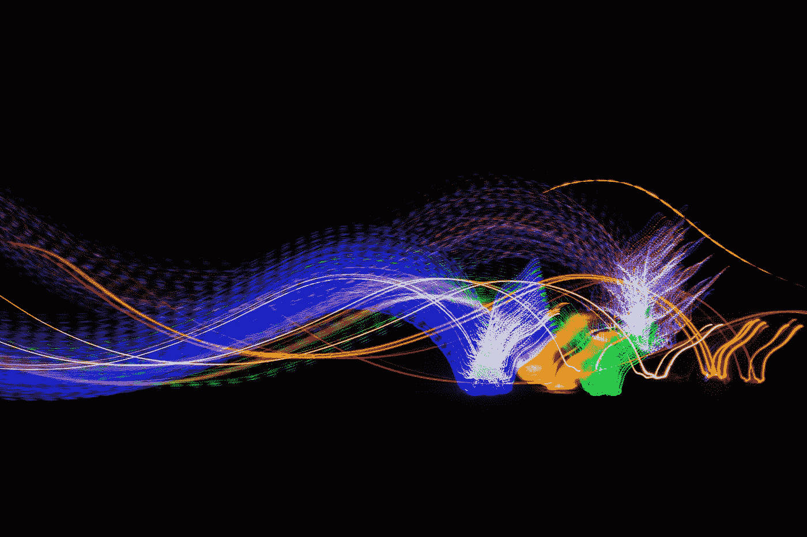

高斯过程回归可用于学习大量周期性和非周期性信号，如图所示。由[瑞安·斯通](https://unsplash.com/@rstone_design?utm_source=medium&utm_medium=referral)在 [Unsplash](https://unsplash.com?utm_source=medium&utm_medium=referral) 上拍摄的照片

# 无限模型表达+现代计算

有没有想过如何用**无限的表达能力**创建非参数监督学习模型？只需看看**高斯过程回归** (GPR)，这是一种几乎完全从数据本身(在超参数的一点帮助下)学习做出预测的算法。将该算法与计算领域的最新进展(如自动微分)相结合，允许应用 GPRs 来近乎实时地解决各种受监督的机器学习问题。

在本文中，我们将讨论:

1.  GPR 背后理论的简要概述/回顾
2.  我们可以使用 GPR 解决的问题类型，以及一些例子
3.  GPR 与其他监督学习算法相比如何
4.  我们可以用来实现 GPR 的现代编程包和工具

这是我的 GPR 系列的第二篇文章。对于高斯过程回归的严格从头开始的介绍，请查看我以前的文章 [**这里**](/gaussian-process-regression-from-first-principles-833f4aa5f842) 。

# **概述:高斯过程回归(GPR)概念**

在我们深入研究如何实现和使用 GPR 之前，让我们快速回顾一下这种受监督的机器学习算法背后的机制和理论。关于以下概念的更详细的推导/讨论，请查看我以前关于 GPR 的文章 [**这里**](/gaussian-process-regression-from-first-principles-833f4aa5f842) 。GPR:

一、以**观察到的**训练点为条件，预测**测试点的条件后验分布**:

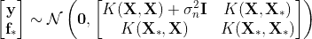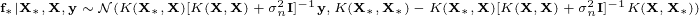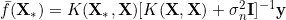

二。将预测测试点目标的**均值**计算为**观测目标值**的**线性组合**，这些**线性组合**的**权重**由从**训练输入**到**测试点**的**核距离**决定:

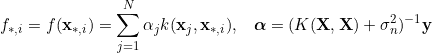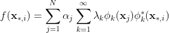

三。使用**协方差函数**测量输入之间的**核距离**:

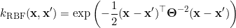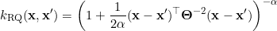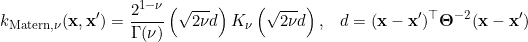

四。**通过将每个新点视为**高斯过程**的一部分，从现有点中插入**新点，即将新点参数化为**高斯**分布:

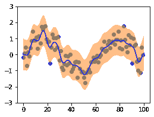

使用噪声正弦时间序列数据集的 1D 插值示例。图片来源:作者。

# GPR 可以解决哪些问题？

GPR 可以应用于各种 ***有监督的*** 机器学习问题(并且在某些情况下，可以作为子程序应用于 ***无监督的*** 机器学习)。以下是可以用这种机器学习技术解决的几类问题:

## **A .插值/克里金法**

插值是许多领域中的关键任务，例如信号处理、空间统计和控制。这种应用在利用空间统计的领域中尤其常见，例如**地统计学。**作为一个具体的例子，考虑在给定山上有限数量的定义点的情况下，生成对应于下面的山的表面的问题。如果你有兴趣看这个的具体实现，请点击这里查看我的文章[](/batched-multi-dimensional-gaussian-process-regression-with-gpytorch-3a6425185109)**。**

****

**克里金法和插值法常用于地统计学，可用于高维空间的表面插值！照片由[马科斯·曼特](https://unsplash.com/@markos_mant?utm_source=medium&utm_medium=referral)在 [Unsplash](https://unsplash.com?utm_source=medium&utm_medium=referral) 上拍摄**

## ****B .时间序列预测****

**这类问题着眼于使用历史数据预测未来的时间序列。与克里金法一样，时间序列预测允许预测未知值。然而，这个问题不是预测不同位置的看不见的值，而是应用 GPR 来预测未来看不见的点的平均值和方差。这非常适用于预测电力需求、股票价格或线性动力系统的状态空间演化等任务。**

**此外，GPR 不仅预测未来某一点的平均值，而且还输出预测方差，使决策系统能够将不确定性因素纳入决策。**

**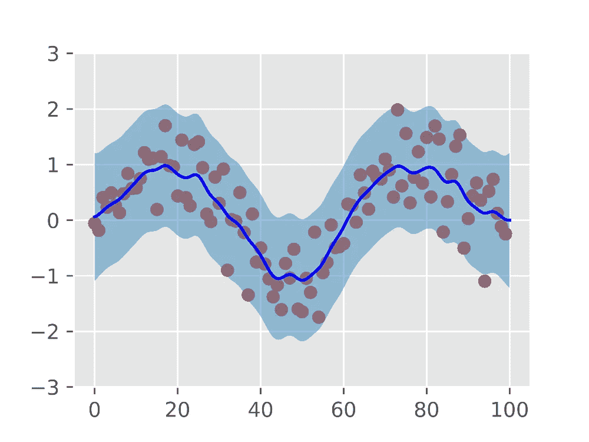**

**用有噪声的正弦曲线进行时间序列预测的例子。深蓝色线代表预测的平均值，而浅蓝色区间代表模型的置信区间。图片来源:作者。**

## ****预测不确定性****

**更一般地，因为 GPR 允许预测测试点的方差，GPR 可用于各种不确定性量化任务——即与估计**期望值**和与该**期望值**相关的不确定性或**方差**相关的任何任务。**

**你可能想知道:*为什么不确定性很重要*？为了激发这个答案，考虑为自主导航安全系统预测行人的轨迹。如果行人的预测轨迹具有**高预测不确定性**，则自动驾驶车辆应更加小心，以应对行人意图的低置信度。另一方面，如果自主车辆具有**低的行人轨迹预测方差**，那么自主车辆将能够更好地预测行人的意图，并且能够更容易地按照其当前的驾驶计划前进。**

**从某种意义上说，通过预测不确定性，决策系统可以根据他们预测这些期望值的不确定性来“加权”他们估计的**期望值**。**

****

**预测行人对自动驾驶汽车系统意图的不确定性是 GPR 的一个应用示例。照片由[法伦·麦克](https://unsplash.com/@fallonmichaeltx?utm_source=medium&utm_medium=referral)在 [Unsplash](https://unsplash.com?utm_source=medium&utm_medium=referral) 拍摄**

# **为什么 GPR 优于其他监督学习模型？**

**您可能想知道—为什么我应该考虑使用 GPR 而不是不同的监督学习模型？下面，我列举几个比较的理由。**

1.  **GPR 是 ***非参数*** 。这意味着它主要从数据本身学习，而不是通过学习一组广泛的参数。这是特别有利的，因为这导致 GPR 模型不像高度参数化的模型(如神经网络)那样*渴求数据，也就是说，它们不需要那么多样本来实现强大的概化能力。***
2.  ***对于插值和预测任务，GPR 估计**期望值**和**不确定性**。这对于在做出决策时考虑到这种不确定性的决策系统尤其有益。***
3.  ***GPR 是一个 ***线性平滑器***【5】——从**监督学习**的角度来看，这可以被概念化为**正则化**技术。从**贝叶斯**的角度来看，这相当于在你的模型上强加了一个**先验**，即测试点上的所有目标必须是现有训练目标的 ***线性组合*** 。这个属性有助于 GPR 推广到看不见的数据，只要真正的看不见的目标可以表示为训练目标的线性组合。***
4.  ***有了**自动差异化**后端框架如`torch`、`tensorflow`，通过`gpytorch`、`gpflow`等 GPR 包集成，GPR 就是**闪电般快速**、**可伸缩**。对于**批量**车型来说尤其如此。有关这方面的示例案例研究，请参见我以前关于批量多维 GPR 的文章 [**这里**](/batched-multi-dimensional-gaussian-process-regression-with-gpytorch-3a6425185109) ！***

# ***如何实现 GPR？***

***下面，我们为高斯过程回归的**可扩展**、**高效**和**模块化**实现介绍几个 Python 机器学习包。让我们逐一了解一下！***

## ***[**1。sci kit-Learn**](https://scikit-learn.org/stable/modules/generated/sklearn.gaussian_process.GaussianProcessRegressor.html)**【1】*****

*****这是一个非常棒的 GPR 入门包。它允许一些模型的灵活性，并能够执行超参数优化和定义引擎盖下的可能性。要将`sklearn`用于您的数据集，请确保您的数据集可以用`np.array`对象用数字表示。通过`sklearn`使用 GPR 的主要步骤:*****

1.  *****预处理您的数据。训练数据(`np.array`)可以表示为一个具有`x_train`形状 **(N，D)**`y_train`形状 **(N，1)****的`(x_train, y_train)`元组，其中 **N** 是样本数， **D** 是特征的维数。你的考点(`np.array`)可以用形状 **(N，D)** 的`x_test`来表示。*******
2.  *******定义你的**协方差函数**。在下面的代码段中，我们使用径向基函数(RBF)内核`RBF`和使用`WhiteKernel`的加性噪声。*******
3.  *******使用你的协方差函数定义你的`GaussianProcessRegressor`对象，以及一个播种你的 GPR 的随机状态。此`random_state`对于确保再现性非常重要。*******
4.  *******使用方法`gpr.fit(x_train, y_train)`调整`gpr`对象。这“训练你的模型”，并使用梯度方法优化你的`gpr`对象的超参数，例如`lbfgs`，一个基于二阶 Hessian 的优化程序。*******
5.  *******使用`gpr.predict(x_test, return_std=True)`方法预测你的测试点`x_test`上目标的**均值**和**协方差**。这给了你一个预测值，以及这个预测点的不确定性的度量。*******

*******使用`pip`为下面的示例安装依赖项:*******

```
*****pip install scikit-learn numpy matplotlib*****
```

*******下面是一个**拟合**并且**使用`sklearn`预测**一维正弦曲线的例子:*******

## *******[2**。gpytrch**](https://gpytorch.ai/)**【2】**(py torch 后端)***********

***********该软件包非常适合创建完全可定制的高级加速 GPR 模型。这个包支持从通过自动微分的 GPR 模型优化到通过 CUDA 和 [PyKeOps](https://pypi.org/project/pykeops/) 的硬件加速。***********

***********在使用 GPyTorch 之前，建议您对 PyTorch 和/或 python 中的自动微分包有所了解，但是 [**教程**](https://docs.gpytorch.ai/en/v1.1.1/examples/01_Exact_GPs/Simple_GP_Regression.html) 使这个框架易于学习和使用。GPyTorch 中 GPRs 的数据表示为`torch.tensor`对象。以下是在 GPyTorch 中拟合 GPR 模型的步骤:***********

1.  *********预处理您的数据。训练数据可以表示为一个具有`x_train`形状 **(B，N，D)**`y_train`形状 **(B，N，1)****的`(x_train, y_train)`元组，其中 **B** 是批量， **N** 是样本数， **D** 是特征的维数。你的测试点可以用形状为 **(B，N，D)** 的`x_test`来表示。***********
2.  *********通过子类化`gpytorch.models.ExactGP`类来定义你的`ExactGPModel`。要创建这个模型的子类，您需要定义:(I)构造器方法，它指定了模型的均值和协方差函数，(ii)方法`forward`，它描述了 GPR 模型如何进行预测。要使用**批处理**，请点击 查看本教程 [**。要在您的超参数上使用**之前的**分布，请点击**](https://docs.gpytorch.ai/en/v1.1.1/examples/08_Advanced_Usage/index.html?highlight=batch#batch-gps) 查看本教程 [**。**](https://docs.gpytorch.ai/en/v1.1.1/examples/00_Basic_Usage/Hyperparameters.html?highlight=priors)*********
3.  *******指定您的`likelihood`函数，您的模型使用该函数将潜在变量 **f** 与观察目标 **y** 相关联。*******
4.  *******使用您的`likelihood`和训练数据`(x_train, y_train)`实例化您的`model`。*******
5.  *******使用`pytorch`自动微分对`model`进行超参数优化(“训练”)。一旦完成，确保你的`model`和`likelihood`与`model.eval()`和`likelihood.eval()`置于后模式。*******
6.  *******通过调用`likelihood(model(x_test))`，使用`model`计算测试点的**均值**和**方差**预测。内部函数从测试输入`**x***`预测潜在测试值`**f***` ，外部函数从潜在测试值`**f***`预测**均值**和**方差**。*******

*******使用`pip`为下面的示例安装依赖项:*******

```
*******pip install gpytorch torch matplotlib numpy# (Optional) - Installs pykeops
pip install pykeops*******
```

*******下面是一个使用`gpytorch`拟合有噪声的一维正弦曲线的例子:*******

## *******[**3。gp flow**](https://gpflow.readthedocs.io/en/master/index.html)【3】(tensor flow 后端)*******

*******另一个支持自动微分的 GPR 包(这次是在`tensorflow`中)，GPFlow 具有广泛的内置功能，用于创建完全可定制的模型、似然函数、内核以及优化和推理例程。除了 GPR，GPFlow 还为贝叶斯优化中的各种其他最新问题提供了内置功能，例如 [**变分傅立叶特征**](https://gpflow.readthedocs.io/en/master/notebooks/advanced/variational_fourier_features.html) 和 [**卷积高斯过程**](https://gpflow.readthedocs.io/en/master/notebooks/advanced/convolutional.html) 。*******

*******在使用 GPFlow 之前，建议您对 TensorFlow 和/或 Python 中的自动微分包有所了解。GPFlow 中 GPRs 的数据表示为`tf.tensor`对象。要开始使用 GPFlow，请查看 [**此示例链接**](https://gpflow.readthedocs.io/en/master/notebooks_file.html) 。*******

## *******[**4。GPy**](https://gpy.readthedocs.io/en/deploy/GPy.models.html)**【4】*********

*******这个包为大量 GPR 模型、似然函数和推理过程提供了 Python 实现。虽然这个包没有像驱动`gpytorch`和`gpflow`一样的自动区分后端，但是这个包的通用性、模块化和可定制性使它成为实现 GPR 的一个有价值的资源。*******

## *******[5。烟火](http://pyro.ai/) [6]*******

*******Pyro 是一个概率编程包，可以与 Python 集成，也支持高斯过程回归，以及高级应用，如[深度内核学习](https://pyro.ai/examples/dkl.html)。*******

## *******[6。创](https://www.gen.dev/) [7]*******

*******Gen 是另一个建立在 Julia 之上的概率编程包。Gen 为高斯过程回归提供了几个优势:(I)它建立在建议分布中，这可以通过有效地对可能的解决方案集施加先验来帮助缩小搜索空间，(ii)它具有用于从拟合 GPR 模型中采样轨迹的简单 API，(iii)作为许多概率编程语言的目标，它能够容易地创建用于调整 GPR 超参数先验的分层模型。*******

## *******[7。斯坦](https://mc-stan.org/)[8]*******

*******Stan 是另一个概率编程包，可以与 Python 集成，但也支持其他语言，如 R、MATLAB、Julia 和 Stata。除了内置高斯过程回归功能，Stan 还支持各种其他贝叶斯推理和采样功能。*******

## *******[8。博特赫](https://botorch.org/)*******

*******BoTorch 由 GPyTorch 的创建者构建，它是一个贝叶斯优化库，支持许多与 GPR 相同的技术，以及高级贝叶斯优化技术和分析测试套件。*******

# *******总结和回顾*******

*******在本文中，我们回顾了高斯过程回归(GPR)背后的理论，介绍并讨论了 GPR 可以用来解决的问题类型，讨论了 GPR 与其他监督学习算法的比较，并介绍了我们如何使用`sklearn`、`gpytorch`或`gpflow`来实现 GPR。*******

*******想看更多强化学习、机器学习、计算机视觉、机器人、教学方面的文章，请关注我！感谢您的阅读！*******

# *******感谢*******

*******感谢 [CODECOGS](https://codecogs.com/) 的[内联方程渲染工具](https://codecogs.com/latex/eqneditor.php)，感谢 Carl Edward Rasmussen 开源教科书*机器学习的高斯过程*【5】，感谢 [Scikit-Learn](https://scikit-learn.org/stable/) 、 [GPyTorch](https://gpytorch.ai/) 、 [GPFlow](https://gpflow.readthedocs.io/en/master/intro.html) 和 [GPy](https://gpy.readthedocs.io/en/deploy/GPy.models.html) 开源他们的高斯过程回归 Python 库。*******

# *******参考*******

*******[1] Pedregosa，Fabian 等，“sci kit-learn:Python 中的机器学习”《机器学习研究杂志》12(2011):2825–2830。*******

*******[3] Gardner，Jacob R .等，“Gpytorch:带 gpu 加速的黑盒矩阵-矩阵高斯过程推断。” *arXiv 预印本 arXiv:1809.11165* (2018)。*******

*******[3] Matthews，Alexander G. de G .等《GPflow:使用张量流的高斯过程库》。j .马赫。学习。第 18.40 (2017)号决议第 1 至 6 段。*******

*******【4】GPy，“GPy。”[http://github.com/SheffieldML/GPy](http://github.com/SheffieldML/GPy)*T21。********

*******[5]卡尔·爱德华·拉斯姆森和克里斯托弗 K. I .威廉斯。2005.机器学习的高斯过程(自适应计算和机器学习)。麻省理工学院出版社。*******

*******[6] Eli Bingham、Jonathan P. Chen、Martin Jankowiak、Fritz Obermeyer、Neeraj Pradhan、Theofanis Karaletsos、Rohit Singh、Paul Szerlip、Paul Horsfall 和 Noah D. Goodman。2019. *Pyro:深度泛概率规划。j .马赫。学习。第 20 号决议，第 1 段(2019 年 1 月)，第 973 至 978 段。********

*******Gen:一个具有可编程推理的通用概率编程系统。库苏马诺-汤纳，M. F。萨阿德公司；卢，a。和 Mansinghka，V. K,《关于编程语言设计和实现的第 40 届 ACM SIGPLAN 会议论文集》( PLDI '19)。*******

*******[8]斯坦开发小组。2021.Stan 建模语言用户指南和参考手册，版本。[https://mc-stan.org](https://mc-stan.org)。*******

*******[9] Balandat，Maximilian，等人，“BoTorch:一个有效的蒙特卡罗贝叶斯优化框架”*神经信息处理系统进展* 33 (2020)。*******