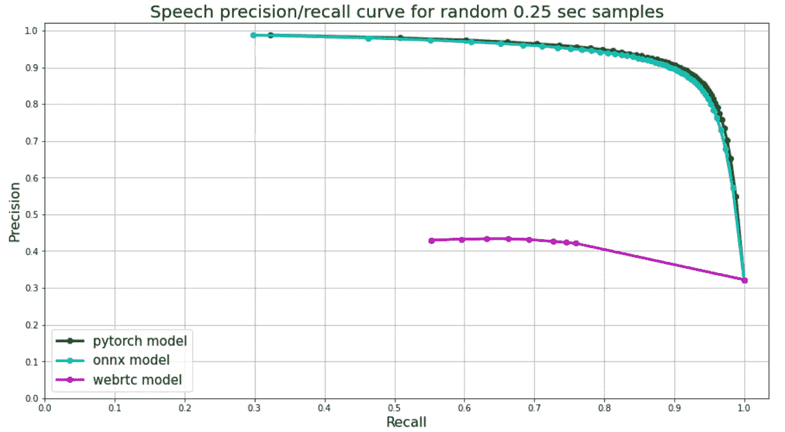
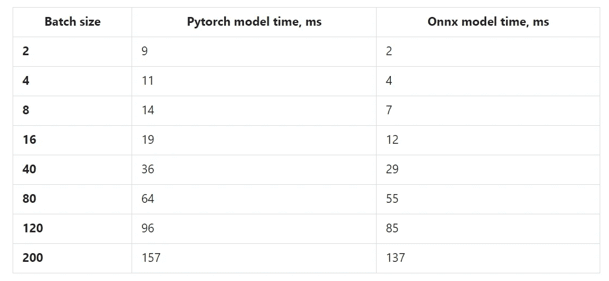
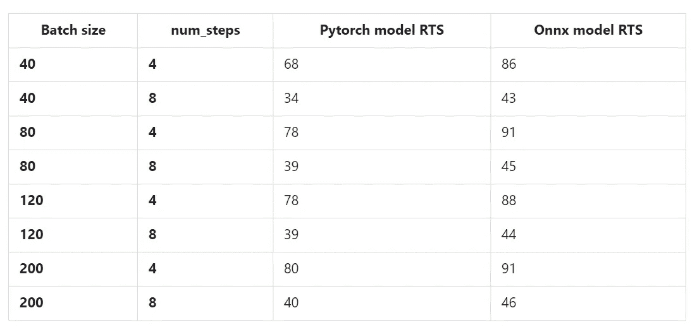

# 现代便携式语音活动检测器发布

> 原文：<https://towardsdatascience.com/modern-portable-voice-activity-detector-released-417e516aadde?source=collection_archive---------20----------------------->



作者图片

目前，除了 WebRTC 语音活动检测器([链接](https://github.com/wiseman/py-webrtcvad))之外，几乎没有任何高质量/现代/免费/公开的语音活动检测器。然而 WebRTC 开始显示出它的年龄，它遭受了许多误报。

此外，在某些情况下，能够匿名化大规模口语语料库(即删除个人数据)至关重要。通常，如果个人数据包含(I)姓名(ii)某个私人 ID，则被视为私人/敏感数据。姓名识别是一件非常主观的事情，它依赖于地区和商业案例，但语音活动和号码检测是相当普遍的任务。

**主要特点:**

*   现代，便携；
*   内存占用低；
*   优于 WebRTC 的指标；
*   在庞大的口语语料库和噪音/声音库上训练；
*   比 WebRTC 慢，但对于 IOT / edge /移动应用足够快；
*   不像 WebRTC(大多是从语音中分辨出静音)，我们的 VAD 可以从噪音/音乐/静音中分辨出语音；
*   PyTorch (JIT)和 ONNX 检查站；

**典型用例:**

*   口语语料库匿名化；
*   可以和 WebRTC 一起使用；
*   针对 IOT / edge /移动使用案例的语音活动检测；
*   数据清理和准备、号码和一般语音检测；
*   PyTorch 和 ONNX 可以用于各种各样的部署选项和后端；

# 入门指南

对于每个算法，您可以在提供的 [**colab**](https://colab.research.google.com/github/snakers4/silero-vad/blob/master/silero-vad.ipynb) 或[**repo**](https://github.com/snakers4/silero-vad)**本身中看到示例。对于 VAD，我们还提供了单个流和多个流的流示例。**

# **潜伏**

**所有速度测试都在 AMD 锐龙 Threadripper 3960X 上运行，仅使用一个线程:**

```
torch.set_num_threads(1) # pytorch 
ort_session.intra_op_num_threads = 1 # onnx ort_session.inter_op_num_threads = 1 # onnx
```

**流延迟取决于两个因素:**

*   ****num_steps** —将每个音频块分割成的窗口数量。我们的后处理类将前一个块保存在内存中(250 ms)，所以新块(也是 250 ms)被追加到它后面。由此产生的大块(500 毫秒)被分成 **num_steps** 个重叠窗口，每个窗口长 250 毫秒；**
*   ****音频流数量**；**

**因此**流式传输的批量大小**为 **num_steps *** 音频流数量**。接收新音频块和获得结果之间的时间如下所示:**

****

**VAD 潜伏期**

# **吞吐量**

**用于全音频处理的 **RTS** (每秒处理的音频秒数，实时速度，或 1 / RTF)取决于 **num_steps** (见上一段)和**批量大小**(越大越好)。**

****

**VAD 吞吐量以每秒处理的音频秒数来衡量**

# **VAD 质量基准**

**我们使用随机的 250 ms 音频块进行验证。组块之间的语音与非语音比率大约是 50/50(即平衡的)。从四种不同语言(英语、俄语、西班牙语、德语)的真实音频中采样语音块，然后将随机背景噪声添加到其中一些语音块中(约 40%)。**

**由于我们的 VAD(只有 VAD，其他网络更灵活)是在相同长度的组块上训练的，模型的输出只是一个从 0 到 1 的浮点数— **语音概率**。我们使用语音概率作为精确召回曲线的阈值。这可以扩展到 100-150 毫秒。小于 100-150 毫秒不能被区分为有把握的语音。**

**[Webrtc](https://github.com/wiseman/py-webrtcvad) 将音频分割成帧，每帧都有相应的编号(0 **或** 1)。对于 webrtc，我们使用 30 毫秒的帧，因此每个 250 毫秒的块被分成 8 帧，它们的**平均值**被用作绘图的阈值。**

****

**作者图片**

***原载于*[*https://habr.com*](https://habr.com/ru/post/537276/)*。***