# 现代推荐系统

> 原文：<https://towardsdatascience.com/modern-recommender-systems-a0c727609aa8?source=collection_archive---------4----------------------->

## [入门](https://towardsdatascience.com/tagged/getting-started)

## 深入探讨脸书和谷歌等公司围绕其业务发展的人工智能算法。

就在 2019 年 5 月，脸书开源了他们的一些推荐方法，并引入了 [DLRM](https://arxiv.org/pdf/1906.00091.pdf) (深度学习推荐模型)。这篇博客文章旨在解释 DLRM 和其他现代推荐方法如何以及为什么如此有效，方法是从该领域先前的结果中推导出来的，并详细解释了它们的内部工作方式和直觉。

图片由[苏珊娜·尤策勒拍摄，suju-foto](https://pixabay.com/de/users/suju-165106/?utm_source=link-attribution&utm_medium=referral&utm_campaign=image&utm_content=4200437) 在 [Pixabay](https://pixabay.com/de/?utm_source=link-attribution&utm_medium=referral&utm_campaign=image&utm_content=4200437)

基于人工智能的个性化广告是目前在线营销的游戏名称，脸书、谷歌、亚马逊、网飞等公司是在线营销丛林的国王，因为他们不仅采纳了这一趋势，而且基本上发明了这一趋势，并围绕这一趋势建立了他们的整个商业战略。网飞的“你可能会喜欢的其他电影”或亚马逊的“购买了该商品的顾客也购买了……”只是网络世界中许多例子的一部分。

所以很自然地，作为一个每天都在使用脸书和 Gooogle 的用户，我会在某个时候问自己:

> “这东西到底是怎么运作的？”

是的，我们都知道基本的电影推荐例子来解释协同过滤/矩阵分解是如何工作的。此外，我不是在谈论为每个用户训练一个直接的分类器的方法，它输出用户是否喜欢某个产品的概率。这两种方法，即协同过滤和基于内容的推荐，必须产生某种性能和一些可以使用的预测，但谷歌，脸书和公司肯定有更好的东西，否则他们不会有今天的地位。

为了理解今天的高端推荐系统是从哪里来的，我们必须看一下解决以下问题的两种基本方法

> 预测某个用户有多喜欢某个项目。

在网络营销领域，这意味着根据评分、喜欢等明确的反馈来预测可能的广告的点击率。以及隐含的反馈，如点击、搜索历史、评论或网站访问。

# 基于内容的过滤与**协作-** 过滤

***1。基于内容的过滤***

宽松地说，基于内容的推荐是指利用用户的在线历史来预测用户是否喜欢某个产品。其中包括用户给出的喜好(例如在脸书上)、他/她搜索的关键词(例如在谷歌上)，以及他/她对某些网站的简单点击和访问。总而言之，它侧重于用户自己的喜好。例如，我们可以想到一个简单的二元分类器(或回归器),它为该用户的某个广告组输出点击率(或评级)。

**2*。协同过滤***

然而，协同过滤试图通过查看相似用户的偏好来预测用户是否会喜欢某个产品。在这里，我们可以考虑用于电影推荐的标准矩阵分解(MF)方法，其中评级矩阵被分解成一个用于用户的嵌入矩阵和一个用于电影的嵌入矩阵。

> 经典 MF 的缺点是我们不能使用任何辅助功能，例如电影类型、上映日期等。MF 本身必须从现有的交互中学习它们。此外，MF 还面临所谓的“冷启动问题”，即一部尚未被任何人评级的新电影，不能被推荐。基于内容的过滤解决了这两个问题，但是，缺乏观察相似用户偏好的预测能力。

这两种不同方法的优点和缺点非常清楚地提出了对混合方法的需求，在这种混合方法中，两种思想以某种方式结合到一个模型中。

# 混合推荐模型

# 1.因式分解机

Steffen Rendle 在 2010 年提出的一个想法是[因子分解机](https://www.csie.ntu.edu.tw/~b97053/paper/Rendle2010FM.pdf)。它掌握了将矩阵分解与回归相结合的基本数学方法

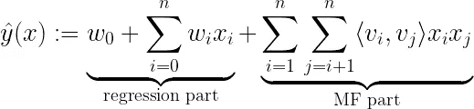

其中在学习期间需要估计的模型参数是:

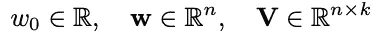

和⟨ ∙，⟩是两个向量 vᵢ和 vⱼof 大小ℝᵏ之间的点积，它们可以被看作是 v 中的行

当看一个如何表示被扔进这个模型的数据 x 的例子时，很容易理解这个等式的意义。让我们看看 Steffen Rendle 在关于因式分解机器的论文中描述的例子:

**假设有以下关于电影评论的交易数据，其中用户在某个时间对电影进行评级:**

*   用户 U∈U = {爱丽丝(A)，鲍勃(B)，。。。}
*   电影(item)I∈I = {泰坦尼克号(TI)，诺丁山(NH)，星球大战(SW)，星际迷航(ST)，。。。}
*   时间 t ∈ ℝ时的评级 r ∈ {1，2，3，4，5}

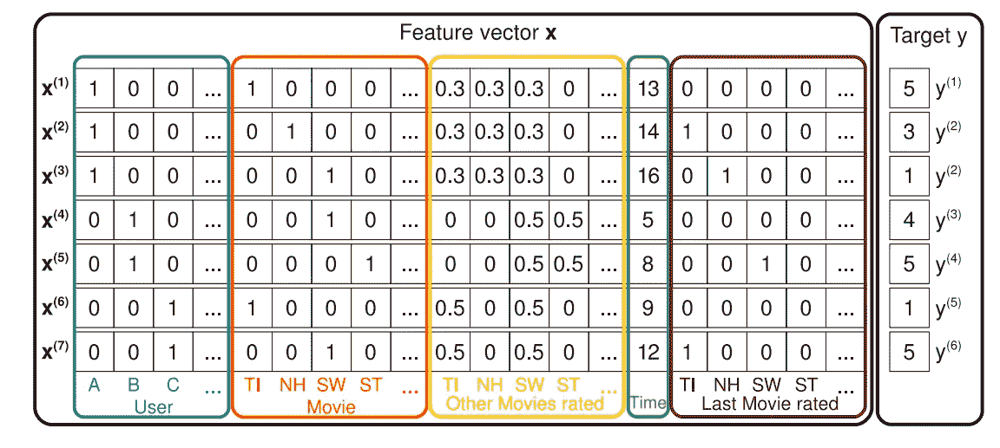

图 1，S. Rendle — 2010 年 IEEE 数据挖掘国际会议，2010-“因式分解机器”

查看上图，我们可以看到混合推荐模型的数据设置。表示用户和项目的稀疏特征以及任何附加的元信息或辅助信息(例如，在该示例中的“时间”或“最后评价的电影”)都是映射到目标 y 的特征向量 x 的一部分。现在关键是它们如何被模型处理。

*   FM 的回归部分像标准回归任务一样处理稀疏数据(例如“用户”)和密集数据(例如“时间”)，因此可以被解释为 FM 内基于内容的过滤方法。
*   FM 的 MF 部分现在考虑了特征块之间的交互(例如，“用户”和“电影”之间的交互)，其中矩阵 V 可以被解释为在协同过滤方法中使用的嵌入矩阵。这些跨用户-电影的关系为我们带来了如下见解:

> 与具有嵌入 vⱼ的另一个用户 j 具有相似的嵌入 vᵢ(表示他对电影属性的偏好)的用户 I 很可能喜欢与用户 j 相似的电影

将回归部分和 MF 部分的两个预测相加在一起并在一个成本函数中同时学习它们的参数导致混合 FM 模型，该模型现在使用“两全其美”的方法来为用户做出推荐。

乍一看，因子分解机器的这种混合方法似乎已经是一个完美的“两全其美”的模型，然而，正如 NLP 或计算机视觉等许多不同的人工智能领域在过去已经证明的那样:

> “把它扔进神经网络，你会让它变得更好”

# 2.广度和深度，神经协同过滤(NCF)和深度因子分解机器(DeepFM)

通过查看 NCF 的论文，我们将首先了解如何通过神经网络方法解决协同过滤，这将引导我们到深度因式分解机器(DeepFM ),它是因式分解机器的神经网络版本。我们将看到为什么它们优于常规 FMs，以及我们如何解释神经网络架构。我们将看到 DeepFM 是如何作为对谷歌之前发布的 Wide&Deep 模型的改进而开发的，这是深度学习在推荐系统中的第一次重大突破之一。这将最终把我们带到前面提到的脸书在 2019 年发布的 DLRM 论文，这可以被视为对 DeepFM 的简化和轻微调整。

## NCF

2017 年，一组研究人员发布了他们关于神经协同过滤的[工作](https://arxiv.org/pdf/1708.05031.pdf)。它包含一个通用的框架，用于学习用神经网络在协同过滤中通过矩阵分解建模的函数关系。作者还解释了如何实现更高阶的相互作用(MF 仅是 2 阶)以及如何将这两种方法融合在一起。

总的想法是，神经网络可以(在理论上)学习任何函数关系。这意味着协同过滤模型表达的与其 MF 的关系也可以被神经网络学习。NCF 为用户和项目提出了一个简单的嵌入层(类似于标准的 MF)，然后是一个直接的多层感知器神经网络，通过神经网络基本上学习两个嵌入之间的 MF 点积关系。

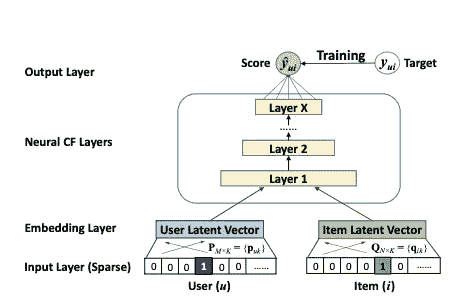

图 2 摘自何、廖、张、聂、胡、蔡志勇的《神经协同过滤》，2017 年第 26 届国际互联网大会论文集

这种方法的优点在于 MLP 的非线性。MF 中使用的简单点积总是将模型限制为学习 2 级交互，而具有 X 层的神经网络理论上可以学习更高级别的交互。想出三个相互作用的分类特征，比如男性、青少年和 RPG 电脑游戏。

在现实世界的问题中，我们不仅仅使用用户和项目二进制化向量作为我们嵌入的原始输入，而且显然包括各种其他可能有价值的元或辅助信息(例如，年龄、国家、音频/文本记录、时间戳等)，因此实际上我们有一个非常高维、高度稀疏和连续分类的混合数据集。在这一点上，图 2 中的上述神经网络也可以很好地解释为简单二进制分类前馈神经网络形式的基于内容的推荐。这种解释是理解它如何最终成为 CF 和基于内容的推荐之间的混合方法的关键。该网络实际上可以学习任何函数关系，因此可以在这里学习 3 阶或更高阶的 CF 意义上的相互作用，例如 x₁x₂x₃，或者形式σ( … σ(w₁x₁+w₂x₂ + w₃x₃ + b)的经典神经网络分类意义上的任何非线性变换。

配备了学习高阶相互作用的能力，通过将神经网络与众所周知的学习低阶相互作用的模型(因式分解机)相结合，我们可以特别地使我们的模型容易地学习 1 阶和 2 阶的低阶相互作用。这正是 DeepFM 的作者在论文中提出的观点。这种同时学习高阶和低阶特征交互的组合思想是许多现代推荐系统的关键部分，并且可以在行业中提出的几乎每个网络架构中以某种形式找到。

## DeepFM

DeepFM 是 FM 和深度神经网络之间的混合方法，两者共享相同的输入嵌入层。原始特征被转换，使得连续字段由其自身表示，而分类字段被一次性编码。由 NN 中的最后一层给出的最终(例如 CTR)预测被定义为:

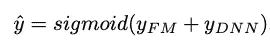

它是两个网络分量的 sigmoid 激活和:FM 分量和深度分量。

**FM 组件**是一个以神经网络架构风格装扮的常规因式分解机器:

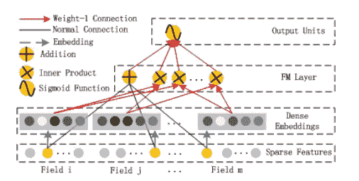

图 2 来自惠丰郭，唐瑞明，叶云明，，何秀强。基于因子分解机的神经网络用于 CTR 预测。arXiv 预印本 arXiv:1703.04247，2017。

FM 层的加法部分直接获得原始输入向量 x(稀疏要素层)，并在将它们相加之前将每个元素与其权重相乘(“正常连接”)。FM 层的内积部分也获得原始输入 x，但是仅在它们已经通过嵌入层之后，并且简单地获得嵌入向量之间没有任何权重的点积(“权重-1 连接”)。通过另一个“权重-1 连接”将这两部分加在一起，得到前面提到的 FM 等式:

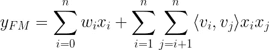

这个方程中的 xᵢxⱼ乘法只需要能够写出 i=1 到 n 的和，它并不是神经网络计算的一部分。由于嵌入层结构，网络自动知道 vⱼvᵢ的哪个嵌入向量之间取点积。

该嵌入层架构如下所示:

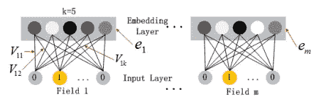

图 4 郭惠峰、唐瑞明、叶云明、、何秀强。基于因子分解机的神经网络用于 CTR 预测。arXiv 预印本 arXiv:1703.04247，2017。

其中 Vᵖ是具有 k 列和多少行的每个场 p={1，…，m}的嵌入矩阵，该场的二进制版本具有元素。嵌入层的输出因此被给定为:

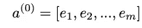

需要注意的是，这不是一个完全连接的图层，也就是说，任何字段的原始输入和任何其他字段的嵌入之间都没有联系。可以这样想:用于性别的独热编码向量(例如(0，1))不能与用于工作日的嵌入向量(例如(0，1，0，0，0，0，0)原始二进制化的工作日“星期二”)有任何关系，并且它的嵌入向量具有例如:k = 4；(12,4,5,9)).

作为因式分解机的 FM 分量反映了 1 阶和 2 阶相互作用的高度重要性，它们被直接添加到深度分量输出中，并被馈送到最终层中的 sigmoid 激活中。

**深度组件**被提议为理论上的任何深度神经网络架构。作者特别关注了常规的前馈 MLP 神经网络(以及所谓的 PNN)。下图给出了常规 MLP:

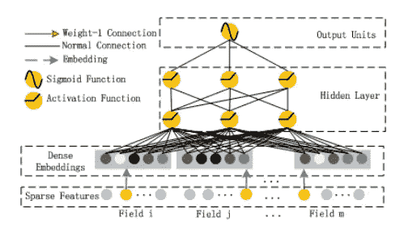

图 3 来自惠丰郭，唐瑞明，叶云明，，何秀强。基于因子分解机的神经网络用于 CTR 预测。arXiv 预印本 arXiv:1703.04247，2017。

一个标准 MLP 网络，在原始数据(由于一个热编码分类输入而高度稀疏)和以下神经网络层之间具有嵌入层，如下所示:

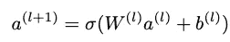

σ表示激活函数，W 表示权重矩阵，a 表示来自前一层的激活，b 表示偏差。

这就产生了整个 DeepFM 网络架构:

使用参数:

*   潜在向量 Vᵢ，用于测量特征 I 与其他特征(嵌入层)交互的影响
*   Vᵢ被传递给 FM 组件以模拟 2 阶交互(FM 组件)
*   wᵢ加权原始特征 i (FM 分量)的 1 阶重要性
*   Vᵢ还被传递到深层组件，以模拟所有高阶交互(> 2)(深层组件)
*   Wˡ和 bˡ，神经网络的权重和偏差(深层组件)

同时获得高阶和低阶交互的关键是在一个成本函数下同时训练所有参数，特别是对 FM 和深度分量使用相同的嵌入层。

## 与 Wide&Deep 和 NeuMF 的比较

关于如何调整这种架构以使其变得更好，人们可以想象出许多变化。然而，在核心上，它们在如何同时模拟高阶和低阶相互作用的混合方法上都是相似的。DeepFM 的作者还提出用所谓的 PNN 交换 MLP 部分，这是一种深度神经网络，它将 FM 层作为初始输入与嵌入层相结合

NCF 论文的作者也提出了一个类似的架构，他们称之为 NeuMF(“神经矩阵分解”)。他们没有使用 FM 作为低阶分量，而是将常规矩阵分解输入到激活函数中。然而，这种方法缺乏由 FM 的线性部分模拟的特定的 1 阶相互作用。此外，作者特别允许模型学习矩阵分解以及 MLP 部分的不同用户和项目嵌入。

如前所述，谷歌的研究团队是最早提出混合推荐方法神经网络的团队之一。DeepFM 可以被认为是 Google 的 Wide&Deep 算法的进一步发展，如下所示:

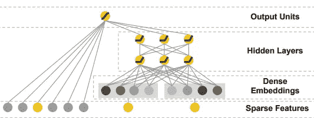

图 1 来自郑恒泽、利万特·科奇、耶利米·哈姆森、塔尔·沙克德、图沙尔·钱德拉、赫里希·阿拉德耶、格伦·安德森、格雷戈·科拉多、柴蔚、穆斯塔法·伊斯皮尔、罗汉·阿尼尔、扎卡里亚·哈克、李潺·洪、维汉·贾恩、刘小兵和赫马尔·沙阿。推荐系统的广度和深度学习。进行中。第一届推荐系统深度学习研讨会，第 7–10 页，2016。

右侧是我们众所周知的带有嵌入层的 MLP，而左侧是不同的手动设计的输入，这些输入直接馈入最终的整体输出单元。点积运算形式的低阶交互隐藏在这些人工设计的特征中，作者说这些特征可以是许多不同的东西，例如:

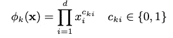

其通过将 d 个特征彼此交叉相乘(如果 xᵢ是第 k 个变换的一部分，则指数等于 1)来捕获 d 个特征之间的交互(有或没有另一个先前嵌入)。

很容易看出 DeepFM 是一种改进，因为它不需要任何先验特征工程，并且能够从完全相同的输入数据中学习低阶和高阶交互，这些输入数据共享一个公共嵌入层。DeepFM 实际上将 FM 模型作为其核心网络的一部分，而 Wide&Deep 并不将点积计算作为实际神经网络的一部分，而是预先在特征工程步骤中进行。

# 3.DLRM——深度学习推荐模型

因此，从谷歌、华为(围绕 DeepFM 架构的研究团队)和其他公司的所有这些不同选择中，让我们看看脸书是如何看待事情的。他们在 2019 年发表了他们的 DLRM 论文，该论文非常关注这些模型的实用方面。并行训练设置、GPU 计算以及对连续和分类特征的不同处理。

下图描述了 DLRM 架构，其工作方式如下:分类特征各自由一个嵌入向量表示，而连续特征由 MLP 处理，因此它们与嵌入向量具有相同的长度。现在在第二阶段，计算嵌入向量和处理过的(MLP 输出)密集向量的所有组合之间的点积。之后，点积与密集要素的 MLP 输出连接，并通过另一个 MLP，最后进入 sigmoid 函数以给出概率。

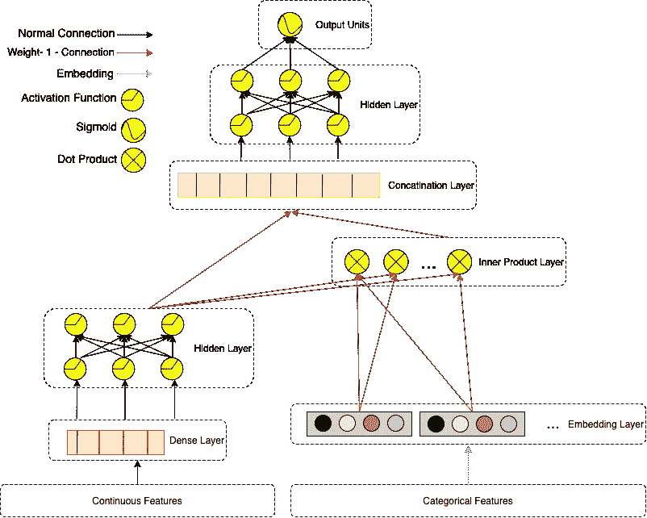

由 [DLRM](http://arxiv.org/abs/1906) 描述的 DLRM 网络。马克斯·贝克尔斯的数字。

DLRM 的建议在某种程度上是 DeepFM 的简化和修改版本，因为它也使用嵌入向量之间的点积计算，但它特别试图通过不直接强制嵌入的分类特征通过 MLP 层来远离高阶交互。这种设计是为了模仿因式分解机器计算嵌入之间二阶相互作用的方式而定制的。我们可以把整个 DLRM 系统看作是 DeepFM 的专门部分，FM 组件。DeepFM 的经典深度分量在 DeepFM 的最后一层中被添加到 FM 分量的输出中(然后被馈送到 sigmoid 函数中),可以被视为在 DLRM 设置中被完全省略。DeepFM 的理论优势是显而易见的，因为通过设计，它可以更好地学习高阶相互作用，然而根据脸书的说法:

> “……在其他网络中发现的二阶以上的高阶相互作用不一定值得额外的计算/存储成本”

# 4.前景和编码

在介绍了各种深度推荐方法、它们的直觉以及优缺点之后，理论上，我在脸书的 GitHub 页面上查看了提议的 DLRM 的 [PyTorch 实现](https://github.com/facebookresearch/dlrm)。

我查看了实现的细节，并尝试了他们内置的预定义数据集 API，以直接处理不同的原始数据集。Criteo 的[ka ggle display advertising challenge](https://labs.criteo.com/2014/02/kaggle-display-advertising-challenge-dataset/)和他们的[TB 级数据集](https://labs.criteo.com/2013/12/download-terabyte-click-logs/)都是预实现的，可以下载并随后用于训练一个完整的 DLRM，只需一个 bash 命令(参见 DLRM repo 的说明)。然后，我扩展了脸书的 DLRM 模型 API，以包括另一个数据集的预处理和数据加载步骤，即 [2020 DIGIX 广告 CTR 预测](https://www.kaggle.com/louischen7/2020-digix-advertisement-ctr-prediction)。请点击查看[。](https://github.com/mabeckers/dlrm/blob/new_dataset/data_preprocess_digix.py)

在下载并解压缩 digix 数据后，以类似的方式，您现在也可以使用一个 bash 命令在该数据上训练一个模型。所有预处理步骤、嵌入的形状和神经网络架构参数都针对处理 digix 数据集进行了调整。带你浏览命令的笔记本可以在[这里](https://github.com/mabeckers/dlrm/blob/new_dataset/Train_DLRM_Digix.ipynb)找到。该模型提供了一些不错的结果，因为我正在继续研究它，通过更好地理解原始数据和 digix 数据背后的广告流程来提高性能。具体的数据清理、超参数调整和特征工程都是我想进一步研究的内容，并在[笔记本](https://github.com/mabeckers/dlrm/blob/new_dataset/Train_DLRM_Digix.ipynb)中提到。第一个目标只是拥有一个技术上可靠的 DLRM 模型 API 的扩展，它可以使用原始的 digix 数据作为输入。

总而言之，我相信混合深度模型是解决推荐任务最有力的工具之一。然而，最近出现了一些非常有趣和创造性的无监督方法，使用[自动编码器](https://arxiv.org/pdf/1802.05814.pdf)解决协同过滤问题。所以在这一点上，我只能猜测大型互联网巨头今天使用什么来提供我们最有可能点击的广告。我假设它很可能是前面提到的自动编码器方法以及本文中介绍的某种形式的深度混合模型的组合。

# 参考

斯蒂芬·伦德尔。因式分解机。进行中。2010 年 IEEE 数据挖掘国际会议，995–1000 页，2010 年。

贺湘南，廖，汉王张，，聂，，蔡达生。神经协同过滤。进行中。第 26 届国际。糖膏剂环球网，第 173–182 页，2017。

郭慧峰，唐瑞明，叶云明，，何秀强。一个基于因子分解机的神经网络用于 CTR 预测。arXiv 预印本 arXiv:1703.04247，2017。

连建勋、周小欢、张辅政、陈忠霞、谢星和。xDeepFM:结合推荐系统的显式和隐式特征交互。进行中。第 24 届 ACM SIGKDD 知识发现和数据挖掘国际会议，第 1754–1763 页。ACM，2018。

Cheng-Tze Cheng、Levent Koc、Jeremiah Harmsen、Tal Shaked、Tushar Chandra、Hrishi Aradhye、Glen Anderson、Greg Corrado、、Mustafa Ispir、Rohan Anil、Zakaria Haque、Hong、Jain、和 Hemal Shah。推荐系统的广度和深度学习。进行中。第一届推荐系统深度学习研讨会，第 7–10 页，2016。

米（meter 的缩写））Naumov、D. Mudigere、H. M. Shi、J. Huang、N. Sundaraman、J. Park、X. Wang、U. Gupta、C. Wu、A. G. Azzolini、D. Dzhulgakov、A. Mallevich、I. Cherniavskii、Y. Lu、R. Krishnamoorthi、A. Yu、V. Kondratenko、S. Pereira、X. Chen、W. Chen、V. Rao、B. Jia、L. Xiong 和 M. Smelyanskiy【在线】。可用:[http://arxiv.org/abs/1906.](http://arxiv.org/abs/1906.)00091[39]