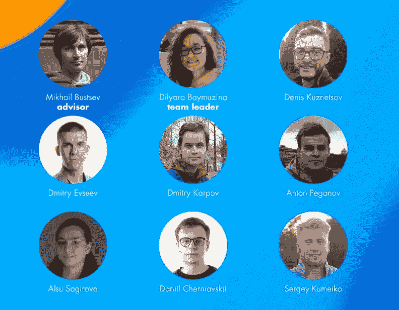
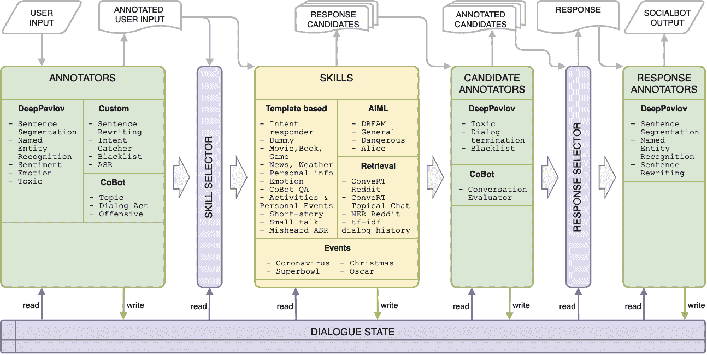
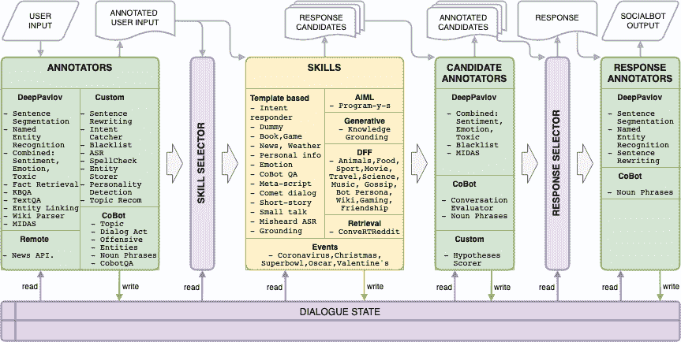

# Alexa 奖中的模块化梦想社交机器人

> 原文：<https://towardsdatascience.com/modular-dream-socialbot-in-alexa-prize-7d83cc9d4d3a?source=collection_archive---------26----------------------->

## 一个开源对话系统项目的介绍和演练

2019 年春天，在 [Mikhail Burtsev](https://scholar.google.com/citations?user=t_PLQakAAAAJ&hl=en) 的带领下，一队来自莫斯科物理技术学院(MIPT)的学生被选中参加来自亚马逊的 [Alexa Prize Challenge 3](https://developer.amazon.com/alexaprize) 。这是正式开始的[梦想社交机器人](https://deeppavlov.ai/dream)的发展，它现在还活着，已经 2 岁了。我们在 Alexa Prize Challenge 3 的旅程在半决赛后于 2020 年 5 月结束，因为我们不幸没有被选中进入决赛。但是我们设法使用开源的 DeepPavlov 代理框架创建了我们的第一个 DREAM socialbot 版本。在半决赛后，我们花了 4 个月的时间添加对知识图(KGs)工作的支持，目标是在 2020 年下半年最终开源整个机器人。然而，在 9 月下旬，亚马逊宣布了 Alexa Prize Challenge 4，我们的应用程序再次自豪地被选中参与。竞争非常激烈，虽然我们进入了半决赛，但遗憾的是我们没有进入决赛。无论如何，我们从这 2 年在生产开发中运行 socialbot 中学到了很多，我们准备与感兴趣的读者分享我们的知识，所以我们正在开始一系列关于梦想 socialbot 的文章。

来自 Alexa 奖挑战 4 的梦之队。

对话系统主要有两种分类:

1.  面向任务和闲聊，
2.  开域和闭域。

面向任务的系统以完成某项任务为目标来进行对话，例如，预订机票或预定餐桌。聊天系统旨在进行没有特殊对话目的的聊天。对话系统的域决定了对话的话题限制，因此封闭域系统只覆盖一个或几个话题，而开放域系统可以就任何话题进行对话。

> 因此，由于参与 Alexa Prize Challenge 的 socialbots 应该能够支持各种流行话题的对话，根据定义，它们是*开放域聊天对话系统*。

对话系统的另一个重要特征是体系结构，它基本上分为整体式和模块化系统。整体(或端到端)对话系统是一种处理输入并返回与对话上下文相关的最终响应的模型。这样的对话系统可解释性低，几乎不可控。鉴于模型的规模受限于资源和最大响应时间，该模型最初不能很好地覆盖开放领域对话并同时具有丰富的词汇。因此，现在大多数对话系统都具有模块化架构，包含许多不同的基于规则、机器学习和深度学习的模型。

DREAM Socialbot 是一个模块化的对话系统，使用开源的 DeepPavlov Agent 框架实现。原始 DREAM socialbot 的整体结构如下图所示。

Alexa 奖挑战赛 3 结束时的梦想社会机器人架构。图片来自[技术报告](https://d7qzviu3xw2xc.cloudfront.net/alexa/alexaprize/assets/pdf/sgc3/Moscow-DREAM.pdf)

对应于 DeepPavlov 代理架构有几个主要部分:*标注器、技能选择器、技能、响应选择器、对话状态*。最初，用户输入话语由许多自然语言理解(NLU)模型处理，这些模型也被称为注释器，包括*不同的校正、分类和标记组件*。考虑到对话状态和当前用户话语注释，技能选择器挑选出将尝试为当前上下文生成响应的技能列表。有超过 *2 打检索和基于规则的技能*。

> 有趣的是，我们试图集成一个生成序列到序列的神经模型，但由于其不可预测性和低控制机会，它没有向用户发布。

所有选择的技能都返回一个、几个或零个候选答案，这些答案将被标注做出最终选择所必需的信息。响应选择器过滤掉不合适的候选响应，应用手写试探法，并使用经验公式来选择最终响应。之后，可以使用用户名(如果知道的话)扩展响应，并使用特殊的链接问题来进一步展开对话。所有组件都可以访问对话状态，该状态存储了对话历史，其中包含每个话语的注释，甚至候选人响应，以及关于社交机器人和用户个性的结构化信息。模块化架构允许不同的开发人员分别开发组件，这加快了开发过程，并让所有团队成员都参与进来。

> 梦之队使用了 DeepPavlov 代理框架，而所有其他团队都在亚马逊的私有 CoBot 框架之上构建他们的 socialbots。一般来说，很多努力都致力于 DeepPavlov 代理的适应、部署和分析工具、检索中的基本内容和基于规则的技能。

在 Alexa Prize Challenge 3 之后，我们的团队打算开源我们的梦想社交机器人。我们花了整个 2020 年夏天来适当地启动这一进程，重点是构建 CoBot 服务的替代品，特别是构建一个开源机制，使用我们在 2020 年 5 月在 DeepPavlov 库中发布的全新 KBQA 组件来回答事实问题。虽然我们已经成功地只用开源组件构建了一个新版本的 socialbot，但我们只能在 2020 年 9 月 5 日之前在我们的 [demo.deeppavlov.ai](https://demo.deeppavlov.ai/) 网站上提供一个演示聊天机器人。虽然我们有更大的计划，但令人惊讶的是亚马逊宣布了 Alexa Prize Challenge 4，由于之前疫情推迟了之前的挑战，它的开始时间较短。因此，没有足够的时间来仔细重构 socialbot，我们决定将梦想 socialbot 的发布推迟到挑战 4 的结束。这个计划给了我们一个机会，让我们更专注于 socialbot 的内容和胆量，并开源了一个更好的版本，尽管比原计划晚了一年。

Alexa Prize Challenge 4 中的 DREAM Socialbot 因此基于原始 DREAM Socialbot 的最终版本，并在去年夏天进行了改进。虽然其中一些改进，如更换基本的 CoBot 分类器，在挑战赛期间被暂时取消，因为我们可以访问更新的服务，但我们在知识图(KGs)上的工作成为去年夏天对我们新的 DREAM Socialbot 的主要贡献。由于模块化架构，这很容易做到，所以 KGs 成为了注释器的一部分。前一年版本中的一些技能利用远程 API 来获取一些有用的信息。我们也将这个知识收集过程作为注释者之一。这给了我们一个在所有技能之间分享结构化知识的机会。

主要目标之一是扩展社交机器人的内容。此外，通过分析去年的技术报告，我们还得出结论，仍然没有比基于脚本的对话更好的对话一致性控制。因此，我们参与 Alexa Prize Challenge 4 的主要成果之一是开发和发布了[对话流框架](https://github.com/deepmipt/dialog_flow_framework)(DFF)——一个用于脚本对话系统开发的开源框架。DFF 给了我们一个机会，让我们摆脱特定主题的检索技能，转而使用脚本化的特定主题技能，这种技能至少能给人留下几轮连贯对话的印象。模块化架构允许技术人员利用来自标注器的所有可用信息，从用户话语分类到提取的实体和检索的知识。

Alexa 奖挑战赛 4 结束时的梦想社会机器人架构。图片来自[技术报告](https://d7qzviu3xw2xc.cloudfront.net/alexa/alexaprize/docs/sgc4/MIPT-DREAM.pdf)

总之，在 DeepPavlov 代理框架内实现的对话系统的模块化架构允许我们:

1.  由不同的开发者进行不同组件的单独开发，
2.  利用来自所有组件中注释器的所有可用信息，
3.  结合不同来源的独立技能(结构、框架)，
4.  在同一级别的并行组件中运行。

AI 助手模块的独立、单独开发和并行执行对比赛来说都非常重要，允许我们有效地使用所有可用的人力和计算资源。

顺便说一下，DeepPavlov 代理架构非常高效，能够承受生产中对话系统所必需的高负载。下一篇文章将专门讨论 DeepPavlov 代理的异步管道，它的特性、优点和缺点。稍后我们还将详细介绍 DREAM socialbot 的结构和组件、对话流框架、我们的开发流程和功能，以及许多见解和技巧。敬请期待！

你可以在我们的官方[博客](https://medium.com/deeppavlov)上阅读更多关于 DeepPavlov 生态系统的信息。此外，请使用我们的[演示](http://demo.deeppavlov.ai/?utm_source=medium&utm_medium=article&utm_campaign=tf)来测试我们基于 BERT 的模型。请在 [Github 页面](https://github.com/deepmipt/DeepPavlov)上为⭐️美国星。别忘了 DeepPavlov 有一个专门的[论坛](https://forum.deeppavlov.ai/)，欢迎任何关于框架和模型的问题。