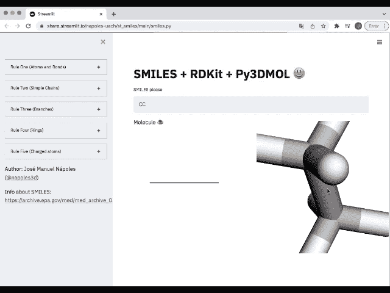
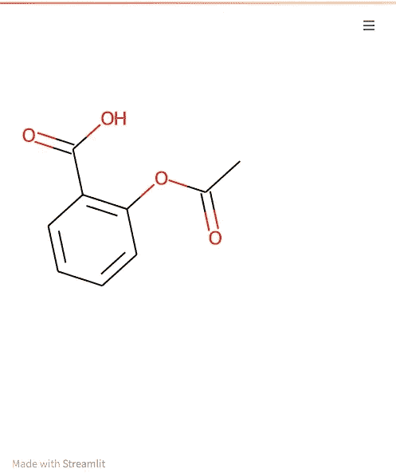

# 使用 RDKit 和 Py3DMol 在 Streamlit 中进行分子可视化

> 原文：<https://towardsdatascience.com/molecular-visualization-in-streamlit-using-rdkit-and-py3dmol-4e8e63488eb8?source=collection_archive---------11----------------------->

## 第 1 部分:RDKit



Streamlit 中的 RDKit 和 Py3DMol。图片作者。

## 1.介绍

在我知道[Streamlit](https://streamlit.io/)【1】后不久，我的[第一个问题](https://jnapoles.medium.com/is-it-possible-to-use-streamlit-to-visualize-molecules-b4e29700f61c)【2】是，如何可能部署分子结构？在这篇文章和下一篇文章中，我将把我所学到的贡献出来，希望这对其他人有所帮助。

在这个由两部分组成的系列中，我将重点介绍两个流行的库，RDKit 和 Py3Dmol。第一种广泛用于分析化合物，并在 2D 用图形表示分子。第二个是渲染 3D 结构的极好选择，从分子到像蛋白质或病毒这样的大分子，还有电子密度的 3D 网格。

第一篇文章应该简短明了，我不打算深入探讨 Streamlit 更复杂的用法。为此，我建议访问[论坛](https://discuss.streamlit.io/)【3】并查看[文档](https://docs.streamlit.io/)【4】。如果您不了解 Streamlit，它是一个很好的框架，可以从 python 脚本快速开发令人印象深刻的 web 应用程序。

## 2.安装必备库。

所以，让我们从安装库开始。我假设您已经安装了 Streamlit 如果没有，请执行以下操作:

```
pip install streamlit
```

这里我们将使用 RDkit 的 pip 可安装版本，我们可以这样安装它:

```
pip install rdkit-pypi
```

顺便提一下，在 google Colab 上安装 *rdkit-pypi* 也能很好地工作，这对于原型开发来说非常好。您可能还希望以 RDKit 处理 PIL 对象的相同方式安装 Pillow，尽管这不是强制性的。

## 3.构建应用程序。

使用 Streamlit 的最大优势是，只需几行 python 代码，您就可以拥有一个工作的 web 应用程序。下面是快速开始使用 RDKit 的最少代码:

对于不熟悉 RDKit 的，我简单解释一下。在第 6 行中，我们定义了一个[微笑字符串](https://www.daylight.com/smiles/)，其中原子和键由 ASCII 字符表示。在这个例子中，分子是阿司匹林。其他例子有:

*   乙醇 CCO
*   乙酸 CC(=O)O
*   环己烷 C1CCCCC1
*   吡啶 c1cnccc1

第 7 行从微笑构建了一个 mol 对象，第 8 行创建了一个 PIL 对象，最后在第 10 行由 Streamlit 用 *st.image()* 显示。生成的最小 web 应用程序如下所示:



在 Streamlit 中使用 RDKit 的简单示例的屏幕截图。图片由作者提供。

或者，您可以将第 8 行替换为:

```
Draw.MolToFile(m,’mol.png’)
```

这将把 mol 对象写成 png 图像，您可以使用

```
st.image('mol.png')
```

当然，您可能希望通过使用 Streamlit 小部件在 web 应用程序中包含更多的交互性。尝试添加一个文本字段来输入微笑字符串，或者使用滑块来查看多个分子！！您还希望看到哪些其他用例？？

## 4.在 Streamlit 云上托管它！

如果您使用的是 [Streamlit Cloud](https://streamlit.io/cloud) [5】，那么在 github repo 中需要一个 packages.txt 文件，只有一行“libxrender1”。这是从经验中学到的东西，没有记录下来，但是最终人们会发现在日志文件中需要它。

此外，您可以使用 rdkit-pypi 和 Pillow 添加一个“requirements.txt”文件:

仅此而已。你可以在这里看到这个小项目[的回购。这是共享应用程序的最佳方式。](https://github.com/napoles-uach/Medium_Mol) [Streamlit Cloud](https://streamlit.io/cloud) 提供社区层(免费！！)来托管您的 web 应用程序。因此，如果您打算使用 Streamlit，您将会爱上这项服务。请点击此处查看示例应用的发布版本:

[https://share . streamlit . io/napoles-uach/medium _ mol/main/app 1 . py](https://share.streamlit.io/napoles-uach/medium_mol/main/app1.py)

## 5.结论。

这样，你就可以建立更复杂的分子可视化了。在本系列的第二部分，我将向您展示我在 Streamlit 中使用 Py3DMol 时学到的一些技巧。

最后，我邀请你来参加[论坛](https://discuss.streamlit.io/)，打个招呼，并使用 Streamlit 和 RDKit 向我们展示你的创作！！第二部见！！

## 6.致谢。

我要感谢伟大的[数据教授](https://www.youtube.com/dataprofessor)Chanin Nantasenamat，感谢他在撰写这篇文章时的善意建议。

如果你喜欢这篇文章，可以考虑订阅邮件列表:

[](https://jnapoles.medium.com/subscribe) [## 每当 joséMANUEL náPOLES du arte 发表文章时都会收到电子邮件。

### 每当 joséMANUEL náPOLES du arte 发表文章时都会收到电子邮件。通过注册，您将创建一个中型帐户，如果您…

jnapoles.medium.com](https://jnapoles.medium.com/subscribe) 

## 参考资料:

[1][https://streamlit.io/](https://streamlit.io/)

[2][https://jna poles . medium . com/is-it-possible-to-use-streamlit-visualize-molecules-b4e 29700 f61c](https://jnapoles.medium.com/is-it-possible-to-use-streamlit-to-visualize-molecules-b4e29700f61c)

[3][https://discuss.streamlit.io/](https://discuss.streamlit.io/)

[4]https://docs.streamlit.io/

[5]https://streamlit.io/cloud

[6][https://github.com/napoles-uach/Medium_Mol](https://github.com/napoles-uach/Medium_Mol)