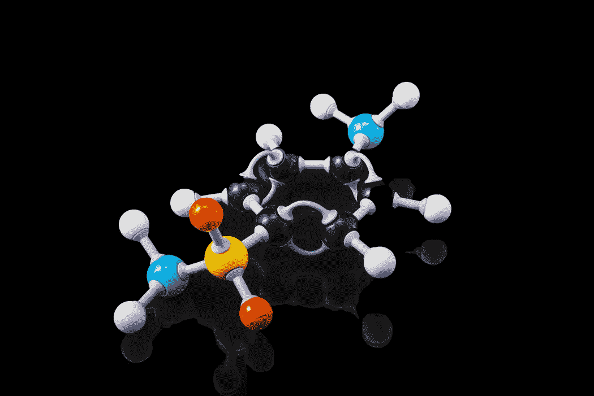

# 分子网络第 1 部分:化学和生命科学中深度学习的数据集

> 原文：<https://towardsdatascience.com/moleculenet-part-1-datasets-for-deep-learning-in-the-chemical-and-life-sciences-b86960d1ee22?source=collection_archive---------21----------------------->



从 [Unsplash](https://unsplash.com/photos/RflgrtzU3Cw)

## [思想和理论](https://towardsdatascience.com/tagged/thoughts-and-theory)

## *迈向分子机器学习的“图像网络时刻”*

*本文由 DeepChem 的 Bharath Ramsundar 共同撰写。*

*基准数据集是机器学习进步的重要驱动力。与计算机视觉和自然语言处理不同，化学和生命科学中数据集的多样性和复杂性使这些领域在很大程度上抵制了制定社区广泛接受的基准的尝试。在这篇文章中，我们将展示如何向分子机器学习的*[*MoleculeNet*](http://moleculenet.ai/)*基准添加数据集，并通过*[*deep chem*](https://deepchem.io/)*API 以编程方式访问它们。*


图片来自 [moleculenet.ai](http://moleculenet.ai/) 。

**分子 ML 数据集策展**

MoleculeNet[1]收集六个主要类别的数据集:量子力学、物理化学、蛋白质、生物物理学、生理学和材料科学。MoleculeNet 的[“第一代”展示了分子 ML 基准可能的样子，并揭示了一些有趣的趋势，这些趋势涉及数据稀缺、类不平衡以及物理感知特征在一些数据集的模型架构上的力量。](https://pubs.rsc.org/--/content/articlehtml/2018/sc/c7sc02664a)

涵盖分子 ML 的整个广度和深度并不容易，因此 MoleculeNet 正在发展成为一个灵活的框架，以标准化的方式贡献数据集和基准模型性能，由 [DeepChem](https://github.com/deepchem/deepchem) 提供支持。

**我们为什么要关注性能指标评测？**

图像和语音识别*看起来*像是巨大的任务，但与我们在物理、化学和生物中看到的问题相比，它们真的非常简单。这就是为什么相对来说很少看到有人声称物理或生命科学中的问题已经被机器学习“解决”了。更好的数据集、数据集生成方法和稳健的基准是分子机器学习进展的必要因素，甚至可能比发明新的深度学习技巧或架构更重要。

在深度学习的许多子领域，标准的进展途径是这样的

1.选择一个广泛使用的基准数据集 **(** 例如[ImageNet](http://www.image-net.org/) ， [CIFAR-10](https://www.cs.toronto.edu/~kriz/cifar.html) ，或者 [MNIST](http://yann.lecun.com/exdb/mnist/) )。

2.开发并测试一个模型架构，该架构在基准测试的某些方面达到“最先进”的性能。

3.想出一个特别的“理论”解释，来解释为什么你的特定架构优于其他架构。

4.在顶级会议上发布您的结果。

如果你幸运的话，在下一个 SOTA 建筑问世之前，其他研究人员甚至可能会使用你的模型或在此基础上进行他们自己的研究。这种范式存在明显的问题，包括数据集中的[偏差](https://arxiv.org/pdf/1908.09635.pdf)、[分布偏移](http://d2l.ai/chapter_multilayer-perceptrons/environment.html#types-of-distribution-shift)，以及[古德哈特-斯特拉森定律](https://en.wikipedia.org/wiki/Goodhart%27s_law) —当一个指标成为目标时，它就不再是一个好的指标。尽管如此，毫无疑问，基准测试提供了一种明确的目的，并激发了其他领域所缺乏的对机器学习研究的兴趣。

也许更重要的是，基准测试鼓励和奖励研究人员创建高质量的数据集，这在许多领域一直没有得到应有的重视。基准数据集能够实现惊人的突破，如 DeepMind 的 AlphaFold(阿尔法折叠)通过几十年的努力组装高分辨率蛋白质结构(T7)而成为可能。AlphaFold 代表了蛋白质折叠中的一种“ [ImageNet moment](https://ruder.io/nlp-imagenet/) ”，这意味着一个问题在某种意义上被“解决”了。

[MoleculeNet](http://moleculenet.ai/) 包含数十万种化合物和测量/计算的特性，所有这些都可以通过 [DeepChem API](https://deepchem.readthedocs.io/en/latest/api_reference/moleculenet.html) 访问。它带来了 ML 会议中流行的传统评估框架的味道，但也提供了贡献和访问新数据集的标准化方法。

**向 MoleculeNet 提供数据集**

数据集贡献已得到显著简化，并且[已记录](https://deepchem.readthedocs.io/en/latest/api_reference/moleculenet.html)。第一步是在 DeepChem repo 中的 GitHub 上打开一个[问题](https://github.com/deepchem/deepchem/issues)来讨论您想要添加的数据集，强调该数据集涵盖哪些独特的分子 ML 任务，这些任务尚未成为 MolNet 的一部分。如果您自己创建或管理了一个数据集，这是一个与 molecular ML 社区共享它的好方法！接下来，您需要

*   写一个继承自`[deepchem.molnet.load_function.molnet_loader._MolnetLoader](https://github.com/deepchem/deepchem/blob/master/deepchem/molnet/load_function/molnet_loader.py#L82)`的`DatasetLoader`类。这包括记录数据集的任何特殊选项和 ML 的目标或“任务”。
*   实现一个`create_dataset`函数，通过应用可接受的特征、拆分器和转换来创建一个 DeepChem `Dataset`。
*   编写一个`load_dataset`函数来记录数据集，并为用户加载数据集提供一个简单的方法。

QM9 MolNet 加载器源代码是编写自己的 MolNet 加载器的一个很好的、简单的起点。

该框架允许数据集直接在 ML 管道中使用任何合理的特征组合(将 SMILES 字符串之类的原始输入转换为机器可读格式)、拆分器(控制如何构建训练/验证/测试集)和转换(*，例如*，如果目标需要在训练之前被规范化)。

[分割线](https://deepchem.readthedocs.io/en/latest/api_reference/splitters.html)在这里尤为重要。在比较不同模型在相同任务上的表现时，每个模型“看到”相同的训练数据并根据相同的数据进行评估是至关重要的。我们还想知道一个模型在相似的样本上的表现如何(使用随机训练/val/测试分割)，以及在不同的样本上的表现如何(*例如*，使用基于化学子结构的分割)。

**使用 DeepChem API 访问数据集**

MolNet 加载器使访问数据集*和为 ML* 预处理数据集成为可能，只需一行 Python 代码:

```
from deepchem.molnet.load_function.qm9_datasets import load_qm9tasks, (train, val, test), transforms = load_qm9()
```

要通过 DeepChem API 实际使用数据集，您只需向 DeepChem 开发人员提供一个 tarball 或压缩文件夹，他们会将其添加到 DeepChem AWS S3 存储桶中。最后，[为您的加载器和数据集添加文档](https://deepchem.readthedocs.io/en/latest/api_reference/moleculenet.html)。

**我们需要您的数据集！**

在看了 MoleculeNet 中长长的数据集列表后，你可能会发现缺少了一些关键的东西。好消息是你(对，就是你！)可以贡献新的数据集！如果你对 Python 编程不太熟悉，你可以在 GitHub 上打开一个[问题](https://github.com/deepchem/deepchem/issues)，包括为什么要将数据集添加到 MolNet 的信息，并向 DeepChem 开发人员寻求帮助。如果你喜欢编程，那就更好了——你可以按照上面概述的步骤做点贡献。

开源基准的真正力量在于任何人都可以做出贡献；这使得 MolNet 的发展和扩展超出了单个研究小组所能支持的范围。

**下一步:分子 ML 模型性能**

在下一篇文章中，我们将讨论如何使用 DeepChem 和 MolNet 脚本为 ML 模型添加性能指标。

**取得联系**

*如果你喜欢这个教程或者有任何问题，请随时通过* [*电子邮件*](mailto:n.frey@seas.upenn.edu) *联系内森，或者连接上*[*LinkedIn*](https://www.linkedin.com/in/ncfrey)*和*[*Twitter*](https://twitter.com/nc_frey)*。*

*你可以在他的* [*网站*](https://ncfrey.github.io/) *上找到更多关于内森的项目和出版物。*

*感谢吴对本文的反馈。*

**参考文献**

[1] DOI: 10.1039/C7SC02664A(边缘文章)化学。Sci。, 2018, 9, 513–530