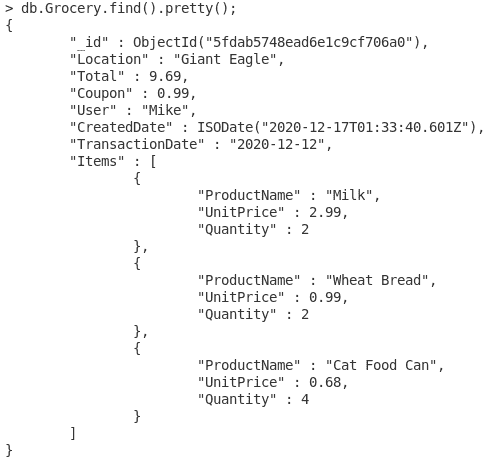
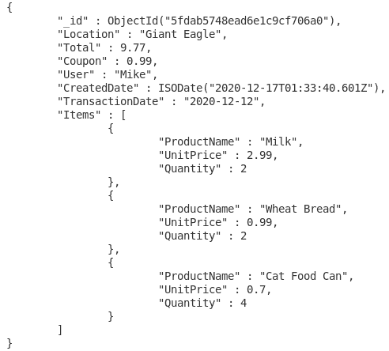
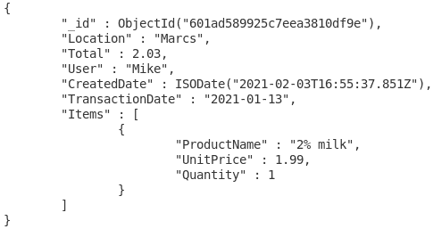
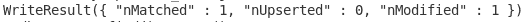
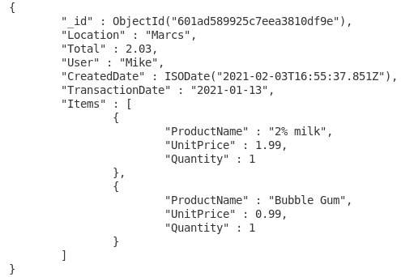
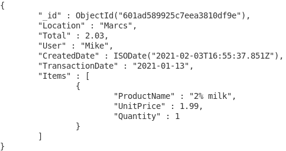
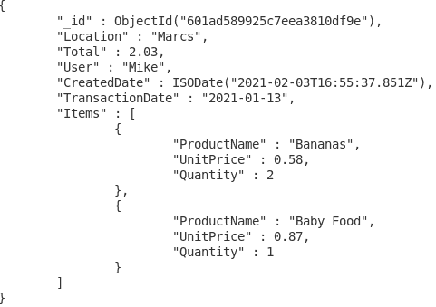

# MongoDB:从安装到实现

> 原文：<https://towardsdatascience.com/mongodb-270838af41bf?source=collection_archive---------17----------------------->

## 第 5 部分介绍如何使用和充分利用 MongoDB


马库斯·斯皮斯克在 [Unsplash](https://unsplash.com?utm_source=medium&utm_medium=referral) 上的照片

# MongoDB 前情提要

[在第四部分](/mongodb-3f605f8533a0)中，我们为 MongoDB 集合设置了插入和删除端点。我们使用 pymongo 和 pydantic 的组合实现了这一点。在连接到数据库之后，我们使用 FastAPI 端点来传递新记录，以便插入到数据库中，或者传递要删除的 ID。为了测试，我们使用了 Postman。

# **这次在 MongoDB 上**

考虑了一会儿之后，我决定如何创建更新端点。回忆更新比简单地选择要更新的项目要稍微困难一些，因为我们已经在几个集合中嵌入了集合。请注意，在嵌入式集合的情况下，这可能不是最简单的解决方案，甚至不是执行更新的正确方式。这只是我的研究和发现。如果你对如何比我的解决方案更有效地执行更新有想法，我很乐意了解更多，所以请在评论中分享。现在，我们必须先学习如何在 MongoDB 中更新。

# **更新 MongoDB 中的集合**

如果你连接有问题，记得你必须停止并重新启动 mongod。我们在以前的部分中讨论过这个问题，所以如果您需要复习，请回顾一下。

使用我们的收据数据库，我们应该看一下食品杂货收集，因为它可以用于显示定期更新和嵌入文档发行的示例:



杂货收集已查询。

现在我们有了 ID，我们可以使用 update 命令来更改总数。为此，只需使用带有一系列参数的“update”命令。要发送的第一个集合将是一个 JSON 对象，它说明要更新应该满足什么条件。就关系数据库而言，这相当于 WHERE 语句。第二组是你想要改变的键，然后是你想要替换的值。对于我们的第一个示例，我们将只更新总数:

```
db.Grocery.update({_id:ObjectId(“<IdHere>”)}, {$set: “Total”: 9.77}})
```


更新结果。

我们的下一次更新将显示嵌入文档的问题。如果我们想使用这样的名称来明确指定，我们将不会收到任何更新:

```
db.Grocery.update({_id:ObjectId(“<IdHere>”), ProductName: “Cat Food Can”}, {$set: {“UnitPrice”: 0.70}})
```


更新失败。

没有找到文档，但是我们从数据中知道有一个文档存在。问题是在原始文档中，没有“产品名称”。只有一个包含“产品名称”的“项目”。

稍微复杂一点，我们可以在 Items 对象中使用元素匹配函数。这样，我们可以指定应该在条目中更新哪个产品。在 set 部分，我们将调用 Items 对象，然后声明应该更新哪个值:

```
db.Grocery.update({_id:ObjectId(“<IdHere>”), Items:{$elemMatch:{ProductName: "Cat Food Can"}}}, {$set: {"Items.$.UnitPrice": 0.70}})
```


更新成功。

现在，再次检查文档以验证:



更新的杂货项目。

回想一下，我们有另一个只包含一个商品的杂货文档。但是如果我们忘记添加一个项目到列表中呢？我们需要找到一种方法来更新整个项目列表。因此，首先我们将决定只更新一个商品的购物清单:



要更新的杂货项目。

为了在不损害任何现有项目的情况下进行添加，我们可以使用“push”命令。这类似于对列表进行的推送，只需将新项添加到末尾并维护现有项。现在我们可以试一试:

```
db.Grocery.update({_id:ObjectId("<IdHere>")}, {$push: {Items: {ProductName: "Bubble Gum", UnitPrice: 0.99, "Quantity": 1}}})
```



将新产品添加到项目列表中。

为了确保一切正常，请再次检查我们的条目:



已添加经过验证的产品。

如果您发现您不想添加该项目，有一种方法可以逆转我们的“推送”。我们可以用“拉”来代替。通过使用这个，MongoDB 将搜索指定的任何产品名称，然后删除嵌入的文档。

```
db.Grocery.update({_id:ObjectId("<IdHere>")}, {$pull: {Items: {ProductName: "Bubble Gum"}}})
```


从项目列表中删除产品。

现在再次检查我们的数据:



经验证的产品已被移除。

最后一个基本更新是在所有项目都需要替换的情况下。这可能是因为收据上有错误的项目，需要更新为正确的项目。对于这种类型，我们可以只使用一个“集合”。回想一下，设置一个值将覆盖任何以前的数据，所以请确保您正在更新您想要更改的文档。为了更改我们修改的最后一个杂货列表的元素，我们将把 Items embedded documents 设置为一组新的嵌入式文档。

```
db.Grocery.update({_id:ObjectId("<IdHere>")}, {$set: {Items: [{ProductName: "Bananas", UnitPrice: 0.58, Quantity: 2}, {ProductName: "Baby Food", UnitPrice: 0.87, Quantity: 1}]}})
```


覆盖项目。

当我们再次检查条目时，旧数据将不再存在。相反，新数据应该已经取代了它:



项目已被覆盖。

还可以选择一次更新多个文档，以及每个文档中的多个字段。但是，出于我们的目的，我们可以使用我们已经了解的基本更新。如果我们以后需要多次更新，我们可以在那时学习。现在，我们将能够转移到更新的 FastAPI 部分，因为 pymongo 将与传统的 mongo 有所不同。

# **结论**

在能够转移到更新 FastAPI 端点之前，我们首先需要学习如何在 MongoDB 中执行更新。我们讨论了语法，包括几种不同的更新方法。

首先，我们学习了如何使用“set”语句进行标准更新。接下来，我们使用相同的语句来定位嵌入的文档元素。在此之后，我们讨论了一个更新问题，如果要保留原始文档，需要向嵌入的 JSON 对象中添加一个新文档。在这样做的时候，我们使用了一个“push”语句来维护现有的数据，同时添加新的条目。为了避免添加条目，我们还学习了如何通过使用“pull”命令删除指定的条目来删除嵌入的文档。这样，任何其他元素都将保留。最后，我们学习了如何重置项目列表中的每个文档，如果错误的项目被添加到特定的收据，或者如果您只想重新开始。这是通过再次使用“set”命令实现的。作为注释，我们讨论了更新多个文档或多个字段的可能性。然而，这暂时超出了我们的项目范围，所以我们跳过了这一部分。

所以这次我们没有到达任何 FastAPI 端点，但是我觉得我们学到了一些关于如何在 MongoDB 中更新的有价值的信息。下一次，我们可以使用我们关于更新如何工作的知识来确定如何正确设置我们的端点。在那之前，干杯！

***用我的*** [***每周简讯***](https://crafty-leader-2062.ck.page/8f8bcfb181) ***免费阅读我的所有文章，谢谢！***

***想阅读介质上的所有文章？成为中等*** [***成员***](https://miketechgame.medium.com/membership) ***今天！***

**|** *看看我最近的一些文章*

[](https://medium.com/swlh/should-i-go-to-college-9640d121e1f1) [## 该不该上大学？

### 我的想法，如果我必须再做一次，我会选择什么。

medium.com](https://medium.com/swlh/should-i-go-to-college-9640d121e1f1) [](https://python.plainenglish.io/i-fell-in-love-with-fastapi-but-i-made-some-mistakes-224219026aea) [## 我爱上了 FastAPI，但我犯了一些错误

### 是时候纠正我的错误了…

python .平原英语. io](https://python.plainenglish.io/i-fell-in-love-with-fastapi-but-i-made-some-mistakes-224219026aea) [](https://levelup.gitconnected.com/trying-out-the-docker-hub-cli-tool-e33c56d289b3) [## 试用 Docker Hub CLI 工具

### 还在实验阶段…

levelup.gitconnected.com](https://levelup.gitconnected.com/trying-out-the-docker-hub-cli-tool-e33c56d289b3) [](/introduction-to-r-318ca6dcb56) [## R 简介

### R 语言适合我吗？

towardsdatascience.com](/introduction-to-r-318ca6dcb56) [](https://medium.com/codex/a-journey-with-kubernetes-part-4-apis-19b311290a4f) [## 库伯内特之旅第 4 部分:API

### 将 Python API 部署到 Kubernetes

medium.com](https://medium.com/codex/a-journey-with-kubernetes-part-4-apis-19b311290a4f) [](/mongodb-3f605f8533a0) [## MongoDB

### 从安装到实现:第 4 部分

towardsdatascience.com](/mongodb-3f605f8533a0) [](https://docs.mongodb.com/manual/reference/method/db.collection.update/) [## db.collection.update() - MongoDB 手册

### 如果没有文档匹配查询标准，并且参数是替换文档(即，仅包含字段和…

docs.mongodb.com](https://docs.mongodb.com/manual/reference/method/db.collection.update/) [](https://stackoverflow.com/questions/6758339/updating-embedded-document-property-in-mongodb) [## 更新 Mongodb 中的嵌入式文档属性

### 感谢贡献一个堆栈溢出的答案！请务必回答问题。提供详细信息并分享…

stackoverflow.com](https://stackoverflow.com/questions/6758339/updating-embedded-document-property-in-mongodb) [](https://specify.io/how-tos/mongodb-update-documents) [## MongoDB 更新一个或所有文档的一个或多个字段

### 目前正在研究奥利弗·沃尔夫,《怪物作家》——写论文、论文、文章或博客最愉快的方式……

specify.io](https://specify.io/how-tos/mongodb-update-documents) [](https://stackoverflow.com/questions/26967525/insert-an-embedded-document-to-a-new-field-in-mongodb-document) [## 将嵌入的文档插入到 mongodb 文档的新字段中

### 我在 mongodb 集合中有一个文档是这样的:{ _id: 133，名称:“abc”，价格:20 }我想添加一个新字段…

stackoverflow.com](https://stackoverflow.com/questions/26967525/insert-an-embedded-document-to-a-new-field-in-mongodb-document) [](https://docs.mongodb.com/manual/reference/operator/update/pull/) [## $pull - MongoDB 手册

### 如果指定了，并且数组元素是嵌入的文档，则运算符应用，就好像每个数组元素都是一个…

docs.mongodb.com](https://docs.mongodb.com/manual/reference/operator/update/pull/) [](https://docs.mongodb.com/manual/reference/operator/update/set/) [## $set - MongoDB 手册

### 以下页面引用了更新操作符。对于聚合阶段，从…开始提供

docs.mongodb.com](https://docs.mongodb.com/manual/reference/operator/update/set/)