# MongoDB:从安装到实现

> 原文：<https://towardsdatascience.com/mongodb-3f605f8533a0?source=collection_archive---------33----------------------->

## 介绍如何使用和充分利用 MongoDB 的第 4 部分


照片由 [Unsplash](https://unsplash.com?utm_source=medium&utm_medium=referral) 上的[迈尔·卡洛](https://unsplash.com/@mirecarlo?utm_source=medium&utm_medium=referral)拍摄

# 概述

在[第三部分](/mongodb-80ae0fcfbcdc)，我们开始着手月度预算应用项目的 FastAPI 部分。首先，我们下载了必要的模块并开始实现。因为 MongoDB 使用 NoSQL，所以我们必须有点创意。一旦 pymongo 连接并工作，我们就能够连接到数据库。对于每个集合，我们创建了一个端点来获取每个文档。

# 继续

接下来，我们可以在其他端点上插入和删除。在此之前，我们还可以讨论如何在 MongoDB 端删除，因为我们之前只讨论了如何插入集合。

这个时候就不讨论怎么更新了。这将是下一部分。因为 MongoDB 是 NoSQL，更新稍微复杂一点。例如，在杂货店集合中，有一个嵌套的项目文档。更新嵌套文档，尤其是没有 ID 的文档，会增加难度。为了进一步讨论该做什么，我们将为此使用一个单独的部分。现在，我们将只关注插入和删除。

另一个需要注意的是，我们发送了带有验证需求的娱乐，主要是某些变量类型是必需的。一个这样的类型是双。不幸的是，pydantic 支持 float，但不支持 double。因此，对于这一点，请注意，我放弃了娱乐集合，并在没有任何验证的情况下重新创建了它。

为了测试，我们将再次使用 Postman 和 uvicorn 来运行 python 应用程序。现在我们有了一点背景和方向，我们可以从打开 MongoDB 开始。我将跳过这一步，因为我们在前面的部分已经讨论过了。

# 在 MongoDB 中删除

实际上，我们需要能够删除的数据。别担心，我们可以将一些样本数据插入到我们的杂货店集合中。

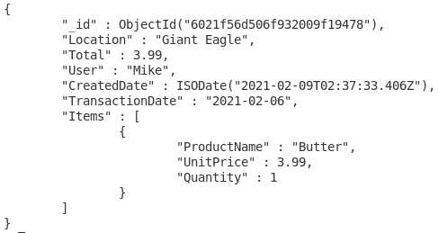

接下来，因为这是样本数据，我们需要从杂货店集合中删除该文档。这样，我们可以用它来测试 API 部分。

要删除，我们使用关键字“remove”:

```
db.Grocery.remove({_id:ObjectId(“<IdHere>”)})
```


# 为杂货店插入端点

首先，我们需要使用一个基本类来绘制我们的字段。这将发生在 app.py 文件中，并使用 pydantic。在导入中，添加以下行:

```
from pydantic import BaseModel
```

接下来，我们需要声明这些类。它应该发生在应用程序声明之后，但在任何端点之前。我们需要的第一个类是一个 Item 类，它稍后将作为一个列表嵌入到杂货类中。

```
class Item(BaseModel):
     ProductName: str
     UnitPrice: float
     Quantity: int
```

完成后，我们可以创建杂货类:

```
class Grocery(BaseModel):
     Location: str
     Total: float
     Coupon: float = None
     Giftcard: float = None
     User: str
     CreatedDate: str
     TransactionDate: str
     Items: List[Item]
```

注意，“None”值不允许在 JSON 对象中传递任何东西。现在我们可以创建端点了。它将与第一个杂货端点的地址相同，但将使用“post”而不是“get”。我们还需要寄一本杂货字典。

```
@app.post(“/receiptsapi/v1/grocery”)
async def AddGrocery(grocery: Grocery):
     groceries = await storage.add_groceries(grocery.dict())
     return groceries
```

接下来，我们需要处理 storage.py 文件中的 add _ 杂货()函数。首先，我们将使用 HTTPException 来引发我们可能遇到的任何错误。我们还需要声明一个 ObjectId 来插入和删除 MongoDB，因此我们需要在 pymongo 导入之后、声明 pymongo 客户端之前添加两个导入:

```
from fastapi import HTTPException
from bson.objectid import ObjectId
```

像其他 FastAPI 插入一样，我们需要一个围绕插入的“try-except ”,以及一个带有描述性消息的状态返回。我已经在我的其他博客中写过如何做到这一点。然而，不同之处在于，因为 pymongo 使用 JSON 对象，所以我们不需要将字典放在对象中。我们可以简单地添加字典:

```
async def add_groceries(grocery):
     try:
          db.Grocery.insert(grocery)
          client.close()
          return {“response”: “User inserted: %s” %(grocery)}
     except Exception as e:
          client.close()
          raise HTTPException(status_code = 404, detail = e)
```

对于测试部分，添加要插入主体的 JSON 对象:

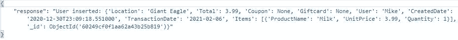

# 插入紧急端点

像杂货店的插页一样，首先需要设置应急类:

```
class Emergency(BaseModel):
     Total: float
     CreatedDate: str
     TransactionDate: str
     Reason: str = None
```

接下来，我们将添加端点。

```
@app.post(“/receiptsapi/v1/emergency”)
async def AddEmergency(emergency: Emergency):
     emergencies = await storage.add_emergencies(emergency.dict())
     return emergencies
```

既然已经在 app.py 文件中设置了端点，那么我们将转到 storage.py 文件来处理 add_emergencies 函数:

```
async def add_emergencies(emergency):
     try:
          db.Emergency.insert(emergency)
          client.close()
          return {“response”: “User inserted: %s” %(emergency)}
     except Exception as e:
          client.close()
          raise HTTPException(status_code = 404, detail = e)
```

接下来，简单地在 postman 中测试。

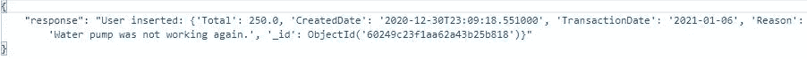

# 插入娱乐端点

在设置娱乐收藏时，出现了一个错误。物品清单与食品杂货清单不一致。这对 NoSQL 来说既是优势也是陷阱，标准化并不是必需的。我们可以使用不同名称的项目类来解决这个问题:

```
class EntertainItem(BaseModel):
     Name: str
     Price: float
```

现在我们可以添加娱乐类:

```
class Entertainment(BaseModel):
     Location: str
     Total: float
     Giftcard: float = None
     Discount: float = None
     CreatedDate: str
     TransactionDate: str
     Items: List[EntertainItem]
```

接下来，我们可以设置娱乐端点:

```
@app.post(“/receiptsapi/v1/entertainment”)
async def AddEntertainment(entertainment: Entertainment):        
     entertainments = await storage.add_entertainments(entertainment.dict())
     return entertainments
```

像以前一样，我们然后移动到 storage.py 文件来清空 add_entertainments 函数:

```
async def add_entertainments(entertainment):
     try:
          db.Entertainment.insert(entertainment)
          client.close()
          return {“response”: “User inserted: %s” %(entertainment)}
     except Exception as e:
          client.close()
          raise HTTPException(status_code = 404, detail = e)
```

现在我们可以测试:

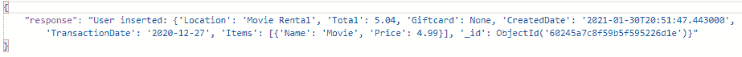

# 插入保险端点

幸运的是，我们没有这个集合的特例，所以我们不需要设置任何额外的类。我们可以像以前一样只使用 app.py 文件中的一个:

```
class Insurance(BaseModel):
     Location: str
     Total: float
     CreatedDate: str
     TransactionDate: str
```

在同一文件中，我们添加了端点:

```
@app.post(“/receiptsapi/v1/insurance”)
async def AddInsurance(insurance: Insurance):
     insurance = await storage.add_insurance(insurance.dict())
     return insurance
```

接下来，移动到 add_insurance 函数的 storage.py 文件:

```
async def add_insurance(insurance):
     try:
          db.Insurance.insert(insurance)
          client.close()
          return {“response”: “User inserted: %s” %(insurance)}
     except Exception as e:
          client.close()
          raise HTTPException(status_code = 404, detail = e)
```

邮递员上:

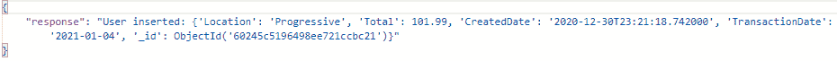

# 插入租金的端点

另一个简单的类，因为该类没有特例:

```
class Rent(BaseModel):
     Total: float
     Minimum: float = None
     Additional: float = None
     CreatedDate: str
     TransactionDate: str
```

现在到了终点:

```
@app.post(“/receiptsapi/v1/rent”)
async def AddRent(rent: Rent):
     rent = await storage.add_rent(rent.dict())
     return rent
```

接下来，转到 storage.py 来设置 add_rent 函数:

```
async def add_rent(rent):
     try:
          db.Rent.insert(rent)
          client.close()
          return {“response”: “User inserted: %s” %(rent)}
     except Exception as e:
          client.close()
          raise HTTPException(status_code = 404, detail = e)
```

给邮递员进行测试:

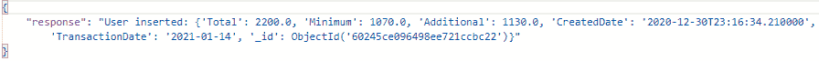

# 插入实用程序的端点

插入 MongoDB 的最后一个端点。我们首先建立我们的类:

```
class Utility(BaseModel):
     Type: str
     Total: float
     CreatedDate: str
     WithdrawalDate: str
```

接下来，添加端点:

```
@app.post(“/receiptsapi/v1/utility”)
async def AddUtility(utility: Utility):
     utilities = await storage.add_utilities(utility.dict())
     return utilities
```

现在转到 storage.py，使 add_utilities 函数:

```
async def add_utilities(utility):
     try:
          db.Utility.insert(utility)
          client.close()
          return {“response”: “User inserted: %s” %(utility)}
     except Exception as e:
          client.close()
          raise HTTPException(status_code = 404, detail = e)
```

最后，交给邮递员进行测试:

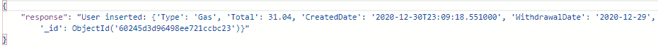

# 删除杂货店的端点

既然我们已经学习了如何使用 pymongo 和 FastAPI 插入数据库，我们还可以学习如何删除。为此，我们需要知道生成的 id。因为它是在我们的基本“get”语句中返回的，所以我们知道区分文档的 GUID。我们需要将该值传递给函数。要使用 delete，我们将使用“delete”而不是“post”。

```
@app.delete(“/receiptsapi/v1/grocery/{id}”)
async def DeleteGrocery(id: str):
     groceries = await storage.remove_grocery(id)
     return groceries
```

在 remove _ 杂货函数中，我们需要将字符串 Id 声明为 ObjectId。使用 delete_one 函数后,“try-except”中的所有其他结构将像插入:

```
async def remove_grocery(groceryId):
     try:
          db.Grocery.delete_one({“_id”: ObjectId(groceryId)})
          client.close()
          return {“response”: “User inserted: %s” %(groceryId)}
     except Exception as e:
          client.close()
          raise HTTPException(status_code = 404, detail = e)
```

在 Postman 中，我们需要发送 Id 的字符串版本。它返回以下结果:

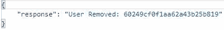

# 删除紧急端点

成功删除一个端点后，我们现在将进入紧急端点:

```
@app.delete(“/receiptsapi/v1/emergency/{id}”)
async def DeleteEmergency(id: str):
     emergencies = await storage.remove_emergency(id)
     return emergencies
```

现在，我们转到 storage.py 文件:

```
async def remove_emergency(emergencyId):
     try:
          db.Emergency.delete_one({“_id”: ObjectId(emergencyId)})
          client.close()
          return {“response”: “User inserted: %s” %( emergencyId)}
     except Exception as e:
          client.close()
          raise HTTPException(status_code = 404, detail = e)
```

知道了我们现在对测试的了解，使用“get”来获取最近插入的内容的 Id，并使用它来删除:

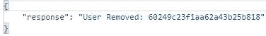

# 删除娱乐端点

同样，这些任务将变得重复，因为它们除了变量名之外都是相似的。首先，我们在 app.py 文件中工作:

```
@app.delete(“/receiptsapi/v1/entertainment/{id}”)
async def DeleteEntertainment(id: str):
     entertainment = await storage.remove_entertainment(id)
     return entertainment
```

接下来，我们转到 storage.py 文件:

```
async def remove_entertainment(entertainmentId):
     try:
          db.Entertainment.delete_one({“_id”: ObjectId(entertainmentId)})
          client.close()
          return {“response”: “User inserted: %s” %( entertainmentId)}
     except Exception as e:
          client.close()
          raise HTTPException(status_code = 404, detail = e)
```

现在，我们转到邮递员:

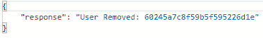

# 删除保险端点

半路上。首先在 app.py 文件中设置 DeleteInsurance 端点:

```
@app.delete(“/receiptsapi/v1/insurance/{id}”)
async def DeleteInsruance(id: str):
     insurance = await storage.remove_insurance(id)
     return insurance
```

现在我们做 storage.py 部分:

```
async def remove_insurance(insuranceId):
     try:
          db.Insurance.delete_one({“_id”: ObjectId(insuranceId)})
          client.close()
          return {“response”: “User inserted: %s” % (insuranceId)}
     except Exception as e:
          client.close()
          raise HTTPException(status_code = 404, detail = e)
```

现在有请邮差:

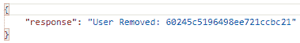

# 删除租赁端点

我们快到了。现在，我们将设置删除租金端点:

```
@app.delete(“/receiptsapi/v1/rent/{id}”)
async def DeleteRent(id: str):
     rent = await storage.remove_rent(id)
     return rent
```

您已经知道了流程，现在转到 storage.py 文件:

```
async def remove_rent(rentId):
     try:
          db.Rent.delete_one({“_id”: ObjectId(rentId)})
          client.close()
          return {“response”: “User inserted: %s” % (rentId)}
     except Exception as e:
          client.close()
          raise HTTPException(status_code = 404, detail = e)
```

邮递员上:

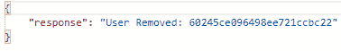

# 删除实用程序的端点

到达我们最后的终点。像其他人一样，从 app.py 文件开始:

```
@app.delete(“/receiptsapi/v1/utility/{id}”)
async def DeleteUtility(id: str):
     utilities = await storage.remove_utility(id)
     return utilities
```

移动到 storage.py 文件的最后一部分:

```
async def remove_utility(utilityId):
     try:
          db.Utility.delete_one({“_id”: ObjectId(utilityId)})
          client.close()
          return {“response”: “User inserted: %s” % (utilityId)}
     except Exception as e:
          client.close()
          raise HTTPException(status_code = 404, detail = e)
```

现在是最后的邮递员测试:

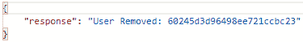

# 结论

首先，我们学习了如何在 MongoDB 中删除文档。我们决定不讨论更新部分，因为 FastAPI 版本在嵌入/嵌套文档方面会稍微复杂一些。相反，我们把它留到下次。

在学习了 MongoDB 部分之后，我们继续设置 FastAPI 部分。首先，我们致力于插入。我们学会了像使用常规 FastAPI 应用程序一样使用 pydantic，但是不需要在 insert 函数中设置对象。相反，对象只是被传递。正如我在另一篇博客中所讨论的，HTTPException 用于捕捉任何错误。我还删除了娱乐集合，并重新添加它以不包含任何验证需求，因为 pydantic 不使用 doubles，而是使用 floats。

插入之后，我们继续从数据库中删除。为此，我们必须获得一个 Id 值，还要将其转换为 ObjectId 格式。我们还讨论了如何正确地通过端点传递 id。

我们现在离启动和运行月度预算项目又近了一步。但是现在，我们仍然需要讨论如何更新现有的文档。下次见，干杯！

**|** *报名加入我的邮件列表* [*这里*](https://crafty-leader-2062.ck.page/8f8bcfb181) *。*

***|*** *参考文献*

[](https://stackoverflow.com/questions/45285852/how-to-retrieve-mongodb-collection-validator-rules) [## 如何检索 MongoDb 集合验证器规则？

### 感谢贡献一个堆栈溢出的答案！请务必回答问题。提供详细信息并分享…

stackoverflow.com](https://stackoverflow.com/questions/45285852/how-to-retrieve-mongodb-collection-validator-rules) [](https://docs.mongodb.com/manual/reference/method/db.collection.remove/) [## db.collection.remove() - MongoDB 手册

### 方法使用命令，该命令使用默认的写入问题。要指定不同的写入问题，请包括…

docs.mongodb.com](https://docs.mongodb.com/manual/reference/method/db.collection.remove/) [](https://www.w3schools.com/python/python_mongodb_insert.asp) [## Python MongoDB 插入文档

### 组织良好，易于理解的网站建设教程，有很多如何使用 HTML，CSS，JavaScript 的例子…

www.w3schools.com](https://www.w3schools.com/python/python_mongodb_insert.asp)  [## 字段类型

### 在可能的情况下，pydantic 使用标准库类型来定义字段，从而平滑学习曲线。对许多人来说…

pydantic-docs.helpmanual.io](https://pydantic-docs.helpmanual.io/usage/types/#datetime-types) [](https://stackoverflow.com/questions/32949898/deleting-document-in-pymongo-from-id) [## 从 id 中删除 PyMongo 中的文档

### 感谢贡献一个堆栈溢出的答案！请务必回答问题。提供详细信息并分享…

stackoverflow.com](https://stackoverflow.com/questions/32949898/deleting-document-in-pymongo-from-id)