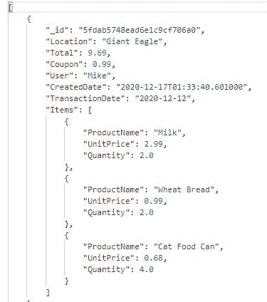
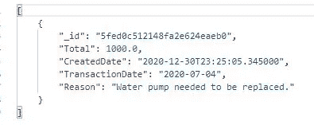
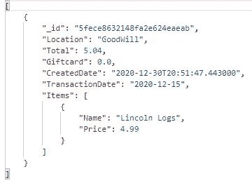
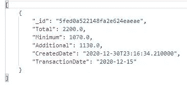
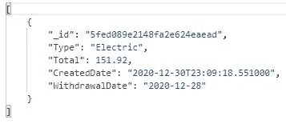
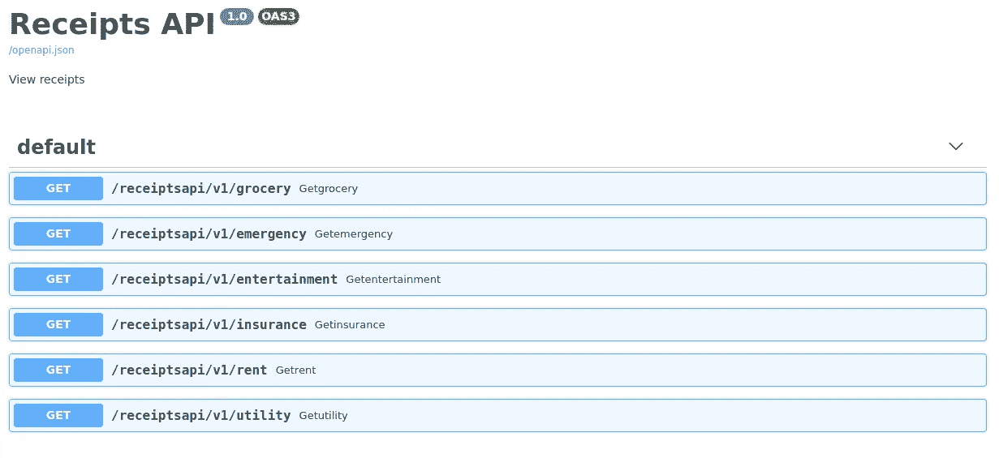
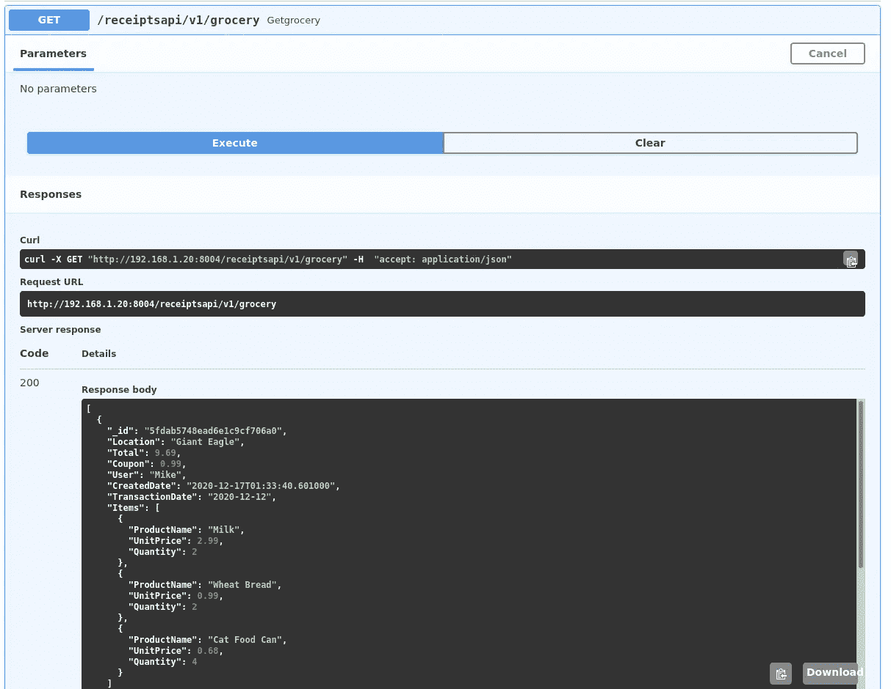

# MongoDB

> 原文：<https://towardsdatascience.com/mongodb-80ae0fcfbcdc?source=collection_archive---------40----------------------->

## 从安装到实现第 3 部分


迈克尔·沃尔特在 [Unsplash](https://unsplash.com?utm_source=medium&utm_medium=referral) 上的照片

# 概述

在第一部分中，我开始构建一个用于月度预算应用程序的数据库。我们讨论了 MongoDB 的安装，以及一些语法差异。安装后，我们创建了一个数据库，这是我们的第一个集合，还创建了一个文档放在这个杂货集合中。

在[第二部分](/mongodb-b16e6f8fc5ca)中，我们讨论了更多关于集合的选项，比如大小限制和验证。了解了上限之后，我们创建了一个样本集合来进行测试，以及测试数据。我们还讨论了如何一次插入多个文档。在此之后，剩余的集合被添加:娱乐，公用事业，租金，保险和紧急情况。我们还向每个集合添加了文档，然后验证它们都在我们的收据数据库中。

# 继续

现在我们已经完成了 Mongo 数据库和集合，我们可以继续我们的 API 了。为此，我们将使用 FastAPI。区别在于我们如何介绍我们的产品系列。对于我使用 MySQL 的典型表，我通常使用 sqlalchemy 创建一个数据库对象。然而，在 sqlalchemy 中，我们使用 ORM(对象关系映射器)工具，这在 MongoDB 中是无法使用的。Mongo 使用 NoSQL，它不会以同样的方式工作。因此，我们将使用名为 PyMongo 的 Python 发行版。因此，设置将与我们之前创建 FastAPIs 的方式不同。

# 安装 pymongo

为了让我们开始，我们需要安装 API 所需要的东西。已经安装了 FastAPI，但是我们使用新的 PyMongo 发行版来运行我们的代码。要安装，请运行:

```
sudo pip3 install pymongo
```

现在，我们准备开始设置我们的端点。

# 设置杂货端点

首先，我们将创建一个名为 storage.py 的文件来保存要调用的函数。回想一下，我们将需要为 API 使用 async 和 await。要启动这个文件，我们需要导入 pymongo 发行版:

```
import pymongo
```

接下来，我们将建立连接。为此，我们需要创建一个基于 Mongo 的客户机，使用包含数据库和 MongoDB 特定端口的主机。接下来，我们将选择数据库:

```
client = pymongo.MongoClient(“localhost”, 27017)
db = client.Receipts
```

在此之后，我们可以创建我们的异步函数来获取食品杂货文档。与 sqlalchemy 非常相似，将在列表中返回结果。但是，ObjectID 是 MongoDB 中的默认主键集，它不能迭代。如果我们想把它附加到一个列表中，这是一个大问题。为了解决这个问题，我们可以将值重置为一个字符串，这样我们就只有 GUID 值了。这将需要在 select 中所有项目的 for 循环中完成，在 Mongo 中这将是一个“find”。更正 ObjectID 后，将其附加到我们创建的列表中。接下来，关闭数据库连接。最后，返回列表。

```
async def get_groceries():
     GroceryList = [] for item in db.Grocery.find():
          item[“_id”] = str(item[“_id”])
          GroceryList.append(item) client.close()
     return GroceryList
```

设置好函数后，我们现在可以设置端点了。首先，创建 app.py 文件。接下来，我们将使用几个导入。请注意，我们可能还没有全部用到，但将来会用到。

```
from fastapi import FastAPI
from typing import List
from pydantic import BaseModelimport storage
```

接下来，设置 FastAPI 的基础:

```
app = FastAPI (
     title = “Receipts API”,
     description = “View receipts”,
     version = “1.0”
)
```

现在，我们只需要创建端点。为此，设置异步函数来获取杂货收据。然后，设置一个变量，该变量将等待我们在存储文件中设置的结果。最后，返回该变量。

```
@app.get(“/receiptsapi/v1/grocery”)
async def GetGrocery():
     groceries = await storage.get_groceries()
     return groceries
```

为了测试，我们将使用 uvicorn 来运行应用程序。如果你还不知道，uvicorn 是一个 ASGI(异步服务器网关接口)服务器实现，它允许我们创建自己的 Python 框架。如果尚未安装，请使用:

```
sudo pip3 install uvicorn
```

安装完成后，我们就可以运行 python 应用程序了。我做的有点不同，像这样:

```
uvicorn app:app –-reload –-host <HOSTNAME> --port <PORTNUMBER>
```

请注意，端口号可以是您想要的任何值，但是主机名应该包含您的应用程序，在我的例子中是我的 Ubuntu IP 地址。现在，我们已经准备好进行测试，并且应该对我们创建的每个端点进行测试。



杂货端点输出。

# 设置紧急端点

在第一部分中已经做好了准备，我们可以直接开始编写端点代码了。它将遵循与杂货店端点相同的格式，只是使用不同的描述性名称。首先，处理 storage.py 文件:

```
async def get_emergencies():
     EmergencyList = [] for item in db.Emergency.find():
          item[“_id”] = str(item[“_id”])
          EmergencyList.append(item) client.close()
     return EmergencyList
```

接下来，在 app.py 文件上创建端点:

```
@app.get(“/receiptsapi/v1/emergency”)
async def GetEmergency():
     emergencies = await storage.get_emergencies()
     return emergencies
```

现在你要做的就是测试:



紧急端点输出。

# 设置娱乐端点

现在，我们可以设置下一个端点。为此，我们将遵循相同的步骤。首先，设置 storage.py 文件:

```
async def get_entertainment():
     EntertainmentList = [] for item in db.Entertainment.find():
          item[“_id”] = str(item[“_id”])
          EntertainmentList.append(item) client.close()
     return EntertainmentList
```

接下来，app.py 文件端点:

```
@app.get(“/receiptsapi/v1/entertainment”)
async def GetEntertainment():
     entertainment = await storage.get_entertainment()
     return entertainment
```

现在测试:



娱乐端点输出。

# 设置保险端点

我知道这越来越重复，但坚持我，我们就快到了。像前面一样从 storage.py 文件开始:

```
async def get_insurance():
     InsuranceList = [] for item in db.Insurance.find():
          item[“_id”] = str(item[“_id”])
          InsuranceList.append(item) client.close()
     return InsuranceList
```

接下来，app.py 文件中的端点:

```
@app.get(“/receiptsapi/v1/insurance”)
async def GetInsurance():
     insurance = await storage.get_insurance()
     return insurance
```

返回给邮递员进行测试:


保险端点输出。

# 设置租金端点

首先，storage.py 文件需要编码:

```
async def get_rent():
     RentList = [] for item in db.Rent.find():
          item[“_id”] = str(item[“_id”])
          RentList.append(item) client.close()
     return RentList
```

接下来，对 app.py 端点做一点工作:

```
@app.get(“/receiptsapi/v1/rent”)
async def GetRent():
     rent = await storage.get_rent()
     return rent
```

现在添加到测试:



租用端点输出。

# 设置应用端点

好吧，最后一个。将以下内容添加到 storage.py 文件中:

```
async def get_utilities():
     UtilityList = [] for item in db.Utility.find():
          item[“_id”] = str(item[“_id”])
          UtilityList.append(item) client.close()
     return UtilityList
```

现在是 app.py 文件中的最后一个变化:

```
@app.get(“/receiptsapi/v1/utility”)
async def GetUtility():
     utilities = await storage.get_utilities()
     return utilities
```

最后，最后一个邮递员测试:



实用程序端点输出。

回想一下，我们还可以看看我们的 Swagger 文档:



Swagger 文档。



通过 Swagger 测试端点。

# 结论

虽然这可能是重复的，但是我们能够为月度预算应用程序创建一个 API。因为 MongoDB 使用 NoSQL，所以我们无法使用常规的 sqlalchemy。这是因为，对于 sqlalchemy，我们使用 ORM 工具，它是专门为关系数据库设计的。正如我们在第一部分中了解到的，NoSQL 没有使用关系模型。

我们可以通过使用 pymongo 来解决这个问题，py mongo 允许我们读取集合。尽管编码非常相似，但我们创建了不同的端点来读取每个集合。

随着端点的创建，我们能够查看集合中的文档。接下来，我们可以进行插入、更新和删除。在那之前，干杯！

*参考文献*

[T3【https://www.uvicorn.org/】T5](https://www.uvicorn.org/)

[*https://pymongo.readthedocs.io/en/stable/*](https://pymongo.readthedocs.io/en/stable/)

[*https://docs . MongoDB . com/manual/reference/method/db . create user/*](https://docs.mongodb.com/manual/reference/method/db.createUser/)

[*https://real python . com/introduction-to-MongoDB-and-python/# MongoDB*](https://realpython.com/introduction-to-mongodb-and-python/#mongodb)

[*https://github.com/dcrosta/professor/issues/13*](https://github.com/dcrosta/professor/issues/13)