# MongoDB

> 原文：<https://towardsdatascience.com/mongodb-92370a2641ad?source=collection_archive---------29----------------------->

## 从安装到实现:第 6 部分


马库斯·温克勒在 [Unsplash](https://unsplash.com?utm_source=medium&utm_medium=referral) 上的照片

# **前情提要**

在第五部分中，我们学习了如何使用一些不同的 Mongo 命令更新文档。我们还讨论过，由于嵌入了文档，更新起来会有点困难，因为细节可能会被覆盖。在更新时，我们了解到我们可以更新每个字段，或者我们可以只更新特定的字段。当我们讨论了几种不同的更新方法后，我们决定花一点时间来考虑如何更新我们的 FastAPI 部分。

# **这次在 MongoDB 上**

花了一点时间，我决定如何更新我们的文件。请记住，这只是我的解决方案，它可能不是唯一的解决方案，也不是最好的解决方案。这只是为了记录我在学习过程中决定要做的事情，所以请在评论中分享你的想法。

因为嵌入的文件，我们必须小心。然而，在查看一个前端应用程序时，我决定更新所有段，并简单地发送整个 JSON 对象进行更新。当显示时，用户可以决定是否需要更新该字段，或者是否用相同的数据替换它。发送整个对象不仅可以动态地更新文档，还可以提供嵌入的文档。

现在，为了让这个更新按照我想要的方式工作，就像 INSERT 一样，我们正在使用我们设置的类。因此，如果文档缺少任何字段，比如带有可选优惠券或礼券卡的杂货文档，它们将被添加并设置为 null。不理想，但也没什么关系。我们总是可以在我们的前端代码中加入不显示任何空值的逻辑，但是拥有它们实际上对我们有利。它将允许用户添加那些他们以前没有的字段，没有太大的困难。因此，不再拖延，让我们进入代码。

# **设置杂货更新端点**

回想一下，我们有一个 app.py 文件和一个 storage.py 文件。app 文件包含 FastAPI 调用，而存储文件处理函数和我们的 MongoDB。

为了创建我们的更新端点，我们首先需要创建函数。首先，让我们来看看我们的存储文件。在 Mongo 中更新时，我们使用了 update 函数。第一个参数包含一个类似于 SQL WHERE 子句的语句，在该语句中，我们首先选择要更新的文档。如果留空，它将更新所有。第二个参数有“$set”指令，类似于 SQL SET 语句。但是，因为字段也将包含在 JSON 对象中，所以我们可以简单地发送整个对象，而不需要声明每个字段及其值。这有助于我们抓住整个物体。

也就是说，当我用 Postman 测试时，我不发送 id 主键以确保它不会被意外更新。当我们在代码中发送对象时，我们需要做的就是确保用户不能编辑我们的 ObjectID，这将解决我们的问题。出于测试的目的，我们可以将它从通过 Postman 发送的对象中去掉。

此外，我们允许一个 upsert，这意味着如果由于某种原因 ID 匹配不上，它将插入该文档。一旦我们有了前端，我们的代码就不需要这个了，但是万一用户忘记刷新页面或者有东西被缓存了，我们需要确保数据不会就这么消失了。了解了所有这些，下面是我们将添加到存储文件中的函数:

```
@app.put(“/receiptsapi/v1/grocery/{id}”)
async def UpdateGrocery(grocery: Grocery, id: str):
     groceries = await storage.update_groceries(grocery.dict(), id)
     return groceries
```

既然我们已经设置了代码，我们就可以选择更新哪个文档了。我选择了以下内容:

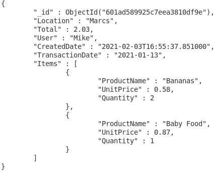

选定的杂货店记录。

这正是我们将要复制到 Postman 主体中的内容，但是没有 ObjectID。所以我们来做个改变。我们可以改变我们的总金额，也可以改变我们的嵌入式文档列表中的项目数。现在只需发送 PUT 并确保 URL 中的 ID 是正确的。


PUT 请求响应。

我们收到了很好的回应，但为了确保万无一失，让我们回去看看收集。

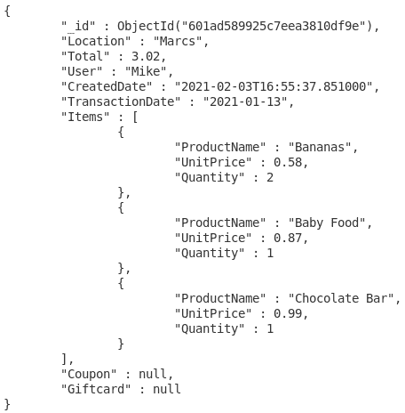

更新了杂货店记录。

看起来我们的收藏更新没有任何问题。唯一需要注意的问题是添加了“优惠券”和“礼品卡”字段，但这也不是问题，因为现在用户有机会添加这些字段。我们可以去下一个终点了。

# **设置紧急更新端点**

首先，让我们转到 storage.py 文件。我们的函数看起来与 update _ goals 函数几乎相同，只是变量名称不同。您可能还记得，这个集合中没有嵌入的文档，但是我们的调用看起来是一样的。这就是为什么我选择这条路线进行更新；我们正在使用更动态的更新。

```
async def update_emergencies(emergency, emergencyId):
     try:
          db.Emergency.update_one({“_id”: ObjectId(emergencyId)}, {“$set”: emergency}, upsert=True)
          return {“response”: “User Updated: %s” % emergencyId}
     except Exception as e:
          client.close()
          raise HTTPException(status_code = 404, detail = e)
```

接下来，我们可以添加到 app.py 文件并设置我们的端点。同样，除了名称变化之外，它看起来与杂货店端点相同，但是我们所有的端点都是相同的，只有很少的变化。

```
@app.put(“/receiptsapi/v1/emergency/{id}”)
async def UpdateEmergency(emergency: Emergency, id: str):
     emergencies = await storage.update_emergencies(emergency.dict(), id)
     return emergencies
```

现在，我们查看当前的紧急情况，以选择哪些将被更新。

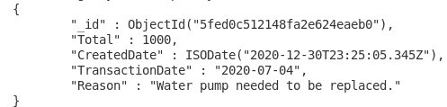

选定的紧急记录。

我选择了这份文件。在原因中，我们还可以补充说，较高的价格是由于该日期是一个假期。这样，将来我们可以回忆起为什么定价会超出我们的预算。因此，让我们将 ObjectID 放入 URL，使用 PUT 调用我们的端点，然后查看文档是否被正确更新:


PUT 请求响应。


更新了紧急记录。

# **设置娱乐更新端点**

现在我相信你已经明白了。首先，转到存储文件来设置函数:

```
async def update_entertainment(entertainment, entertainmentId):
     try:
          db.Entertainment.update_one({"_id": ObjectId(entertainmentId)}, {"$set": entertainment}, upsert=True)
          return {"response": "User Updated: %s" % entertainmentId}
     except Exception as e:
          client.close()
          raise HTTPException(status_code = 404, detail = e)
```

接下来，转到应用程序文件来设置端点:

```
@app.put("/receiptsapi/v1/entertainment/{id}")
async def UpdateEntertainment(entertainment: Entertainment, id: str):
     entertainment = await
storage.update_entertainment(entertainment.dict(), id)
     return entertainment
```

现在查看集合并选择一个要更新的文档:

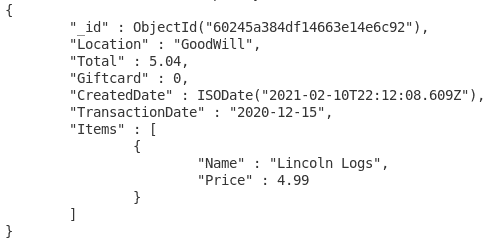

精选娱乐唱片。

在 Postman 中，设置 URL，包括 ObjectID，然后在正文中围绕您想要的内容进行更改。例如，让我们使用礼品卡进行交易。礼品卡可以吃掉全部金额，所以我们的总数将是零。运行后，仔细检查更新的文档。


PUT 请求响应。

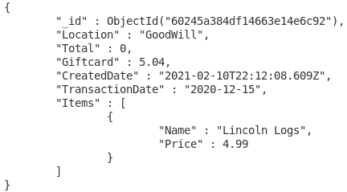

更新娱乐记录。

# **设置保险更新端点**

首先，在存储文件中设置更新功能:

```
async def update_insurance(insurance, insuranceId):
     try:
          db.Insurance.update_one({"_id": ObjectId(insuranceId)}, {"$set": insurance}, upsert=True)
          return {"response": "User Updated: %s" % insuranceId}
     except Exception as e:
          client.close()
          raise HTTPException(status_code = 404, detail = e)
```

现在转到应用程序文件来创建端点:

```
@app.put("/receiptsapi/v1/insurance/{id}")
async def UpdateInsurance(insurance: Insurance, id: str):
     insurance = await storage.update_insurance(insurance.dict(), id)
     return insurance
```

接下来，选择要更新的文档。

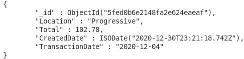

选定的保险记录。

对于这次更新，我将使用 Geico，而不是 Progressive，只是为了表明如果犯了一个简单的错误，它可以被纠正。你知道该怎么做。邮递员的时间到了。


PUT 请求响应。

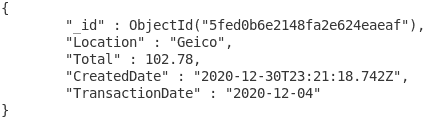

更新了保险记录。

# **设置租金更新端点**

首先，我们将函数添加到存储文件中:

```
async def update_rent(rent, rentId):
     try:
          db.Rent.update_one({“_id”: ObjectId(rentId)}, {“$set”: rent}, upsert=True)
          return {“response”: “User Updated: %s” % rentId}
     except Exception as e:
          client.close()
          raise HTTPException(status_code = 404, detail = e)
```

接下来，将更新端点添加到应用程序文件:

```
@app.put("/receiptsapi/v1/rent/{id}")
async def UpdateRent(rent: Rent, id: str):
     rent = await storage.update_rent(rent.dict(), id)
     return rent
```

最后，选择您想要更新的文档，将更改放入 Postman，并监视发生了什么。

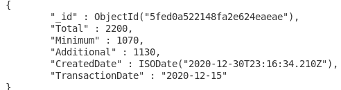

选定的租金记录。


PUT 请求响应。

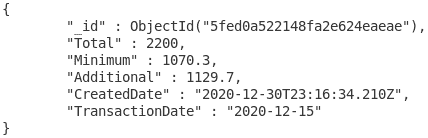

更新的租金记录。

# **设置实用程序更新端点**

在我们的测试中，让我们改变一下。但是首先，我们必须添加我们的代码。最后一个。首先，将函数添加到存储文件中:

```
async def update_utility(utility, utilityId):
     try:
          db.Utility.update_one({"_id": ObjectId(utilityId)}, {"$set": utility}, upsert=True)
          return {"response": "User Updated: %s" % utilityId}
     except Exception as e:
          client.close()
          raise HTTPException(status_code = 404, detail = e)
```

接下来，我们将端点添加到应用程序文件中:

```
@app.put("/receiptsapi/v1/utility/{id}")
async def UpdateUtility(utility: Utility, id: str):
     utilities = await storage.update_utility(utility.dict(), id)
     return utilities
```

之后，选择要更新的记录:

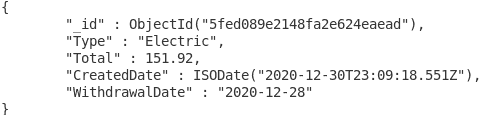

选定的公用事业记录。

所以在 Postman 中，我们将只发送一个字符的 ID。例如，结尾的“d”将改为“f”。因为“upsert ”,它应该会添加一个新的记录，但是让我们测试一下。对于我们的更新，我们应该将总数、创建日期更改为最近的日期，将事务日期更改为下个月。记住，它应该更新整个记录，但是我们的 ID 只差一个字符。

现在，当您检查时，响应显示“用户已更新”，但我们希望如此，因为这是我们在成功时发送的消息。但是，请再次检查集合:

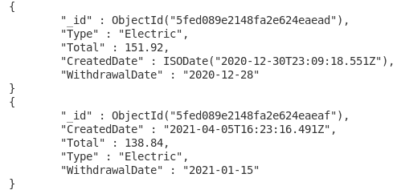

更新了效用记录。

如您所见,“upsert”允许将记录添加到数据库中。如果您不想要该特性，只需将“upsert”设置为 False，当在集合中找不到该 ID 时，很可能会返回一个错误。但就我的目的而言，我希望保留该功能。

# **结论**

在 MongoDB/FastApi 项目的这一部分，我们为每个集合创建了更新端点。我们讨论了“upsert”选项的作用，以及我为什么选择在这个项目中使用它。

至于 Mongo 和 FastApi 编码，那是我们收据跟踪项目的最后一部分。剩下唯一要做的就是给我们的项目一个前端 app。我希望通过使用 pymongo 库，您对 MongoDB 有了更多的了解，甚至对 FastApi 也有了一些了解。我确实从这次经历中吸取了教训。为了了解更多，我正在考虑扩展到 React 的前端，因为我的经验仍然有限。它应该继续是一个有趣的项目。下次见，干杯！

***用我的*** [***每周简讯***](https://crafty-leader-2062.ck.page/8f8bcfb181) ***免费阅读我的所有文章，谢谢！***

***想阅读介质上的所有文章？成为中等*** [***成员***](https://miketechgame.medium.com/membership) ***今天！***

查看我最近的文章:

[](https://python.plainenglish.io/organizing-my-pictures-with-mysql-and-python-ca5dee8fe02f) [## 用 MySQL 和 Python 组织我的图片

### 又快又脏，但很管用…

python .平原英语. io](https://python.plainenglish.io/organizing-my-pictures-with-mysql-and-python-ca5dee8fe02f) [](https://medium.com/codex/all-along-ive-been-using-a-sql-antipattern-50f9a6232f89) [## 一直以来，我都在使用 SQL 反模式

### 下面是如何修复它…

medium.com](https://medium.com/codex/all-along-ive-been-using-a-sql-antipattern-50f9a6232f89) [](https://python.plainenglish.io/creating-a-basic-photoshop-app-with-python-c24181a09f69) [## 使用 Python 创建照片编辑应用程序

### 我从没想过会这么容易

python .平原英语. io](https://python.plainenglish.io/creating-a-basic-photoshop-app-with-python-c24181a09f69) [](https://python.plainenglish.io/the-lazy-way-of-using-python-to-search-wikipedia-fce2a7260390) [## 使用 Python 搜索维基百科的懒惰方式

### 是的，有一个更简单的方法…

python .平原英语. io](https://python.plainenglish.io/the-lazy-way-of-using-python-to-search-wikipedia-fce2a7260390) [](https://python.plainenglish.io/building-an-old-school-text-based-game-with-python-efcc33d25a42) [## 用 Python 构建一个老式的基于文本的游戏

### 他们还没死！

python .平原英语. io](https://python.plainenglish.io/building-an-old-school-text-based-game-with-python-efcc33d25a42) 

参考资料:

[](https://docs.mongodb.com/manual/reference/method/db.collection.update/) [## db.collection.update() - MongoDB 手册

### 本页记录了 shell 方法，并没有提到 MongoDB Node.js 驱动程序(或任何其他驱动程序)方法…

docs.mongodb.com](https://docs.mongodb.com/manual/reference/method/db.collection.update/) [](https://kb.objectrocket.com/mongo-db/how-to-update-a-mongodb-document-in-python-356) [## 如何用 Python 更新 MongoDB 文档

### 如果您在 MongoDB 中存储数据，您可能需要不时地更新文档。幸运的是，皮蒙戈人…

kb.objectrocket.com](https://kb.objectrocket.com/mongo-db/how-to-update-a-mongodb-document-in-python-356)