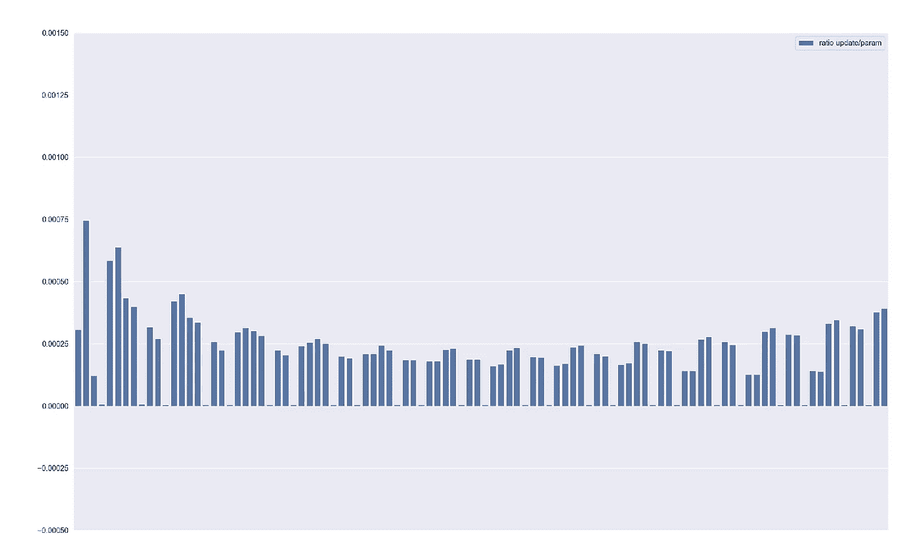
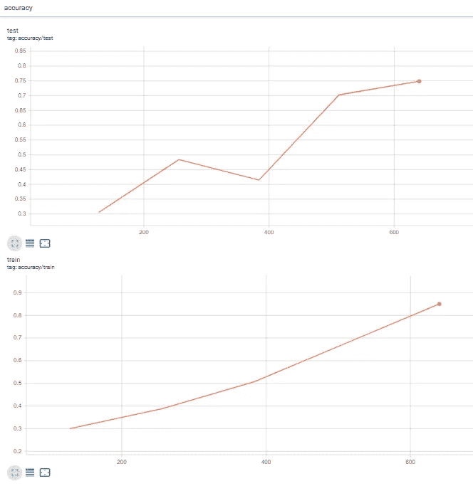
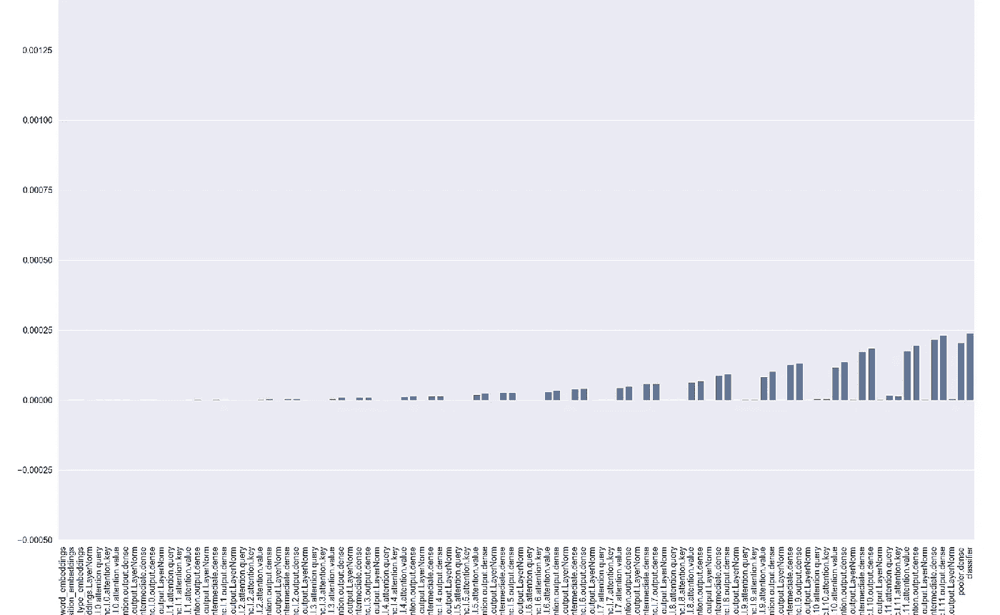
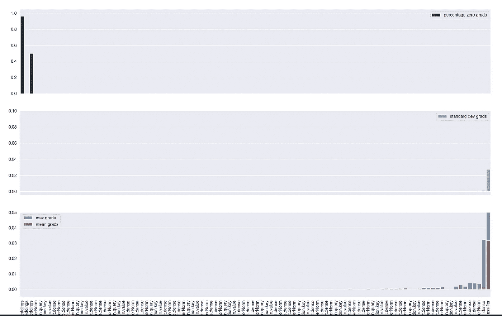
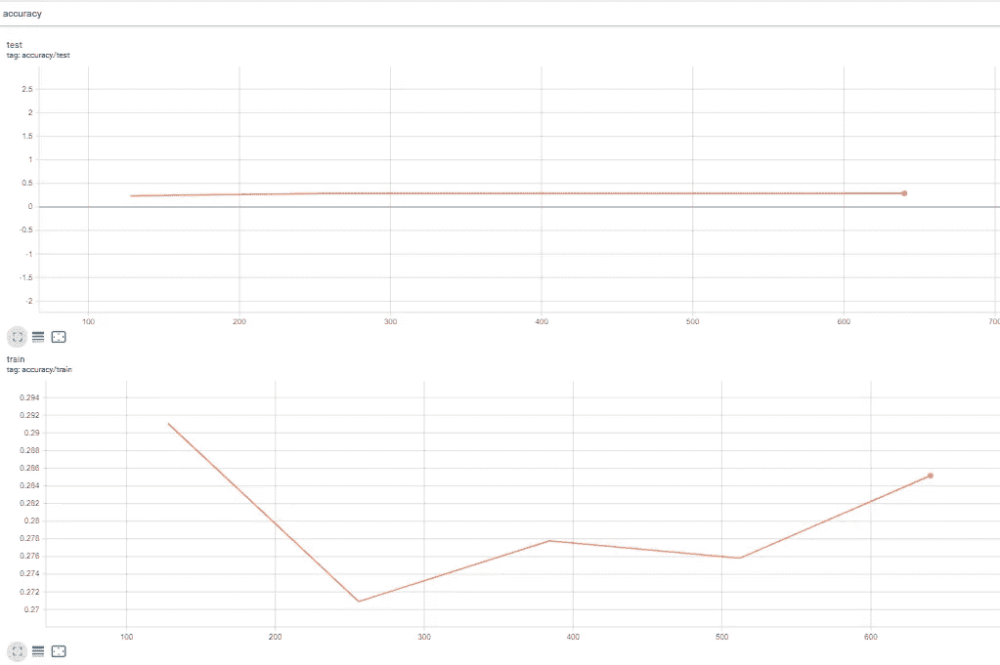

# 用 TensorBoard 监控 BERT 模型训练

> 原文：<https://towardsdatascience.com/monitor-bert-model-training-with-tensorboard-2f4c42b373ea?source=collection_archive---------11----------------------->

## 梯度流量和更新率


[https://unsplash.com/@tobiastu](https://unsplash.com/@tobiastu)

在[的上一篇文章](https://medium.com/@alexml0123/deep-dive-into-the-code-of-bert-model-9f618472353e)中，我们解释了 BERT 模型的所有构建组件。现在，我们将在 TensorBoard 中训练监控训练过程的模型，查看梯度流、更新参数比率、损失和评估指标。

为什么我们希望监控梯度流量和更新率，而不是简单地查看损失和评估指标？当我们开始对大量数据进行模型训练时，我们可能会在意识到之前运行许多次迭代，查看模型没有训练的损失和评估指标。在这里，查看梯度的大小和更新率，我们可以立即发现有问题，这为我们节省了时间和金钱。

## 数据准备

我们将使用来自 *sklearn* 的【T20 个新闻组数据集(许可证:公共域/来源:[http://qwone.com/~jason/20Newsgroups/](http://qwone.com/~jason/20Newsgroups/))在这个例子中有 4 个类别: *alt .无神论*、 *talk.religion.misc* 、 *comp.graphics* 和 *sci.space.* 我们用来自*变形金刚*的*bertokenizer*对数据进行标记化

```
categories = ['alt.atheism', 'talk.religion.misc', 'comp.graphics', 'sci.space']newsgroups_train = fetch_20newsgroups(subset='train', categories=categories)
newsgroups_test = fetch_20newsgroups(subset='test', categories=categories)X_train = pd.DataFrame(newsgroups_train['data'])
y_train = pd.Series(newsgroups_train['target'])X_test = pd.DataFrame(newsgroups_test['data'])
y_test = pd.Series(newsgroups_test['target'])BATCH_SIZE = 16max_length = 256
config = BertConfig.from_pretrained("bert-base-uncased")
config.num_labels = len(y_train.unique())
config.max_position_embeddings = max_lengthtrain_encodings = tokenizer(X_train[0].tolist(), truncation=True, padding=True, max_length=max_length)
test_encodings = tokenizer(X_test[0].tolist(), truncation=True, padding=True, max_length=max_length)class BertDataset(Dataset):def __init__(self, encodings, labels):
 self.encodings = encodings
 self.labels = labelsdef __getitem__(self, idx):
 item = {key: torch.tensor(val[idx]).to(device) for key, val in 
self.encodings.items()}
 item[‘labels’] = torch.tensor(self.labels[idx]).to(device)
 return itemdef __len__(self):
 return len(self.labels)train_dataset = BertDataset(train_encodings, y_train)
test_dataset = BertDataset(test_encodings, y_test)train_dataset_loader = DataLoader(train_dataset, batch_size=BATCH_SIZE, shuffle=True)
test_dataset_loader = DataLoader(test_dataset, batch_size=BATCH_SIZE)for d in train_dataset_loader:
    print(d)
    break# output : 
{'input_ids': tensor([[ 101, 2013, 1024,  ...,    0,    0,    0],
         [ 101, 2013, 1024,  ..., 1064, 1028,  102],
         [ 101, 2013, 1024,  ...,    0,    0,    0],
         ...,
         [ 101, 2013, 1024,  ..., 2620, 1011,  102],
         [ 101, 2013, 1024,  ..., 1012, 4012,  102],
         [ 101, 2013, 1024,  ..., 3849, 2053,  102]], device='cuda:0'),
 'token_type_ids': tensor([[0, 0, 0,  ..., 0, 0, 0],
         [0, 0, 0,  ..., 0, 0, 0],
         [0, 0, 0,  ..., 0, 0, 0],
         ...,
         [0, 0, 0,  ..., 0, 0, 0],
         [0, 0, 0,  ..., 0, 0, 0],
         [0, 0, 0,  ..., 0, 0, 0]], device='cuda:0'),
 'attention_mask': tensor([[1, 1, 1,  ..., 0, 0, 0],
         [1, 1, 1,  ..., 1, 1, 1],
         [1, 1, 1,  ..., 0, 0, 0],
         ...,
         [1, 1, 1,  ..., 1, 1, 1],
         [1, 1, 1,  ..., 1, 1, 1],
         [1, 1, 1,  ..., 1, 1, 1]], device='cuda:0'),
 'labels': tensor([3, 0, 2, 1, 0, 2, 2, 1, 1, 0, 1, 3, 3, 0, 2, 1], device='cuda:0')}
```

## 张量板的使用

TensorBoard 允许我们编写和保存不同类型的数据，包括图像和标量，以供将来分析。首先让我们用 pip 安装 tensorboard:

> pip 安装张量板

要写入 TensorBoard，我们将使用来自*torch . utils . tensor board*的 *SummaryWriter*

```
from torch.utils.tensorboard import SummaryWriter# SummaryWriter takes log directory as argument
writer = SummaryWriter(‘tensorboard/runs/bert_experiment_1’)
```

为了编写标量，我们使用:

```
writer.add_scalar(‘loss/train’, loss, counter_train)
```

需要变量 *counter_train* 来知道向 TensorBoard 写入内容的步数。
要写一个图像，我们将使用以下内容:

```
writer.add_figure(“gradients”, myfig, global_step=counter_train, close=True, walltime=None)
```

## 模特培训

现在让我们看看我们的训练函数

*out_every* 变量控制写入 TensorBoard 的频率，以步数衡量。我们还可以使用 *step_eval* 变量，比在每个时期之后更频繁地进行评估。梯度流量和更新比率数字分别从 *plot_grad_flow* 和 *plot_ratios* 函数返回。

我们传递模型的参数，为了更好的可视化，我们可以决定用 *skip_prob* 参数跳过一些层。我们写下每层梯度的平均值、最大值和标准偏差，忽略偏差层，因为它们不太有趣。如果你也想显示 bias 的渐变，你可以删除第 17 行的部分。我们还显示了每层中零梯度的百分比。需要强调的是，由于 BERT 使用 GeLU 而不是 ReLU 激活函数，这最后一个图可能不太有用，但如果您使用的是 ReLU 的不同模型，该模型存在[死亡神经元](https://en.wikipedia.org/wiki/Rectifier_(neural_networks))问题，显示零梯度的百分比实际上是有帮助的。

*plot_ratios* 函数显示每个参数的更新/参数比率，这是一个标准化测量，因为更新除以参数值，并有助于了解您的神经网络如何学习。作为一个粗略的启发，这个值应该在 *1e-3* 左右，如果低于这个值，学习率可能太低，否则太高。此外，您可以通过 *skip_prob* 参数减少显示的图层。

在模型训练期间，您可以使用以下命令启动 TensorBoard:

```
tensorboard --samples_per_plugin images=100 --logdir bert_experiment_1
```

否则，您可以创建一个*。bat* 文件(在 Windows 上)以便更快地启动。创建一个新文件，例如*run _ tensor board*with*。bat* 扩展并复制粘贴以下命令，相应修改 *path_to_anaconda_env，path_to_saved_results* 和 *env_name* 。然后点击文件启动 TensorBoard。

```
cmd /k “cd path_to_anaconda_env\Scripts & activate env_name & cd path_to_saved_results\tensorboard\runs & tensorboard — samples_per_plugin images=100 — logdir bert_experiment_1”
```

定义*samples _ per _ plugin images = 100*我们显示这个任务中的所有图像，否则默认情况下 TensorBoard 只会显示其中的一部分。

## 结果

监控这些情节，我们可以很快发现事情是否如预期发展。例如，如果许多图层的渐变为零，您可能会遇到渐变消失的问题。同样，如果比率非常低或非常高，您可能希望立即深入了解，而不是等到训练结束或训练的几个时期。

例如，通过下面的配置查看 240 步的比率和梯度，我们可以看到情况看起来很好，我们的训练进行得很好——我们可以期待最终的好结果。

```
EPOCHS = 5
optimizer = AdamW(model.parameters(), lr=3e-5, correct_bias=False)
total_steps = len(train_dataset_loader) * EPOCHS
scheduler = get_linear_schedule_with_warmup(
                   optimizer,
                   num_warmup_steps= 0.7 * total_steps,
                   num_training_steps=total_steps
                                            )
```



比率更新，作者图片


渐变流，按作者排列的图像

事实上，最终结果是:



训练/测试准确性，图片由作者提供

而如果我们将计划设置更改为:

```
scheduler = get_linear_schedule_with_warmup(
 optimizer,
 num_warmup_steps= 0.1 * total_steps,
 num_training_steps=total_steps
 )
```

我们从图中注意到，在第 180 步，模型没有学习，我们可以停止训练以进一步研究。在这种情况下，将 *num_warmup_steps* 设置为 *0.1 * total_steps* 使得学习率降低，并且在训练开始后不久变得非常小，并且我们最终得到消失的梯度，该梯度不会传播回网络的第一层，从而有效地停止了学习过程。



比率更新，作者图片



渐变流，按作者排列的图像



训练/测试准确性，图片由作者提供

你可以在[的这个](https://github.com/MLAlex1/bert_tensorboard) GitHub repo 中找到完整的代码，自己尝试一下。

## 结论

在阅读完这篇文章和之前的文章之后，你应该拥有所有的工具，并且理解如何在你的项目中训练 Bert 模型！我在这里描述的是一些你想在培训期间监控的东西，但 TensorBoard 提供了其他功能，如[嵌入投影仪](https://www.tensorflow.org/tensorboard/tensorboard_projector_plugin)，你可以使用它来探索你的嵌入层，以及更多你可以在这里找到的功能。

## 参考

https://cs231n.github.io/neural-networks-3/