# 使用 Amazon SageMaker 功能商店和 AWS Glue DataBrew 监控 ML 功能

> 原文：<https://towardsdatascience.com/monitor-ml-features-using-amazon-sagemaker-feature-store-and-aws-glue-databrew-c530abcc479a?source=collection_archive---------21----------------------->

## 阿诺·劳尔、[伊万·卡塔纳](https://www.linkedin.com/in/ioancatana/)和[马克·罗伊](https://www.linkedin.com/in/markproy/)联合发文

功能推动机器学习(ML)预测，这些预测对业务越来越重要，并嵌入到运营流程中。在从事不同项目的数据科学团队之间共享可重用特性时，特性质量和准确性至关重要。由于现实世界的变化或测量方法的变化，生产要素数据分布可能会随着时间的推移而偏离基线要素数据集。特征漂移表示给定特征的值的分布不再与过去存在的分布一致。当特征漂移时，在这些特征上训练的所有模型的精度都降低。例如，鉴于零售店客流量和餐馆访问量的变化，基于疫情之前数据的需求预测模型表现不佳。通过使用数据分析和收集相关统计数据，您可以监控特征漂移，从而保持对模型质量的控制，并采取调整特征变换等措施来解决数据质量问题，甚至引入新特征来保持或提高模型的准确性。

照片由 [Julentto 摄影](https://unsplash.com/@julensan09?utm_source=medium&utm_medium=referral)在 [Unsplash](https://unsplash.com?utm_source=medium&utm_medium=referral) 上拍摄

如今，公司正在建立特征库，以便在训练和实时推理期间为 ML 特征提供中央存储库，从而保持特征的一致性。数据科学团队可以将功能共享到中央存储库中，促进重用并消除返工。特性存储还提供了跨团队的一组统一的特性定义，使人们更容易一起工作。然而，利益相关者对驱动最大似然预测的特征的状态几乎没有可见性。在最好的情况下，他们构建并维护自己的基础设施和工具来监控特性质量，以尝试展现这些洞察力。如果没有适当的功能监控，跨团队和业务单元的功能可重用性的愿景将遥不可及。团队不信任已发布的特性，因为用户不能欣赏特性的质量。因此，在构建定制监控的工具上实现了大量的投资，这花费了核心 ML 工作的时间和精力。

探索现有要素以供重用的数据科学家需要轻松访问要素数据剖面和统计数据。特征漂移检测识别模型再训练和特征处理改进的机会。

在这篇文章中，我们概述了如何使用[亚马逊 SageMaker 功能商店](https://aws.amazon.com/sagemaker/feature-store/)和 [AWS Glue DataBrew](https://aws.amazon.com/glue/features/databrew/) 实现功能监控解决方案。如果你是功能商店的新手，你可能想在开始这篇文章之前回顾一下[了解亚马逊 SageMaker 功能商店的关键功能](https://aws.amazon.com/blogs/machine-learning/understanding-the-key-capabilities-of-amazon-sagemaker-feature-store/)以获得更多的背景知识。

# **架构概述**

以下架构使用 DataBrew 进行特性分析，使用 [Amazon 简单存储服务](http://aws.amazon.com/s3) (S3)将一段时间内的特性分析数据存储为 JSON 文件，以便使用笔记本电脑或商业智能(BI)仪表板进行分析和可视化。

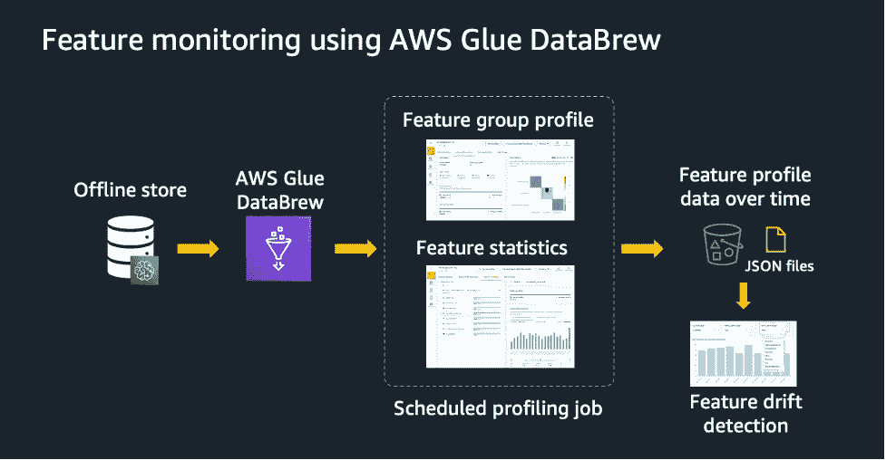

使用 AWS Glue DataBrew 进行特征监控(图片由作者提供)

Feature Store 是专门为 ML 功能管理构建的解决方案，可帮助数据科学团队跨团队和模型重用 ML 功能，以低延迟为大规模模型预测提供功能，并更快速有效地培训和部署新模型。

DataBrew 是一个可视化的数据准备工具，可以帮助您清理和规范化数据，而无需编写代码。DataBrew 还允许您指定在运行分析作业时为数据集自动生成哪些数据质量统计数据。这允许您自定义数据配置文件统计数据，例如根据数据集的性质和大小确定异常值和相关性，并创建仅包含满足您需求的统计数据的自定义数据配置文件概述。

将要素存储和数据构建结合使用时，您可以监控现有要素存储上的 ML 要素，查看要素数据随时间的分布，以及所有 ML 要素的要素数据质量，从而获得更高质量的 ML 模型。

在本文中，我们提供了两种配置 DataBrew 的方法:第一种是直接使用控制台，第二种是以编程方式。在较高层次上，您可以创建一个 DataBrew 数据集，该数据集连接到在 AWS 粘合数据目录中定义的要素组表，然后配置 DataBrew 配置文件作业以生成要素统计数据。然后，您可以使用 DataBrew 控制台仪表板来可视化特性统计数据、它们的分布以及其他自动生成的信息，以便更好地了解特性。

# 先决条件

在开始本教程之前，请确保您的 [AWS 身份和访问管理](http://aws.amazon.com/iam) (IAM) SageMaker 执行角色包含创建解决方案所需资源的权限。这包括访问亚马逊 S3、[亚马逊雅典娜](http://aws.amazon.com/athena)、 [AWS Glue](https://aws.amazon.com/glue) 和 DataBrew 操作。

在这篇文章中，我们使用了来自使用 [Faker](https://faker.readthedocs.io/) Python 库合成生成的客户列表的合成杂货订单。你可以按照[这个模块](https://github.com/aws-samples/amazon-sagemaker-feature-store-end-to-end-workshop/blob/main/01-module-feature-store-foundations/m1_nb0_prepare_datasets.ipynb)自己试试。对于每个客户，笔记本电脑会生成 1-10 个订单，每个订单中都会有购买的产品。目标是说明如何使用功能存储进行功能管理，以及如何使用 DataBrew 来监控这些功能。下面是使用[亚马逊 SageMaker Studio](https://docs.aws.amazon.com/sagemaker/latest/dg/studio.html) 控制台定义功能组的截图。

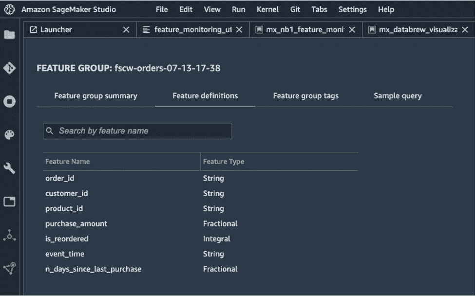

特征组定义(图片由作者提供)

功能存储在您的帐户中使用 S3 存储桶来存储离线数据。您可以针对亚马逊 S3 的离线数据存储使用类似 Athena 的查询引擎来分析要素数据或在单个查询中连接多个要素组。Feature Store 会在创建功能组的过程中自动为功能组构建一个数据目录，然后您可以使用 Athena 甚至像 [Presto](https://prestodb.io/) 这样的开源工具使用这个目录来访问和查询离线存储中的数据。

# 使用 DataBrew 控制台生成统计数据

在本节中，我们将详细介绍如何使用 DataBrew 控制台直接监控离线功能组。我们首先需要使用[CREATE TABLE AS SELECT(CTAS)](https://docs.aws.amazon.com/athena/latest/ug/ctas.html)从离线特性存储中将特性组表的快照创建到 Athena 中来自查询结果的新表中。关于 Athena 查询的更多示例，请参见[带有 Athena 和 AWS Glue 的查询特征库](https://docs.aws.amazon.com/sagemaker/latest/dg/feature-store-athena-glue-integration.html)。我们创建的快照只包含最新的特性组记录，没有任何已删除的记录，并将其作为 DataBrew 提供的分析功能的输入。这个快照很重要，因为离线存储包含整个功能历史。特征轮廓必须集中在给定时间点的特征上。同样，特征漂移检测只有在比较一系列特征轮廓时才有意义。

要为离线功能存储的快照创建 DataBrew 数据集，请完成以下步骤:

1.  在 DataBrew 控制台的导航窗格中，选择**数据集**。
2.  选择**连接新数据集**。
3.  选择存储离线功能商店快照的 AWS Glue 表(对于本文，*fscw-orders-07–13–17–38–1626198069-ctas-temp*)。
4.  选择**创建数据集**。

重复这些步骤，为离线要素存储中的其他要素组创建数据集。

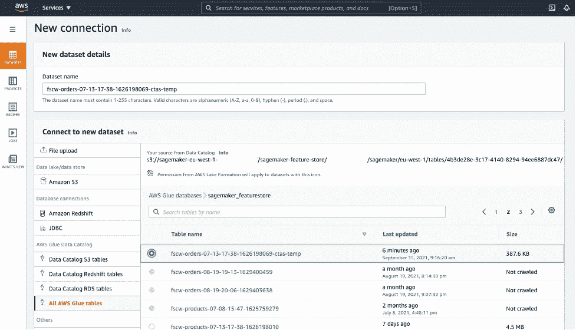

数据集创建(图片由作者提供)

1.  在 DataBrew 控制台上，选择**数据集**。
2.  选择您之前创建的数据集之一(*fscw-orders-07–13–17–38–1626198069-ctas-temp*)。
3.  选择运行数据配置文件。
4.  选择**创建轮廓作业**。
5.  在配置文件作业的配置中，选择要存储配置文件作业输出的亚马逊 S3 位置。
6.  在**数据配置细节**中，选择您想要生成的所有数据质量统计。
7.  在**权限**下，对于**角色名称**，选择您的 IAM 角色具有访问数据的 DataBrew 权限。
8.  选择**创建并运行任务**。

**数据集**页面有以下选项卡帮助您浏览数据:

*   **数据集预览** —包含关于数据集源的信息
*   **数据概要概述** —包含数据集级别的概要统计
*   **列统计** —包含列级别的详细统计
*   **数据沿袭** —包含带有数据流的可视化图表

让我们更详细地看一下每个选项卡。

**数据集预览**选项卡显示数据集的信息、位置和创建日期，以及数据集整体结构的概述。

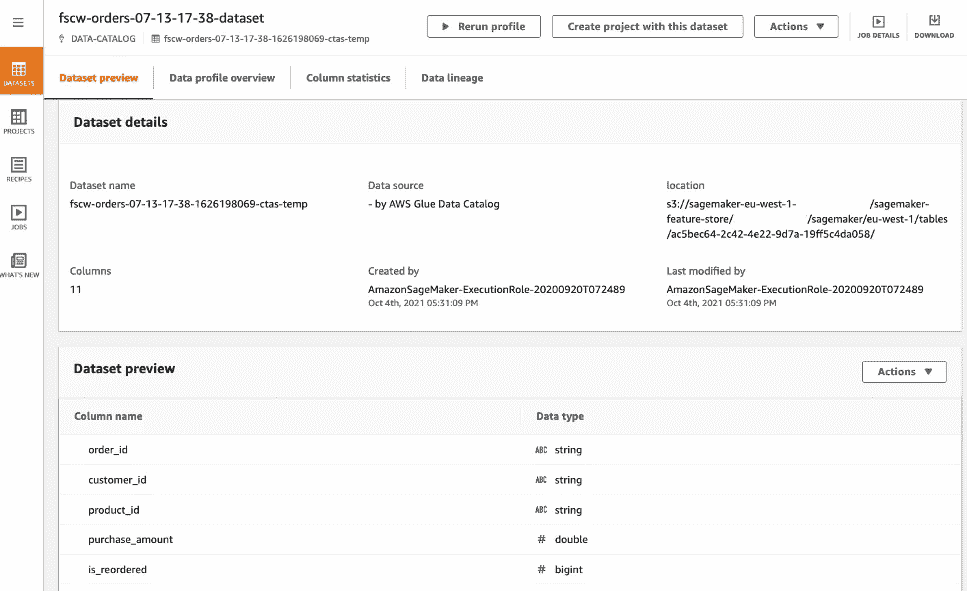

数据集预览(图片由作者提供)

**Data profile overview** 选项卡包含数据集的统计和体积的图形数据配置文件。它包括总行数、缺失像元的百分比、重复行以及显示要素之间关系的关联矩阵。

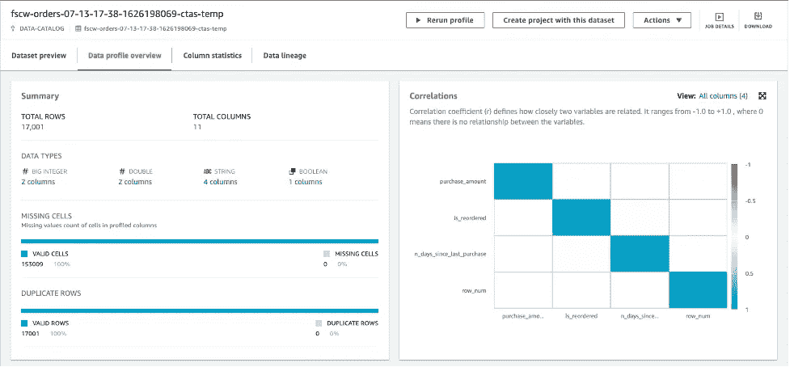

数据集简介概述(图片由作者提供)

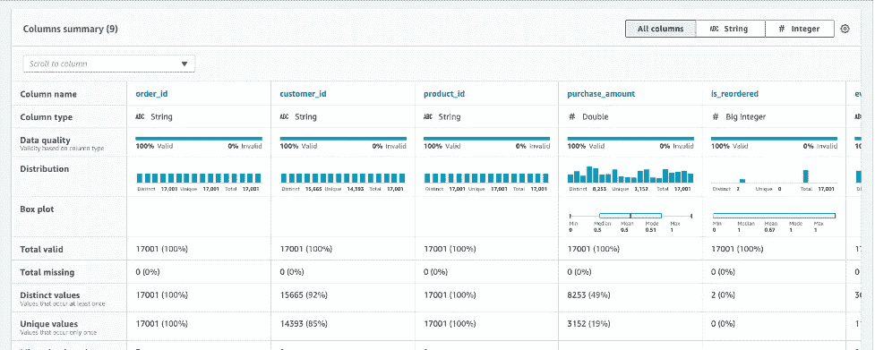

数据集概要概述-列摘要(作者提供的图片)

在**列统计数据**选项卡上，您可以找到关于数据集中每一列的详细统计数据，例如值分布、标准偏差、前几个不同的值以及其他数据洞察。

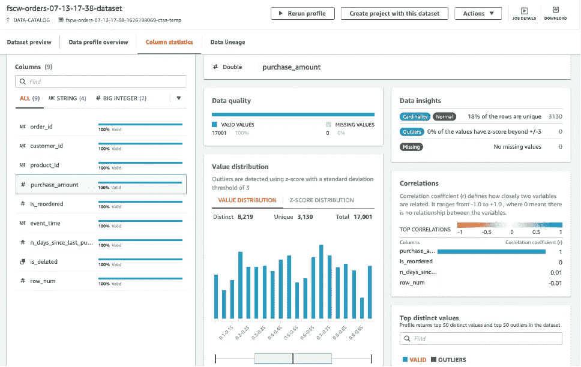

列统计(图片由作者提供)

所有质量结果的列表也可以作为 JSON 报告文件在您的 S3 存储区中获得。从 DataBrew profile job details 页面，我们还可以下载生成的报告，格式为 JSON、PNG 或 PDF 文件。

# 以编程方式监控功能

您可以使用 AWS APIs 自动执行上一节中描述的创建 DataBrew 概要分析数据和统计信息的所有步骤。在这一节中，我们将介绍可以在 Studio 中运行的 Jupyter 笔记本中实现的功能。

第一个函数`*feature_monitoring_prep*`准备 DataBrew 用来运行分析作业的数据集。该函数执行以下步骤:

*   使用 CTAS 根据查询结果将离线要素存储中的要素组表快照创建到 Athena 的新表中。快照表仅包含最新的要素组记录，不包含已删除的记录。
*   创建并运行一个 AWS Glue crawler 来抓取快照表。需要首先对该表进行爬网，以便在创建 DataBrew 数据集时该表可用作数据源。
*   通过将 DataBrew 数据集连接到前面步骤中创建的 AWS Glue 表来创建它。
*   配置 DataBrew 配置文件作业。

下面是一个示例代码片段，展示了我们如何使用一些输入参数(如要素组名称、S3 桶和存储结果的键)来调用此函数:

`*response_brew_prep = feature_monitoring_utils.feature_monitoring_prep(
orders_feature_group_name,
results_bucket,
results_key
)*`

现在，功能监控的准备步骤已经完成，我们可以调用下一个函数`*feature_monitoring_run*`，运行 DataBrew profile 作业，评估数据集并创建统计数据。您可以在不同的时间间隔连续运行该功能多次，以生成单独的相应报告。在这种情况下，它会自动重新创建用作 DataBrew 数据集输入的快照表。

`*response_brew_job = feature_monitoring_utils.feature_monitoring_run(
orders_feature_group_name
)*`

该函数仅将特性组名称作为输入参数，并返回由 DataBrew 配置文件作业生成的 JSON 报告的 S3 位置，以及包含报告可视化的 DataBrew 控制台的 URL。您可以选择笔记本中显示的链接，在新的浏览器选项卡中打开 DataBrew 控制台，以查看质量统计可视化。

作为该功能的一部分，DataBrew 控制台的 URL 和亚马逊 S3 中 DataBrew JSON 报告文件的位置都作为标签添加到功能组中。这允许您访问特征组以发现和检索质量统计报告的位置。同样，您可以随时将配置文件 URL 标记值直接复制并粘贴到您的 web 浏览器中，以在 DataBrew 控制台上显示报告。

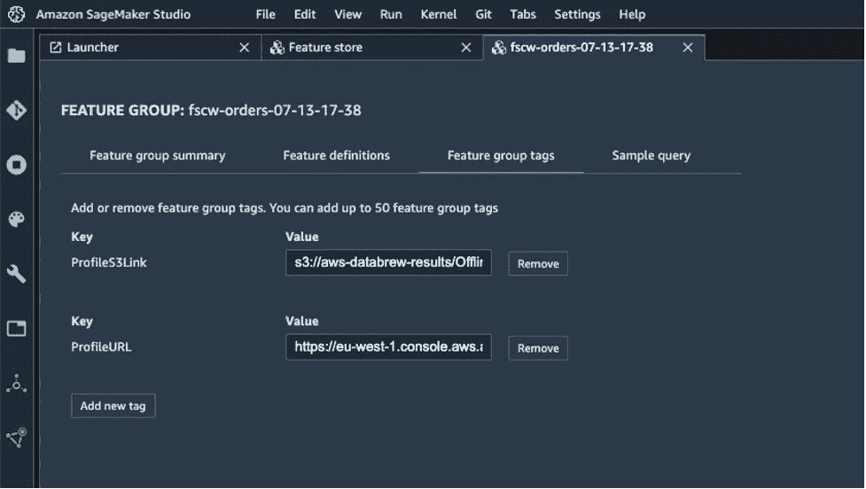

要素组标签(图片由作者提供)

[本笔记本](https://github.com/aws-samples/amazon-sagemaker-feature-store-end-to-end-workshop/blob/main/07-module-feature-monitoring/m7_nb1_feature_monitoring.ipynb)根据 DataBrew 质量统计生成的报告，提供了一些功能和趋势的可视化示例。

附加功能`consolidate_monitor_reports`扫描包含 DataBrew 质量统计 JSON 报告文件的 S3 文件夹位置，并将这些文件合并成一个单独的 [pandas](https://pandas.pydata.org/) DataFrame。该数据帧还被导出为平面 CSV 文件，以便由其他可视化或 BI 工具(如 [Amazon QuickSight](https://aws.amazon.com/quicksight/) )进行进一步分析。将所有报告合并到一个地方的目的是帮助检测特征的质量统计的变化。

`consolidate_monitor_reports`函数将功能组名称、存储合并结果的 S3 存储桶和文件夹以及用于选择最新报告子集的开始日期作为输入。它返回整合的 DataFrame 对象和生成的 CSV 文件的 S3 位置。

`*response_consolid = feature_monitoring_utils.consolidate_monitor_reports(
orders_feature_group_name,
results_bucket,
consolidated_results_key,
start_date
)*`

以下屏幕截图显示了整合数据框架的示例视图。这是对`purchase_amount`特性名称的提取，包含了从 DataBrew JSON 报告中收集的所有质量统计数据。我们可以观察到熵或标准差的值随着时间而变化。

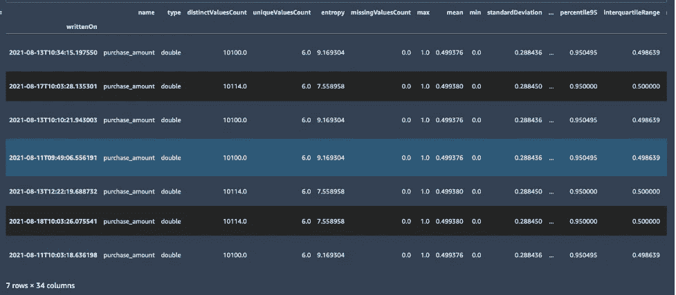

特征统计数据框架(图片由作者提供)

# 可视化随时间推移的要素漂移

在笔记本中，我们还提供了一个示例可视化功能`plot_profiling_data`，以便轻松显示特定功能随时间的变化。该函数将全局数据帧、要监控的特征和特定的统计数据(如熵、平均值或标准偏差)作为输入。您还可以使用自己喜欢的 Python 库创建自己的可视化。

下面是一个简单的曲线图，显示了`purchase_amount`特性的`entropy`随时间的变化:

`*feature_monitoring_utils.plot_profiling_data(
analysis_data,
feature_name = 'purchase_amount',
['entropy']
)*`

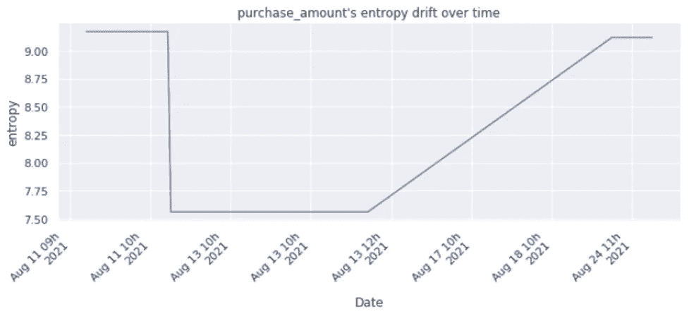

特征的熵随时间漂移(图片由作者提供)

现在我们显示了`purchase_amount`特性的多个质量统计(`entropy`和`standardDeviation`)随时间的演变:

`*feature_monitoring_utils.plot_profiling_data(
analysis_data,
feature_name = 'purchase_amount',
['entropy', 'standardDeviation'],
multiple_plots = True
)*`

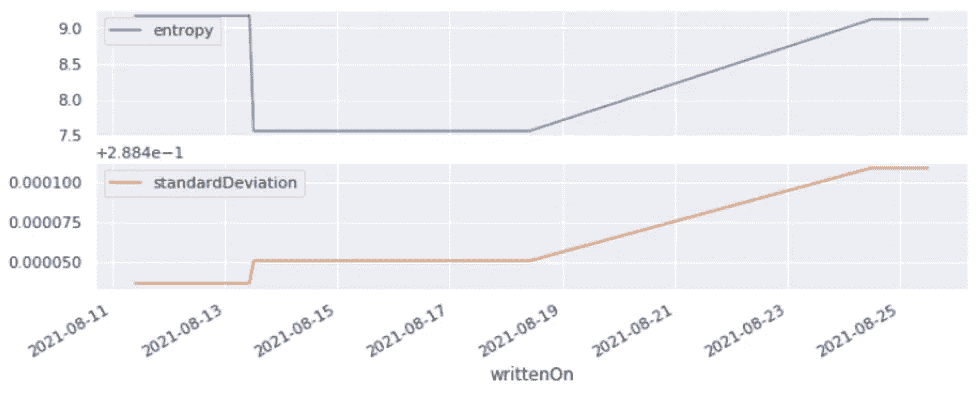

要素的多重统计随时间漂移，多重绘图(图片由作者提供)

如果我们想比较同一张图上具有两个不同比例的`purchase_amount`特征的两个统计值(`entropy`和`standardDeviation`)随时间的演变，我们在调用`*plot_profiling_data*`函数时使用`*multiple_plots = False*`。

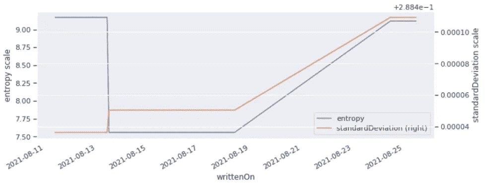

要素的多重统计随时间漂移(图片由作者提供)

通过这种方法，您还可以创建一个管道或工作流解决方案，以完全自动化对现有功能库的功能监控。除了查看功能统计数据和创建显示您的功能如何随时间变化的仪表板之外，您还可以使用其他 AWS 服务来扩展解决方案，以配置警报和阈值，从而关注超出可接受范围的功能。这样，功能组的所有者可以采取措施，如调整功能转换以解决数据质量问题，甚至引入新功能。模型利益相关者可以得到关于大的特征漂移或违反约束的警告，并且可以重新训练他们的模型以获得更精确的预测。

要探索完整的代码示例，并在您自己的帐户中试用，请参见 [GitHub repo](https://github.com/aws-samples/amazon-sagemaker-feature-store-end-to-end-workshop) 。

# 结论

Feature Store 提供专门构建的功能管理解决方案，帮助组织跨业务部门和数据科学团队扩展 ML 开发。在这篇文章中，我们解释了如何使用 DataBrew 在现有的特性存储上启用特性监控。将功能存储和数据构建结合使用时，可以查看功能统计数据，还可以创建仪表板来显示功能随时间的变化情况。通过提供对数据组成和质量的深入了解，在团队之间推动更多的功能重用，从而帮助建立信任，这将产生更高的模型准确性和更快的上市时间。试一试吧，在评论中告诉我们你的想法。