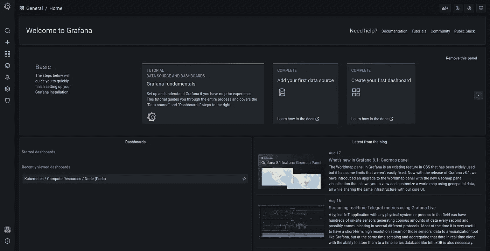

# 云本地架构中的监控和可观察性

> 原文：<https://towardsdatascience.com/monitoring-and-observability-in-cloud-native-architectures-54e68e52b103?source=collection_archive---------34----------------------->

## 为什么监控对于云原生应用程序至关重要？有哪些工具可以完成这项工作？


图片由[皮克斯拜](https://pixabay.com/?utm_source=link-attribution&utm_medium=referral&utm_campaign=image&utm_content=2030266)的康斯坦丁·科洛索夫拍摄

想象一下被囚禁在一个没有窗户、没有日历和挂钟的牢房里。此外，你没有访客，你唯一的同伴是一个不喜欢闲聊的警卫。我知道这是一个非常黑暗的场景，但是请原谅我。

你有一个目标:找出季节(例如，夏天或秋天)以及外面是白天还是晚上。你怎么能这样做？你可以观察警卫的行为，他穿什么，吃什么食物，他晒黑了吗？如果他戴着太阳镜，那么也许现在是夏天，外面阳光明媚。如果他穿着外套，那么也许我们正处于隆冬。这就是我们所说的黑箱监控。

历史上，我们使用黑盒监控来推断问题的原因。我们有磁盘错误吗？我们是否观察到 CPU 使用率的峰值？但是试图通过监控系统的间接数据来提高应用程序的性能并不是理想的方法。我们可以做得更好！让我们打开一扇窗，要求我们应得的电话。

这个故事介绍了我们现在可以用来监控云原生应用程序性能的工具，以及如何将它们安装在 Kubernetes 集群中。在另一个故事中，我们将看到如何正确地使用它们来构建一个仪表板，它可以揭示我们的宠物项目内部正在发生的事情。

> [Learning Rate](https://www.dimpo.me/newsletter?utm_source=medium&utm_medium=article&utm_campaign=monitoring) 是一份时事通讯，面向那些对 AI 和 MLOps 世界感到好奇的人。你会在每周五收到我关于最新人工智能新闻和文章的更新和想法。订阅[这里](https://www.dimpo.me/newsletter?utm_source=medium&utm_medium=article&utm_campaign=monitoring)！

# 监控与可观察性

在本文中，我们关心的是工程师方面的情况。因此，当错误发生时，开发人员需要正确的反馈，以便他们知道应该修复什么。他们可以通过正确的监控和观察工具来实现。但是有什么区别呢？

> **我们监控系统并观察应用**

## 监视

在监控中，我们关注的是系统本身。例如，在云环境中，系统很可能是一个 Kubernetes 集群。然而，监控不会告诉我们应用程序内部发生了什么。它会给出诸如内存可用性低之类的指标，但它不会帮助我们查明问题的原因。

## 可观察性

在可观察性中，我们可以直接进入我们的应用程序，观察它的各种过程和功能。我们可以看到服务如何执行以及它们如何交互。然后，我们可以揭示几个问题或发现优化，使我们的应用程序性能更好。

根据经验，请记住:**我们监控系统并观察应用**。你还会听到人们使用术语*可观测性*来对这两个概念进行分组(即监控*和*可观测性)。

# 可观察性工具

专家们常用的堆栈可观测性包括[普罗米修斯](https://prometheus.io/)、[格拉夫纳](https://grafana.com/)和[耶格](https://www.jaegertracing.io/)。

Prometheus 是领先的开源监控解决方案。它是由 SoundCloud 在 2012 年创建的，属于云本地计算基金会(CNCF)。Prometheus 收集系统信息，有一个时间序列数据库和自己的查询语言，称为 PromQL。此外，普罗米修斯有自己的内置警报工具。

优步在 2015 年创造了耶格，它也属于 CNCF。与 Prometheus 不同，Jaeger 收集应用程序信息，并提供分布式跟踪系统。

Grafana 是一个可视化平台，允许您构建直观的仪表板。它支持时序数据库，因此经常与 Prometheus 捆绑在一起。而且，你可以用插件来扩展 Grafana。

# 装置

要使用这些工具，我们需要将它们安装在 Kubernetes 集群中。因此，首先，要生成一个 Kubernetes 实例，我们可以使用 [K3s](https://k3s.io/) 。要安装 K3s，请执行以下命令:

```
curl -sfL https://get.k3s.io | sh -
# Check for Ready node, takes maybe 30 seconds
k3s kubectl get node
```

接下来，我们将使用头盔安装普罗米修斯和格拉夫纳。所以，让我们安装头盔:

```
curl https://raw.githubusercontent.com/helm/helm/master/scripts/get-helm-3 | bash
```

为了在我们的应用程序和可观察性堆栈之间创建一些分离，我们可以创建一个新的名称空间。姑且称之为*监控*:

```
kubectl create namespace monitoring
```

我们现在准备安装普罗米修斯。执行以下命令:

```
helm repo add prometheus-community [https:*//prometheus-community.github.io/helm-charts*](https://prometheus-community.github.io/helm-charts)helm repo add stable [https:*//charts.helm.sh/stable*](https://charts.helm.sh/stable)helm repo updatehelm install prometheus prometheus-community/kube-prometheus-stack --namespace monitoring --kubeconfig /etc/rancher/k3s/k3s.yaml
```

要验证您的安装，运行`kubectl get pods -n monitoring`。您应该会看到 6 个豆荚即将准备就绪。您现在可以运行端口转发命令来查看 Grafana 仪表板:

```
kubectl port-forward prometheus-grafana-5855d975d8-495bn --address 0.0.0.0 3000:3000 -n monitoring
```

导航到`127.0.0.1:3000`；用户名为`admin`，默认密码为`prom-operator`。



欢迎来到 Grafana——作者图片

最后，让我们在集群中安装 Jaeger。我们将使用官方 [Jaeger GitHub 仓库](https://github.com/jaegertracing/jaeger)中的文件。为了安装 Jaeger，我们将创建一个新的*可观察性*名称空间:

```
kubectl create namespace observability
```

然后，运行以下命令:

```
kubectl create -f [https://raw.githubusercontent.com/jaegertracing/jaeger-operator/master/deploy/crds/jaegertracing.io_jaegers_crd.yaml](https://raw.githubusercontent.com/jaegertracing/jaeger-operator/master/deploy/crds/jaegertracing.io_jaegers_crd.yaml)kubectl create -n observability -f [https://raw.githubusercontent.com/jaegertracing/jaeger-operator/master/deploy/service_account.yaml](https://raw.githubusercontent.com/jaegertracing/jaeger-operator/master/deploy/service_account.yaml)kubectl create -n observability -f [https://raw.githubusercontent.com/jaegertracing/jaeger-operator/master/deploy/role.yaml](https://raw.githubusercontent.com/jaegertracing/jaeger-operator/master/deploy/role.yaml)kubectl create -n observability -f [https://raw.githubusercontent.com/jaegertracing/jaeger-operator/master/deploy/role_binding.yaml](https://raw.githubusercontent.com/jaegertracing/jaeger-operator/master/deploy/role_binding.yaml)kubectl create -n observability -f [https://raw.githubusercontent.com/jaegertracing/jaeger-operator/master/deploy/operator.yaml](https://raw.githubusercontent.com/jaegertracing/jaeger-operator/master/deploy/operator.yaml)
```

就是这样！现在您已经有了一个安装了行业标准可观察性工具的 Kubernetes 集群。

# 序

在这个故事中，我们看到了什么是黑盒监控，以及它与白盒监控的对比。我们看到了什么是可观察性和监控，它们的区别，以及它们带来了什么。

最后，我们看到了如何创建一个 Kubernetes 集群并安装 Prometheus、Jaeger 和 Grafana，它们是用于监视和观察的行业标准工具。

在后面的故事中，我们将看到如何正确地使用它们来构建一个仪表板，它可以揭示我们的宠物项目内部正在发生的事情。

# 关于作者

我的名字是[迪米特里斯·波罗普洛斯](https://www.dimpo.me/?utm_source=medium&utm_medium=article&utm_campaign=monitoring)，我是一名为[阿里克托](https://www.arrikto.com/)工作的机器学习工程师。我曾为欧洲委员会、欧盟统计局、国际货币基金组织、欧洲央行、经合组织和宜家等主要客户设计和实施过人工智能和软件解决方案。

如果你有兴趣阅读更多关于机器学习、深度学习、数据科学和数据操作的帖子，请关注我的 [Medium](https://towardsdatascience.com/medium.com/@dpoulopoulos/follow) 、 [LinkedIn](https://www.linkedin.com/in/dpoulopoulos/) 或 Twitter 上的 [@james2pl](https://twitter.com/james2pl) 。

所表达的观点仅代表我个人，并不代表我的雇主的观点或意见。