# 监控和重新训练你的机器学习模型

> 原文：<https://towardsdatascience.com/monitoring-and-retraining-your-machine-learning-models-f385b596b285?source=collection_archive---------16----------------------->

## [实践教程](https://towardsdatascience.com/tagged/hands-on-tutorials)

## 有了谷歌数据工作室、lakeFS 和远大前程


由[内森·杜姆劳](https://unsplash.com/@nate_dumlao?utm_source=medium&utm_medium=referral)在 [Unsplash](https://unsplash.com?utm_source=medium&utm_medium=referral) 上拍摄的照片

像生活中的一切一样，机器学习模型会变得陈旧。在一个不断变化、非稳定数据的世界中，每个人都需要偶尔回到学校并循环利用自己，你的模型也不例外。

嗯，我们知道重新训练我们的模型是重要的，但是我们应该什么时候做呢？如果我们做得太频繁，我们最终会浪费宝贵的时间和精力，但是很少做肯定会影响我们预测的质量。不幸的是，没有放之四海而皆准的答案。应该仔细评估每个案例，以确定陈旧性的影响。

在这篇文章中，我想分享我在一个个人项目中监控和再培训的方法:一个假新闻检测器 web 应用程序。我绝不是这方面的专家，所以如果你有任何建议或考虑，请随时联系。

## 应用程序

我们简单的 web 应用程序基本上是一个假新闻检测器:用户能够输入一篇新闻文章的 URL，系统将输出它的预测结果:它是假的还是真的。

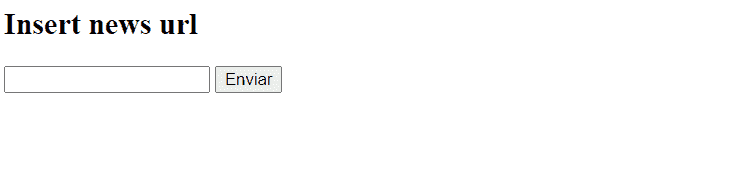

作者 Gif

对于每个输入，系统将预测结果和附加元数据记录在位于 **GCP** 的 **BigQuery** 表中。这些数据将用于监控我们模型的性能，并在需要时对其进行重新训练。

本文分为两部分:**监控**和**再培训。**

首先，我将讲述我如何使用 **BigQuery** 的预测日志来建立一个 **Google Data Studio** 仪表板，以便有一些更新的图表和指标来评估我的文本分类模型的健康状况。

在**再培训**部分，我将展示我是如何处理数据版本化来管理每个再培训实验的数据和模型工件，同时保持数据质量。为此，我使用了[**lakeFS**](https://lakefs.io/)**[**远大前程**](https://greatexpectations.io/)**[**W&B**](https://wandb.ai/)**等工具。本部分讨论的所有内容都可以在[项目的资源库](https://github.com/FelipeAdachi/fake-news-experiments/blob/main/src/retrain/assert_commit_retrain.py) *中找到。*******

# ****监视****

****让我们先来看看`model_predictions`表的模式:****

*   ******标题(字符串):**新的标题。****
*   ******内容(字符串):**新的文本内容。****
*   ******模型(字符串):**生成预测的模型的名称。****
*   ******预测(字符串):**模型的预测—“真”或“假”。****
*   ******置信度(FLOAT):** 模型预测的置信度。从 0 到 1。****
*   ******url(字符串):**新的 url。****
*   ******预测日期(日期时间):**进行预测的日期和时间。****
*   ******ground_truth (STRING):** 以 NULL 开始，在一个标注过程中可以更改为“真”或“假”。****
*   ******coverage (FLOAT):** 新闻中出现在模型词汇中的单词的百分比。****
*   ******word_count(整数):**新闻的字数。****

****这些字段都是在我们的应用程序为预测的在线请求提供服务时计算的。如果你有兴趣知道这些指标最初是如何计算的，你可以看看[项目的资源库](https://github.com/FelipeAdachi/fake-news-deploy)中的`app.py`。****

****从这些字段中，我们可以使用 Google Data Studio 设置一个在线仪表板，以持续监控我们预测模型的一些指标:****

****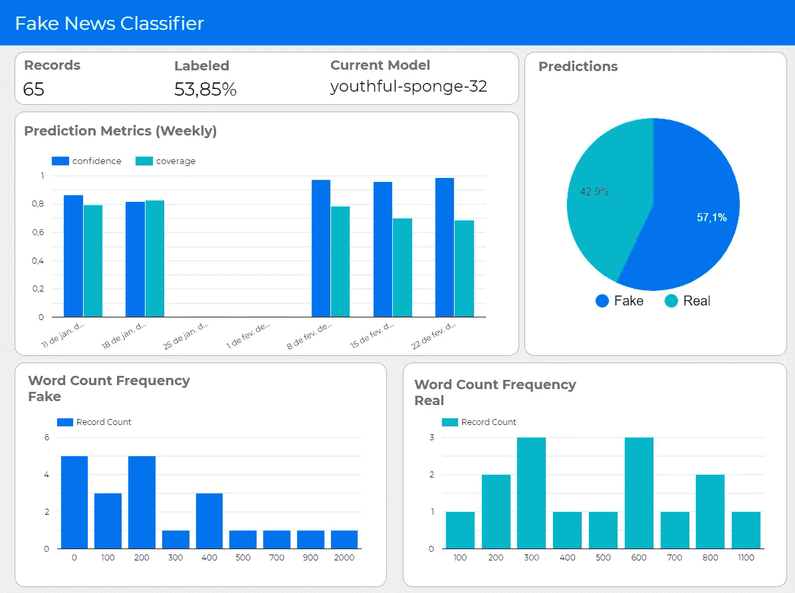****

****作者图片****

****Data Studio 有一个非常直观的界面。在这个例子中，我们只使用了一个数据源，即 BigQuery 中的`model prediction`表。因此，从一个空白的仪表板，我们可以通过简单地点击顶部的**添加数据**按钮，然后选择 BigQuery 选项来添加数据源。****

****我选择不显示与`ground_truth`相关的图表，因为如果近期没有重新训练模型的意图，这个字段可能经常为空。但是如果不断地做标记，一个**混淆矩阵**将会是我们仪表板的一个很好的补充。****

****在这个例子中，由于我没有大量的记录，我们不应该从这些数字中得出任何统计结论。希望在未来，随着更多的每日预测，这些图表将提供更多的信息。尽管如此，让我们逐一讨论这些指标:****

## ****记录****

****这仅仅是应用程序到目前为止提供的预测数量。要创建它，请转到**在顶部添加图表**并选择**记分卡。**选择您的表作为**数据源**，选择**记录计数**作为**指标。******

## ****有标签的****

****这是已手动标记的记录的百分比。这对下一步的再培训很重要。没有地面真相，你不能重新训练你的模型。****

****像**记录一样，**这也是一个**记分卡。**但是对于这一个，您必须创建一个新的计算字段，方法是单击记分卡的**数据**选项卡底部的**添加字段**:****

****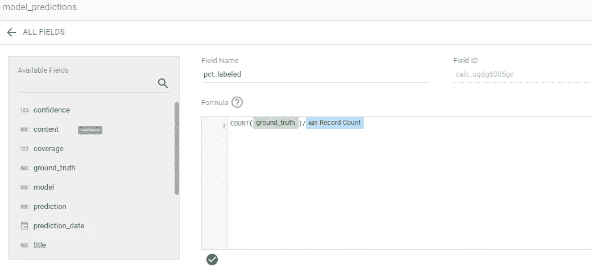****

****作者截图****

****然后，选择新创建的字段作为您的**指标，就像前面的**一样。****

## ****当前模型****

****上一个预测模型的名称。假设我们只有一个应用程序，并且一次只能有一个模型。****

****这个指标实际上是一个**表**图，而不是一个**记分卡**。作为**维度，**选择`model`和`prediction_date`，然后将**每页行数**设置为 1，然后将`prediction_date`按**降序**排序。然后你应该在**样式**标签中隐藏所有可能的东西。****

## ****预言****

****真实/虚假预测的百分比。****

****要创建它，请转到**添加图表→饼图。**选择`prediction`作为**尺寸**，选择**记录 _ 计数**作为**公制，**就可以了。****

## ****预测指标****

****该图显示了每周两个值的平均值:`confidence`和`coverage` **。**由此，我们应该能够看到模型对其预测的信心水平发生了不寻常的变化，以及有多少新闻出现在经过训练的模型的词汇中。如果`coverage`有下降的趋势，并且低于预定的阈值，可能是时候重新训练它了。****

****这是一个**时间序列。**在**尺寸**字段，在小日历图标处，您应该可以设置周期。我选择了 **ISO 年周。**作为**度量，**选择`confidence`作为第一个度量， **AVG** 作为度量的聚合。然后，进入**添加公制**并在**样式**选项卡对`coverage.`进行同样的操作，您可以将两个系列从**线条**更改为**条**并设置它们的颜色。****

## ******字数统计频率******

****该图表根据每个预测类别，按字数对记录进行分组。即使我们需要更多的数据来真正掌握字数分布，但似乎假新闻通常比真新闻短。****

****另一个奇怪的细节是，有 5 个字数在 0-100 之间的假预测。对于一条新闻来说，这似乎有点低，这促使我进一步调查。我最终发现，这些记录是从同一个网站提取的，它们都有一个解析错误。内容不是真正的新闻，而是一条错误消息。这很重要，我们应该确保这些类型的记录永远不会被吸收到我们的训练测试数据集中。****

****这是我在数据工作室制作直方图的最接近的一次。要创建一个，请转到**图表→条形图，**并在**数据**选项卡的底部添加一个新字段。在公式字段中，输入:****

****`FLOOR(word_count/100)*100`****

****对于每条记录，字数会除以 100，然后将结果的最大整数值乘以 100。这将把记录放入数百个容器中。我将该字段命名为`wc_bin`。您可以使用它作为**尺寸，**和**记录计数**作为**度量。**您还应该将**排序**设置为**上升**，并选择`wc_bin`。****

****要将直方图分成假的和真的，你可以去**添加一个过滤器，**排序正下方的**，**并插入一个过滤器，如下所示:****

**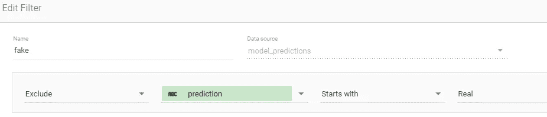**

**作者截图**

**对下一个类别做相反的事情。**

# **再训练**

**好了，现在我们有了一个检查模型健康状况的方法。如果有什么异常，我们可以开始标记一些记录，并查看一些重要的分类指标，如**精度、召回率和 F 值。如果你对结果不满意，我们应该开始重新训练模型。****

## **概观**

**下图是我为这个项目设置的再培训流程的概述:**

**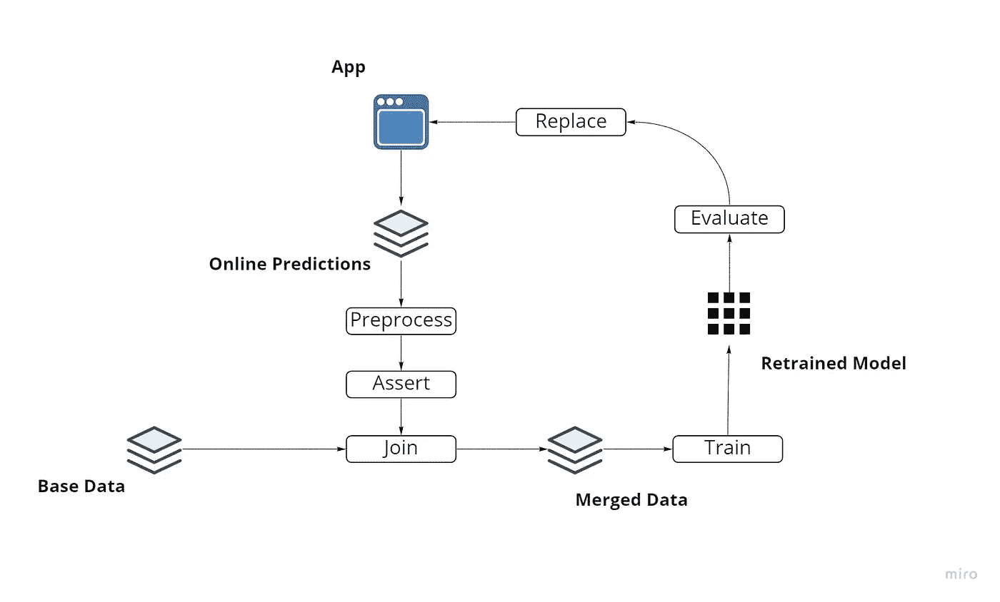**

**作者图片**

**我们有我们的**基础数据**，我们用来训练我们的第一个预测模型的[原始数据集](https://www.kaggle.com/clmentbisaillon/fake-and-real-news-dataset)。此外，该应用程序还不断向我们提供在线预测的数据。因此，为了重新训练模型，我们可以提取这些数据并做一些简单的预处理，如删除重复的新闻。验证我们的数据并确保它符合我们对数据形状和分布的一些假设也是非常重要的。然后，我们继续连接两个数据源，最终重新训练模型。在替换旧模型之前，我们必须用测试集来评估新训练的模型，以确保其质量。**

**每次我们希望重新训练模型时，我们都遵循这些步骤。但是如果我们在将来发现有问题，我们如何调试我们的模型呢？要做到这一点，除了模型的性能结果和生成它的代码之外，我们还需要一种有序的方式来存储我们的模型和数据工件。**

## **使用 LakeFS 进行数据版本控制**

**管理 ML 应用程序中的数据管道不是一件容易的事情。不像传统的软件开发，GIT 已经成为代码版本化的标准，数据版本化仍然处于早期阶段，没有一个“确定的”方法。**

**我决定将每个再训练过程视为一个单独的实验，并将每个实验的工件存储在一个单独的分支中。这与我们习惯的代码版本化有点不同，因为在这种情况下，我不期望将分支合并回主干。它们是短命的分支，目的是根据不同的再训练实验对我们的工件——数据集和模型——进行版本控制。**

**尽管有许多提供数据版本控制功能的 MLOps 工具，例如 [**MLflow**](https://mlflow.org/) 和 [**W & B**](https://wandb.ai/home) ，但是我选择将[数据版本控制作为基础设施](https://lakefs.io/data-versioning-as-an-infrastructure/)，通过在我的对象存储上启用类似 Git 的操作。为此，我决定试用最近发布的 [**lakeFS**](https://lakefs.io/) ，它使我能够在我现有的 S3 对象存储之上添加类似 Git 的引擎。这样，我的项目数据版本控制能力独立于我将来可能添加或替换的任何工具。**

## **预备步骤—部署 lakeFS**

**您可以在这里找到设置 lakeFS 环境的说明。**

**我基本上不得不:**

1.  **[在 AWS RDS 上创建 PostgreSQL 数据库](https://docs.lakefs.io/deploying/db.html)**
2.  **为我的存储库配置一个 S3 存储桶**

*   **对于策略的主体，我创建了一个用户并为其创建了访问密钥。我还将使用这个用户向 AWS 认证 lakeFS。你可以在这里阅读更多关于[的内容，在这里](https://docs.aws.amazon.com/AmazonS3/latest/userguide/walkthrough1.html)阅读更多关于[的内容。](https://docs.aws.amazon.com/IAM/latest/UserGuide/id_credentials_access-keys.html)**

**3.[安装 lakeFS](https://docs.lakefs.io/deploying/install.html)**

*   **我选择通过 Docker 安装它，命令如下:**

```
docker run --name lakefs -p 8000:8000
-e LAKEFS_DATABASE_CONNECTION_STRING="<postgres-connection-str>"
-e LAKEFS_AUTH_ENCRYPT_SECRET_KEY="<lakefs-secret-key>"
-e LAKEFS_BLOCKSTORE_TYPE="s3"
-e LAKEFS_GATEWAYS_S3_DOMAIN_NAME="s3.local.lakefs.io"
-e LAKEFS_BLOCKSTORE_S3_CREDENTIALS_ACCESS_SECRET_KEY="<s3-secret-key>"
-e LAKEFS_BLOCKSTORE_S3_CREDENTIALS_ACCESS_KEY_ID="<s3-access-key>" -e LAKEFS_BLOCKSTORE_S3_REGION="<s3-region>" treeverse/lakefs:latest run
```

**其中`postgres-connection-str`是您在创建 PostgreSQL DB 时获得的连接字符串，`lakefs-secret-key`是任意随机生成的字符串(别忘了)，`s3-secret-key`和`s3-access-key`是您之前为 AWS 用户创建的密钥对，`s3-region`是您创建的 bucket 的区域。**

**4.[设置](https://docs.lakefs.io/deploying/setup.html)**

**在 **localhost:8000** 中，在设置了新的管理员用户并创建了存储库之后，您应该能够看到您的存储库列表:**

**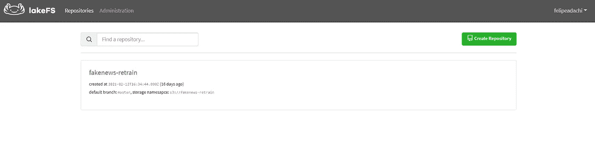**

**作者截图**

## **再培训过程**

**现在我们已经设置好了一切，我们需要将流程图转化为一系列步骤并实现它。我们基本上需要:**

*   **从在线预测中获取数据( **BigQuery** )**
*   **清理并断言数据质量(**巨大的期望**)**
*   **从 master ( **lakeFS** )创建新的分支**
*   **将在线预测上传到新分支( **lakeFS** )**
*   **从主支行( **lakeFS** )获取基础数据**
*   **将在线预测连接到基础数据，并拆分为训练测试数据集**
*   **将列车测试拆分上传至分支( **lakeFS** )**
*   **用更新的数据集训练模型**
*   **记录实验/结果( **W & B****
*   **上传模型和词汇到分支( **lakeFS** )**
*   **将更改提交到分支( **lakeFS** )**

## **数据结构**

**至于我们的数据结构，我们将把我们的原始数据集以及从 web 应用的在线预测中提取的数据定义为`external`数据。一旦外部来源被组合并分成适当的训练测试集，文件夹`interim`将保存我们的数据。模型文件也将存储在它们自己的文件夹中。**

**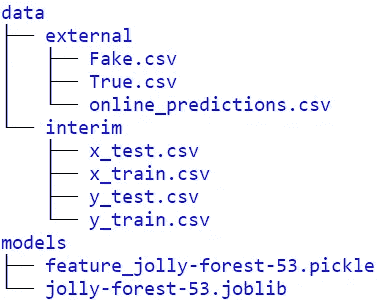**

**作者图片**

## ****从生产中获取数据****

**首先，我们需要从 BigQuery 表中获取新数据。为了使用 Python APIs 访问 BigQuery，我需要 JSON 格式的 GCP 凭证。创建项目后，您可以按照本 [Google 文档](https://cloud.google.com/docs/authentication/getting-started)中*“创建服务帐户”*的说明下载您的凭证。**

**然后，安装`google-cloud-bigquery`,设置一个指示凭证位置的环境变量，并启动 BigQuery 客户机，这样就可以查询表了。在这种情况下，`sunny-emissary-293912`是我的项目的名称，`fakenewsdeploy`是我的数据集的名称，`model_predictions`是我的表的名称。**

## **清洁和维护质量**

**我们应该始终确保存储数据的质量。一个很好的方法就是使用工具<https://greatexpectations.io/>**。在我做了一些非常简单的清理之后，比如删除重复的新闻和字数少的新闻，我们可以对我们的数据做一些基本的假设。****

****在这个例子中，如果我们的数据通过了一些验证，我们将继续我们的再训练。`ground_truth`应该只假设`Fake`或`Real`值，`url`值应该是唯一的，并且每个样本应该有一个非空的`content.`。此外，我们假设必须调查过低的`coverage`，因为它可能是解析错误的迹象，或者可能是另一种语言的内容。最后，`word_count`应该高于 100，正如我们在本文的**监控**部分所讨论的。****

****然后我们可以生成一个`expectation_suite`，它给我们一个 JSON 文件，显示我们的数据通过的验证。我们还应该确保存储这些信息以供将来参考(这将在序列中完成)。****

****我们只是带着巨大的期望触及了表面。查看他们的网站[以了解更多功能。](https://greatexpectations.io/)****

## ****创建新分支****

****既然我们信任我们的数据，我们可以将它存储在一个新创建的分支中。在这个项目的 [**建模/评估**的前期，我用 **W & B** 来跟踪我的实验。我会在再训练过程中继续使用它，和 lakeFS 一起使用。这样，实验标识符就是 wandb 的运行名，为了创建分支，我将使用相同的名称:](/how-i-learned-to-stop-worrying-and-track-my-machine-learning-experiments-d9f2dfe8e4b3)****

****这里要指出两件事。在第 3 行，在开始运行时，您会看到我配置了一个阈值。这是一个很好的 W&B 功能，我可以设置一个阈值，在培训期间进行监控。在这种情况下，如果被训练模型的 **F1-Score** 低于 **0.9** ，W & B 会发邮件通知我。我们将在训练代码中看到它的其余部分。****

****这里的另一个重要问题是我如何在我的 lakeFS 存储库中进行操作。这可以用几种不同的方式来完成，但是我选择使用 Python 客户端。我创建了一个`lakefs_connector`类来将 API 包装成更适合我的应用程序的函数。该类的实现显示在本文的末尾。****

## ****将在线预测上传至分行****

****让我们继续上传`online_predictions.csv`到我们的分支。我们还将把`my_expectation_file.json`保存到 wandb 运行中。****

****现在，我们可以在任何需要的时候访问我们的期望文件，并确保在这个特定的运行中数据的状态符合我们的假设:****

****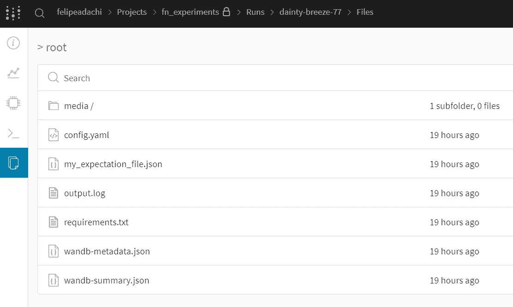****

****作者截图****

## ****合并数据和拆分****

****我们的基础数据由两个文件组成:`True.csv`和`Fake.csv`，这两个文件都已经上传到我们的主分支机构。让我们将来自`online_predictions.csv`的数据添加到我们的基础数据中，然后将它分成训练测试数据集:****

## ****训练模型并上传工件****

****最后一系列步骤是最终训练模型，并将我们的工件上传到存储库的分支:****

****我们将上传训练测试分割以及我们的模型文件——实际的`joblib`模型和用于我们的矢量器的词汇(它也用于计算我们的`coverage`字段)。****

****你可以在这里查看训练模型[的全部代码。我不会深入细节，因为我已经在我的](https://github.com/FelipeAdachi/fake-news-experiments/blob/main/src/models/train_final.py)[上一篇文章](/how-i-learned-to-stop-worrying-and-track-my-machine-learning-experiments-d9f2dfe8e4b3)中提到了。我只想指出它的一个摘录，与我们设置的警报配置相关:****

****`f1_score`是训练过程中计算出的 F1 分数。由于我们之前设置了阈值 0.9，如果本次运行的分数低于该值，将向配置的目标发送警报。对我来说，是我的电子邮件:****

****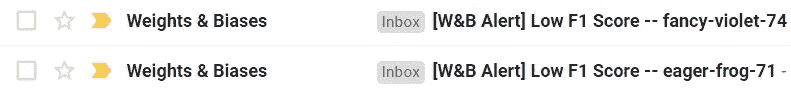****

****作者截图****

## ****提交更改****

****现在，剩下要做的就是将我们的更改提交到我们的分支中:****

****我们会根据再训练实验将数据分开，就像这样:****

****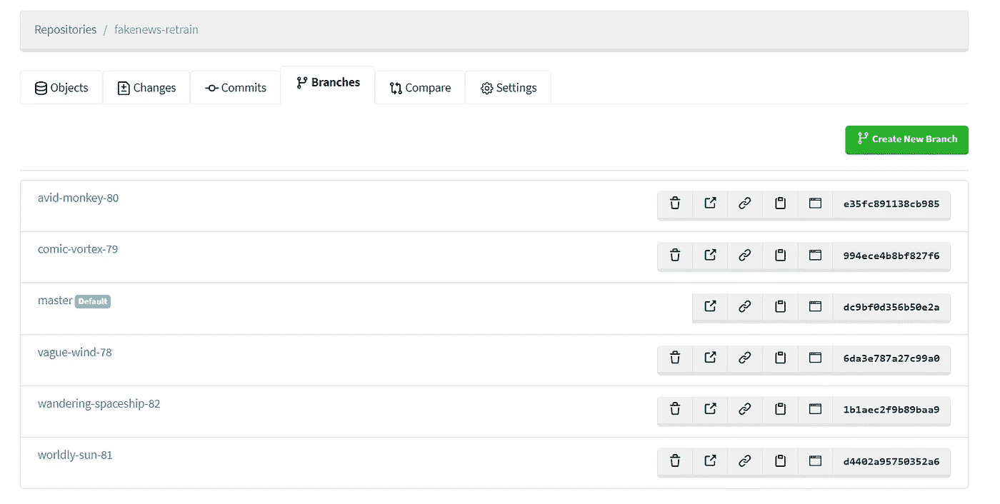****

****作者截图****

****由于运行名称是唯一的，我们可以很容易地将数据与我们在 W&B 的实验仪表板上的再培训结果进行匹配:****

****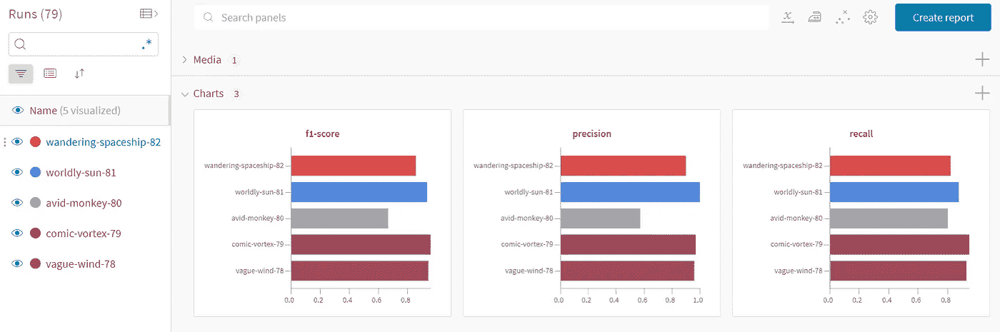****

****作者截图****

## ****lakeFS 连接器****

****在上面的代码片段中，我们对我们的存储库进行了一些操作，比如创建分支、下载和上传对象，以及提交更改。为此，我使用 [**bravado**](https://bravado.readthedocs.io/en/stable/) 来生成一个动态客户端，如这里的[所示](https://docs.lakefs.io/using/python.html)。这样，我们可以通过 Python 命令访问所有 lakeFS 的 API。****

****通过实例化`lakefs_conn`类，我们创建了一个 lakeFS 客户机，并通过对象的方法执行所需的存储库操作:****

# ****下一步是什么****

****我想与你分享我对监测我的模型的性能和再培训，但这真的是一个漫长过程的第一步。随着时间的推移，额外的数据使我们能够有更多的见解，我们最终会发现更好的方法来监控我们的应用程序。****

****例如，在未来，我们可以绘制多个重新训练模型的性能，并随着时间的推移对它们进行比较，以更准确地评估时间对我们预测的影响。或者，给定足够的基本事实信息，我们可以在仪表板中添加精度和召回率等指标。****

****至于再培训部分，还有很多可以改善的地方。随着我们对数据分布的了解越来越多，我们可以在断言阶段增加额外的期望。为自动提交前验证增加挂钩也是一个自然的发展。在撰写本文时，lakeFS 还不支持 Webhooks，但在最新版本(0.33)中已经有了。****

****暂时就这样吧！如果您有任何反馈或问题，请随时联系我们！****

****感谢您的阅读！****

# ****参考****

*   ****[机器学习的连续交付](https://martinfowler.com/articles/cd4ml.html)****
*   ****[数据版本](https://emilygorcenski.com/post/data-versioning)****
*   ****[确保数据湖环境中的数据质量](https://lakefs.io/ensuring-data-quality-in-a-data-lake-environment/)****
*   ****[ML 测试分数:衡量 ML 生产准备情况和技术债务削减的指标](https://static.googleusercontent.com/media/research.google.com/en//pubs/archive/aad9f93b86b7addfea4c419b9100c6cdd26cacea.pdf)****
*   ****[为什么数据版本控制作为基础设施很重要](https://lakefs.io/data-versioning-as-an-infrastructure/)****
*   ****[lakeFS —文档](https://docs.lakefs.io/)****
*   ****[远大前程—文档](https://docs.greatexpectations.io/en/latest/)****
*   ****[权重和偏差—文档](https://docs.wandb.ai/)****