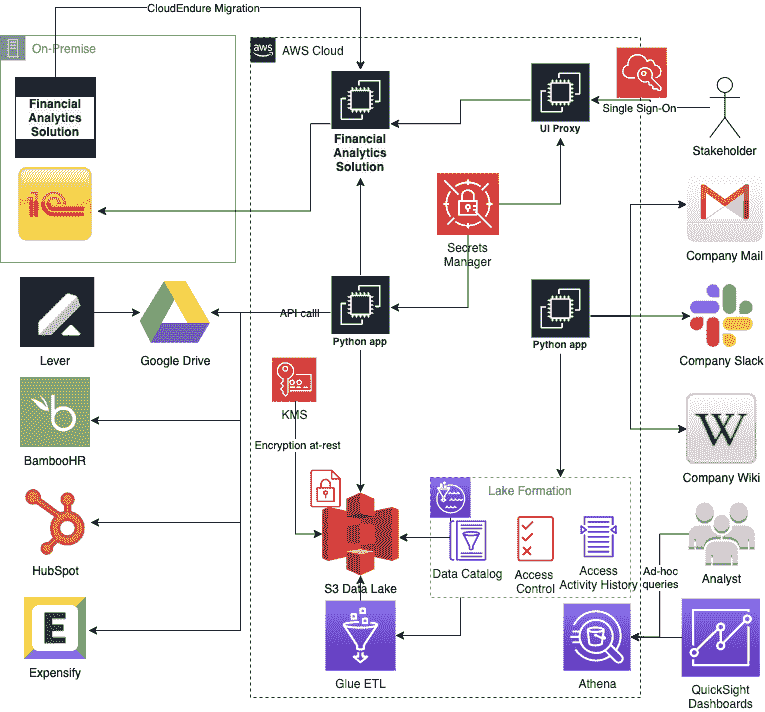
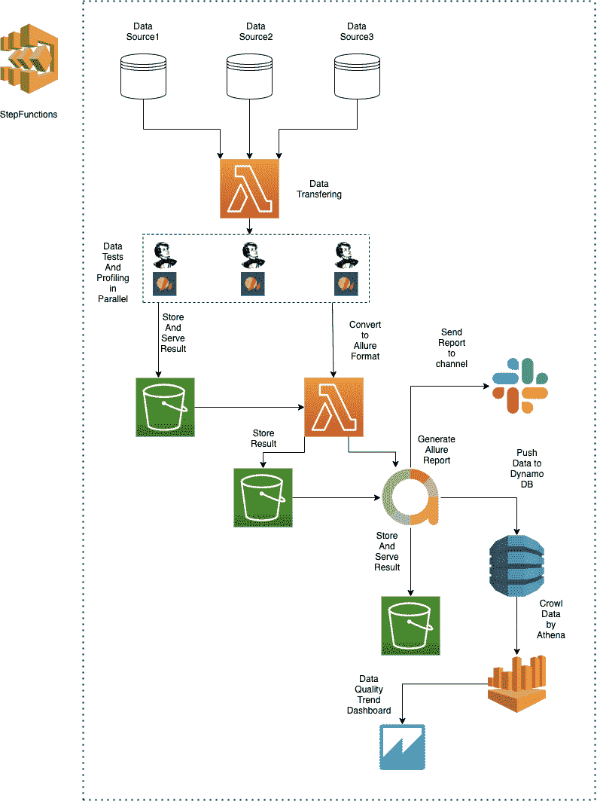
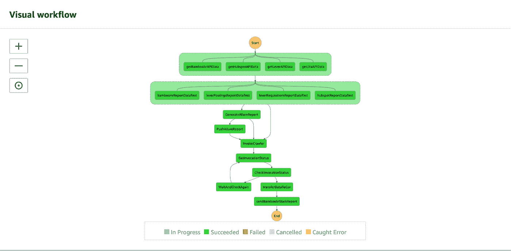
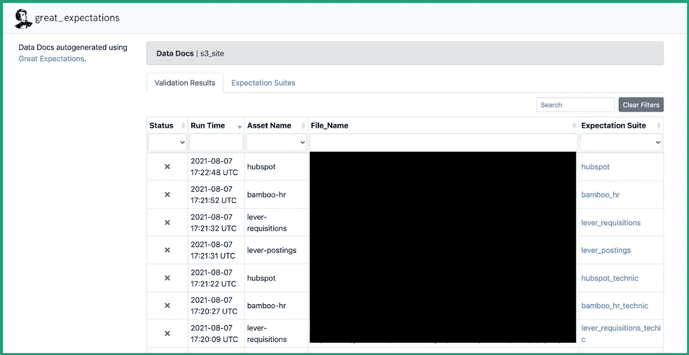
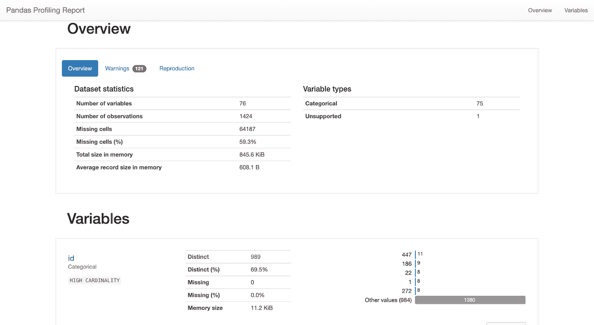
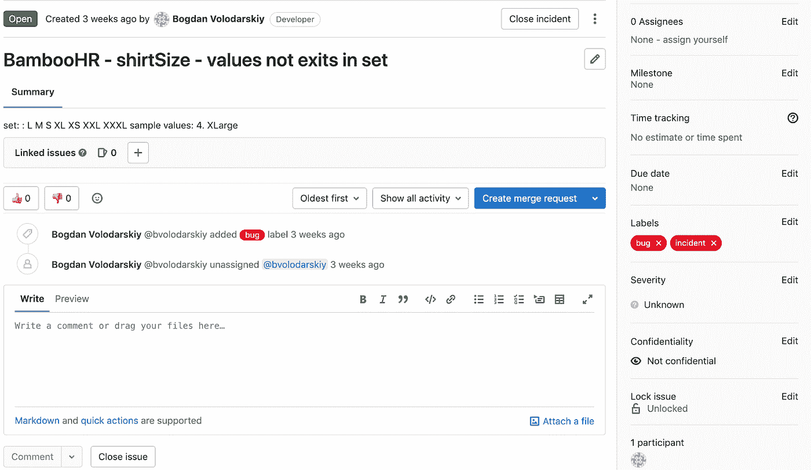
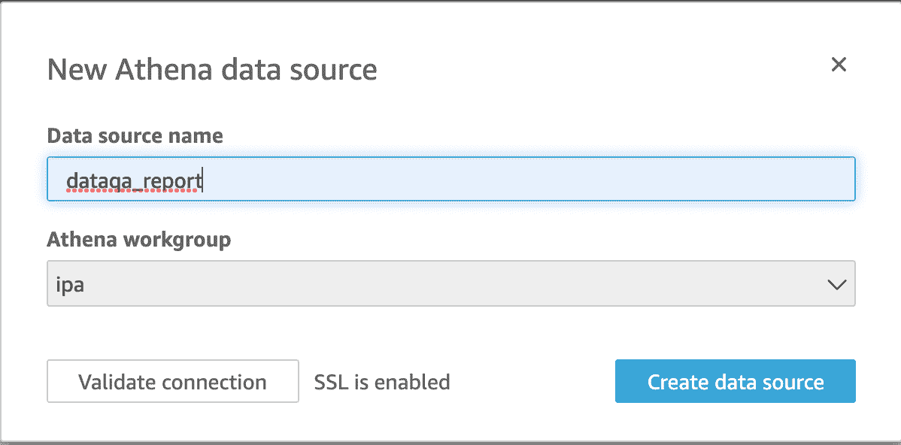
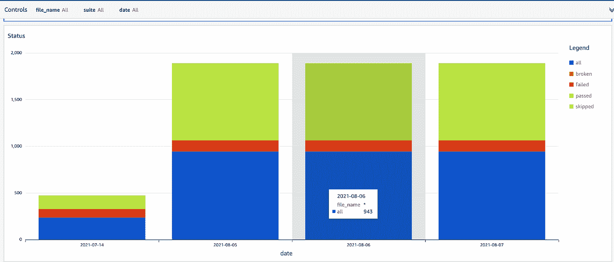
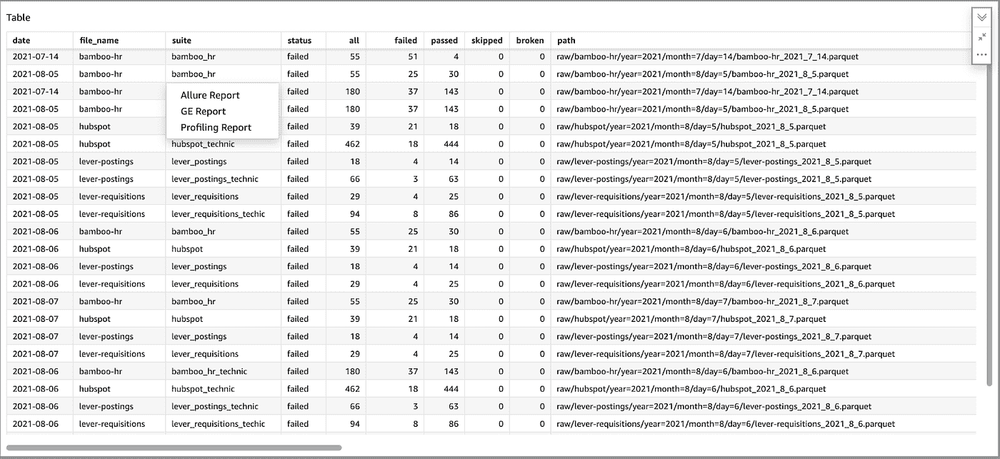
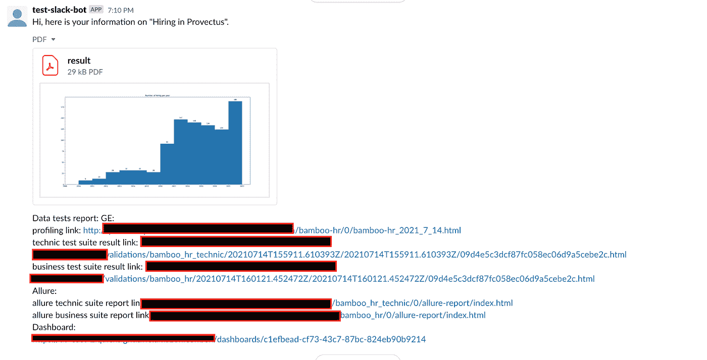

# 使用远大前程和 Allure 构建的无服务器监控数据湖中的数据质量

> 原文：<https://towardsdatascience.com/monitoring-data-quality-in-a-data-lake-using-great-expectations-and-allure-built-serverless-47fa1791af6a?source=collection_archive---------10----------------------->


图片来自 [freepik](https://www.freepik.com/)

人工智能、机器学习和大数据产业正在快速增长。它们不再仅仅是炒作，所有这三个行业都已经成熟到能够帮助各种组织推动增长并交付切实成果的程度。在这种情况下，相关解决方案的质量，尤其是支持这些解决方案的数据质量变得至关重要。

在 [Provectus](https://provectus.com/) ，我们明白人工智能的数据质量至关重要。为此，我们使用各种服务进行数据质量监控，这些服务可以帮助我们识别和跟踪数据趋势、检测数据变化等等。所有这些服务都有助于识别风险和防止支出。软件测试背后的理论暗示着你越早发现错误并修复它，花费的钱就越少。在 AI 和 ML 的例子中，研究清楚地表明好的数据比模型中的系数更有用。


作者图片

今天的 AI 现实是，单纯做数据管道已经不够了。处理您的 ML 模型和数据更类似于一个标准的 IT 例程，包括它的所有过程。那么，如何有效地大规模评估数据质量呢？

我们已经有了一些使用两个开源数据质量保证框架的经验:Deequ 和 Great Expectations，但是大部分是在本地，而不是在云中。本文提供了一些关于使用 Great Expectations 来监控 AWS 云中的数据质量的观点。

# 为什么是远大前程？

Great Expectations (GE)是一个基于 Python 的开源数据质量框架。GE 使工程师能够编写测试、审查报告和评估数据质量。这是一个可插拔的工具，意味着你可以很容易地添加新的期望和定制最终报告。GE 可以很容易地与诸如 Airflow 之类的 ETL 集成，并且它有 AWS 支持。后者对于 AWS 首要咨询合作伙伴 Provectus 非常重要，因为我们现在正在努力将 [Pandas profiling](https://github.com/pandas-profiling/pandas-profiling) 添加到我们的数据质量监控工具组合中。Pandas 是分析数据和为 GE 自动生成简单测试套件的完美工具。

# 为什么是《倾城》？

Allure 框架是用于测试和报告的经典 IT 工具。对于经理和非技术专业人员来说，这是一个很好的选择，因为与严格的技术通用电气相比，它允许他们以更舒适的方式处理数据。在这个实现中，我们通过从 GE 到 Allure 的[自写适配器](https://github.com/provectus/from_ge_to_allure_mapper)来使用 Allure 和 GE 报告。

**解决方案架构**

一开始，我们基于以下架构参考构建了一个 POC。



作者图片

在实施中，我们用在我们以前的一个项目(NDA 下的客户)。我们依赖于基于气流的解决方案，也依赖于我们与 GE 共同制定的数据质量保证战略。然而，在这种情况下，我们需要收集大量的数据来构建它，并提供一个用户友好的仪表板，使 C 级员工能够处理数据。从这个角度来看，数据的质量再次显得至关重要。

我们的第一步是选择正确的数据集，并联系数据所有者，以了解我们到底需要在其中签入什么。然后，我们编写了几个本地测试套件:一个是技术套件，提供关于列中 null 值和空值的技术细节，另一个是研究业务和操作问题。之后，GE config 被改为 AWS(亚马逊 S3)集成，数据上传到它的存储器。为了实现卓越运营，我们对 Lambda 使用了 docker 图像和 ECR。我们对其进行了测试，并开始研究将其集成到现有数据管道的最佳方式。我们决定在 AWS Lambda 中使用 Step 函数作为 ETL。

这是最终的解决方案。



作者图片

**解决方案概述**

1.  使用 AWS Lambda 和 AWS Glue 从数据源检索数据
2.  同时，对每个数据集运行 AWS Lambda 和 Pandas Profiling 以及 GE 测试套件，并将每个数据集作为静态 S3 网站进行存储/服务
3.  在 AWS Lambda 中，将 GE 结果转换为 Allure 结果，并存储在亚马逊 S3 中
4.  在 AWS Lambda 中，根据 Allure 结果生成 Allure 报告，在亚马逊 S3 中存储和提供
5.  通过使用 AWS，Lambda 向 Slack 通道发送报告
6.  结果被推送到亚马逊 DynamoDB(你也可以使用亚马逊 S3 来降低成本)
7.  使用 Amazon Athena 从 Amazon DynamoDB 抓取数据
8.  使用 Amazon Quicksight 提取数据

**步进功能:**



作者图片

请记住，我们不希望(或需要)停止通常的数据工程步骤的实现，但是我们可以通过使用无服务器将所有堆栈部署到 Cloudformation。

# 数据质量保证堆栈的实现

**** —敏感信息*

要在 AWS 上实施 GE，您需要:

1.  更改 ge 配置(great_expectation.yml)数据源、源和 data_docs

```
datasources:
  pandas_s3:
    class_name: PandasDatasource
    batch_kwargs_generators:
      pandas_s3_generator:
        class_name: S3GlobReaderBatchKwargsGenerator
        bucket: ***
        assets:
          your_first_data_asset_name:
            prefix: ***/ regex_filter: .* module_name: great_expectations.datasource
    data_asset_type:
      class_name: PandasDataset
      module_name: great_expectations.datasetexpectations_S3_store:
    class_name: ExpectationsStore
    store_backend:
      class_name: TupleS3StoreBackend
      bucket: '***'
      prefix: '***/great_expectations/expectations/'

  validations_S3_store:
    class_name: ValidationsStore
    store_backend:
      class_name: TupleS3StoreBackend
      bucket: '***'
      prefix: '***/great_expectations/uncommitted/validations/'

  evaluation_parameter_store:class_name: EvaluationParameterStore

expectations_store_name: expectations_S3_store
validations_store_name: validations_S3_store
evaluation_parameter_store_name: evaluation_parameter_storedata_docs_sites:s3_site:
    class_name: SiteBuilder
    show_how_to_buttons: false
    store_backend:
      class_name: TupleS3StoreBackend
      bucket: ***
    site_index_builder:
      class_name: DefaultSiteIndexBuilder
      renderer:
        module_name: custom_data_docs.renderers.custom_table_renderer
        class_name: CustomTableRenderer
      show_cta_footer: true
```

2.创建测试套件并编写测试；记得更改必要文件的路径

```
# ### Column Expectation(s)

# #### `id`

# In[ ]:

batch.expect_column_values_to_match_regex(column='id',
                                          regex="^\d+$")

# #### `lastNameFirstName`

# In[ ]:
batch.expect_column_values_to_match_regex(column='lastNameFirstName',
                                          regex="([a-zA-Z .-]){2,30}[,]+[ ]+([a-zA-Z .-]){2,30}$")

# #### `customTeam`

# In[ ]:

# In[ ]:

batch.expect_column_values_to_match_regex(column='customTeam',
                                          regex="^[a-zA-Z -]+$")
```

3.如果你想使用 AWS Lambda，把你的代码包装成 lambda_handler 或者

```
def handler(event, link):
    context = DataContext(os.path.join(BASE_DIR, 'great_expectations'))

    expectation_suite_name = "***"
    suite = context.get_expectation_suite(expectation_suite_name)
    suite.expectations = []

    batch_kwargs = {'data_asset_name': '***', 'datasource': 'pandas_s3', 'path': 's3a://***/'+event[0],'link':link}
    batch = context.get_batch(batch_kwargs, suite)
    batch.head()
```

4.创建 requirements.txt 和 dockerfile

```
importlib-metadata==2.0
great-expectations==0.13.19
s3fs==2021.6.0
python-dateutil==2.8.1
botocore==1.20.49
boto3==1.17.1
aiobotocore==1.3.0
requests==2.25.1
decorator==4.4.2
pyarrow==2
fastparquet
awslambdaric
awswrangler
pandas_profilingFROM python:3.6-stretch
RUN apt-get update \
 && apt-get upgrade -y \
 && apt-get install -y
RUN apt-get install -y python3-dev
RUN apt-get install -y python3-pip
RUN pip3 install --upgrade cython
RUN pip3 install setuptools_scm
ADD ./requirements.txt ./
COPY  edit_bamboo_hr_technic.py ./
COPY edit_bamboo_hr.py ./
COPY test_pandas_profiler.py ./
COPY bamboohr_report_data_test.py ./
COPY great_expectations /great_expectations
RUN pip3 install  -r requirements.txt
ENTRYPOINT ["/usr/local/bin/python", "-m", "awslambdaric"]
CMD ["bamboohr_report_data_test.handler"]
```

1.  在亚马逊 S3，使用静态网站选项。如果你想增加更多的安全性，实现 Amazon CloudFront
2.  使用无服务器工具部署到 Cloudformation。首先，您需要“docker-compose build”，然后是“sls deploy”。如果您希望 GE 有一个单一的 Lambda，您需要创建一个 ECR 存储库，并按照指令推送您的 docker 映像。之后，创建一个 AWS Lambda 映像并选择它。

通用电气报告门户:



作者图片

通用电气报告:


作者图片

对于 Pandas Profiling，您可以使用以下代码:

```
def profile_data(event, runs):
    file_path = event[0]
    s3 = boto3.resource("s3")
    bucket = s3.Bucket('***')
    df = wr.s3.read_parquet(path='s3://***/')
    profile = ProfileReport(df, title="Pandas Profiling Report",    minimal=True)
    report = profile.to_html()
    bucket.put_object(Key='***', ContentType='text/html')
```

我们在同一个 Lambda 上部署 GE 和 Pandas Profiling，以削减成本和简化流程。

熊猫概况报告:



作者图片

诱惑力:

1.  Pre:您需要将 GE json 结果映射到 Allure json 结果
2.  创建 docker 文件和需求文本
3.  创建 sh 脚本并使用 Python 脚本与 Allure 交互，因为 Allure 需要 Java

```
FOLDER=$1
rm -r /tmp/result
rm -r /tmp/allure-report
aws s3 sync s3://***/allure/"$FOLDER"/result /tmp/result
allure-2.14.0/bin/allure generate /tmp/result --clean -o tmp/allure-report
aws s3 sync /tmp/allure-report s3://***/allure/"$FOLDER"/allure-report
```

4.部署它

《诱惑》报道:


作者图片


作者图片

我们还在 Gitlab 问题之间进行了整合，以便在测试运行后更容易创建问题。



作者图片

亚马逊雅典娜和亚马逊 DynamoDB:

要存储数据，请使用数据透视表，要抓取数据，请使用 Amazon Athena。

为了将数据推送到存储，我们可以使用 Amazon DynamoDD(或 Amazon SS)。

1.  访问亚马逊 DynamoDB
2.  创建表格
3.  去和 Amazon DynamoDB 在同一地区的 Amazon Athena
4.  连接一个新的数据源(即选择一个已创建的 DynamoDB 表)
5.  在查询编辑器中测试连接


作者图片

快速观察:

1.  去亚马逊 Quicksight
2.  选择数据集，转到新数据集
3.  选择亚马逊雅典娜
4.  选择您的工作组和数据源名称



作者图片

5.创建数据源

6.进行新的分析

在现有的实现中，我们使用两种类型的图表

1.  bug 趋势线——每个日期每个选定源的失败测试百分比，您可以通过过滤器来选择


作者图片

2.套件和源状态栏



作者图片

3.这也是一个数据透视表，您可以单击 raw 打开报告菜单并查看每个数据 qa 结果



作者图片

Slack bot 发送一个通知，其中包含每个管道的链接



作者图片

# 结论

本文演示了如何使用 StepFunctions、Lambda、GE、Allure 和 Pandas Profiling 在 AWS 上的数据管道中构建和实现一种[数据质量](https://provectus.com/data-quality-assurance/)方法。它解释了这些工具和服务的内容和方式，并提供了一种使用它们来确保数据质量、简化管道调试和降低成本的可靠方法，而不会增加数据管道的架构复杂性。

## **要了解更多关于 Provectus 数据质量保证实践的信息，请访问** [**网页**](https://provectus.com/data-quality-assurance/) **:**

[满怀期望的数据质量保证和 Kubeflow 管道](https://medium.com/analytics-vidhya/data-quality-assurance-with-great-expectations-and-kubeflow-pipelines-d83449fbaa81)
[我们的 pip 包用于将 ge 结果映射到 Allure 结果](https://github.com/provectus/from_ge_to_allure_mapper)