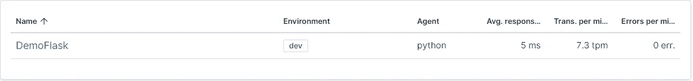
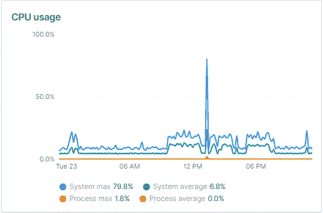
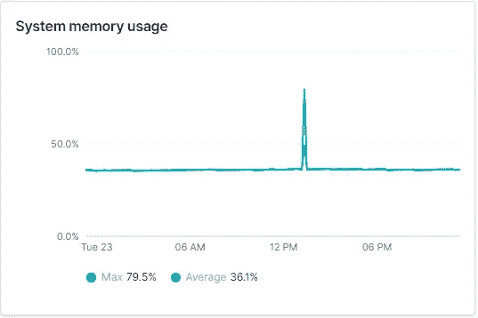
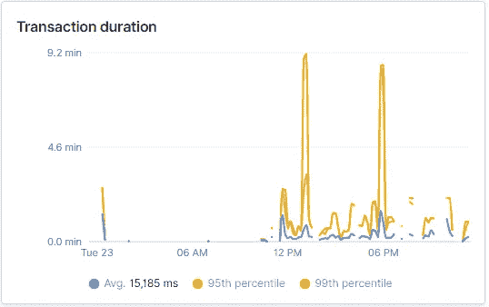
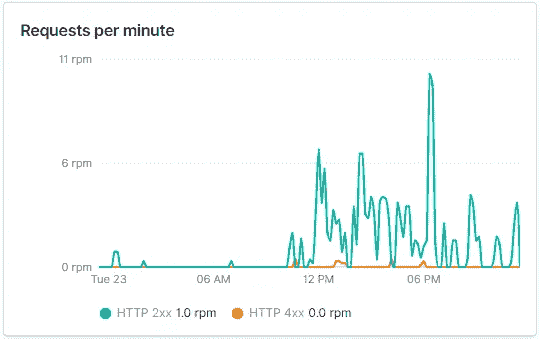
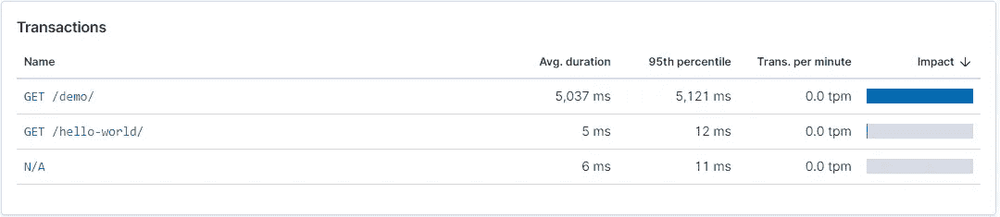
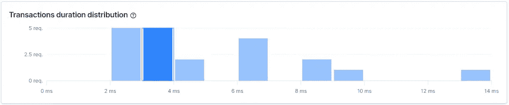
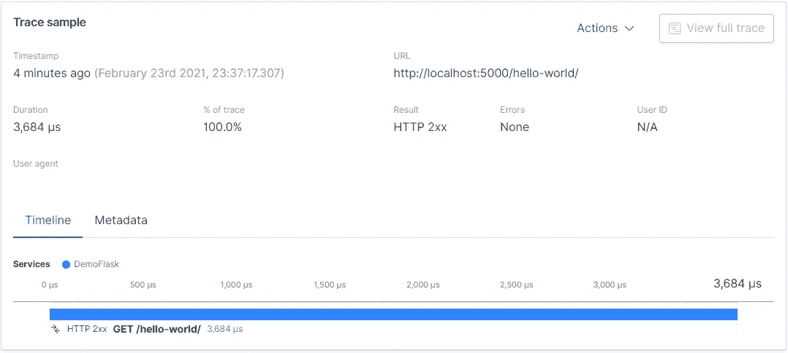
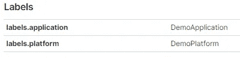

# 使用弹性 APM 监控 Python 应用程序

> 原文：<https://towardsdatascience.com/monitoring-flask-fastapi-python-applications-with-elastic-apm-33237a39d7b6?source=collection_archive---------11----------------------->

## 编程；编排

## Flask、FastAPI 和 Python 应用程序监控指南


卢克·切瑟在 [Unsplash](https://unsplash.com/?utm_source=unsplash&utm_medium=referral&utm_content=creditCopyText) 上拍摄的照片

# 什么是弹性 APM？

> 弹性 APM 是建立在弹性堆栈上的应用性能监控系统。通过收集有关传入请求、数据库查询、缓存调用、外部 HTTP 请求等响应时间的详细性能信息，它允许您实时监控软件服务和应用程序。这使得快速查明和修复性能问题变得很容易。
> 
> Elastic APM 还自动收集未处理的错误和异常。错误主要基于堆栈跟踪进行分组，因此您可以在新错误出现时识别它们，并留意特定错误发生的次数。

[-弹性](https://www.elastic.co/guide/en/apm/get-started/current/overview.html)

本文由三部分组成:

1.  监控烧瓶/烧瓶-RESTPlus 应用
2.  监控 FastAPI 应用程序
3.  监控 Python 应用程序

# 监控烧瓶/烧瓶-RESTPlus 应用

## 装置

弹性 APM 内置烧瓶支架。因为 Flask-RESTPlus 和 Flask-RESTful 是 Flask 的扩展，所以相同的步骤适用于 Flask-RESTPlus 和 Flask-RESTful。

使用 pip 安装弹性 APM 代理:

```
pip install elastic-apm[flask]
```

## 履行

让我们首先导入所需的包:

```
from flask import Flask

from elasticapm.contrib.flask import ElasticAPM
import elasticapm
```

现在，让我们创建一个 Flask 实例，这将是我们的 WSGI 应用程序。

```
app = Flask(__name__)
```

我们可以通过使用环境变量或应用程序代码本身来初始化 APM 代理。在本文中，我们将在代码中初始化 APM 代理。

要创建一个弹性 APM 代理的实例，我们需要以下参数:

`server_url` →弹性 APM 的 URL

`service_name` →应用名称

`environment` →应用运行的环境，例如开发、质量保证或生产

```
server_url = 'http://localhost:8200'
service_name = 'DemoFlask'
environment = 'dev'
```

接下来，我们将初始化 APM 代理。
我们需要传递 Flask 实例`app`作为初始化 APM 代理的第一个参数，以及我们上面定义的参数。

```
apm = ElasticAPM(app, server_url=server_url, 
      service_name=service_name, environment=environment)
```

我们的 APM 代理现在准备好了。

现在，让我们打开 Kibana(例如 http://localhost:5601/)来查看记录的数据。

打开 Kibana 仪表板并转到 APM 选项卡。你可以看到我们的服务`DemoFlask`列在那里。



单击服务名并转到 Metrics，在这里可以跟踪 CPU 和内存的使用情况。



在 transactions 选项卡中，您可以看到与您的应用程序收到的每个请求相关的可视化内容，例如事务持续时间和每分钟的请求数。



您还可以查看所有端点的列表及其平均持续时间。



单击交易以查看交易的更多详细信息。



您还可以通过使用[标签](https://www.elastic.co/guide/en/apm/get-started/7.4/metadata.html#labels-fields)来添加关于交易的附加信息。

```
elasticapm.label(platform='DemoPlatform')
```

为了给所有事务添加默认标签，我们可以使用 Flask 的`app.before_request` decorator。

```
@app.before_request
def apm_log():
    elasticapm.label(platform = 'DemoPlatform',                     
                     application = 'DemoApplication')
```

标签的信息将在事务的跟踪样本的元数据选项卡中可见。



*注意，默认情况下，只有当应用程序在调试模式下是* ***而不是*** *时，才会记录事务和错误数据。*

*示例代码可以在* ***参考资料*** *部分提到的链接中找到。*

# 监控 FastAPI 应用程序

要使用 Elastic APM 正确地监控 FastAPI/Starlette 应用程序，您需要使用 Python 3.7+

## 装置

使用 pip 安装弹性 APM 代理:

```
pip install elastic-apm
```

## 履行

首先，让我们导入所需的包:

```
import uvicorn
from fastapi import FastAPI
from elasticapm.contrib.starlette import make_apm_client, ElasticAPM
```

接下来，我们将使用`SERVICE_NAME`、`SERVER_URL`和`ENVIRONMENT`创建一个 APM 客户端。此外，我们将使用`GLOBAL_LABELS`同时指定全局标签。

```
apm_config = {
 'SERVICE_NAME': 'DemoFastAPI',
 'SERVER_URL': 'http://localhost:8200',
 'ENVIRONMENT': 'dev',
 'GLOBAL_LABELS': 'platform=DemoPlatform, application=DemoApplication'
}
apm = make_apm_client(apm_config)
```

现在，让我们初始化弹性 APM 代理。

```
app = FastAPI()
app.add_middleware(ElasticAPM, client=apm)
```

FastAPI 应用程序现在准备好将日志发送到弹性服务器。

*示例代码可以在* ***参考资料*** *部分提到的链接中找到。*

# 监控 Python 应用程序

我们可以创建一个弹性 APM 客户端来监控不使用框架的 Python 应用程序(例如 Flask、Django 或 FastAPI)。这些应用的一个例子可以是可调度代码。

## 装置

使用 pip 安装弹性 APM 代理:

```
pip install elastic-apm
```

## 履行

首先，我们将创建一个弹性 APM 客户端

```
from elasticapm import Client
import elasticapm
client = Client(
    {'SERVICE_NAME': 'DemoPython',
     'SERVER_URL': 'http://localhost:8200',
     'ENVIRONMENT': 'dev'}
)
```

对于 Flask 和 FastAPI 这样的框架，Elastic APM 会自动检测应用程序，并开始和结束事务。

然而，对于不使用这种框架的 Python 应用程序，我们需要手动检测应用程序，并开始和结束事务。

自动检测您的应用程序以捕获 HTTP 请求、数据库查询等。，添加下面一行

```
elasticapm.instrumentation.control.instrument()
```

要开始一个事务，使用`begin_transaction`方法，将适当的事务类型作为参数。

举个例子，

```
client.begin_transaction('schedule')
```

要完成一个事务，使用 *end_transaction* 方法，该方法有两个参数，即。交易名称和结果。

举个例子，

```
client.end_transaction('demo-transaction', 'success')
```

*可以在* ***资源*** *部分提到的链接中找到用于监控 Python 应用程序的示例代码。*

## 资源

这篇文章的所有代码片段都可以在我的 GitHub 页面上找到。

## 参考

*   [https://www . elastic . co/guide/en/APM/agent/python/current/configuration . html](https://www.elastic.co/guide/en/apm/agent/python/current/configuration.html)
*   [https://www . elastic . co/guide/en/APM/agent/python/current/flask-support . html](https://www.elastic.co/guide/en/apm/agent/python/current/flask-support.html)
*   [https://www . elastic . co/guide/en/APM/get-started/7.4/metadata . html](https://www.elastic.co/guide/en/apm/get-started/7.4/metadata.html)
*   [https://www . elastic . co/guide/en/APM/agent/python/current/starlette-support . html](https://www.elastic.co/guide/en/apm/agent/python/current/starlette-support.html)

## 让我们连接

领英:[https://www.linkedin.com/in/jimit105/](https://www.linkedin.com/in/jimit105/)GitHub:[https://github.com/jimit105](https://github.com/jimit105)推特:[https://twitter.com/jimit105](https://twitter.com/jimit105)