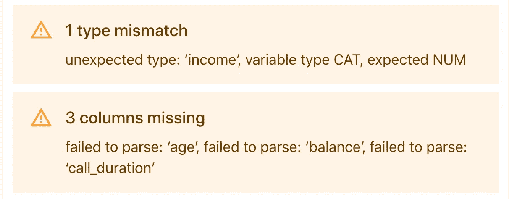

# 监控生产中的机器学习模型

> 原文：<https://towardsdatascience.com/monitoring-machine-learning-models-in-production-how-to-track-data-quality-and-integrity-391435c8a299?source=collection_archive---------8----------------------->

## 如何跟踪数据质量和完整性

图片作者。

俗话说:垃圾进来就是垃圾出去。输入数据质量是机器学习系统最重要的组成部分。无论您是否有即时反馈回路，您的模型监控总是从这里开始。

# 数据会出什么问题？

人们会遇到两种类型的数据问题。简单来说:
1)数据本身出了问题；或者
2)数据因为环境而改变。

让我们从第一类开始。光是它就有很多。

# 头号数据处理问题

机器学习应用程序通常依赖上游系统来提供输入。最常见的情况是生产模型没有收到数据。或者，它接收损坏的或有限的数据，这都是由于一些管道问题。

## 我们举个营销的例子。

一家银行的数据科学团队开发了一个强大的机器学习系统，以个性化每月发送给客户的促销信息。

该系统使用来自内部客户数据库的数据、来自网上银行和移动应用程序的点击流日志以及呼叫中心日志。此外，营销团队手动维护一个电子表格，在其中添加本月的促销选项。

所有数据流被合并并存储在数据仓库中。当模型运行时，它会计算关节表顶部的必要特征。然后，该模型根据接受的可能性对每个客户的报价进行排名，并输出结果。

*促销个性化用例的简化管道丛林。(*图片由作者提供)。

此管道使用多个数据源。并且，不同的功能所有者维护它们中的每一个。相当多的机会来搞乱它！

## 以下是将要发生的令人不快的事情的不完整列表:

*   **错误的来源。**管道指向旧版本的市场营销表，或者存在未解决的版本冲突。
*   **失去通路。**有人将表格移动到新位置，但没有更新权限。
*   **错误的 SQL。**或者不是 SQL。无论你用什么来查询你的数据。这些连接和选择在第一次出现复杂情况之前可能工作得很好。比如说，一个来自不同时区的用户在“明天”做了一个动作？该查询可能不成立。
*   **基础设施更新。你得到了一个新版本的数据库和一些自动化的大扫除。空格替换为下划线，所有列名小写。一切看起来都很好，直到您的模型想要将其常规特征计算为“上月收入/总收入”。带有硬编码的列标题。哎哟！**
*   **断特征码。**我敢说，数据科学的代码往往不是生产级的。在极端情况下，它可能会失败。例如，培训中的促销折扣从未超过 50%。然后，营销部门推出一个“免费”报价，并第一次键入 100%。一些依赖的特性代码突然变得没有意义，并返回负数。

当数据处理出错时，模型代码就会崩溃。至少，你会很快了解这个问题。但是如果您的 Python 代码有一些*“Try…Except”*子句，它可能会在不正确和不完整的输入上执行。后果都是你的。

我们看的宣传片例子有批量推断。没那么戏剧化。你有犯错的空间。如果您及时发现了管道问题，您可以简单地重复模型运行。

在高负载流模型中，数据处理问题成倍增加(想想电子商务、游戏或银行交易)。

# #2 数据模式变化

在其他情况下，数据处理工作得很好。但是数据源会发生有效的变化。不管是什么原因，新的数据格式、类型和模式对模型来说很少是好消息。

除此之外，变更的作者通常没有意识到影响。或者，那里甚至存在某种模型。

## 让我们回到宣传片的例子。

一天，呼叫中心的运营团队决定整理 CRM，丰富他们在每次客户来电后收集的信息。

他们可能会引入更好、更细化的类别，根据问题类型对来电进行分类。他们还会询问每个客户他们首选的通信渠道，并开始在一个新的字段中记录。既然我们在这里:让我们重命名和改变字段的顺序，使它对新用户更直观。

现在，看起来很整洁！

图片作者。

但对模型来说并非如此。

**用专业术语来说，这一切都意味着失去信号。**

除非明确告知，否则模型不会将新类别与旧类别相匹配，也不会处理额外的功能。如果没有数据完整性检查，它将基于它知道如何处理的部分输入生成响应。

## 任何与目录打交道的人都知道这种痛苦。

比如在需求预测或者电商推荐方面。通常，你会有一些基于类别类型的复杂特性。比如，“笔记本电脑”或“手机”在“电子产品”中那是昂贵的。让我们把它做成一个特色。“手机壳”在“配件”里这有点“便宜”我们也会用到它。

然后，有人重新整理了目录。现在，“手机”和“手机壳”都在“手机”下面。一个完全不同的类别，有不同的解释。该模型将需要重新学习，或者等到有人解释发生了什么。

这里没有魔法。如果目录更新经常发生，你最好把它考虑到模型设计中。否则，培训业务用户并跟踪突然的变化。

是的，现实世界的机器学习可能就是这么脆弱。(图片来源: [Pixabay](https://pixabay.com/photos/danbo-domino-macro-2495978/) *)*

## **更多例子:**

*   原始业务系统中的更新导致测量单位(将摄氏温度改为华氏温度)或日期格式(日/月/YY 或月/日/YY？)
*   应用程序中的新产品功能增加了模型从未训练过的遥测技术。
*   有新的第三方数据提供者或 API，或宣布的格式变化。

**具有讽刺意味的是，领域专家可以将这种变化视为运营改进。**例如，一种新的传感器可以让您以毫秒级的速度捕捉高粒度数据。好多了！但是该模型是针对聚合进行训练的，并期望以通常的方式计算它们。

**缺乏清晰的数据所有权和文档使其更加困难。**可能没有简单的方法来跟踪或知道向谁通知组织内部即将到来的数据更新。数据质量监控成为捕捉变化的唯一方式。

# #3 源位置的数据丢失

数据不仅会改变。它也可能由于源头上的一些故障而丢失。

*有时你的管道可能会无处可去。(图片鸣谢:*[*Unsplash*](https://unsplash.com/photos/4XvAZN8_WHo)*)。*

**例如，由于日志记录中的错误，您丢失了应用点击流数据。**物理传感器坏了，温度不再可知。外部 API 不可用等等。我们希望尽早发现这些问题，因为它们通常意味着未来再培训数据的不可逆转的损失。

这种中断可能只影响数据的一个子集。例如，一个地理位置或特定操作系统中的用户。这使得检测更加困难。除非另一个(适当监控！)系统依赖于相同的数据源，所以故障可能不会被注意到。

更糟糕的是，一个被破坏的数据源可能仍然提供数据。例如，损坏的温度传感器将返回上一次测量的恒定值。这很难发现，除非你跟踪“不寻常”的数字和模式。

与物理故障一样，我们不能总是立即解决问题。但是及时发现有助于快速评估损害。如果需要，我们可以更新、替换或暂停模型。

# #4 破碎的上游模型

在更复杂的设置中，您有几个相互依赖的模型。一个模型的输出是另一个模型的输入。

这也意味着:一个模型的坏预测是另一个模型的坏特征。

## **拿一个内容或产品推荐引擎来说。**

它可能首先预测某个产品或物品的受欢迎程度。然后，考虑到估计的流行度，它向不同的用户做出推荐。

这些将是独立的模型，基本上是相互连接的。一旦该商品被推荐给用户，它更有可能被点击，从而更有可能被拳头模型视为“受欢迎”。

## 一个更高科技的例子:汽车路线导航系统。

首先，你的系统构建可能的路线。然后，一个模型预测他们每个人的预期到达时间。接下来，另一个模型对选项进行排序，并决定最佳路线。这在某种程度上影响了实际的交通堵塞。一旦汽车沿着建议的路线行驶，这就产生了一种新的路况。

图片作者。

物流、路线和交付中的其他模型经常面临同样的问题。

这些相互关联的系统有一个明显的风险:如果其中一个模型出了问题，你会得到一个相互关联的问题循环。

# 监控数据质量和完整性

正如我们所见，机器学习模型的输入数据可能会出错。

我们希望这些事情永远不要发生，但是让我们现实一点。所以，我们的目标是及时赶上他们。

*打破复杂系统的简单事物。* *(图片来源:* [Unsplash](https://unsplash.com/photos/Wpnoqo2plFA) *)。*

**通常，数据可靠性和一致性属于数据工程范畴。**您甚至可以在数据库级别拥有一些检查或监控系统。还有什么需要关注的吗？

**问题是，对于机器学习系统，我们不关心整体数据质量。**我们希望跟踪给定模型使用的特定数据子集。有时是专一的。仓库中 99%的数据是正确的并不重要；我们想检查一下我们的作品。

特征处理代码也是一个需要监控的独立移动部分。这需要定制设置。

因此，在数据质量和完整性方面，MLOps 符合 DataOps。我们最好仔细检查一下。

有一些与数据相关的东西需要注意:

# #1 型号电话

要回答的第一个问题是这个模型是否有效。为此，看看模型响应的数量。这是添加到软件监控之上的一个基本但有用的检查。

为什么？服务本身可能是可操作的，但不是模型。或者，您可能比计划的更频繁地依赖于回退机制，如业务规则。

如果你的模型经常被使用，这就没那么有用了。但是如果有一个“正常”的使用模式，这是一个很好的检查。例如，你的模型部署在电子商务网站上，或者每天都有新的销售数据。你就知道会有什么样的消费。

查看模型调用的数量是发现问题的简单方法。

在这里，模特打电话的次数一夜之间变为零。也许服务中断了？

**根据模型环境，您可能想要分别检查请求和响应。**模型是否未被询问(例如，因为推荐小部件崩溃)或未能回答(例如，模型超时，我们不得不使用静态推荐)？答案会指出应该从哪里开始调试。

现在，我们来看看数据。

# #2 数据模式

正如我们上面解释的，数据模式可能会改变。不管是因为不好的做法还是出于好意；我们想检测它。

我们的目标是了解特性何时被删除、添加或更改。

最直接的方法是执行逐个特征的检查和调查:

**1/如果特性集保持不变。**对于表格数据:有多少列？有没有什么东西不见了，或者有什么新的东西？

**2/如果特征数据类型匹配。我们在某个地方得到了分类值而不是数值吗？例如，在给定的列中，我们有从 1 到 10 的数字特征。现在，当我们查询它时，我们看到类似“低”、“中”和“高”的值我们应该能抓到这个。**

*模式验证错误。(图片由作者提供)。*

最后，您需要一个快速的摘要视图，来查看传入的数据集是否符合预期。

# #3 缺失数据

我们还想检测任何丢失的数据。

**通常，会有一些可接受的缺失值。**我们不想对每个空条目都做出反应。但是我们希望比较缺失数据的水平是否保持在“正常”范围内，包括整个数据集和单个要素。是否丢失了任何关键功能？

**记住这一点很重要，因为缺失值可能有多种形式。**有时它们是空的，有时它们是“未知的”或“999”。如果您对缺少的功能进行简单的检查，您可能会错过其他功能。最好扫描缺失数据的标准表达式，如“N/A”、“NaN”、“undefined”等。偶尔用自己的眼睛进行审计也不是一个坏主意。

**如果你的特征数量有限，你可以将它们全部显示在一个图中。**我们就是这样做的，对缺失值的份额进行颜色编码:

图片作者。

**您还可以设置数据验证阈值，以定义何时暂停模型或使用回退。**例如，如果缺少太多特征。当然，“太多”的定义取决于您的用例以及模型的错误成本。

一个有用的建议是挑出你的关键驱动因素。您可以根据模型特征重要性或 SHAPley 值来实现。或者，将这两种方法与你的领域知识结合起来。

这个想法是建立不同的监控策略。你总是需要你的关键特性来运行模型。有了辅助手段，缺席就不是一个阻碍。你只需要做个记录，然后和数据所有者一起调查。

# #4 特征值

数据摆在那里，不代表就是正确的。

**例子:**

*   在 excel 处理出错后,“年龄”列的值从 0.18 到 0.8，而不是 18 到 80。
*   一个物理传感器坏了，显示一周的某个恒定值。
*   有人在功能计算过程中掉了一个负号，您会看到负的销售数字。

在所有情况下，模型都是有效的，数据是可用的——但是被破坏了。

要检测到这一点，您需要监控特性的统计数据和分布。

我们使用明显库(图片由作者提供)比较了训练和生产中的特征分布。

**1/特征值范围。**对于数字特性，检查数值是否在合理范围内。对于分类属性，定义一个可能值的列表，并留意新奇的事物。

**如何做到这一点？**

*   通过查看训练分布，您可以直接定义您的期望值(最小-最大范围，或给定列的可能值)。
*   或者，依靠常识:我们知道“年龄”或“室外温度”的可能值。
*   如果有更多的上下文，您可以让领域专家来定义特定输入的“正常”。

它还有助于声明何时明确允许空值。

**2/关键特征统计。**对于数值特征，可以看平均值、均值、最小最大比、分位数。

后者将有助于捕捉像这种传感器损坏的情况。形式上，它保持在范围内，但测量完全是静态的:

图片作者。

**对于分类输入，您可以检查它们的频率。**例如，如果你处理文本，对应的可能是词汇的%。

**目标是监控实时数据集的合规性**并验证输入端的数据。通过这种方式，您可以在出现范围违规、异常值或统计数据变化时进行捕捉。

# #5 特征处理

另一个要考虑的方面是**在哪里**运行您的数据有效性检查。

**当数据出错时，首先要问的是为什么。**在理想世界中，我们希望一发现错误就定位错误。断裂的连接或功能代码可能是一个原因。在这种情况下，源数据很好，但是在转换为模型特征的过程中会发生一些事情。

**有时，为管道中的每一步分别验证输入和输出**是有意义的。这样，我们可以更快地找到问题并进行调试。

## 例如，我们预测一家移动运营商的客户流失。

营销数据来自一个来源。购买日志与不断变化的产品计划相结合。然后，您将使用日志与关于技术连接质量的外部数据合并。特征转换需要几个步骤。

图片作者。

当然，您可以简单地验证上一次计算的输出。但是如果你注意到一些特性没有意义，你就不得不返回每一步。如果管道很复杂，单独检查可能会为您节省一些检测工作。

# 总结

数据质量监控是生产机器学习系统的第一道防线。通过查看数据，您可以在许多问题影响实际模型性能之前发现它们。

你可以，也应该对每个型号都这样做。这是一个基本的健康检查，类似于延迟或内存监控。它对于人类和机器生成的输入都是必不可少的。每一种都有自己的错误类型。数据监控还有助于揭示被放弃的或不可靠的数据源。

当然，数据问题不止于此。在下一篇文章中，我们将深入挖掘[数据和概念漂移](https://evidentlyai.com/blog/machine-learning-monitoring-data-and-concept-drift)。

*最初发表于*[T5【https://evidentlyai.com】](https://evidentlyai.com/machine-learning-monitoring-how-to-track-data-quality-and-integrity)*。*

*在 appeally AI，我们构建开源工具来分析和监控机器学习模型。在 Github 中查看我们的* [*数据漂移检测工具*](https://github.com/evidentlyai/evidently) *。*

*想留在圈子里？* [*报名*](https://evidentlyai.com/sign-up) *获取我们的更新和产品消息，或者加入上*[*Twitter*](https://twitter.com/EvidentlyAI)*和*[*Linkedin*](https://www.linkedin.com/company/evidently-ai/)*获取更多关于生产机器学习的内容，或者加入我们的* [*不和谐社区*](https://discord.gg/xZjKRaNp8b) *进行聊天和连线。*