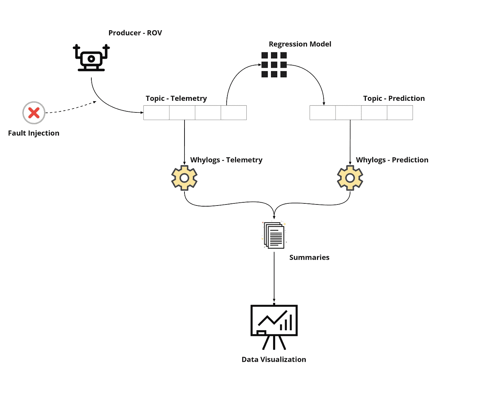
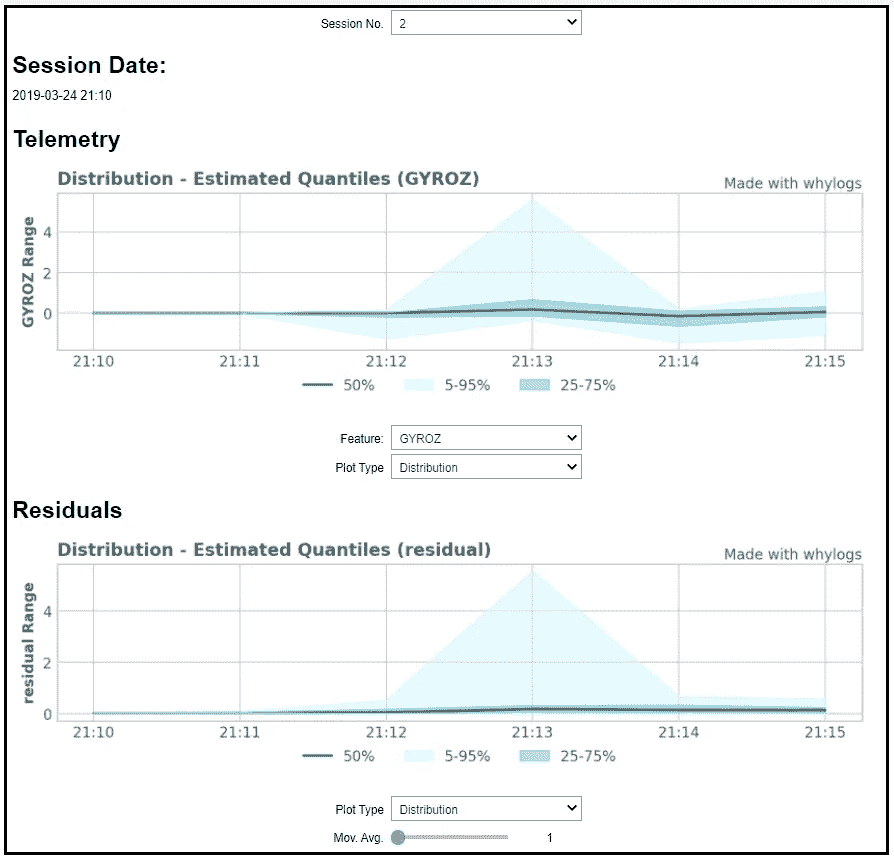
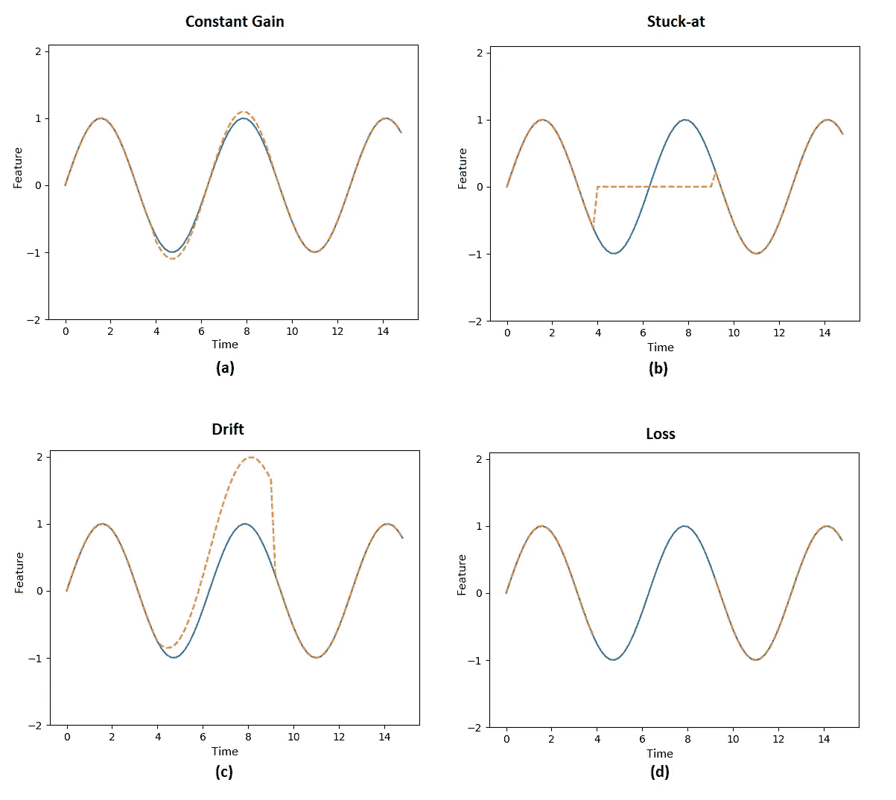
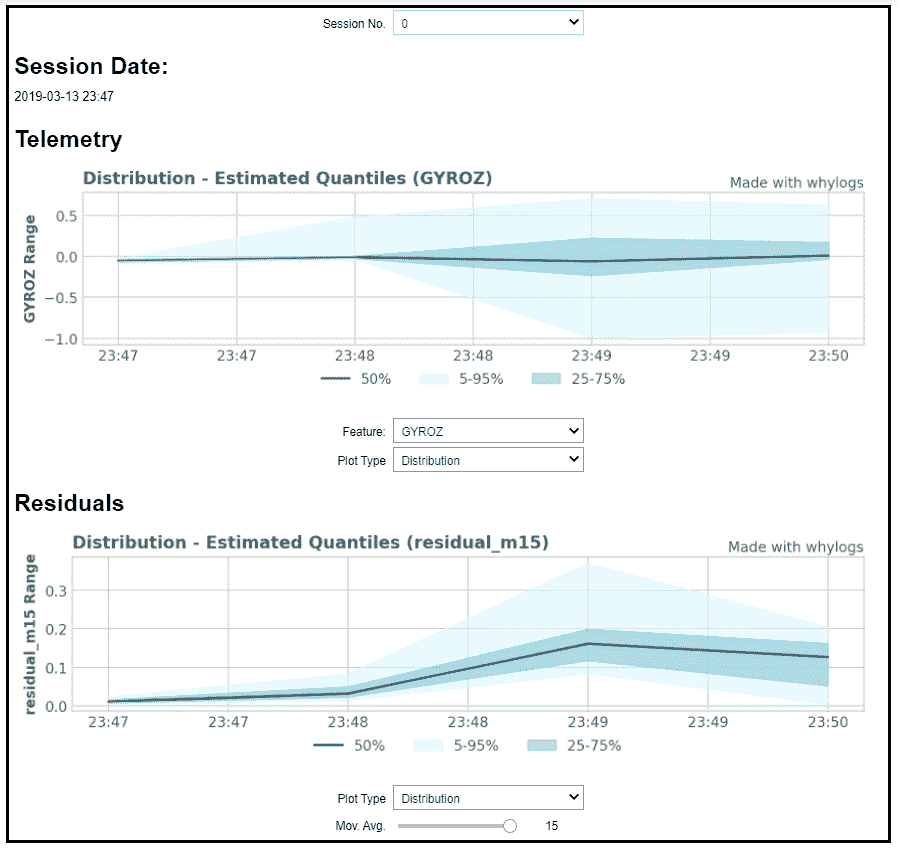
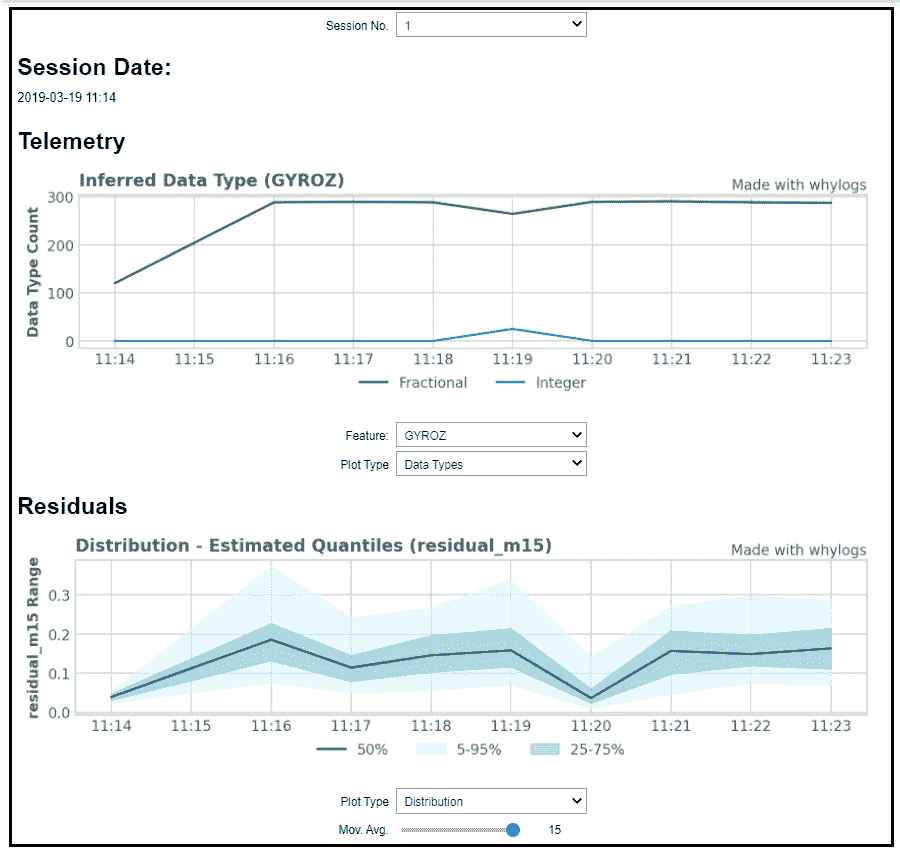
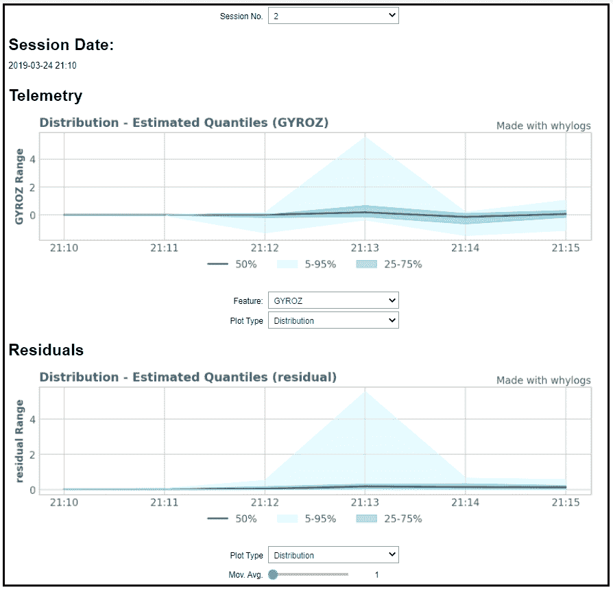
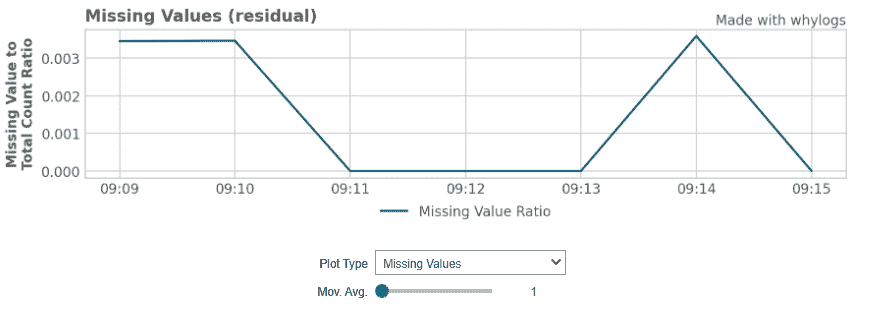

# 水下无人驾驶飞机的监控

> 原文：<https://towardsdatascience.com/monitoring-of-an-underwater-drone-3c5c8a6d1a21?source=collection_archive---------46----------------------->

## 使用 Kafka 和 whylogs 监控流数据


克里斯·利维拉尼在 [Unsplash](https://unsplash.com/?utm_source=unsplash&utm_medium=referral&utm_content=creditCopyText) 上的照片

数据在做出明智决策中的重要性现在已被几乎所有应用普遍认同。这也促进了对工具的需求，使我们能够以明智和有效的方式利用这些数据。

在本文中，我想分享一种方法，通过记录流数据的统计配置文件来设置监控仪表板，从而利用流数据。为此，我将使用水下遥控潜水器( **ROV** )作为用例。更具体地说，我们将监测来自最新的 OpenROV(现在的 [Sofar](https://www.sofarocean.com/) )的 [OpenROV v2.8](https://openrov.dozuki.com/c/OpenROV_v2.8_%28Kit_Assembly%29) 的故障，这是一种低成本的远程机器人水下无人机。为了增强我们的故障检测能力，我们将使用一个回归模型，通过 [SKLearn](https://scikit-learn.org) 平台进行训练，对我们的车辆行为进行建模。这样，我们的监控仪表板将服务于两个目的:监控回归模型的性能和质量问题，以及(主要)监控车辆本身的健康状况。由于故意破坏 ROV 会很麻烦，我们将在我们的数据中手动注入一些传感器故障，并希望能够通过使用我们的仪表板来检测这些故障。

作为选择的数据记录平台，我们将使用 [**whylogs**](https://github.com/whylabs/whylogs) ，这是一个来自 [WhyLabs](https://whylabs.ai/) 的开源库，旨在监控来自 ML/AI 应用程序的数据。Whylogs 为记录的记录计算近似的统计数据，这意味着它是具有大量数据的管道的合适选择。尽管这个例子使用了最少量的信息，但是知道所选择的工具考虑到了未来可能的扩展还是很好的。

由于我们要处理实时数据的连续流，我们需要选择一个合适的事件流平台。从这个意义上说，在这个项目中使用 Kafka 似乎是一个自然的选择，也是一个熟悉这个工具的好机会。这样，我们可以通过使用发布/订阅模式，将遥测信息的发送从模型预测和日志记录过程中分离出来。

你可以在这个项目的 [jupyter 笔记本](https://github.com/whylabs/whylogs/blob/mainline/examples/rov_whylogs/ROV-whylogs.ipynb)中了解这里讨论的一切。在[项目的资源库](https://github.com/whylabs/whylogs/tree/mainline/examples/rov_whylogs)中，您还会发现贯穿本文的各个 Python 脚本和所需文件。

# 目录

1.  [*概述*](#3f55)
2.  [*我们以*](#9212) 结束
3.  [*故障注入*](#2447)
4.  [*开发应用程序*](#090f)
    *∘*[*设置 Kafka*](#2317) *∘*[*创建 Kafka 客户端*](#2f79) *∘*[*遥测生产者*](#6418) *∘*[*预测生产者*](#137f)
5.  [*监控仪表盘*](#d76c)
    *∘*[*会话 0 —恒定增益故障*](#5823)
    *∘*[*会话 1 —卡在(零)*](#4fa7)
    *∘*[*会话 2 —卡在(最大值)*](#e17c)
6.  [*结论*](#7c4d)

# 概观

让我们仔细看看我们的实验。



作者图片

ROV 以在线方式将其遥测信息发送到遥测主题中。这些信息只是 JSON 对象的集合，其中每个对象代表不同特征的一个采样点，例如车辆的角位置、电流、电压等。考虑到在这种情况下，信息已经收集完毕，我们将简单地通过 Python 脚本发送 JSON 内容，模拟 ROV 的实时操作。鉴于我们的目标是检查我们是否能够监控和验证一些常见传感器故障的存在，我们需要在将数据发送到遥测主题之前，在数据集中手动注入一些故障。传感器故障将在下一节详细解释。

下一个组件是预测生成器，它使用遥测主题，以便通过训练好的回归模型生成预测，并将结果传输到单独的预测主题中。在这个用例中，回归模型使用遥测信息来预测一个特定特征的下一个时间步长— **GYROZ** ，这是 ROV 在*偏航*方向的角速度(潜水器转弯的速度)。回归模型是一个线性最小二乘回归模型，具有 *L2* 正则化和多项式基函数，使用 [SKLearn](https://scikit-learn.org/stable/) 库在大约 24 小时的 ROV 操作中进行训练。

接下来的两个组件将持续监听遥测和预测主题，以建立我们数据的统计资料，这些资料将用于记录会话的后续人工检查阶段，以便有望检测到 ROV 操作期间可能出现的异常。在这种情况下，如果采样点距离上一个采样点超过 5 分钟，则认为新的操作会话已经开始，对于每个会话，我们将数据聚合为 1 分钟一批的数据。由于我们的采样频率为 **5 Hz** ，因此每批大约有 300 个采样点。

最后，我们需要一种简单的方法来可视化统计结果。我决定将最相关的绘图类型集中在一个 iPython 小部件中。这样，我们只需使用 jupyter 笔记本就可以检查 whylogs 摘要的当前状态。

# 我们最终会得到什么

不要在整篇文章中建立结论，让我们从展示我们将如何监控我们的 ROV 操作和模型预测开始。一旦我们的所有流程都在发送和记录来自 ROV 操作的信息，最后一个组件就是监控仪表板本身，我们希望在这里集中所有必要的信息，以评估潜水器的行为。

考虑到最终目标是检测不同种类的故障，我实现了一个带有可定制参数的监控仪表板，因此我们可以从 whylogs 中选择正确的图表来检测不同的情况。在这个仪表板中，我们基本上可以选择要选择的参数:

*   要检查的单个操作会话。
*   我们希望检查的遥测信息，如速度、位置、电机输入、CPU 使用率等。
*   线性回归模型的预测，此处用于检查我们的 ROV 的行为是否与我们在标称条件下的预期有很大不同。



作者图片

我们将在文章的结尾更详细地讨论这些结果，但最终的结论是，通过调整我们仪表板的正确参数，我们肯定能够检测到由我们车辆中的感官故障引起的异常情况。因为这里的重点不是开发完美的回归模型，我们的预测本身不足以检测某些情况下的错误。然而，通过结合来自我们的预测和输入特征可视化的见解，我们可以对我们检查的每个操作会话中发生的事情有所了解。

# 故障注入

在这个实验中，我们将使用来自 **4** 个不同操作会话的数据，每个会话的持续时间从 **4** 到 **9** 分钟不等。在每个会话中，大约在一半时间注入一个持续时间为 **5s** 的 **GYROZ** 传感器故障。你可以看看 JSON 文件，已经注入了错误，在项目的资源库中，在 **rov_data** 文件夹下。

在下图中，注入的故障类型用橙色表示，应用于样本正弦信号。在会话 0 中，注入一个**恒定增益**故障，其中真实值因乘以一个恒定因子而失真，如 **a)** 所示。**固定**故障在会话 1 和会话 2 中均被模拟，不同之处在于其“固定”的值——而在会话 1 中，GYROZ 值固定在值 0，如 **b)** 所示，会话 2 的固定值为 5.56，这与 ROV 陀螺仪传感器的最大范围有关。最后，在会话 3 中注入一个**漂移**传感器故障，如 **c)** 所示。该故障模拟的情况是，相对于故障开始时，随着时间的增加，实际值发生失真。



作者图片

除了这些传感器故障，会话 3 中还应用了**丢失**错误，模拟水下机器人长时间停止发送信息的情况。与之前的故障不同，该故障不仅影响 **GYROZ** 值，还影响车辆传输的整套特征。这是通过在会话 3 运行结束时从我们的数据集中手动删除一些连续的数据点来模拟的。

# 开发应用程序

现在我们已经有了用例的概述，让我们继续实际实现应用程序。接下来的几个部分将涵盖向我们在 Kafka 的主题发送/读取信息所需的代码，使用我们的回归模型进行预测，并使用 whylogs 记录我们的统计数据。

## 建立卡夫卡

在继续之前，我们需要用 Kafka 设置我们的流平台。我们正在处理低生产者吞吐量，所以设置一个与 Docker 本地卡夫卡将足以为这个项目。为此，你可以遵循[本教程](https://betterprogramming.pub/your-local-event-driven-environment-using-dockerised-kafka-cluster-6e84af09cd95)。文章中详细解释了步骤，但是对于非常短的版本，您可以简单地将 **docker-compose.yml** 文件复制到您想要的文件夹中，然后运行 docker-compose up。对于这一步，您自然需要安装 Docker。

一旦容器启动，您可以使用以下命令进入`kafka-tools`命令行界面:

`docker exec -it kafka /bin/sh`

并检查可用的主题，只是为了确保它的工作:

`kafka-topics --list --bootstrap-server localhost:9092`

## 创造卡夫卡式的客户

在接下来的 Python 脚本中，我们将不得不创建大量的 Kafka 消费者和生产者。让我们定义两个简单的函数来创建客户端，这样我们可以在将来重用它们:

在这两种情况下，客户端都被告知应该联系的地址，以便引导初始群集元数据。此外，由于我们正在生成/消费 JSON 格式的值，我们需要用`vaue_serializer` / `value_deserializer`参数为它指定正确的处理方式。

在这个项目中，消费者被设置为总是从主题的开头开始，以确保每次运行都将记录整个内容。为此，在开始之前，我们首先必须手动将分区分配给我们想要的主题。

关于 whylogs 与 Kafka 集成的更多信息，你可以参考这个[教程笔记本](https://github.com/whylabs/whylogs-examples/blob/mainline/python/Kafka.ipynb)和 WhyLabs 上的这个[博客帖子。](https://whylabs.ai/blog/posts/integrating-whylogs-into-your-kafka-ml-pipeline)

## 遥测生产者

现在我们已经运行了 Kafka，我们可以开始将 ROV 数据发送到我们的遥测主题。首先，我们需要创建一个 Kafka Producer 客户端，它将记录发布到我们的集群，并读取 **rov_data** 文件夹中的 JSON 编码文件，以创建一个字典列表:

正如我们所看到的，我们的采样点由一系列特征组成:

*   *mtarg1，mtarg2，mtarg3* :向 3 个螺旋桨中的每一个发送输入指令。
*   *侧倾、俯仰、偏航*:车辆绕 **X、Y、Z** 轴的角度位置。
*   *LACCX，LACCY，LACCZ:* 车辆绕 **X，Y，Z** 轴的角加速度。
*   *GYROX，GYROY，GYROZ:* 车辆绕 **X，Y，Z** 轴的角速度。
*   *SC1I，SC2I，SC3I:* 每个螺旋桨的电流读数。
*   *BT1I，BT2I:* 电动每个电池组的电流读数。
*   *vout、iout 和 CPU usage:*ROV 的 BeagleBone 微型计算机的电压、电流和 CPU 使用率。

我们现在可以在我们的主题中发布我们的数据点:

如果您愿意，在发送信息之前，最好通过在`kafka-tools`输入以下命令来创建带有适当分区/复制的 Kafka 主题:

```
kafka-topics --create --bootstrap-server localhost:9092 --replication-factor 1 --partitions 1 --topic telemetry-rov
```

但是您不必这样做，因为如果主题不存在，它会自动创建一个主题。

在这个例子中，维护记录的顺序非常重要，所以我们调用了一个`producer.flush()`来确保只有在前一个请求已经被提交时才发出新的请求。

## 预测生产者

有了遥测数据，我们就能够开始用回归模型进行预测。鉴于我们正在对 *GYROZ* 进行一步预测，我们只需要等待一个时间步就可以得到我们的地面真相。通过计算上一个时间步的预测值和当前实际值之间的差值，我们定义了所谓的*残差*。这个想法是，水下机器人的潜在异常会产生更高的残差，因为我们的预测会比通常的实际值更远。

和前面一样，我们创建了**消费者**客户端(从遥测主题读取)和**生产者客户端**(发布到我们的预测主题)。我们还必须加载我们的 *SKLearn* 模型，用 *joblib:* 持久化

在我们的 *main* 函数中，脚本将持续从主题中获取数据，并计算每个时间步长读取的残差。如果 10 秒钟过去了还没有收到新的记录，我们会输出一个警告来通知用户。

一旦我们有了当前和先前时间步长的数据，就可以计算残差:

为了进行预测，我们还需要加载在模型训练过程中安装的**最小-最大**定标器(`BL_x.pickle`和`BL_y.pickle`)，这样我们就可以对预测和逆变换的特征进行变换，以输出未缩放的残差。

为了保持遥测和预测主题之间的一致性，我们希望存储每个时间戳的残差，即使计算它是不可能的。因此，对于第一个采样点，或者当两个采样点在时间上相距太远时，残差被记录为一个`nan`值。

## 遥测记录器

一旦适当地设置了两个 Kafka 生成器，我们就可以开始用 whylogs 记录我们的会话配置文件了。记录从遥测主题轮询，并分成单独的会话。如果下一个采样点与上一个采样点相隔超过 5 分钟，则当前会话将被结束并记录，然后再开始下一个会话。当超过 10 秒钟没有新信息时，我们也认为当前会话已经结束，并记录结果。

## 预测记录器

我们的预测题目也是这样。这里的不同之处在于，我们不仅要记录剩余要素，还要进行一些转换，以便创建和记录附加要素。

即使对于车辆的标称条件，我们也可能在残值中有峰值，导致高比率的误报。为了减少这种情况，我们根据不同的时间框架计算残差的移动平均值。在本例中，除了未改变的残差，我们还将记录最后 **5** 、 **10** 和 **15** 时间步长( **1** 、 **2** 和 **3** 秒)的移动平均值:

如果，对于给定的滑动窗口，我们有`nan`值，或者我们没有足够的记录来计算移动平均值，那么对于给定的时间戳，`nan`被记录。

## 会话记录器

每当记录器结束一个会话时，就会调用`log_session()`函数，该函数负责初始化一个日志记录会话，并记录给定会话的每个记录。

为此，让我们将数据组织成一个 **Pandas 数据帧**，将我们的时间戳列转换成 **datetime** 对象，然后使用`df.groupby`将数据帧分成一批，每批 1 分钟。通过这种方式，每个操作阶段都将记录水下机器人每分钟活动的统计数据。`key`和`freq`参数分别告诉我们分组的列和分组的频率。

将数据适当地分成批后，我们现在可以为每批数据调用`session.logger()`，传递`dataset_timestamp`来标记每个窗口的开始，并继续记录每批数据。

# 监控仪表板

在这个阶段，我们让我们的消费者监听发送的任何新记录，并将它们记录到我们的 whylogs 输出文件夹中，根据配置文件 *.whylogs.yaml* ，这个文件夹就是 **whylogs-output** 文件夹。剩下要做的是使用生成的统计数据来检查操作会话，寻找注入故障的迹象。

Whylogs 为我们提供了许多探索日志统计属性的方法。在这个例子中，我将把自己限制在内置的绘图上，这为我们提供了一种直观检查特性的方法，比如特性分布、缺失值和数据类型。

尽管要监控的主要遥测特征是 **GYROZ，**但有一种简单的方法来检查所有其余特征的曲线将是有用的。至于剩余特征，我们可能想要检查不同移动平均线的图。考虑到这些选项中的任何一个，我们都有 3 或 4 种可能感兴趣的图，将所有这些选项集中到一个交互式监控仪表板中会很有趣，用户可以在其中选择他感兴趣的特定图。在这个项目中，这是以一个 **iPython 小部件的形式完成的。**

在本文中，我将只展示小部件的输出，但是您可以在附带的 [**jupyter 笔记本**](https://github.com/whylabs/whylogs/blob/mainline/examples/rov_whylogs/ROV-whylogs.ipynb) 中查看完整的代码和详细的解释。在项目的存储库中，您会发现预先记录的信息已经准备好了，因此您可以直接跳到仪表板部分。只是一定要安装 **ipywidgets:**

`python -m pip install ipywidgets`

并启用小部件扩展:

`jupyter nbextension enable --py widgetsnbextension`

## 会话 0 —恒定增益故障

现在，让我们看一些输出示例。通过选择第一个会话，我们将看到 ROV 操作的日期和时间，以及遥测和残差图的不同选择:



作者图片

该会话有一个**恒定增益**传感器故障。从上图来看，单独评估 **GYROZ** 分布是困难的，因为不同的驾驶模式会导致不同的分布，这是正常的。不变的残值也不是很清楚。但是通过应用 3s 的移动平均线，我们肯定开始看到一些异常行为的迹象。在这种情况下，仅监控车辆的传感信息不足以检测故障。

## 会话 1 —停留在(零)

让我们继续我们的第二个例子，**会话 1:**



作者图片

在此阶段，注入了一个**固定 0** 故障。不幸的是，在这种情况下，遥测和残差分布都没有多大帮助。回归模型不够敏感，不足以捕捉故障。然而，**数据类型**图产生了一个有趣的结果。该特性的值通常是一个浮点数，但是 whylogs 将一系列恰好为 0 的值推断为一个整数序列，使其与众不同。

## 会话 2 —固定不变(最大)

第三个例子也是固定值，但固定在传感器的最大范围:



作者图片

这个很容易发现，因为最大值确实高于通常的分布。遥测和残差分布图都认为在 **21:13** 附近有异常。

## 第 3 部分—漂移和损失

为了避免重复，我不会显示漂移传感器故障的分布图，因为这种情况下产生的图与**会话 0** 非常相似。然而，应用于残差的**缺失值**图告诉我们一些关于注入损耗误差的信息:



作者图片

每当我们没有有效的先前时间步长时，残差就用`nan`值记录。因此，预计第一个会话的采样点会有缺失值。但是，当它们出现在运行的中间时，这是两个采样点之间经过了一段延长的时间( **> 0.5s** )的标志，表明出现了损失错误。尽管我们没有直接监控丢失错误，但我们可以在运行结束时看到它的存在，大约在 **09:14** 。

# 结论

在本文中，我想通过在一个特定的用例中应用它们来探索数据流和监控的可用工具:水下无人机的故障检测。尽管 MLOps 生态系统正在快速发展，但我觉得在生产中监控 ML 应用程序的解决方案仍然很少。这就是为什么像 whylogs 这样的开源工具是 ML 从业者工具集的一个非常受欢迎的补充。

在这个项目中，我们的回归模型远非完美，在许多情况下，预测本身不足以捕捉我们注入的故障条件。然而，通过设置一个简单的监控仪表板，我们能够通过同时查看输入和输出图来获得更广泛的视图，此外，我们还能够从许多不同的图中选择不同的特性。对于这个项目，在仪表板中只包含来自 whylogs 的内置图就足够了，但是我们可以通过包含每个完整会话的可用摘要的单独选项卡来添加更多信息。

至于应用程序本身，也有很大的扩展空间。在这个例子中，出于演示的目的，我们在本地使用了 Kafka，但是我确信对于一个生产环境，事情会变得更加复杂。也许在未来，我们可以让整队的遥控潜水器被自动监控故障！

暂时就这样吧！感谢您的阅读，如果您有任何问题或建议，请随时联系我们！