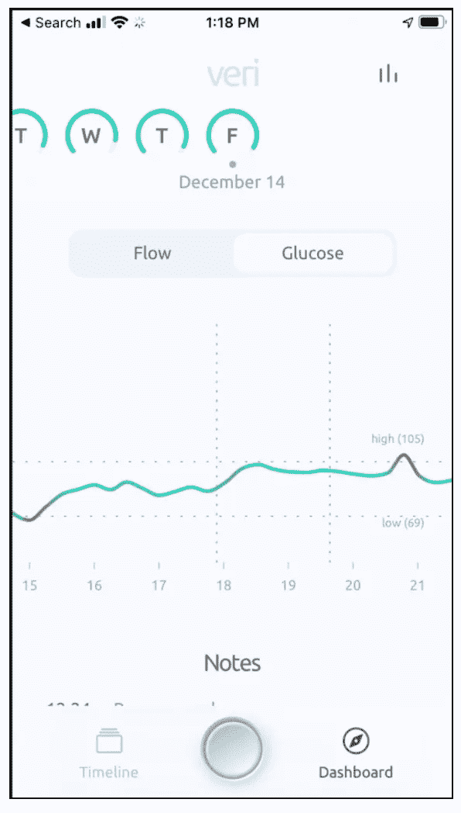

# 在看恐怖电影时分析你身体的葡萄糖反应

> 原文：<https://towardsdatascience.com/monitoring-your-glucose-response-during-a-horror-movie-78904a890e96?source=collection_archive---------53----------------------->

可穿戴设备将会继续存在。像 Fitbit 这样的设备现在拥有大约 3000 万活跃用户，比这个星球上活跃的软件开发者还多，而且在久而久之越来越受欢迎。

来自 [Pexels](https://www.pexels.com/photo/halloween-decorated-room-5435182/?utm_content=attributionCopyText&utm_medium=referral&utm_source=pexels) 的 [Cottonbro](https://www.pexels.com/@cottonbro?utm_content=attributionCopyText&utm_medium=referral&utm_source=pexels) 摄影

可穿戴设备有各种形状和尺寸，可以执行各种功能。我有幸测试了 T4 Veri T5 公司的一种新设备，它能提供实时血糖数据。这让我想到:除了监测糖尿病等疾病，我们还能通过跟踪血糖水平获得什么好处？

但首先，这里有一些关于血糖监测设备的基础知识。是的，它确实有一根针。不，不是不方便。是的，它确实需要每 15 天更换一次，是的，它很舒服，也很容易使用。

你可能想知道为什么有人会在手臂上插一个针头传感器，但话说回来，这比记录你六年来的饮食习惯要少得多。(实际上，在可穿戴设备出现之前，有一些有趣的研究调查了有多少人在记录他们的习惯。)

# 了解葡萄糖和身体的胰岛素反应

理解这些数据需要相当多的知识。如果你对此感兴趣，我鼓励你做更多的研究。在这里，我将更多地关注数据是如何设计的，以及它如何作为一种数据集的例子，这种数据集可以促进对个体的更好的医学理解，并创造出“精确病人”，正如史蒂文·查拉普博士曾经称他们为“精确病人”。

这里你可以看到 Veri app UI 显示了我某个典型早晨的数据(这个数据其实是真实的)。如果你的第一反应是想知道工程单位 mg/dL 是什么，那就随便玩转换器吧。TLDR 版本设定为 70 毫克/分升约为 3.9 毫摩尔/升，100 毫克/分升约为 5.6 毫摩尔/升

图片由 [Veri](http://veristable.com) app 作者提供

根据梅奥诊所的说法，血糖水平低于 200mg/dl 属于正常范围，低于 100 mg/dl 属于正常空腹范围。

# 我从数据本身学到了什么？

我收到的数据实际上是相当重复的。我在想我可能会进行的各种食品工程实验，但无论我吃什么，我的代谢反应都是相似的，我的葡萄糖水平以一种非常可预测的方式波动——当我吃东西时，它们上升，当我禁食时，它们缓慢下降。但是，我还是得到了一些有价值的观察结果:

**锻炼**导致我的血糖水平出现有趣的波动。左侧的“峰值”实际上来自禁食期间的剧烈运动，而不是进食。

**禁食期间的血糖变化**让我对通过酮症分解脂肪如何影响我的血糖水平有了一些了解。了解酮症等功能背后的理论是一回事，但没有什么比看到自己血糖数据的起伏更重要的了。

图片由 [Veri](http://veristable.com) app 作者提供

**对葡萄糖的营养影响**是我最期待测量的，但正如你在左边的图表中看到的，它显示了当我在下午 6 点后吃东西(“适当的食物”)和晚上 8 点后再吃东西(精制糖)时，吃“适当的食物”实际上对葡萄糖水平的影响比锻炼小(尽管那些美味的精制糖确实导致了最大的峰值)。

# 你还能试验什么？

给我印象最深的是我的数据的重复性。当然，这完全取决于所讨论的人，并且在某人开始具有较大葡萄糖水平差异的情况下，该数据的效用将会高得多。然而，这让我想起了一个有趣的问题:我还能把这些数据和什么结合起来呢？

在我们最近与 Jim Guszcza 的讨论中，他指出，可穿戴设备可以通过向开发者开放数据来成倍增加其创造的价值，然后开发者可以将这些数据整合到新的应用中。这个案例也不例外。如果我能像看恐怖电影一样监控我的葡萄糖对外部压力的反应会怎么样？有影响吗？弄清楚会很有趣。其他生命体征呢，比如体温？我们能从由我们的综合健康数据组成的数据集中收集到什么？

# 开放平台放大价值

如果将行为数据、来自不同传感器的数据以及活动、媒体消费和营养数据结合起来，您会看到用例的数量增加了几个数量级。我确信有一个最佳间歇禁食时间表的用例，甚至可能有一个不同类型电影的理想小吃的用例。

你能想到什么类型的用例？[让我们知道](https://liberty-equality-data.featureupvote.com/)。