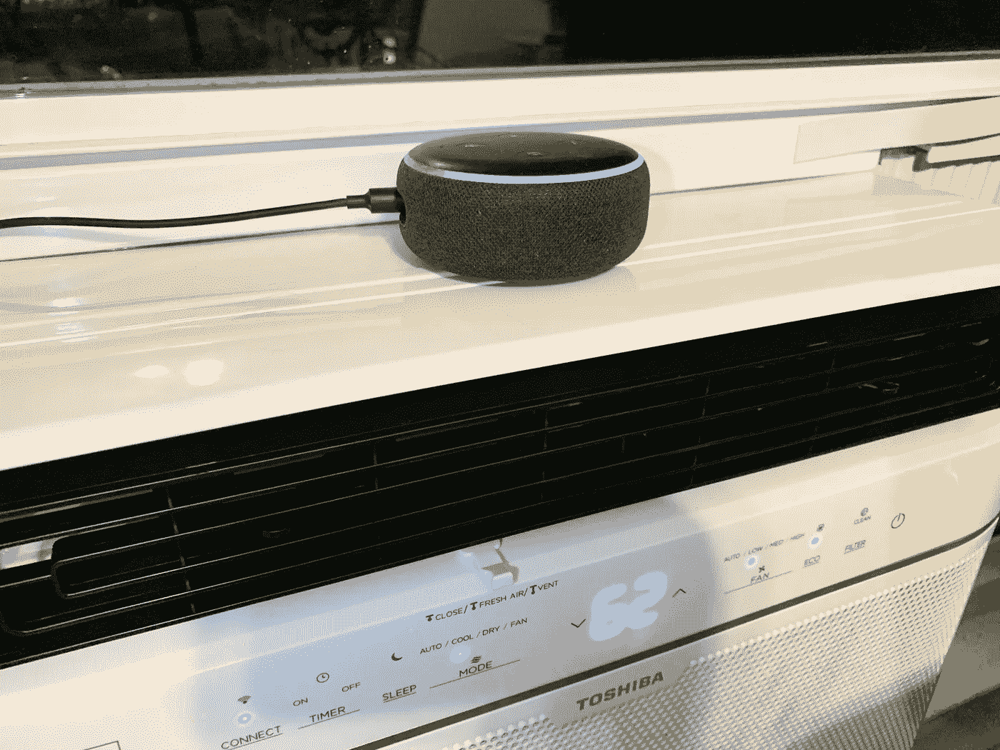
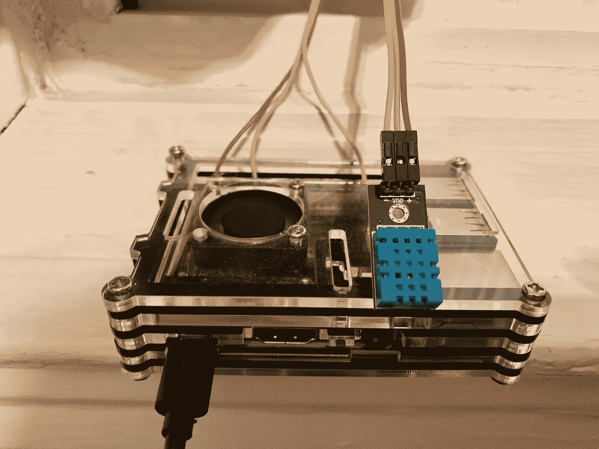
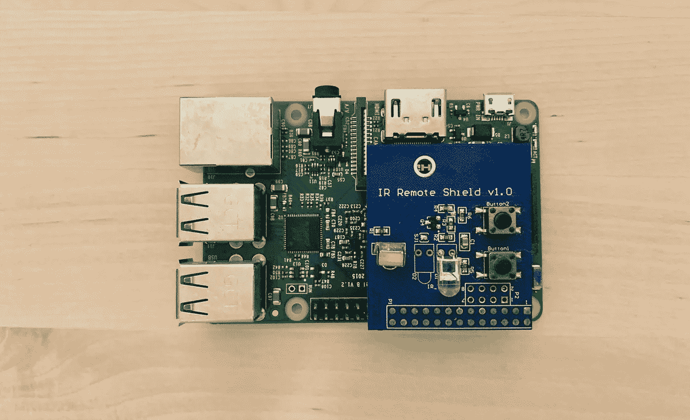
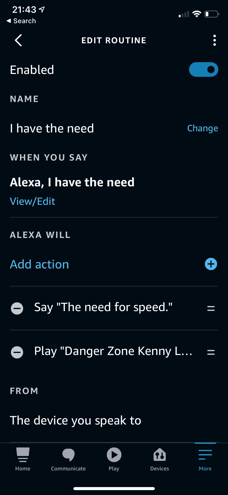
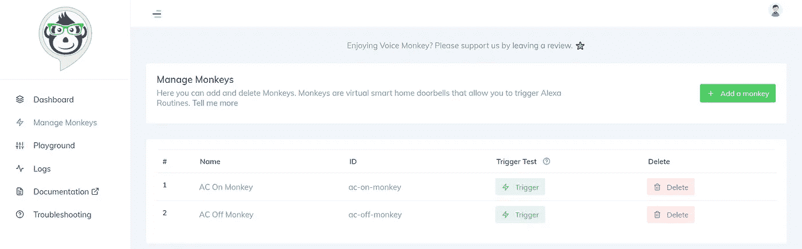
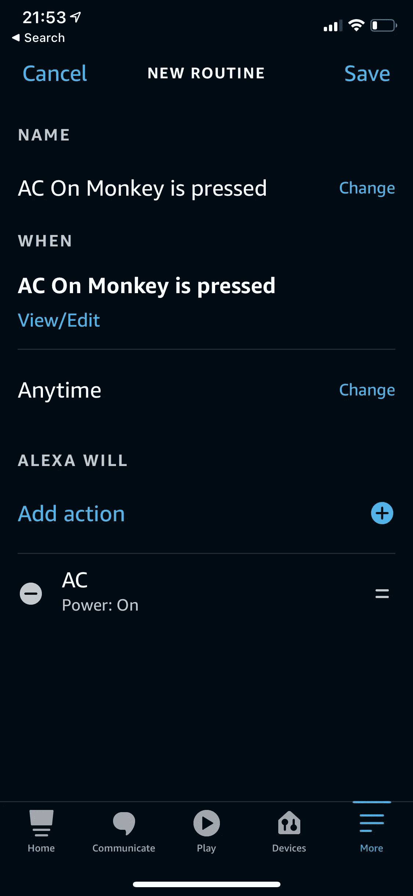

# 摆弄 Alexa 程序

> 原文：<https://towardsdatascience.com/monkeying-around-with-alexa-routines-3f3f95795922?source=collection_archive---------13----------------------->

## 最后一种编程调用 Alexa 例程的方法

如果您正在寻找一种在代码中调用 Alexa 例程的方法，您已经找到了合适的文章。我将向你展示如何使用免费的 Alexa 应用程序[语音猴](https://app.voicemonkey.io/)，在任何程序和你的 Alexa 之间架起一座桥梁。

*你为什么要这么做？*

可能有大量有创意的用例，但我想到了两件事:

1.  在代码中与支持 Alexa 的智能设备进行交互
2.  在你的代码中使用你的 Alexa 作为某种语音提示系统

*这种方法最好的一点是它是语言不可知的。*一旦你设置好了，就只需要一个 GET 请求来调用你的 Alexa 程序。



Alexa 已经可以控制这台空调了…如果我能用树莓 Pi 或者无服务器功能之类的东西控制 Alexa 岂不是很酷？(图片由作者提供)

## 我的问题背景

当我在寻找用 Python 程序控制我的 Alexa 空调的方法时，我遇到了语音猴子。

我的“智能”空调应该将房间保持在一定的温度，但根据我的经验，它要么太冷，要么太热。我可以通过简单地与 Alexa 交谈来打开/关闭我的空调并设置温度——这使得调整事情更容易——但我与 Alexa 交谈的次数有点太多了。为什么不让程序替我做呢？

我有一个备用的 Raspberry Pi 来运行我的程序，连接到 DHT11 温度传感器来监控温度——我的计划是监控当前温度，并根据需要打开或关闭我的空调，以保持更可预测的温度。



我值得信赖的树莓 Pi 3 连接到 DHT11 传感器。[这种便宜的小传感器可以测量精确到 1 摄氏度和 1%湿度的温度和湿度。(图片由作者提供)](https://components101.com/sensors/dht11-temperature-sensor)

似乎可行——但有一件事让这个计划有点困难。

**如何通过树莓 Pi 与我的 AC 进行交互？**

是的，也许我可以用电线把我的树莓皮接到我的交流电上，但是我真的没有摆弄物理电子设备的背景。我的 AC 带有一个遥控器——也许我可以用一个带有红外发射器的 Raspberry Pi 来重放来自 AC 遥控器的命令？这是可行的，但是记录和定义这些按钮的工作量很大。



您可以通过带有 Raspberry Pi 和红外增强器的红外遥控器来控制任何可控制的设备。我以前用上图的设置做过，但是设置、记录所有按钮的红外输出以及找到一个红外发射器可以清晰地看到你想要控制的设备的地方需要很多工作——这实际上是最后的手段。(图片由作者提供)

我的结论？我的 AC 是一款智能设备，内置了某种智能家居接口，最好利用这一点。制造商已经为我们做了大量工作来创建 Alexa 界面，所以我们就用它吧。

**但是我们如何与这款智能设备的 Alexa 界面互动呢？**目前还没有真正官方支持的 Alexa 方式来做到这一点。

浏览几年前的一些论坛，我看到一个建议，写一个程序来执行文本到语音转换，并将语音记录发送到 Alexa API。它可以让你调用任何你想要的 Alexa 命令，但这有点不方便，因为你需要一种方法来自动刷新你的亚马逊 cookies(根据我的经验，我每次都需要填写验证码)。

另一个建议甚至更笨拙——使用两个相邻的 Alexa 设备，并使用这个[主动提供的 Alexa 文本到语音转换项目](https://github.com/walthowd/ha-alexa-tts)，让第一个 Alexa 设备说出你给它的任何命令，第二个 Alexa 设备实际上执行命令。这将是可行的——但它确实需要一个额外的 Alexa 设备，而且让这些东西一直互相说话肯定会很烦人。更不用说它可能会有点慢，而且不可靠(在命令过程中考虑像背景聊天这样的事情可能会把事情弄糟)。

如果你想在几年前做类似的事情，这将是你不得不忍受的地狱。

谢天谢地，我发现了一个更近的建议，使用[语音猴子](https://app.voicemonkey.io/)作为一个 API 来暴露你的 Alexa 例程，与其他选择相比，这似乎是显而易见的。

Alexa 例程是 Alexa 的一个功能，让你在你的 Alexa 生态系统中做类似 IFTTT(如果这个，那么那个)的事情。使用 Alexa 例程，您可以为一系列命令创建自己的快捷方式，这些命令可以链接到自定义触发器。



Alexa 例程可以让你为任何你想要的触发器串起一系列的 Alexa 命令。这是我从 Reddit 上重新创建的一个，我觉得很有趣。(图片由作者提供)

简单来说，它是如何工作的:语音猴子让你创造猴子，他们称之为“虚拟智能家庭门铃”

你可以把每只猴子想象成它自己独特的虚拟按钮(显示为 Alexa 支持的智能设备)，可以通过向分配给猴子的 URL 发送 GET 请求来按下它。通过 Alexa 例程，你可以使用猴子作为 Alexa 例程的触发器(它可以调用你的 Alexa 支持的几乎任何功能)。很酷吧？



你可以看到我创造的猴子。每只猴子都被分配了一个唯一的 URL，我可以通过发送 GET 请求来触发它。Voice Monkey 为您提供了一个很好的触发测试来测试您的创作，还提供了一个[游乐场](https://app.voicemonkey.io/url)部分，它提供了一个 UI 来定制您的 GET 请求。(图片由作者提供)



在你的 Alexa 程序中设置你的猴子为“当”触发器。这个 Alexa 例程现在可以通过 GET 请求调用。(图片由作者提供)

## 使用语音猴进行设置

设置起来相当容易。下面是[语音猴快速入门指南](https://voicemonkey.io/docs)提供的一些说明。

> 1.你首先需要使用 Alexa 应用程序[启用语音猴子技能](https://skills-store.amazon.com/deeplink/dp/B08C6Z4C3R)并链接你的亚马逊账户。
> 
> 2.[使用您用于链接技能的同一个亚马逊帐户登录](https://voicemonkey.io/login)到语音猴。
> 
> 3.完成设置，然后转到[“管理猴子”](https://app.voicemonkey.io/monkeys)生成您的第一只猴子。
> 
> 4.在 Alexa 应用中创建一个新的例程，以你的猴子为触发器(“当这发生时”>“智能家居”>“你的猴子名”)。
> 
> 5.访问仪表板的[游乐场](https://app.voicemonkey.io/url)部分，测试你的新猴子。
> 
> 6.(可选)-要发布公告，您必须打开语音猴技能，作为您的例行程序中的最后一个动作。

一旦你完成了这个设置，你应该准备好启动你的猴子了！

## 尝试你的第一个请求

使用以下 URL 中的自定义值替换`MY_ACCESS_TOKEN`、`MY_SECRET_TOKEN`和`MY_MONKEY_NAME`，并尝试从浏览器导航到该 URL。

`[https://api.voicemonkey.io/trigger?access_token=MY_ACCESS_TOKEN&secret_token=MY_SECRET_TOKEN&monkey=MY_MONKEY_NAME&announcement=hello%20world](https://api.voicemonkey.io/trigger?access_token=MY_ACCESS_TOKEN&secret_token=MY_SECRET_TOKEN&monkey=MY_MONKEY_NAME&announcement=hello%20world)`

你应该看到你的猴子被触发了。如果你在你的 Alexa 例程中添加了语音猴子技能作为最后一个动作，你应该会听到 Alexa 说“你好，世界”。

现在，如果您想让您的程序向这个 URL 发送 GET 请求并进行自定义通知，您可以在 URL 中的`announcement`参数中填入您喜欢的任何内容——只需确保使用编码 URL 中空格字符的`%20`进行分隔。

例如在 Python 中

```
import requestsdef format_url(s):
    return s.split().join('%20')url = '[https://api.voicemonkey.io/trigger?access_token=MY_ACCESS_TOKEN&secret_token=MY_SECRET_TOKEN&monkey=MY_MONKEY_NAME&announcement=](https://api.voicemonkey.io/trigger?access_token=MY_ACCESS_TOKEN&secret_token=MY_SECRET_TOKEN&monkey=MY_MONKEY_NAME&announcement=hello%20world){}'temp = 72 # This might change--we want to Alexa to announce itannouncement = format_url(f'Temperature is {str(temp)}')
requests.get(url.format(announcement))
```

## 结论

既然你已经听说过语音猴子，如果你想玩一些与你的定制程序挂钩的 Alexa 例程，就去试试吧。

在撰写本文时，Voice Monkey 对多达 300 只猴子完全免费。这是 300 个独特的 Alexa 例程，你可以通过语音猴 API 暴露。

提醒一句:虽然 Voice Monkey 现在是免费的，但它是一项需要提供商付费运营的服务。

[根据文件](https://voicemonkey.io/docs)

> 语音猴子是免费的，而在测试阶段，我们计划让它尽可能长时间免费。
> 
> 我们很乐意永久免费提供这项服务，但幕后存在基础设施和维护成本。
> 
> 我们将尽可能保持免费，如果需求给成本带来太大压力，如果我们引入定价结构，我们会让你知道。

不管未来的价格结构如何，现在都可以免费试用和修改！

请注意，我不以任何方式隶属于语音猴，不能保证任何可靠性，他们的服务正常运行时间。**这不是一个付费广告**，我只是在展示我个人使用案例中喜欢使用的一项服务。