# 自动驾驶中使用变压器的单目 BEV 感知

> 原文：<https://towardsdatascience.com/monocular-bev-perception-with-transformers-in-autonomous-driving-c41e4a893944?source=collection_archive---------0----------------------->

## *截至 2021 年末的学术文献和行业实践回顾*

更新:

*   添加 DETR3D，2021/11/07
*   添加 STSU，将图像转换成地图，2021/12/27

量产级自动驾驶需要可扩展的世界三维推理。随着自动驾驶汽车和其他交通代理在道路上移动，大多数时候推理不需要考虑高度，这使得鸟瞰图(BEV)成为一种足够的表示。

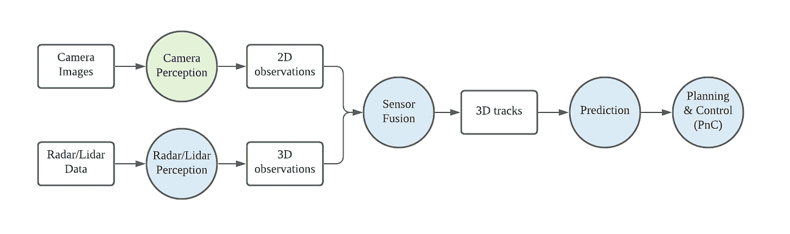

传统自动驾驶堆栈的极度简化架构(图片由作者提供)

上图说明了一个**传统的**自动驾驶栈(为了简单起见，这里省略了本地化等很多方面)。在此图中，圆圈代表功能模块，并根据它们所在的空间进行颜色编码。绿色模块发生在 2D，蓝色模块发生在 BEV。只有相机感知发生在 2D 空间，或者更准确地说，在获得机载相机图像的**透视空间** e。它依赖于传感器融合和大量手工制作的规则来将 2D 检测提升到 3D，可选地借助于来自雷达或激光雷达的 3D 测量。

> 这里我说传统至少有两个原因。首先，相机感知仍然发生在透视空间中(与最近的单目 3D 物体检测趋势相反，可以在[这里](/monocular-3d-object-detection-in-autonomous-driving-2476a3c7f57e)找到对其的回顾)。第二，来自多模态传感器的结果以后期融合的方式进行融合(与早期融合相反，早期融合中传感器数据被送入神经网络进行数据驱动的关联和几何推理)。

# BEV 感知是相机感知的未来

该图暗示，对于唯一的异常值(摄像机感知)来说，转向 BEV 将是非常有益的。首先，直接在 BEV 中执行相机感知可以直接与来自雷达或激光雷达等其他设备的感知结果相结合，因为它们已经在 BEV 中表示和使用。BEV 空间中的感知结果也容易被下游组件使用，例如预测和规划。第二，单纯依靠手工制作的规则将 2D 观测提升到 3D 是不可扩展的。BEV 表示有助于过渡到早期融合管道，使融合过程完全由数据驱动。最后，在只有视觉的系统中(没有雷达或激光雷达)，在 BEV 中执行感知任务几乎成为**强制**，因为在传感器融合中没有其他 3D 提示可用于执行这种视图转换。

 [## 面向自动驾驶的单目鸟瞰语义分割

### 2020 年 BEV 语义分割综述

towardsdatascience.com](/monocular-birds-eye-view-semantic-segmentation-for-autonomous-driving-ee2f771afb59) 

一年前的 2020 年末，我写了一篇[评论博文](/monocular-birds-eye-view-semantic-segmentation-for-autonomous-driving-ee2f771afb59)，总结了学术界关于**单眼 BEV 感知**的论文。该领域研究如何将单目图像提升到 BEV 空间进行感知任务。从那以后，我一直在更新我读过的更多的文章，以保持这篇博文的更新和相关性。这个领域的范围已经从语义分割稳步扩展到全景分割、对象检测，甚至其他下游任务，如预测或规划。

在过去的一年里，单眼 BEV 感知出现了三种方法。

*   **IPM:** 这是基于平地假设的简单基线。Cam2BEV 也许不是第一部这样做的作品，但却是最近的相关作品。它使用 IPM 来执行特征变换，并使用 CNN 来校正不在 2D 路面上的 3D 对象的失真。
*   **Lift-splat** :利用单深度估计提升至 3D，并在 BEV 上进行 splat。这股潮流是由[Lift-Splat-shot](https://arxiv.org/abs/2008.05711)发起的，后续还有 [BEV-Seg](https://arxiv.org/abs/2006.11436) 、 [CaDDN](https://arxiv.org/abs/2103.01100) 、 [FIERY](https://arxiv.org/abs/2104.10490) 等诸多作品。
*   **MLP** :使用 MLP 为视图转换建模。这一行是由 [VPN](https://arxiv.org/abs/1906.03560) 发起，[渔网](https://arxiv.org/abs/2006.09917)，以及[HDP mapnet](https://arxiv.org/abs/2107.06307)**跟进。**
*   ****变形金刚**:使用基于**注意力**的变形金刚来模拟视图变换。或者更具体地说，基于**交叉关注**的变压器模块。这一趋势开始显示出最初的牵引力，因为自 2020 年年中以来，至少到目前为止，截至 2021 年底，《变形金刚》席卷了计算机视觉领域。**

**在这篇评论性的博文中，我将关注最后一个趋势——使用变形金刚进行视图转换。**

> **几乎具有讽刺意味的是，许多文献中的论文，有些是在 CV 中的变形金刚兴起之前，有些是在最近的这波浪潮中，将它们的专用视图转换模块称为“视图变形金刚”。这使得在文献中寻找那些确实使用注意模块进行观点转换的人变得更加困难。**
> 
> **为了避免混淆，在这篇博文的后面，我将使用大写的**变形金刚**来指代基于注意力的架构。也就是说，使用*变形金刚*通过提升图像到 BEV 来执行视图*转换*似乎是一个很好的双关语。**

# **使用变压器查看变换**

**变形金刚的一般架构已经在许多其他博客中进行了广泛的解释(例如著名的[插图变形金刚](https://jalammar.github.io/illustrated-transformer/))，因此我们在此不再赘述。由于全局注意机制，变形金刚更适合执行视图变换的工作。目标域中的每个位置到源域中的任何位置具有相同的距离，克服了 CNN 中卷积层的局部受限感受野。**

## **交叉关注与自我关注**

**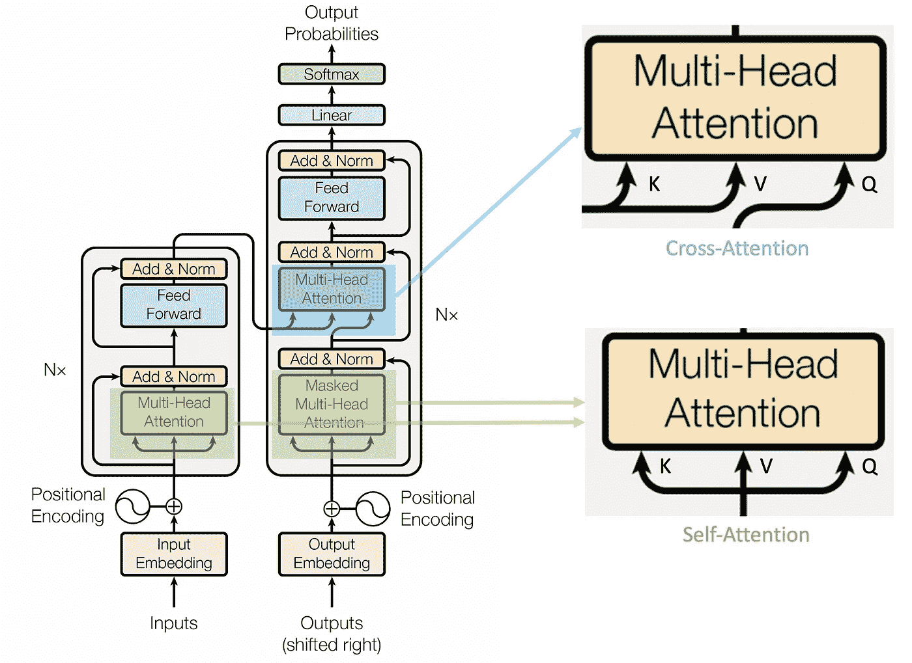**

**《变形金刚》中交叉注意力和自我注意力的运用([来源](https://arxiv.org/abs/1706.03762))**

**变压器中有两种关注机制，编码器中的**自关注**和解码器中的**交叉关注**。它们之间的主要区别是查询 Q。在自我注意中，Q、K、V 输入是相同的，而在交叉注意中，Q 与 K 和 V 在不同的域中。**

**正如[我之前的博客](/illustrated-difference-between-mlp-and-transformers-for-tensor-reshaping-52569edaf89)中所详述的，关注模块的输出形状与查询 q 相同，就此而言，自我关注可以被视为原始特征域中的特征助推器，而交叉关注则可以被视为跨域生成器。**

> ****交叉注意**的想法其实是最初的注意机制，甚至早于变形金刚的创造。注意机制在 ICLR 2015 年的论文“[通过联合学习对齐和翻译](https://arxiv.org/abs/1409.0473)的神经机器翻译”中首次提到。原始 NeurIPS 2017 Transformer 论文“[注意力是你所需要的全部](https://arxiv.org/abs/1706.03762)”的更具创新性的贡献实际上是用自我注意力模块取代了双向 RNN 编码器。这也许是为什么许多人在提到交叉注意力时仍然更喜欢注意力这个词而不是变形金刚的原因。更多精彩的叙述请见[这里](https://datascience.stackexchange.com/a/85999)。**

## **交叉注意力是你所需要的**

**《变形金刚》在 CV 中的许多最新进展实际上只是利用了**自我关注**机制，比如被大量引用的 **ViT** ( [一幅图像值 16x16 个字:变形金刚在比例上的图像识别](https://arxiv.org/abs/2010.11929)，ICLR 2021)或者 **Swin Transformer** ( [使用移位窗口的分级视觉变形金刚](arxiv.org/abs/2103.14030)，Arxiv 2021/03)。它们作为主干特征提取器的增强。然而，考虑到在大规模生产车辆上典型的资源有限的嵌入式系统中部署通用变压器架构的困难，自我关注相对于得到良好支持的 CNN 的增量好处可能难以证明。在我们看到一些突破性的自我关注超过 CNN 之前，专注于 CNN 的行业应用(如量产自动驾驶)将是一个明智的选择。**

**另一方面，交叉注意有更充分的理由。将交叉注意力应用于计算机视觉的一项开创性研究是 **DETR** ( [用变形金刚进行端到端的物体检测](https://arxiv.org/abs/2005.12872)，ECCV 2020)。DETR 最具创新性的部分之一是基于称为对象查询的固定数量槽的交叉注意力解码器。不同于原始的 Transformer 文件，其中每个查询被一个接一个地(自动回归地)馈送到解码器，这些查询被并行地(同时地)馈送到 DETR 解码器。查询的内容也是学习的，并且除了查询的数量之外，不必在训练之前指定。这些查询可以被视为一个空白的、预先分配的模板，用于保存对象检测结果，而交叉注意解码器负责填补空白。**

**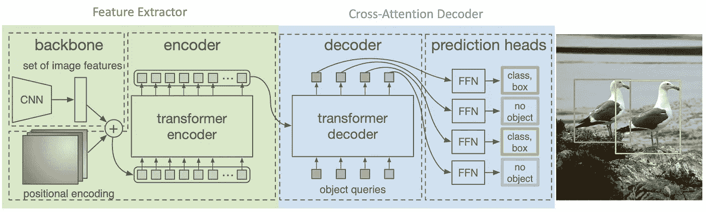**

**DETR 的交叉注意力解码器部分可以看作是一个跨域生成器([来源](https://arxiv.org/abs/2005.12872))**

**这引发了使用交叉注意解码器进行视图转换的想法。输入视图被馈入特征编码器(基于自我关注或基于 CNN)，编码后的特征作为 K 和 v，目标视图格式的查询 Q 可以被学习，只需要被光栅化为模板。Q 的值可以与网络的其余部分一起学习。**

**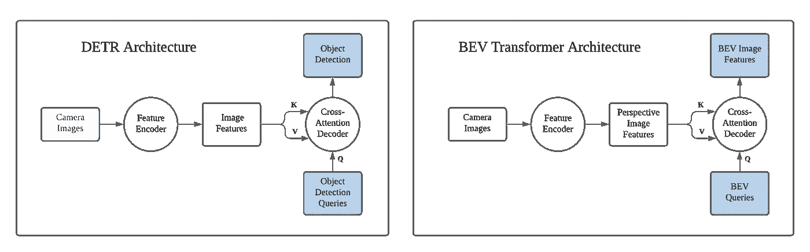**

**DETR 架构可适用于 BEV 转型(图片由作者提供)**

**在接下来的会议中，我们将回顾一些最相关的工作，并且我们还将深入探讨由 [Andrej Karpathy](https://karpathy.ai/) 在[特斯拉 AI 日](https://youtu.be/j0z4FweCy4M?t=2925) (08/20/2021)分享的变压器在特斯拉 FSD 中的使用。**

# ****PYVA (CVPR 2021)****

**PYVA ( [专注地投影您的视图:通过交叉视图变换进行单目道路场景布局估计](https://openaccess.thecvf.com/content/CVPR2021/papers/Yang_Projecting_Your_View_Attentively_Monocular_Road_Scene_Layout_Estimation_via_CVPR_2021_paper.pdf)，CVPR 2021)是第一个明确提到交叉注意力解码器可用于视图变换以将图像特征提升到 BEV 空间的项目。与早期的单目 BEV 感知工作类似，PYVA 对转换后的 BEV 特征执行道路布局和车辆分割。**

**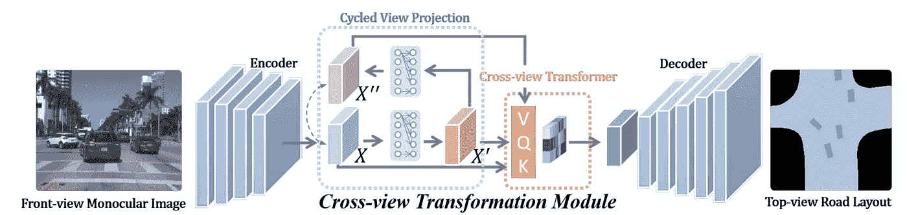**

**PYVA 的架构使用了 MLP 和交叉关注([来源](https://openaccess.thecvf.com/content/CVPR2021/papers/Yang_Projecting_Your_View_Attentively_Monocular_Road_Scene_Layout_Estimation_via_CVPR_2021_paper.pdf))**

**PYVA 首先使用 MLP 将透视空间中的图像特征 X 提升到(所要求的)BEV 空间中的 X’。第二 MLP 将 X’映射回图像空间 X”，并使用 X 和 X”之间的循环一致性损失来确保该映射过程保留尽可能多的相关信息。**

**PYVA 使用的 Transformer 是一个**交叉注意**模块，查询 Q 要映射到 BEV 空间中的 BEV 特征 X’，V 和 K 都是透视空间中的输入 X(如果忽略透视空间中 X 和 X”的区别)。**

**注意，在 BEV 空间中没有对 X '的显式监管，而是由 BEV 空间中的下游任务损失隐式监管。**

**在 PYVA 中，似乎是 MLP 做了视图转换的繁重工作，而交叉注意用于增强 BEV 中被提升的特征。然而，由于对 BEV 空间中生成的查询没有明确的监督，从技术上来说，很难将这两个组件的贡献分开。对此进行消融研究将有助于澄清这一点。**

# **整洁(ICCV 2021)**

**NEAT ( [端到端自动驾驶的神经注意力场](https://arxiv.org/abs/2109.04456)，ICCV 2021)在使用基于 MLP 的迭代注意力将图像特征提升到 BEV 空间之前，使用变压器来增强图像特征空间中的特征。本文的目标是可解释的、高性能的、端到端的自动驾驶，但我们在这里将只关注可解释的中间 BEV 表示的生成。**

**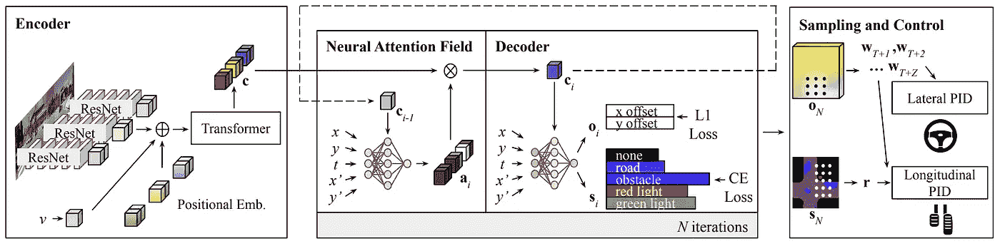**

**整洁的建筑([来源](https://arxiv.org/abs/2109.04456))**

**编码器模块中使用的转换器基于自我关注。作者还承认“变压器可以从我们的编码器中移除，而不会改变输出维度，但我们将它包括在内，因为它根据我们的消融研究提供了改进”。正如我们上面所讨论的，配备自我关注模块的编码器可以被视为一个美化的主干，这不是本研究的重点。**

**最有趣的部分发生在神经注意力场(NEAT)模块。对于给定的输出位置(x，y)，使用 MLP 将输出位置和图像特征作为输入，生成与输入特征图像具有相同空间维度的注意图。注意力图然后用于点积原始图像特征，以生成给定输出位置的目标 BEV 特征**。如果我们遍历所有可能的 BEV 网格位置，那么我们可以将 NEAT 模块的输出平铺到一个 BEV 特征图**。**

**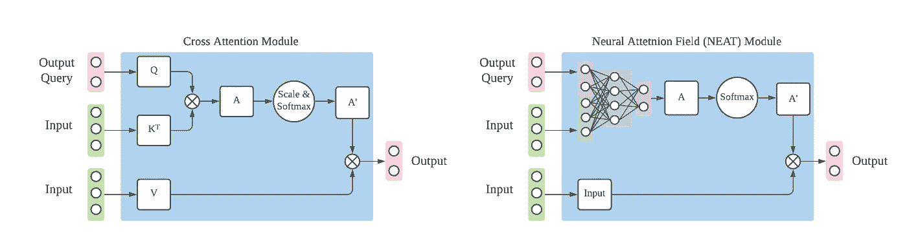**

**交叉注意模块 vs 神经注意场模块(图片由作者提供)**

**这个简洁的模块非常类似于交叉注意机制。主要区别在于 Q 和 K 之间的相似性度量步骤被 MLP 代替。这里我们忽略了其他一些小细节，例如 Softmax 运算，以及值 v 的线性投影。从数学上讲，我们有以下 MLP、交叉注意力和整洁的公式。**

**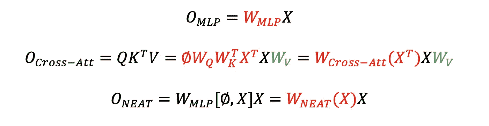**

**MLP、交叉注意力和整洁的区别(改编自[来源](/illustrated-difference-between-mlp-and-transformers-for-tensor-reshaping-52569edaf89))**

**符号约定遵循我之前[关于 MLP 和变形金刚](/illustrated-difference-between-mlp-and-transformers-for-tensor-reshaping-52569edaf89)的区别的博文。简而言之，很明显，NEAT 保持了交叉注意机制的数据依赖性，但它不再具有交叉注意的排列不变性。**

> **为了清楚地与交叉注意机制进行比较，在上面的讨论中省略了一个细节。在 NEAT 的实现中，MLP 的输入不是完全成熟的图像特征 c，而是不具有任何空间范围的全局汇集的 c_i。采用迭代注意。作者认为，把比 c_i 维数高得多的图象特征 c 送入 MLP 要复杂得多。也许 MLP 的一次通过不足以补偿空间内容的损失，因此需要多次通过。本文没有提供这种设计选择的消融研究。**

**解码器部分还使用 MLP 来生成所查询位置(x，y)的期望语义含义。如果我们将净输出平铺到 BEV 特征图中，以特定位置的特征和位置坐标作为输入的 MLP 相当于 BEV 特征图上的 1x1 卷积，其中(x，y)连接到特征图。这个操作和 [CoordConv](https://arxiv.org/abs/1807.03247) (NeurIPS 2018)非常相似。这是利用 BEV 特征图进行下游 BEV 感知任务的相当标准的做法。我们甚至可以超越 1x1 卷积，通过堆叠的 3x3 卷积进一步提高性能，以增加 BEV 空间中的感受域。**

**总之，NEAT 使用交叉注意力的变体(MLP 来代替相似性度量)来将相机图像提升到 BEV 空间。**

# **STSU (ICCV 2021)**

****STSU** ( [车载图像结构化鸟瞰交通场景理解](https://arxiv.org/abs/2110.01997)，ICCV 2021)采用稀疏查询进行目标检测，沿袭了 DETR 的做法。STSU 不仅能检测动态物体，还能检测静态道路布局。这是同一作者的 [BEV 特征拼接](https://arxiv.org/abs/2012.03040)的后续工作，在[我的另一个博客](/monocular-birds-eye-view-semantic-segmentation-for-autonomous-driving-ee2f771afb59)中评论了一篇关于 BEV 语义分割的论文。**

**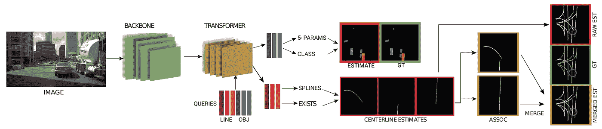**

**STSU 的建筑([来源](https://arxiv.org/abs/2110.01997))**

**STSU 使用两组查询向量，一组用于中心线，一组用于对象。最有趣的是它对结构化道路布局的预测。车道分支包括几个预测头。**

*   **检测头预测由某个查询向量编码的通道是否存在。**
*   **控制头预测 R [贝塞尔曲线](https://en.wikipedia.org/wiki/B%C3%A9zier_curve)控制点的位置。**
*   **关联头预测用于聚类的嵌入向量。**
*   **关联分类器接受 2 个嵌入向量，并判断中心线对是否关联。**

> **贝塞尔曲线非常适合中心线，因为它允许我们用固定数量的 2D 点来建模任意长度的曲线。**
> 
> **在 **LSTR** ( [利用变压器进行端到端车道形状预测](https://arxiv.org/abs/2011.04233)，WACV 2011)中也使用了用于车道预测的变压器，其仍然在图像空间中。结构化的道路布局预测也可以在 [**HDMapNet** (一个在线高清地图构建与评估框架](https://arxiv.org/abs/2107.06307)，CVPR 2021 工作坊)中找到，没有使用变形金刚。**

# **DETR3D (CoRL 2021)**

**DETR3D **、T21([通过 3D 到 2D 查询从多视图图像进行 3D 对象检测](https://arxiv.org/abs/2110.06922)，CoRL 2021)也使用稀疏查询进行对象检测，遵循 DETR 的实践。类似于 STSU，但 DETR3D 侧重于动态对象。查询在 BEV 空间中，并且它们使得 DETR3D 能够直接在 BEV 空间中操纵预测，而不是对图像特征进行密集变换。****

**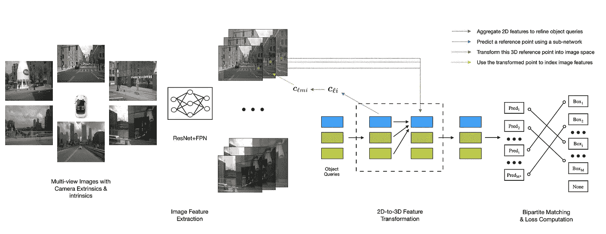**

**DETR3D 的架构([来源](https://arxiv.org/abs/2110.06922))**

**BEV 感知优于 mono3D 的一个优势在于相机重叠区域，在该区域中，物体更有可能被相机视野剪切。Mono3D 方法必须基于来自每个摄像机视点的有限信息来预测每个摄像机中的裁剪对象，并依赖全局 NMS 来抑制冗余框。DETR3D 专门评估了图像边界(约占整个数据集的 9%)处的这种裁剪对象，并发现 DETR3D 比 mono3D 方法有显著的改进。这在特斯拉 AI 日也有报道。**

**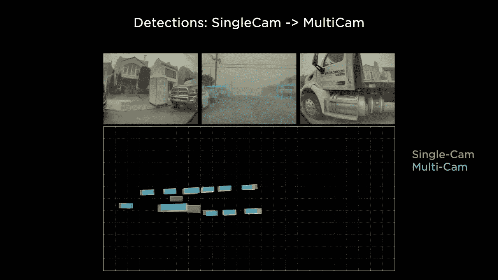**

**多凸轮预测优于单凸轮结果([来源](https://youtu.be/j0z4FweCy4M?t=3677))**

> **DETR3D 使用了几个技巧来提高性能。首先是对象查询的迭代优化。本质上，预测 BEV 中的 bbox 中心被重新投射回具有摄像机变换矩阵(内部和外部)的图像，并且多摄像机图像特征被采样和集成以改进查询。这个过程可以重复多次(本文中为 6 次)以提高性能。**
> 
> **第二个技巧是使用预训练的 mono3D 网络主干来提高性能。对于基于变形金刚的 BEV 感知网络来说，初始化似乎非常重要。**

# ****将图像转换成地图(2021/10，Arxiv)****

**[将图像转换成贴图](https://arxiv.org/abs/2110.00966)注意到，无论图像像素的深度如何，图像(图像列)中的垂直扫描线与穿过 BEV 贴图中摄像机位置的极线之间都存在 1–1 的对应关系。这类似于 [OFT (BMVC 2019)](https://arxiv.org/abs/1811.08188) 和 [PyrOccNet (CVPR 2020)](https://arxiv.org/abs/2003.13402) 的想法，沿着投射回 3D 空间的光线在像素位置涂抹特征。**

**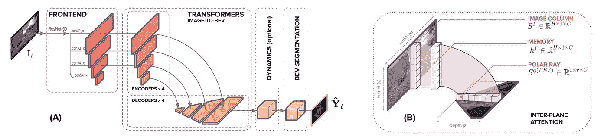**

**在列方向使用轴向交叉注意力转换器和在行方向使用卷积大大节省了计算。**

# **特斯拉的方法**

**在 2021 年的特斯拉 AI 日，特斯拉揭示了为特斯拉 FSD 提供动力的神经网络的许多复杂的内部工作原理。最有趣的构建模块之一是一个被称为“图像到 BEV 转换+多相机融合”的模块。这个模块的中心是一个转换器模块，或者更具体地说，是一个**交叉关注**模块。**

**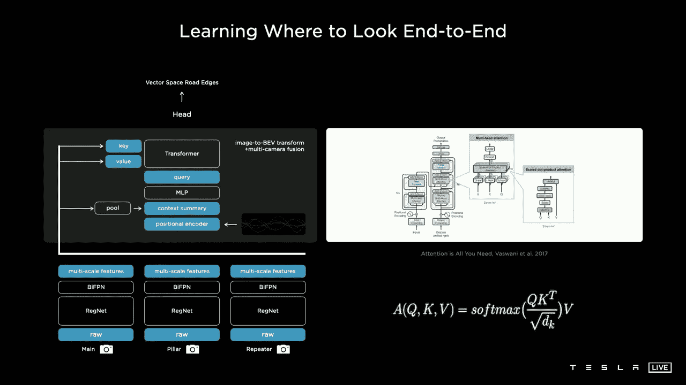**

**特斯拉的 FSD 架构([来源](https://youtu.be/j0z4FweCy4M?t=3677))**

> **你初始化一个你想要的输出空间大小的栅格，你用输出空间中的正弦和余弦的位置编码来平铺它，然后这些用 MLP 编码成一组**查询**向量，然后所有的图像和它们的特征也发出它们自己的**键**和**值**，然后查询键和值馈入多头自我注意(作者注:这实际上是交叉注意)。**
> 
> **— Andrej Karpathy，2021 年特斯拉人工智能日，[来源](https://youtu.be/j0z4FweCy4M?t=3677)**

**虽然 Andrej 提到他们使用了多头自我注意，但他描述的显然是一种**交叉注意**机制，他幻灯片中右边的图表也指向了最初变形金刚论文中的交叉注意块。**

**这个视图转换中最有趣的部分是 BEV 空间中的查询。它由 BEV 空间中的栅格生成(空白、预分配的模板，如在 DETR)，并与位置编码(PE)连接。还有一个**上下文概要**，使用位置编码平铺显示。该图没有显示如何生成上下文摘要并与位置编码一起使用的细节，但我认为有一个全局池，它折叠透视空间中的所有空间信息，以及一个平铺操作，它将这个 1x1 张量平铺在预定义的 BEV 网格上。**

**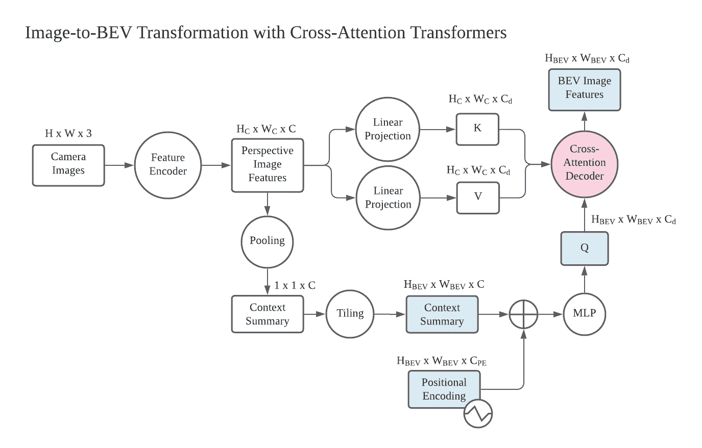**

**使用交叉注意力转换器的图像到 BEV 转换的构建块和张量形状(图片由作者提供)**

**在上图中，我根据我的理解，列出了视图转换模块中更详细的块(圆圈)和相应的张量及其形状(正方形)。BEV 空间中的张量颜色编码为蓝色，核心交叉注意模块颜色编码为红色。希望这能帮助学术界感兴趣的读者在这个方向上更深入地挖掘。**

## **关于变形金刚 vs MLP 的最后一句话**

** [## 说明了张量整形的 MLP 和变压器之间的差异

### 深入探究数学细节，并附有插图。

towardsdatascience.com](/illustrated-difference-between-mlp-and-transformers-for-tensor-reshaping-52569edaf89) 

> (将图像提升到 BEV 空间)是数据相关的，很难对此组件进行固定的转换，因此为了解决这个问题，我们使用转换器来表示这个空间。—安德烈·卡帕西，2021 年特斯拉人工智能日

Andrej 还提到视图转换问题依赖于数据，他们选择了转换器。关于交叉注意在张量整形中的详细用法及其与 MLP 的区别，在[我之前的](/illustrated-difference-between-mlp-and-transformers-for-tensor-reshaping-52569edaf89)博客中有详细介绍，有一些数学细节和具体图解。它还强调了为什么变压器的张量整形是数据依赖的，而 MLP 不是。

# 外卖食品

*   变形金刚在学术界和工业界越来越受欢迎，用于视图转换。
*   正如在[我之前的博客](/illustrated-difference-between-mlp-and-transformers-for-tensor-reshaping-52569edaf89)中所讨论的，尽管《变形金刚》的数据依赖性使其更具表现力，但这也使其难以训练，MLP 的盈亏平衡点可能需要大量的数据、GPU 和工程努力。
*   在大规模生产的自动驾驶汽车中，在资源有限的嵌入式系统中部署变压器也可能是一个重大挑战。特别是，当前的神经网络加速器或 GPU 针对卷积神经网络(例如，3x3 卷积)进行了高度优化。

# 承认

我和[一谷](https://www.zhihu.com/people/gu-yi-62-83)进行了几轮讨论，他目前正在澳门大学做博士研究。我们的讨论促使我重新审视单眼 BEV 感知领域的最新趋势。

# 参考

*   [**整洁**:端到端自动驾驶的神经注意场](https://arxiv.org/abs/2109.04456)，ICCV 2021
*   [**PYVA** :用心投射你的视角:通过交叉视角变换的单目道路场景布局估计](https://openaccess.thecvf.com/content/CVPR2021/papers/Yang_Projecting_Your_View_Attentively_Monocular_Road_Scene_Layout_Estimation_via_CVPR_2021_paper.pdf)，CVPR 2021
*   特斯拉人工智能日于 2021 年 8 月 20 日在 Youtube 上直播

*   [**CaDDN** :用于单目 3D 物体检测的分类深度分布网络](https://arxiv.org/abs/2103.01100)，CVPR 2021 口述
*   [**:从周围单目摄像机鸟瞰未来实例预测**](https://arxiv.org/abs/2104.10490)**，ICCV 2021**
*   **[**BEV-Seg** :利用几何和语义点云进行鸟瞰语义分割](https://arxiv.org/abs/2006.11436)，CVPR 2020 研讨会**
*   **[**高清地图网**:在线高清地图构建与评估框架](https://arxiv.org/abs/2107.06307)，CVPR 2021 研讨会**
*   **[**DETR** :用变形金刚进行端到端的物体检测](https://arxiv.org/abs/2005.12872)，ECCV 2020**
*   **[注意力是你所需要的全部](https://arxiv.org/abs/1706.03762)，NeurIPS 2017**
*   **[联合学习对齐和翻译的神经机器翻译](https://arxiv.org/abs/1409.0473)，ICLR 2015**
*   **[**ViT** :一张图像抵得上 16x16 字:大规模图像识别的变形金刚](https://arxiv.org/abs/2010.11929)，ICLR 2021**
*   **[**Swin 变换器**:使用移位窗口的分级视觉变换器](arxiv.org/abs/2103.14030)，Arxiv 2021/03**
*   **[**CoordConv:** 卷积神经网络的一个耐人寻味的失败和 CoordConv 解决方案](https://arxiv.org/abs/1807.03247)，NeurIPS 2018**
*   **[**STSU** :车载图像结构化鸟瞰交通场景理解](https://arxiv.org/abs/2110.01997)，ICCV 2021**
*   **[**DETR3D** :通过 3D 到 2D 查询从多视图图像中检测 3D 对象](https://arxiv.org/abs/2110.06922)，CoRL 2021**
*   **[**将图像翻译成地图**](https://arxiv.org/abs/2110.00966) ，Arxiv 2021/10****