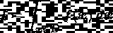
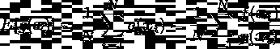
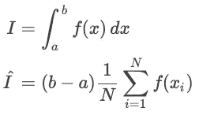
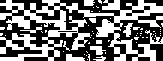
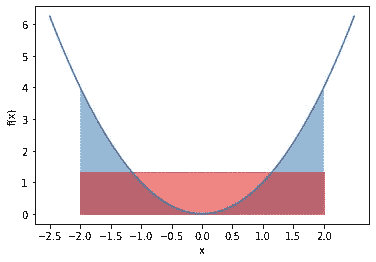
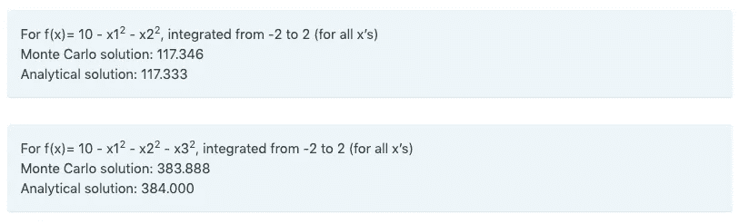
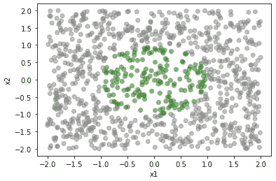
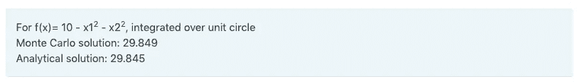
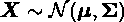
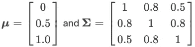

# Python 中一元和多元函数的蒙特卡罗积分

> 原文：<https://towardsdatascience.com/monte-carlo-integration-in-python-over-univariate-and-multivariate-functions-12615dd252fa?source=collection_archive---------9----------------------->

## [实践教程](https://towardsdatascience.com/tagged/hands-on-tutorials)

## 如何用蒙特卡罗方法近似积分复变函数


由[杰斯温·托马斯](https://unsplash.com/@jeswinthomas?utm_source=medium&utm_medium=referral)在 [Unsplash](https://unsplash.com?utm_source=medium&utm_medium=referral) 上拍摄的照片

蒙特卡罗积分是一种基本的蒙特卡罗方法，用于数值估计函数 *f(x)* 的积分。我们将在这里讨论这个理论以及 Python 中的例子。

# 理论

假设我们要求解域 *D* 上 *f(x)* 的积分。



在单变量函数(即具有一个变量)的情况下，域只是一维的，积分是从 *a* 到 *b* 。

我们可以重新排列一些项，将上面的等式表示为:


换句话说，积分等价于求 *g(x)* 的期望值，这里我们已经定义了 *g(x)=f(x)/p(x)* 在一个定义域上。我们可以通过从域中采样*x*N 次来近似这一点，这意味着，



如果我们从均匀分布中取样，假设函数是一元的，这意味着抽取任何给定的 *x* 的概率就是 *p(x)=1/(b-a)* 。如果我们将其代入上述近似表达式，我们会看到，



这实际上是在区间 *a* 到 *b* 上计算 *f(x)* 的平均值，并乘以区间的长度。换句话说，我们正在寻找一个矩形的面积，宽度=区间宽度，高度=预期值 *f(x)* 。

这也适用于任何尺寸。在一元函数的情况下，定义域只是一条线(即 *b-a* )。对于二元函数，定义域就是面积。一般来说，



这意味着我们可以通过将区域体积乘以区域上函数的期望值来近似积分。

# 示例|单变量

例如，在 Python 中，我们可以执行以下操作来近似从-2 到 2 的 *f(x)=x* 的积分。

我们得到以下结果，


其中蒙特卡罗近似非常接近解析解。从视觉上看， *f(x)=x* 从-2 到 2 的积分如下图蓝色所示。近似值是用红色突出显示的矩形。



用红色显示 f(x)的近似值。作者图片

# 示例|多元

我们也可以对多元函数进行积分。程序和以前一样。然而，我们现在需要在一个更高维的域上采样，而不是在一条线上采样(从 *a* 到 *b* )。为简单起见，我们将说明一个多元函数在一个域上的积分，对于每个变量有相同的 *a* 和 *b* 。这意味着在具有两个变量(x1 和 x2)的函数中，定义域是正方形的；对于三个变量的函数，立方体形状。

结果呢



# 示例|其他域上的多元积分

在其上执行积分的域可能更复杂，并且难以从中采样和计算其体积。例如，我们可以在圆形区域而不是方形区域上对二元函数进行积分。尽管如此，想法是相同的——对于均匀采样，我们希望在整个区域内进行采样，并通过区域体积和区域内函数期望值的乘积来近似积分。

让我们使用相同的二元函数 *f(x)=10-x1 -x2* 并在单位圆上积分。精确地在单位圆上均匀采样比只在正方形区域(覆盖单位圆)上采样更难。由此，我们可以 1)将域的面积计算为采样正方形的面积与域内采样点的比例的乘积，2)将期望值计算为域内采样点的平均值 *f(x)* 。下面是采样的可视化(单位圆内的采样点以绿色显示)，



采样时单位圆内的数据点以绿色显示(区域)。作者图片

在 Python 中，这看起来像，

结果是，



作为最后一个例子，我们也可以对多元概率分布进行积分。让我们在单位圆上积分下面的多元正态分布，



在哪里



我们用 Python 定义这些，并执行蒙特卡罗积分，

作为确认，我们使用能够在椭球(包括圆)上积分多元正态分布的`pmvnEll`函数。

```
library(shotGroups)
pmvnEll(r=1, sigma=rbind(c(1,0.8,0.5), c(0.8,1,0.8), c(0.5,0.8,1)),
        mu=c(0,0.5,1), e=diag(3), x0=c(0,0,0))
```

由于结果彼此非常匹配，


# 附加注释

显然，提供的例子很简单，有些例子有针对特定情况的分析解决方案和/或 Python/R 包。但是它们有助于理解蒙特卡罗积分背后的机制。显然，所描述的蒙特卡罗方法很容易推广到没有封闭形式解的更复杂的函数。此外，还有许多更优化的抽样方法(如分层抽样、重要性抽样等)，如果有兴趣，我们鼓励读者深入阅读这些主题。

# 额外资源

https://www . scratchpapixel . com/lessons/mathematics-physics-for-computer-graphics/Monte-Carlo-methods-in-practice/Monte-Carlo-integration

[https://towards data science . com/Monte-Carlo-integration-in-python-a71a 209d 277 e](/monte-carlo-integration-in-python-a71a209d277e)

*原载于 2021 年 1 月 13 日*[*https://boyangzhao . github . io*](https://boyangzhao.github.io/posts/monte-carlo-integration)*。*