# 蒙特卡洛马尔可夫链(MCMC)，解释说

> 原文：<https://towardsdatascience.com/monte-carlo-markov-chain-mcmc-explained-94e3a6c8de11?source=collection_archive---------0----------------------->

## 理解使用随机性估计复杂实体背后的魔力


来源:图片由来自 [Pixabay](https://pixabay.com/?utm_source=link-attribution&utm_medium=referral&utm_campaign=image&utm_content=1655118) 的[埃里克·斯坦](https://pixabay.com/users/erik_stein-2524241/?utm_source=link-attribution&utm_medium=referral&utm_campaign=image&utm_content=1655118)拍摄

MCMC 是贝叶斯统计中最重要和最流行的概念之一，尤其是在进行推理时。

从更大的角度来看，有时在高维空间中估计推理在计算上可能变得不可行，在这种情况下，我们求助于对其进行近似——或者通过使用 ***采样方法*** (其中之一是 **MCMC** )或者用 ***参数化分布*** ( **变分推理**)对其进行近似。

在本帖中，我们将通过举例来剖析和理解 MCMC 的组件来讨论它。在这篇文章的后面，我们将会看到一个融合了这个概念的算法， **Metropolis-Hasting 算法。**

事不宜迟，让我们开始吧！

> 注:标有“附加内容”的小节可以跳过，不会影响对概念的总体理解。

**采样**

*抽样是一种通过将人口的一个子集纳入研究来近似估计整个人口的某些特征的方法。*

采样有各种各样的用例—

*   它可以用来近似一个棘手的总和或积分。
*   它可以用于在估计易处理但昂贵的和或积分时提供显著的加速。
*   在某些情况下，如密度估计，它可以简单地用于近似概率分布，然后估算缺失数据。

少数抽样技术— **祖先抽样、逆变换抽样、拒绝抽样、重要性抽样、蒙特卡罗抽样、MCMC 抽样。**

在这篇文章中，我们只关注 MCMC 方法，其他方法将在另一篇文章中讨论。

## 介绍

MCMC 方法是使用马尔可夫链来执行蒙特卡罗估计的一系列算法。

这个名字给了我们一个提示，那就是它由两部分组成——
*蒙特卡洛*和*马尔可夫链。让我们分别地和以它们的组合形式来理解它们。*

# 蒙特卡罗抽样

**(直觉上)**

蒙特卡洛法得名于摩纳哥的蒙特卡洛赌场。

这是一种从概率分布中取样并使用这些样本来逼近所需数量的技术。换句话说，它使用随机性来估计某个确定性的感兴趣的量。

> 示例:如果要求我们计算下图中给定曲线的曲线下面积，可能需要对复杂的解析公式进行积分。
> 然而，使用蒙特卡罗方法，我们将在矩形中随机生成红点
> (点越多越准确)，并计算落在曲线下的点与落在整个矩形中的点的比率——该比率将为我们提供面积，给定矩形的面积。

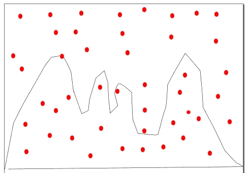

(图片由作者提供)-蒙特卡洛法估算曲线下的面积

基本上，如果计算某个量具有复杂的分析结构，我们可以简单地执行模拟来生成大量样本，并使用它们来近似该量。这些工作假设渐近地遵循中心极限定理。

它在风险分析、可靠性分析等方面有许多其他用例。

**(数学上)**

假设我们有期望值要估计，这可能是一个非常复杂的积分，甚至难以估计——使用蒙特卡罗方法，我们通过对样本求平均值来近似这些量。

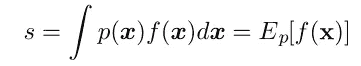

要计算的原始期望值

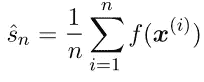

通过刺激 f(x)的大样本产生的近似期望

计算大量样本的平均值可以减少标准误差，并为我们提供一个相当准确的近似值。

***这种方法有一个局限性，因为它假设很容易从一个概率分布中抽样，然而这样做并不总是可能的。有时，我们甚至不能从分布中取样。在这种情况下，我们利用马尔可夫链从一个棘手的概率分布中有效地进行采样。”***

# 马尔可夫链

在进入 ***马氏链*** 之前，让我们先看一下定义它的有用性质——

**马尔可夫性质:**

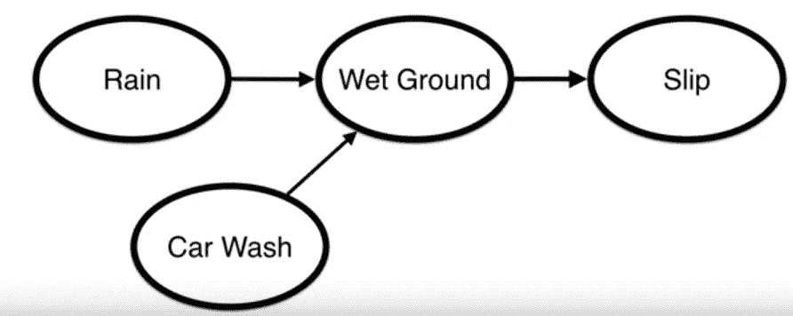

椭圆形中的实体是状态

从上面的图像中，考虑一个由 4 个状态组成的系统—

*下雨*或*洗车*导致*地面潮湿*接着*【地面潮湿】*导致*【打滑】。*

马尔可夫性质只是做了一个假设——***从一个状态跳到下一个状态的概率只取决于当前状态而不取决于导致这个当前状态的先前状态的序列。***

> 如果我们要计算某人滑倒的概率，知道地面是否潮湿就提供了足够的证据来估计它。我们不需要知道导致它的状态(“下雨”或“洗车”)。

***数学上来说:***

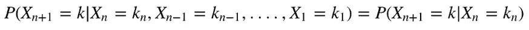

截断分布的马尔可夫性质

从数学方程中可以明显看出，马尔可夫性质假设可能会节省我们大量的计算。

事后看来，如果一个过程展现出 ***马尔可夫性质*** ，那么它就被称为
***马尔可夫链。***

现在我们已经看到了马尔可夫链，让我们来讨论使它如此令人满意的性质— **平稳分布。**

## **平稳分布:**

假设，我们有一个很少状态的过程，并且我们有一个固定的状态间转移概率 **(Q)** 。
我们从时间步 **i** 的所有状态上的一些随机概率分布( **Sᵢ** )
开始，为了估计下一个时间步 **i+1** 的所有状态上的概率分布，我们将其乘以转移概率 **Q** 。

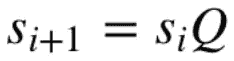

如果我们继续这样做，过一会儿 **S** 在与矩阵 Q 相乘时停止变化，这就是我们说它已经达到了 ***平稳分布。***

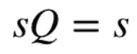

已达到稳定分布

让我们看一个例子——

在这个例子中，我们有 3 个州(X₁、X₂、X₃)

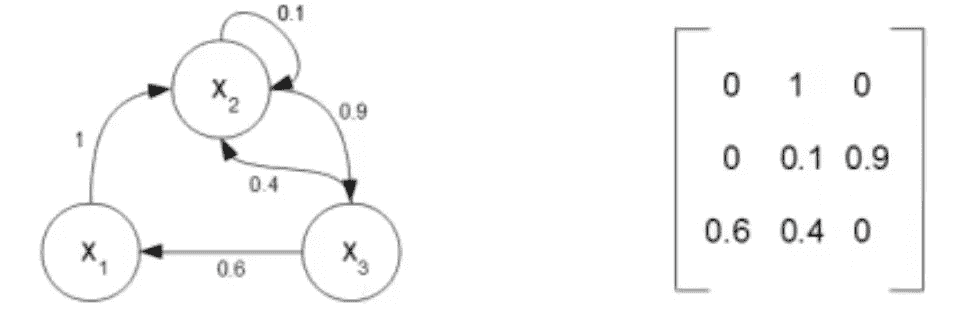

状态之间的转移概率( **T**

如果我们处于状态 **S₂** ，留在 **S₂** 的概率是 0.1，
转换到状态 **S₁** 的概率是 0，转换到状态 **S₃** 的概率是 0.9(从矩阵的第二行可以明显看出)。

让我们从向量 **Sᵢ** 的某个随机值开始(向量显示在任何特定时间步处于每个状态的概率)，我们可以看到向量如何总计为 1。

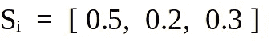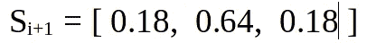

应用**后 Sᵢ₊₁** = **Sᵢ*Q**

如果我们继续按时间步长移动，最终我们会到达静止状态，

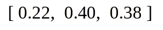

稳定分布

现在最需要知道的是，这个平稳分布不依赖于初始状态，你可以尝试不同的初始状态 **Sᵢ** 。

```
import numpy as npQ = np.matrix([[0,1,0],[0,0.1,0.9],[0.6,0.4,0]])
S_initial = np.matrix([[0.3, 0.4 , 0.3]])
epsilon = 1while epsilon > 10e-8:
    S_next = np.dot(S_initial, Q)
    epsilon = np.sqrt(np.sum(np.square(S_next - S_initial)))
    S_initial = S_nextprint(S_initial)
```

平稳分布表示在任何给定时间处于任何状态的概率。

直观地说**马尔可夫链可以被认为是在链上行走，给定特定步骤的状态，我们可以通过查看下一步的“状态概率分布”来决定下一个状态。**

好了，现在我们已经看到了马氏链和蒙特卡洛，让我们把我们的重点放在这些美丽的组合形式，即 mcmc。

**临时演员—**

任何好奇并想了解**为什么马尔可夫链收敛于平稳分布的人**都可以参考下图——

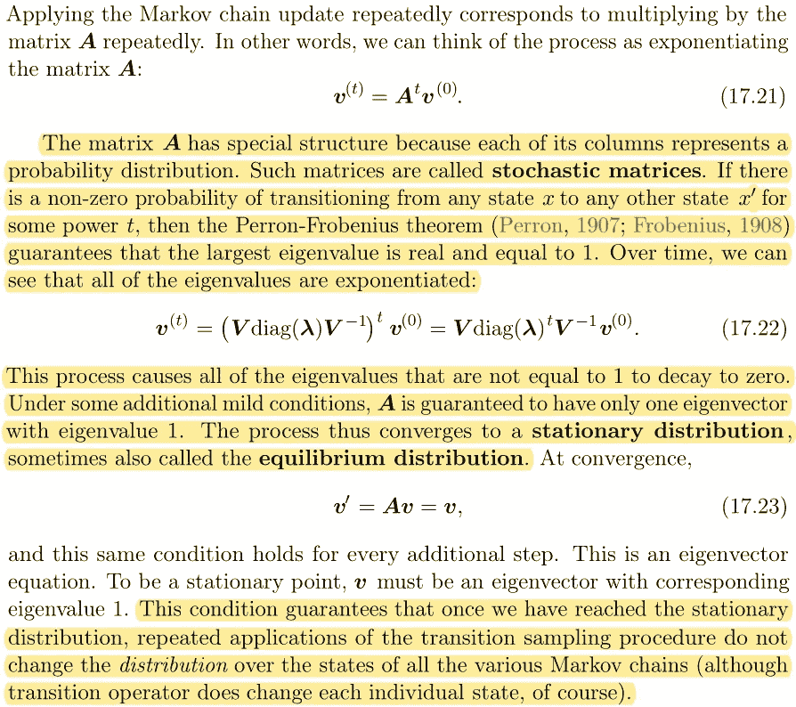

来源:@book{Goodfellow-et-al-2016，title={Deep Learning}，作者= { Ian good fellow and yo shua beng io and AaronCourville }，出版商={MIT Press}，注= { \ URL { http://www . Deep Learning book . org } }，年份={2016}}

# 马尔可夫链蒙特卡罗(MCMC)

***MCMC 可以用来从任何概率分布中抽样。大多数情况下，我们用它来从难以处理的后验分布中进行抽样，以达到推断的目的。***

使用 Bayes 估计后验概率有时会很困难，在大多数情况下，我们可以找到**可能性** x **先验**的函数形式。然而，计算边缘化概率 P(B)在计算上可能是昂贵的，尤其是当它是连续分布时。

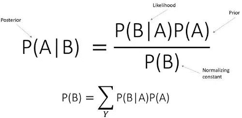

(图片由作者提供)具有离散边际概率的贝叶斯定理

这里的技巧是完全避免计算归一化常数。

**该算法的总体思路是从一些随机概率分布开始，逐渐向期望的概率分布移动。**

听起来很简单，但是我们怎么做呢？

> 启动一个状态随机概率分布的马尔可夫链，在链中逐渐向稳定分布收敛，应用一些条件(**详细资产负债表**)确保该稳定分布类似于期望的概率分布。

因此，在达到平稳分布时，我们已经逼近后验概率分布。

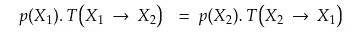

详细的资产负债表状况

概率 p(A)表示在 A 的概率，概率 T(A -> B)表示从 A 移动到 B 的概率。

概率 p(B)代表在 B 的概率，概率 T(B -> A)代表从 B 移动到 A 的概率。

每条边代表从 A 到 B 或者 B 到 A 的概率流
如果条件满足，那么它保证稳态近似代表后验分布。

尽管 MCMC 本身很复杂，但它们提供了很大的灵活性。它为我们提供了高效的高维采样。它可以用来解决大状态空间的问题。

**限制** — MCMC 在逼近多模态概率分布时表现不佳。

## 临时演员—

[**在这种情况下，边际概率 P(B)是一个称为归一化常数的常数，它对分子**](https://stats.stackexchange.com/questions/481390/why-is-the-normalisation-constant-in-bayesian-not-a-marginal-distribution) **的所有可能值求和。**

存在用于训练或评估具有难以处理的归一化常数(也称为配分函数)的模型的技术。他们很少在算法中使用 MCMC 进行采样。

例如— **对比散度(CD)** 对于训练像*受限玻尔兹曼机*这样的非结构化图形模型很有用。

# Metropolis —加速算法

假设我们从分布 p(x) = f(x) / Z 中采样，其中 Z 是难以处理的归一化常数。

我们的目标是以这样一种方式从 p(x)中抽样，即只利用分子而避免估计分母。

**(求婚概率)**

我们先来看一下**提议概率(g)** 。
给定一个样本，它建议我们用马尔可夫链中的下一个潜在样本。
(如何决定是接受还是拒绝潜在样本，我们将在下一节中看到)。

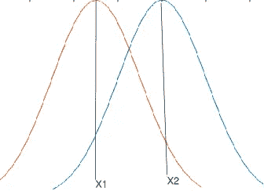

(图片由作者拍摄)—提案分发

假设 **g(X₂ | X₁) =正态(x₁σ)**
***(****它可能是任何分布，为简单起见我们选择了正态分布* ***)***

保持 X₁均值，我们做一个正态分布。然后我们从这个分布中抽取 X₂
作为样本。

我们重复同样的步骤对 X₃进行采样，保持 X₂为平均值。

**(主算法)**

让我们从详细的资产负债表条件开始这个算法。


详细的资产负债表

从 X₁过渡到 X₂的可能性可以被视为一个两步走的过程，考虑到我们在 X₁州—

第一步是用一些
***的提议概率* g** 做出 X₂的提议(上一节讨论过)。

第二步是接受新状态 X₂用某种
***接受概率***

***将转移概率代入方程…***

***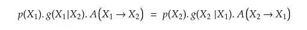***

***用 f(x)/Z 代替 p(x)，两边的 Z 被抵消，我们得到…***

***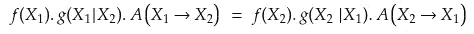***

***重新构建等式会导致***

***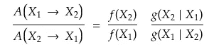***

***替代速记符号***

***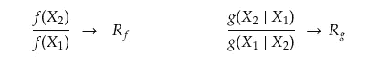******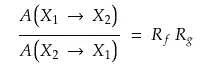***

***最后，我们得到**接受概率 A*****

***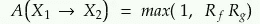***

***接受概率***

***总结一下—***

*   ***我们从一个随机状态开始。***
*   ***基于提议概率(g ),我们随机选择一个新的状态。***
*   ***计算提议的新状态的接受概率(A)。***
*   ***掷硬币，正面着地的概率等于接受概率，如果硬币正面着地，接受样品，否则拒绝。***
*   ***重复这个过程一段时间。***

***我们保持长时间的采样，并丢弃最初的几个样本，因为链还没有达到其静止状态(这个时期被称为
**预烧期**)。***

***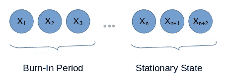***

***(图片由作者拍摄)***

*****限制:*****

*   ***在近似多模态分布时，由于链被卡住，得到有偏差的样本，因此对所需量的估计不太准确。***
*   ***当样本空间是高维时，Metropolis-Hasting 变得非常慢。(另一个惊人的 MCMC 方法**哈密顿蒙特卡罗**克服了这些缺点，将在另一篇文章中讨论)。***

*****结论**:***

***对 MCMC 方法的讨论到此结束。更多关于类似讨论的帖子将被关注。***

***这绝不是一个容易理解的概念，因为它是概念的融合，而这些概念隐藏在数学背后。***

***如果你一路走来，那么恭喜你！！万事如意！！***

# ***参考:***

1.  ***[深度学习作者伊恩·古德菲勒、约舒阿·本吉奥和亚伦·库尔维尔。](https://www.amazon.in/Deep-Learning-Ian-Goodfellow/dp/0262035618)***
2.  ***[ritvikmath 创作的《大都会-加速》](https://www.youtube.com/watch?v=yCv2N7wGDCw&t=185s)***