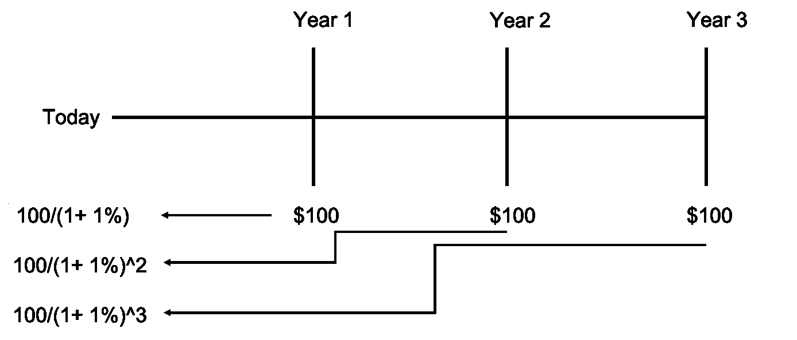
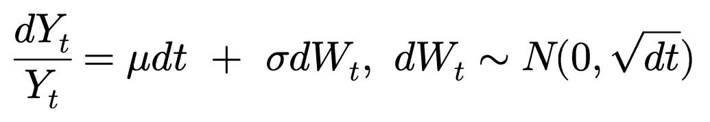
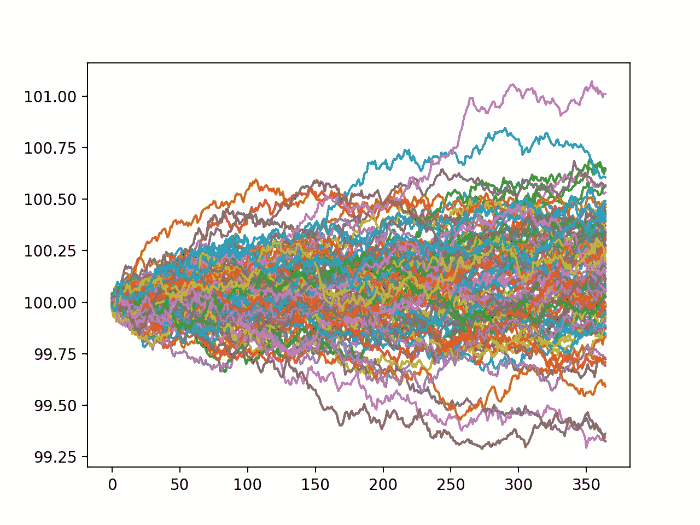
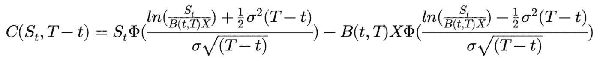

# Python 中的蒙特卡罗定价

> 原文：<https://towardsdatascience.com/monte-carlo-pricing-in-python-eafc29e3b6c9?source=collection_archive---------5----------------------->

## 证券定价概念与代码指南


来自[派克斯](https://www.pexels.com/photo/wood-city-vacation-water-3836520/?utm_content=attributionCopyText&utm_medium=referral&utm_source=pexels)的[卡斯特利什](https://www.pexels.com/@castorlystock?utm_content=attributionCopyText&utm_medium=referral&utm_source=pexels)摄影

# 介绍

本科量化金融课程的大部分时间花在不同证券的定价上。最初，重点在于货币的时间价值，以及年金和永久年金的分析。之后，重点转移到学习、分析和定价股票衍生品，包括远期、期货、期权和互换。一旦为衍生品定价奠定了基础，剩下的课程就是研究并成为市场部门或证券类型的专家。在这篇文章中，我的目标是分解决定市场上所有这些证券的公平价格的潜在主题。事不宜迟，让我们开始吧…

# 金钱的时间价值

随着时间的推移，金钱的价值会有所不同。那具体是什么意思？如果有人让你选择今天收到 100 美元，或者一年后收到 100 美元，你会选择哪一个？自然，大多数人更希望尽快(今天)收到 100 美元。直观上，这可以解释为理解货币的时间价值。随着现金流在未来越来越远，它的价值就越低。同样的概念可以延伸到比较不同时间点的现金流值。凭直觉，我们更愿意从今天起一年后收到 100 美元，而不是两年后。从数学上来说，货币价值暂时差异的罪魁祸首是无风险利率。越早收到钱，就能越早获得利息。这就是在不同时间比较不同金额的方法——即找到现金流的*现值*,然后进行比较。考虑以下互斥的选择:

假设年无风险利率为 1%。

**选项 A:**

*   今天收到 100 美元

**选项 B:**

*   一年后收到 102 美元

你应该选择哪个？

为了确定收到哪一个现金流，我们可以以无风险利率贴现 102 美元，以找到 102 美元在今天的*中的价值*。

**今天收到 100 美元的现值**

*   100/(1.01)⁰ = $100

**从今天起一年后收到 102 美元的现值**

*   102/(1.01)¹ = $101

以今天的美元计算，**选择 A** 值**100 美元**而**选择 B** 值**101 美元**。由于**选项 B** 具有更高的现值，这意味着**选项 B** 今天比**选项 A** 更值钱。这似乎是一个简单的概念，但特别是在评估更复杂的证券时，记住这种时间价值差异变得至关重要。

# 证券定价

一般来说，任何证券的市场价格应该代表该证券产生的所有未来现金流的现值。考虑以下投资工具:

**安全 A**

*   在第 1 年末支付 100 美元
*   在第二年末支付 100 美元
*   在第 3 年末支付 100 美元

你愿意为安全支付多少钱？好了，现在我们知道钱在不同的时间点有不同的价值，我们可以用一个合适的无风险利率来贴现每个现金流在当前时间点的价值，以确定证券的价格。假设年无风险收益率为 1%，我们可以将每笔付款贴现到现在。



**以今天的美元计算的第一年付款**

*   100/(1.01) = 99.01

**以今天的美元计算的第二年付款**

*   100/(1.01)² = 98.03

**以今天的美元计算的第三年付款**

*   100/(1.01)³ = 97.06

**未来现金流量的现值之和**

*   97.06 美元+98.03 美元+99.01 美元=**294.10 美元**

所以今天**证券 A** 的合适值是 **$294.10** 。我们可以推广这一概念，找到任何证券的公允价值，不管它们的回报结构有多独特或奇特。在本文的后面，我们将分析具有独特收益结构的衍生品。然而，使用这种未来现金流现值的概念，我们可以找到今天所述证券的适当价格(更具体地说，今天未来现金流的*预期*现值)。为了做到这一点，我们需要一种方法来模拟基础资产的随机运动。

# 几何布朗运动

在我们能够对其价值取决于基础权益的衍生证券的价格建模之前，我们需要对基础权益建模。几何布朗运动是一种随机过程，可用于生成标的股票可能遵循的样本路径。换句话说，我们可以用几何布朗运动来模拟股票价格。



几何布朗运动

*   **Yt** —时间 *t* 的股价
*   **dYt** —股票价格随时间的变化 *t*
*   **μ** —漂移项
*   **σ** —波动项
*   **dt** —随时间变化
*   **小波变换** —布朗运动

几何布朗运动似乎有许多组成部分，但本质上有三个组成部分:回报(dYt/Yt)、预期回报(μdt)和对回报的冲击(σdWt)。我们可以使用下面的代码非常容易地在 Python 中模拟几何布朗运动。

当使用几何布朗运动对股票建模时，我们只需要提供几个参数:股票在时间段 T 的**初始股价**、**漂移**(预期收益)、股票在时间段 T 的**波动率**、时间步长 **dt** 的长度以及我们产生到 **T** 的总时间。在上面的代码中，我们使用了以下参数集…

*   **初始价格** — 100
*   **漂移** — 8%(预期收益)
*   **波动率** — 10%(预期震荡回归)
*   **时间步长(dt)** — 1/365(每日)
*   **总时间(T)** — 1(一年)

如果使用几何布朗运动来生成真实股票的样本路径，有几种方法可以找到漂移和波动。一般来说，我使用我正在生成的时间段的平均历史回报，波动率我使用隐含波动率(参见什么是隐含波动率？)为一个 at 货币期权。运行上面的代码后，我们最终生成了 100 个样本路径，可以使用 matplotlib 绘制这些路径。



几何布朗运动生成的样本路径

既然我们有了生成标的资产样本路径的方法，我们就可以讨论衍生品定价了。

# 布莱克-斯科尔斯定价法

臭名昭著的 Black-Scholes 模型被用来为欧式期权定价。然而，定价的总体主题仍然是一样的。Black-Scholes 提出这种定价模型的方式遵循风险中性预期。实质上，他们找到了决定当前公允价值的期权的风险中性期望值(参见[推导布莱克-斯科尔斯模型](https://medium.com/swlh/deriving-the-black-scholes-model-5e518c65d0bc))。这与我们在上述证券定价部分中对**证券 A** 的定价没有什么不同。这种模型有一些缺点，表现为对市场环境做出了强有力的假设…

*   没有交易成本
*   连续交易
*   对数正态分布股票收益

在实践中，当交易成本存在时，这些假设立即被违反，交易只能离散地进行，并且股票回报根据经验显示它们不是对数正态分布的。我的研究重点是通过数学修改将布莱克-斯科尔斯方程中的交易成本和离散交易等一般市场条件考虑在内(如果感兴趣，请参见[一般市场条件下的期权定价和复制](https://romanmichaelpaolucci.medium.com/option-pricing-and-replication-under-generic-market-conditions-b66d0da01b07))。然而，布莱克-斯科尔斯价格提供了一个基线，我们可以对照蒙特卡洛价格进行检查。布莱克-斯科尔斯方程如下…



*   **St**—t 时刻的股价
*   **X** —期权的执行价格
*   **σ** —波动项
*   **φ**—累积正态分布函数
*   **B(t，T)** —连续贴现因子
*   **T** —到期时间
*   **t** —当前时间点

如果上面的等式不是很清楚，不要担心 Python 中的实现更容易理解(如果你希望看到更多没有完整推导的数学解释，请参见[风险中性投资组合管理](https://medium.com/swlh/risk-neutral-portfolio-management-e448ed2aa103))。

```
12.368267463784072 # Price of the European call option by BS Model
```

# 蒙特卡洛定价

我们现在有了开始蒙特卡洛定价所需的一切。回想一下今天证券的价值应该如何代表该证券产生的所有未来现金流。在金融衍生品的例子中，我们不知道它们现金流的未来价值。然而，我们知道可能的结果。知道了可能的结果，我们就可以找到所有未来现金流的*预期现值*。请允许我用一个例子来详细说明…

在欧式看涨期权的情况下，它要么在货币内(行使)到期，要么在货币外(什么也不做)到期。让我们用 Python 建立一个这个收益结构的模型。

现在，我们可以在代码中使用这个收益模型来生成潜在的股票路径，以找到每个样本路径末端的期权价值。然后我们就可以把价值折现到现在(记住钱的时间价值！)，并对所有值进行平均，以找到期权产生的未来现金流的预期现值。

```
16.31698913180365 # Monte Carlo Price of the European Call Option
```

考虑到我们生成的路径(和任意参数集)的样本大小，我们非常接近 Black-Scholes 价格！值得注意的是，这两种价格都不正确，它们只是告诉我们不同的东西。理解每个价格的是如何产生的将有助于解释。

同样的过程也可以用来给任何收益不确定的证券定价。让我们来看一个更奇特的选择…

**向上和向外屏障选项**

*   类似于欧式看涨期权的执行价格和收益
*   不能再行使期权的障碍水平

对于向上和向外障碍期权，如果障碍水平被触发，期权是否到期并不重要——它变得不可执行。我们可以再次用 Python 很容易地模拟这个收益结构。

这种障碍期权与欧式期权(在实施中)的唯一区别是，障碍期权要求观察每个价格点，以确定障碍是否被突破。

```
9.08694137422691 # Monte Carlo Price of Up and Out Barrier Option
```

这是向上和向外障碍期权的蒙特卡洛价格。从逻辑上讲，这是有意义的，因为对欧式期权的额外约束(障碍水平)不会增加收益，或增加收益潜力(实际上阻碍了它)。因此，正如蒙特卡洛价格所示，我们应该为这一选择支付更少的费用。这种定价方法的美妙之处在于能够为客户开发出完全符合他们需求的奇特产品。虽然这可能是一个粗略的例子，如果客户希望通过购买看涨期权对冲他们在股票头寸中的风险，但他们不相信基础资产会超过某个点，我们可以根据他们的情况为上涨和下跌障碍期权定价，并降低他们的对冲成本。

***来自《走向数据科学》编辑的提示:*** *虽然我们允许独立作者根据我们的* [*规则和指导方针*](/questions-96667b06af5) *发表文章，但我们不认可每个作者的贡献。你不应该在没有寻求专业建议的情况下依赖一个作者的作品。详见我们的* [*读者术语*](/readers-terms-b5d780a700a4) *。*