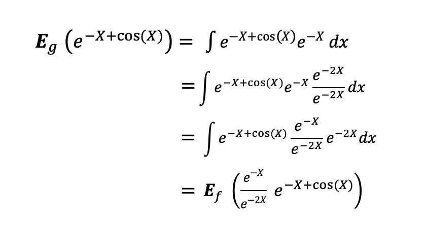

# 蒙特卡罗模拟和 Python 变种

> 原文：<https://towardsdatascience.com/monte-carlo-simulation-and-variants-with-python-43e3e7c59e1f?source=collection_archive---------1----------------------->

## 蒙特卡洛模拟指南，必须了解 Python 实现的统计抽样技术


[图片来源:帕维尔·丹尼柳克](https://images.pexels.com/photos/7594223/pexels-photo-7594223.jpeg?auto=compress&cs=tinysrgb&dpr=2&h=750&w=1260)

蒙特卡洛模拟基于重复随机抽样。蒙特卡洛的基本概念是使用**随机性**来解决原则上可能是确定性的问题。蒙特卡罗模拟是在不知道真实的潜在人口分布的情况下对人口进行推断的最流行的技术之一。这种取样技术变得很方便，尤其是当人们没有足够的时间从原始人群中重复取样时。蒙特卡罗模拟的应用范围从解决理论物理问题到预测金融投资趋势。

> 蒙特卡罗有 3 个主要用途:估计参数或统计测量，检查估计的性质，近似积分

这篇文章是关于蒙特卡罗程序的 3 种用法和 3 种蒙特卡罗变体，统计抽样技术，它们可以用来产生独立的随机样本。本文将涵盖以下主题:

```
**- Introduction to Monte Carlo Simulation
- MC Parameter Estimation
- MC Examining the Estimate Properties
- MC Integrals Approximation
- Importance Sampling
- Rejection Sampling
- Inverse Transform Sampling**
```

这篇文章适合有统计学知识的读者，因为它将涵盖中等水平的统计概念和例子。如果你想从零开始学习必要的统计学概念，可以在这里查看我之前关于 [***统计学基础的文章。***](/fundamentals-of-statistics-for-data-scientists-and-data-analysts-69d93a05aae7)

# 蒙特卡罗模拟游戏攻略

蒙特卡洛模拟最初是为了解决 [*布丰针问题*](https://en.wikipedia.org/wiki/Buffon%27s_needle_problem) 而发明的，其中 *π，pi，*可以通过将针落在由平行等距条带组成的地板上来估算。蒙特卡洛模拟的现代版本是由**斯坦尼斯拉夫·乌拉姆**发明的，他在核武器项目工作期间发明了现代版本的 [*马尔可夫链蒙特卡洛*](https://en.wikipedia.org/wiki/Markov_chain_Monte_Carlo) 技术，而**约翰·冯·诺依曼**编写了一台特殊的计算机来执行蒙特卡洛计算。冯·诺依曼还以他的著名方法而闻名，他通过扔两次不公平的硬币，忽略不同的{正面，反面}和{反面，正面}选项，使不公平的骰子变得公平。

乌兰提出的基于一系列真正随机的 T2 数的方法非常慢，但是冯·诺依曼开发了一种计算 T4 伪随机数的方法，比乌兰的方法快得多。这种方法的名字来自摩纳哥的蒙特卡洛赌场，乌兰的叔叔会从亲戚那里借钱去赌博。

> 冯·诺依曼也因他著名的方法而闻名，他通过投掷两次不公平的硬币，忽略不同的 HT 和 TH 选项，使不公平的骰子变得公平。

蒙特卡罗背后的想法是，随着我们使用更多的样本，我们的答案应该越来越准确。

# 蒙特卡罗估计

蒙特卡罗使用大数定律(LLN)通过模拟值得出总体参数的估计值。LLN 陈述:假设 **X1，X2，。。。，Xn** 都是具有相同基础分布的独立随机变量，也称为独立同分布或 i.i.d .，其中所有 X 都具有相同的均值 **μ** 和标准差 **σ** 。随着样本量的增加，所有 X 的平均值等于均值μ的概率等于 1。LLN 可以总结如下:


因此，蒙特卡罗估计背后的思想是，当我们多次获得一个参数的估计值时，假设 M = 10000 次，那么这些估计值的平均值将形成该参数的蒙特卡罗无偏估计值。


## 蒙特卡罗估计:Python 实现

假设我们想要估计两个变量(一对自变量和因变量)之间的因果关系，并且我们对截距α和斜率β的可能值有所了解。

我们能做的是从正态分布中随机抽样，以生成误差项、因变量和自变量的值。然后我们就可以估计β的系数，beta_hat，重复这个过程 M = 10000 次。然后通过 LLN，这 10000 个 beta _ hats 的样本均值将是真实 beta 的无偏估计。那就是:


# 用蒙特卡罗方法检验估计性质

蒙特卡罗模拟是检验估计量性质的有力工具。当检查线性回归估计的属性时，这可能不是很有用，因为大多数统计软件包已经提供了检查估计的方法。然而，在使用 Monet Carlo 估计的其他情况下，估计可能是找出估计量是否*无偏*、*有效、*和*一致*的唯一方法。

估计值是无偏的吗？

估计量的偏差是其期望值和被估计参数的真实值之间的差值，可以表示如下:


当我们声明估计量是*无偏的*时，我们的意思是偏差等于零，这意味着估计量的期望值等于真实参数值，即:


为了检查估计量是否无偏，我们可以使用上一步中获得的 beta_hats 的蒙特卡罗样本，并绘制这个采样分布。那么，如果这个抽样分布以真实参数值为中心，那么估计量就是无偏的。

从图中我们可以看到，我们使用蒙特卡罗模拟 10000 次迭代得到的β估计的抽样分布是以真实参数β为中心的。所以，beta_hat 的蒙特卡罗估计是无偏的。


图片来源:作者

## **估算是否一致有效？**

如果随着样本量变得非常大，估计量收敛到真实参数，那么这个估计量被称为*一致*，即:


为了检查估计量是否一致，我们可以使用我们在上一步中获得的 beta_hats 的蒙特卡罗样本，并针对少量和大量的 M 个模拟绘制其采样分布。如果我们看到，随着样本量的增加(蒙特卡罗模拟交互的次数)，抽样分布变得更窄，并且更集中于真实参数值，那么估计值很可能是一致的。

一个参数可以有多个估值器，但是方差最小的那个被称为*有效* **。**为了检查估计量是否有效，我们可以使用我们在上一步中获得的 beta_hats 的蒙特卡罗样本，并绘制少量和大量 M 次模拟的抽样分布。如果我们看到抽样分布的宽度随着样本量的增加而变小，那么估计可能是有效的。

假设我们运行 M = 1000 的蒙特卡罗模拟，并获得β的蒙特卡罗估计(左直方图)。此外，我们用 M = 10000 重新运行这个模拟(右直方图)。我们看到，随着 M 从 1000 增加到 10000，beta_hats 的采样分布更加集中在真实参数值周围。所以，beta_hat 的蒙特卡罗估计是一致的。我们看到，随着 M 从 1000 增加到 10000，beta_hat 的采样分布宽度减小。所以，beta_hat 的蒙特卡罗估计是有效的。


图片来源:作者

# 用蒙特卡罗方法近似积分

对于已知函数，如正态分布函数，计算积分可能很简单，不需要使用 MC。然而，对于更复杂的函数，计算积分可能非常困难，在这些情况下，使用 MC 可能是计算该积分的唯一方法。

用于逼近积分的 MC 是基于 LLN，其背后的思想是，如果我们可以从给定的分布 P(x)生成随机样本 xi，那么我们可以通过求和而不是积分来估计该分布下函数的期望值。换句话说，我们可以通过确定一个积分的被积函数 h 的平均值 *(x)* 来求出它的值。正如我们之前看到的，MC 就是基于这个原则。


## MC 积分逼近:Python 实现

假设我们想得到概率 Pr[X ≥ 3]，其中 X ~范数(10，2)，可以用下面的积分表示，其中 f(x)是正态分布的 pdf 函数。


然后使用蒙特卡罗模拟，通过计算这个量 10000 次并取这些值的平均值，就可以得到这个积分。

# 重要抽样

重要抽样是使蒙特卡罗模拟收敛得更快的方法之一。此外，与传统的蒙特卡罗方法相比，重要性抽样的方差也更低。它用于根据目标分布 g(x)估计某个 h(x)函数的期望值，同时可以访问某个 f(x)函数。想法是使用一些**提议的分布** f(x)从样本中抽取样本，并使用**重要性权重** w = g(x)/f(x)，以减轻高估或低估目标分布 g(x)的影响。


## 重要性采样:Python 实现

假设我们想估计服从指数分布的随机变量 X 的期望值。因此，我们的目标分布是指数分布，g(x) = Exp(1)，h(x) = exp(-X + cos(X))。


对于重要性抽样，我们需要选择一个尽可能接近目标分布的方案分布，因此我们选择 f(x) = Exp(2)。假设指数函数的 pdf 是 exp(-λ* x)，那么我们有:


其中 f(x)是我们可以从中采样的建议分布，h(x)是需要估计期望值的函数，g(x)是我们不能从中采样的目标分布，w(x)是重要性权重。那么 h(x)的期望值可以表示如下:



然后利用 LLN，我们可以把这种期望表达如下:


下图显示了 h(x)、目标分布 g(x)和提案分布 f(x)图。正如我们所看到的，提案分布与目标分布非常接近。f(x)用于随机抽取 1000 个观察点，每次计算表达式 g(x)/f(x)*h(x)，即计算重要性权重并与 h(x)相乘。然后，取这些值的平均值，得到 1.52，这是我们要找的期望值。


图像来源:作者

# 拒绝采样

剔除采样通常用于从**非正态目标分布**生成独立样本。这种蒙特卡罗采样变体背后的思想是，如果我们想从目标非标准化分布 P(x)生成随机样本，那么我们可以使用一些**提议分布** Q(x)】和一个**归一化** **常数** c，使得 cQ(x)是一些辅助分布 P×(X)的上界，其中 P(x)=(P×(X)/c 得出一个样本列表，从该列表中可接受的值将形成来自目标 P(X)分布的独立样本。

**1:** 选择一个接近目标分布 P(X)的建议函数 Q(X)

**2:** 选择归一化常数 c，使得 P×(x)≤cQ(x)

**3:** 选择辅助分布 P×(X)s . t . P(X)= P×(X)/c

**4:** 从 Q(X)生成随机样本 X

**5:** 从 Unif(0，cQ(x))生成随机样本 u

**6:** 重复步骤 1、2 M 次(如 10000 次)

**7:** 如果 u≤P×(x)，则接受 x，否则拒绝


图像来源:作者

**剔除取样的重要要求:**

*   要从中取样的方案分布 Q(x)(均匀或高斯)
*   归一化常数 c，使得 c*Q(x)
*   辅助分布 P*(x)
*   可以从提案分发中获取样本

## 拒绝采样:Python 实现

假设我们想从正态分布的混合中生成独立样本，我们希望其分布类似于 p×(x)= N(30，10) + N(80，20)。我们可以访问正态分布和均匀分布进行采样，以生成这些目标样本。我们可以使用建议函数 Q(x) = N(50，30)，归一化常数 c = max(P*(x)/Q(x))。

然后，我们按照前面描述的步骤生成样本，其中很大一部分样本被拒绝，而一些样本被接受。以下直方图显示了一组可接受的样本，这些样本是来自混合正态分布的独立样本，同时只能访问正态和均匀随机生成器。


图像来源:作者

> 剔除采样的效率非常低，因为它会剔除大量样本点，从而导致计算时间非常长。

# 逆变换采样

与剔除采样一样，逆变换采样是一种生成独立样本的方法，但与剔除采样不同，逆变换采样的效率是 100%。逆变换采样背后的思想是使用我们无法从中采样的目标群体分布的**逆累积分布函数**并使用我们可以容易地从中采样的随机生成器，从目标群体中生成独立的随机样本。

**1:** 来自 Unif(0，1)的样本值 u

**2:** 利用目标分布的逆 CDF 函数，得到值为 u 的逆 CDF 对应的 x 值

**3:** 重复步骤 1 和 2 M 次(如 10000 次)

**4:** 收集这些遵循期望分布的 x 值

**对 ITS 的重要要求:**

*   从 Unif(0，1)访问采样
*   了解目标分布 PDF/CDF
*   能够确定目标分布的逆 CDF

## 逆变换采样:Python 实现

假设我们希望从λ等于 1 的指数分布中生成独立样本，而我们只能从均匀分布中采样。因此，我们可以如下确定指数分布的逆 CDF:


然后，我们从 Unif(0，1)中随机采样，并使用这个值 u 来确定 x，使用目标分布的定义逆 CDF，即-log(1-u)。一旦这个过程重复 M = 10000 次，存储的样本就是来自目标分布的独立样本。下面的直方图显示了这些样本。


图片来源:作者

> 与拒绝采样不同，逆变换树是 100%有效的。

## 关于选择建议分布的说明

*   如果建议分布看起来非常像目标分布，蒙特卡罗变体的计算效率将是最好的。
*   当建议分布在目标分布具有不可忽略的密度的区域中具有 0 密度时，重要性抽样、拒绝抽样和逆变换抽样方法都可能严重失败。因此，建议分布应该有重尾。

## 额外资源

</fundamentals-of-statistics-for-data-scientists-and-data-analysts-69d93a05aae7>  

[https://www.youtube.com/watch?v=kYWHfgkRc9s&ab _ channel = BenLambert](https://www.youtube.com/watch?v=kYWHfgkRc9s&ab_channel=BenLambert)

https://www.youtube.com/watch?v=V8f8ueBc9sY[t = 1s&ab _ channel = BenLambert](https://www.youtube.com/watch?v=V8f8ueBc9sY&t=1s&ab_channel=BenLambert)

https://www.youtube.com/watch?v=rnBbYsysPaU&t = 566s&ab _ channel = BenLambert

# 额外资源

<https://github.com/TatevKaren>  

# 如果你喜欢这篇文章，这里有一些你可能喜欢的其他文章:

</how-to-crack-spotify-data-science-technical-screen-interview-23f0f7205928>  </fundamentals-of-statistics-for-data-scientists-and-data-analysts-69d93a05aae7>  </simple-and-complet-guide-to-a-b-testing-c34154d0ce5a>  </monte-carlo-simulation-and-variants-with-python-43e3e7c59e1f>  <https://tatev-aslanyan.medium.com/bias-variance-trade-off-in-machine-learning-7f885355e847>  <https://tatev-aslanyan.medium.com/data-sampling-methods-in-python-a4400628ea1b>  <https://medium.com/analytics-vidhya/pyspark-cheat-sheet-big-data-analytics-161a8e1f6185>  

***感谢阅读***

*我鼓励你* [***加入 Medium today***](https://tatev-aslanyan.medium.com/membership) *拥有* *完整访问所有跨媒体发布的伟大锁定内容，并在我的 feed 上发布关于各种数据科学、机器学习和深度学习主题的内容。*

*关注我* [***中***](https://medium.com/@tatev-aslanyan)**阅读更多关于各种数据科学和数据分析主题的文章。更多机器学习的动手应用，数学和统计概念查看我的*[***Github***](https://github.com/TatevKaren)**账号。
我欢迎反馈，可以联系*[***LinkedIn***](https://www.linkedin.com/in/tatev-karen-aslanyan/)*。***

*****快乐学习！*****