# 基于 Python 的制药过程蒙特卡罗模拟

> 原文：<https://towardsdatascience.com/monte-carlo-simulation-of-pharmaceutical-manufacturing-processes-in-python-b014eb96d14?source=collection_archive---------4----------------------->

## 使用 Python 对流程进行离散模拟可以突出事件成功或满足生产标准的更大概率。


由 [Shopify 合作伙伴拍摄的股票照片](https://burst.shopify.com/photos/science-lab-research-tests)

今天，群体免疫是新闻播音员、医生、科学家、教师、朋友和家人经常引用的话题。[大约 70%的世界人口将需要接种疫苗](https://www.mayoclinic.org/diseases-conditions/coronavirus/in-depth/herd-immunity-and-coronavirus/art-20486808)，以产生从我们的全球社会中根除新冠肺炎所需的免疫反应，尽管随着奥米克隆等新出现的变种，这一数字可能会更小。制造足够多的疫苗来满足需求是一个越来越大的问题，特别是在供应链限制和约束全球原材料和组件的情况下。

对于这些救命药物的制造商来说，在现有生产线产能的情况下，准确预测可以有效制造多少剂量从未如此重要。生产疫苗是一项独特的挑战，因为产品的生长频率很高，即使几十种中间体或原材料中的一种发生微小变化，也会完全改变一批产品的生长。作为患者，我们是完全安全的， [FDA 有程序来保证声誉好的公司安全地生产药物](https://www.fda.gov/vaccines-blood-biologics/development-approval-process-cber/vaccine-development-101)。然而，制造商面临的挑战仍然是如何预测能够生产的剂量的挑战和机会，以便负责任地满足预防疾病的需求。

Python 中的离散事件模拟是制作生产模型原型的最快速和可用的工具之一，甚至可以利用标准库来构建各种制造场景。在今天的练习中，我们将模拟一种假设药物的年产量，这种药物是我们在之前的两篇媒体文章中生产的。

[](/production-planning-and-resource-management-of-manufacturing-systems-in-python-5458e9c04183) [## Python 中制造系统的生产计划和资源管理

### 高效的供应链、生产计划和资源分配管理比以往任何时候都更加重要。Python…

towardsdatascience.com](/production-planning-and-resource-management-of-manufacturing-systems-in-python-5458e9c04183) [](/applied-models-of-production-planning-systems-in-python-942a2c91e6ad) [## Python 中生产计划系统的应用模型

### 用 Python 开发了生产计划系统后，就有可能扩展我们的系统以包括人员配备和…

towardsdatascience.com](/applied-models-of-production-planning-systems-in-python-942a2c91e6ad) 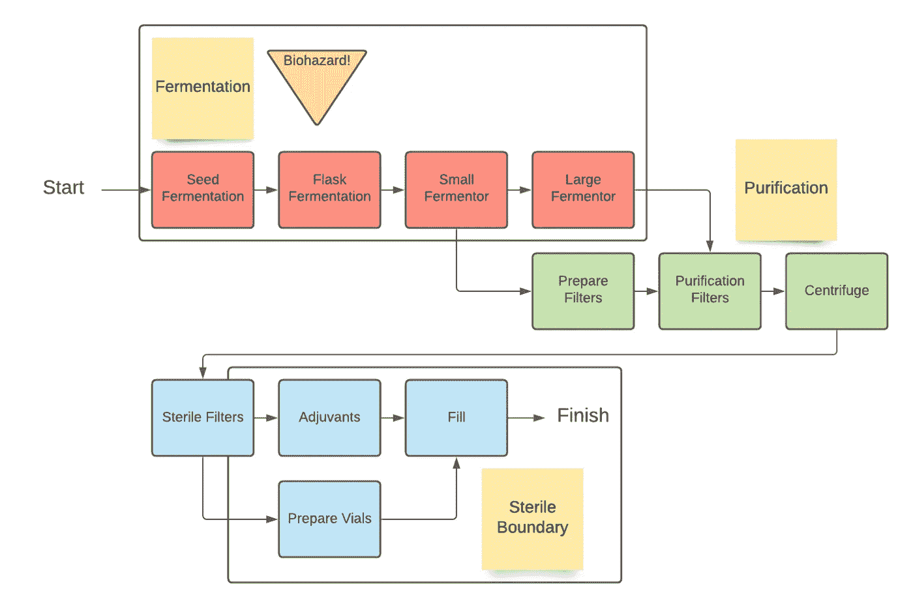

仿制药生物制品生产工艺流程图

这里我们可以看到我们假设的过程有三个主要的处理阶段:发酵、纯化和无菌边界。不足为奇的是，在一些制造过程中，每个单元操作步骤都会产生浪费和产量下降，但这些低效率的影响是复合的。最重要的是，生物空间内的变化会导致一系列预期的性能和产量，而不是每批恒定和可预测的数量。然而，能够预测这个范围是我们的模型原型可以展示巨大价值的地方。

我们将在脚本中使用几个不同的库。我们所有的图形都将在 [plotly](https://medium.com/u/5fdd6522cd45?source=post_page-----b014eb96d14--------------------------------) 内，当然 Numpy 和 Pandas 是计算的必需品。Scipy 还将用于稍后的一些统计报告。

```
import pandas as pd
import plotly.express as px
import numpy as np
import scipy.stats as st
pd.set_option("plotting.backend", "plotly")
```

下面也可以看到我们的模拟数据。请注意，在五年的时间里，每年生产二十批。我们有以克为单位记录的每次操作的产量，这些数据应该来自实验样本，尽管这些数据是为这次练习编造的。最后，我们有可用产品生产的剂量、全年生产的总剂量、所有时间生产的总剂量、我们的库存(本月的剂量，减去需求需求，加上上个月的库存)，以及预期需求或交付合同的每月需求(下面的数字很小，COVID 疫苗订单为数千万或数亿)。

```
data = pd.read_csv('SimulatedGenericDrugProductData.csv')
data['DOM'] = pd.to_datetime(data['DOM'], format = '%m/%d/%Y')
data
```

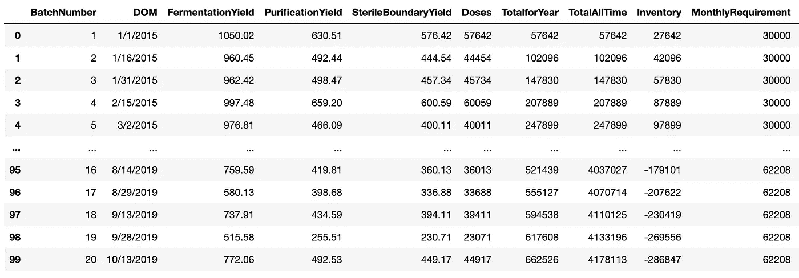

模拟过程信息数据表

现在，让我们开始规划我们的场景，并了解我们的特许经营的状态。

```
fig = px.scatter(data, x="DOM", y="Doses", trendline="ols",title='Doses of Product')
fig.show()
```


产品剂量

从上图中我们可以看出，随着时间的推移，我们生产的平均剂量一直在下降。

```
fig = px.line(data, x='DOM',y=['Doses','MonthlyRequirement'], title='Doses Made and Monthly Demand Requirement')
fig.show()
```

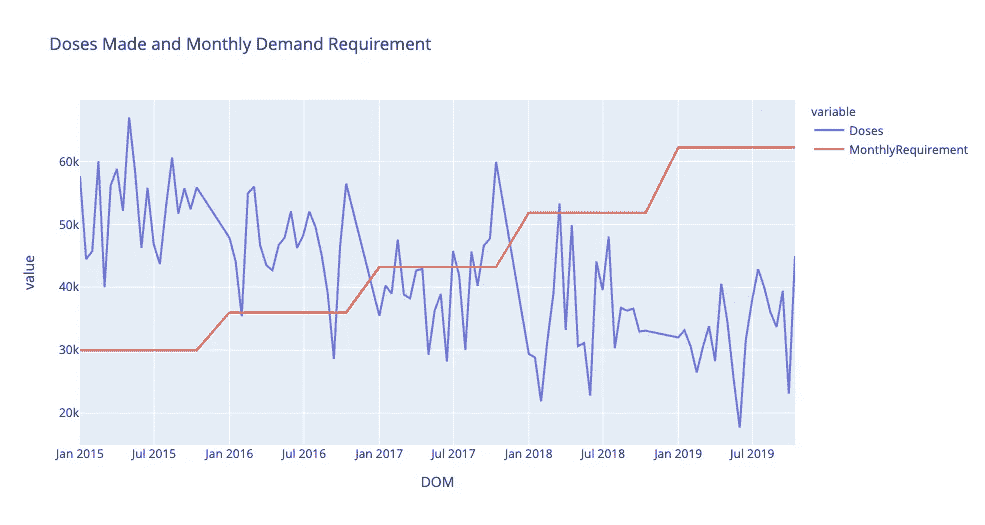

制造的剂量和每月需求

```
fig = px.bar(data, x='DOM',y=['Inventory','TotalAllTime'], barmode='group', title='Total Manufactured Doses and Inventory')
fig.show()
```

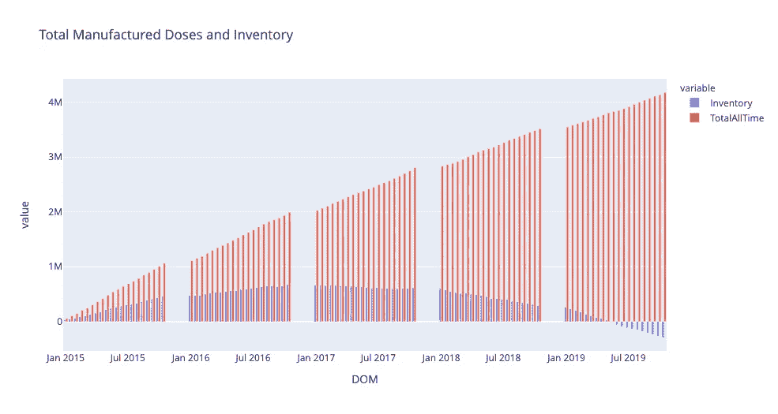

总制造剂量和库存

我们可以看到，随着时间的推移，我们的流程效率一直在下降。虽然我们仍然能够生产产品，但我们的总生产率正在下降，我们从 2019 年开始无法满足患者的需求。我们的库存下降到负值，也许这是一个点，我们要么剥夺了市场，或者竞争对手将介入供应未满足的需求。

我们的业务证明了解决问题的必要性。问题的根源是什么？比较这三个单元操作，我们可以看到过程衰减的速率是从哪里开始的。

```
fig = px.scatter(data, x="DOM", y=['FermentationYield','PurificationYield','SterileBoundaryYield'], trendline="ols",title='Grams of Product')
fig.show()
```

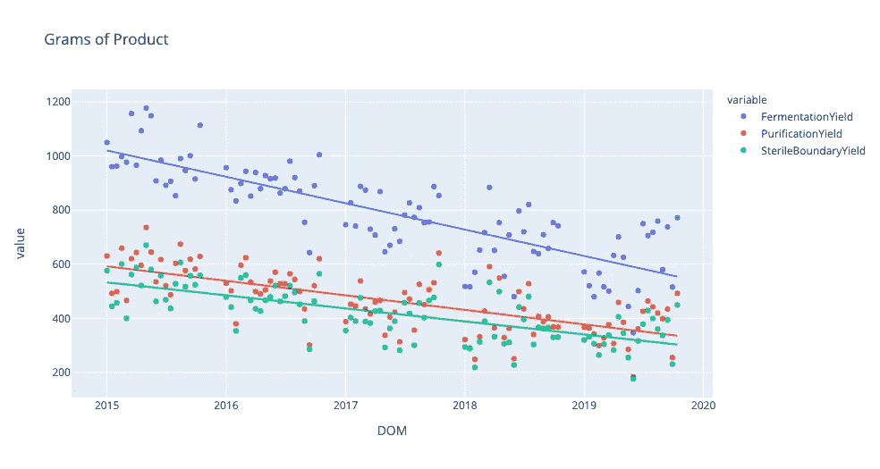

每个单元操作中生产的产品克数

随着时间的推移，我们的发酵过程已经降低了效率。也许下一步会调查我们设备的机械问题，我们使用的原材料的质量，或者我们每批使用的种子的健康状况。

假设对流程的任何更改都需要大量的时间来实施，我们可以预期我们明年的绩效会是什么样的？一年的批量产量是多少？我们能满足 40 万人的需求吗？500,000;或者全年生产 60 万剂？

为了回答这些问题，我们需要准备一个明年的模拟群体，比如说 1000 人，看看随机事件的发生如何影响明年生产计划的执行。这个过程被称为蒙特卡罗模拟，因为随机抽样将指示我们做出更广泛的概括(最初源于赌场的名称)。各种潜在事件都有可能发生，例如设备故障两个月，原料质量下降导致产量下降，员工因病减少，供应链问题导致材料不可用等。其中一些事件的统计离散分布是二项式的，这意味着这些事件发生或不发生的可能性有一定的百分比，但我们将简化我们的模型，只根据我们模拟的下一年的表现来检查每年每个单元操作的产量。

```
data2015 = data[data['DOM'].dt.year == 2015]
data2016 = data[data['DOM'].dt.year == 2016]
data2017 = data[data['DOM'].dt.year == 2017]
data2018 = data[data['DOM'].dt.year == 2018]
data2019 = data[data['DOM'].dt.year == 2019]
```

让我们来看看这些数据。

```
fig = px.histogram(data2018, x='FermentationYield', title='Assumption: Normal Distribution')
fig.show()
```

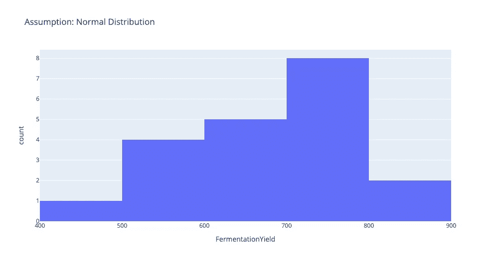

```
data2018.describe()
```

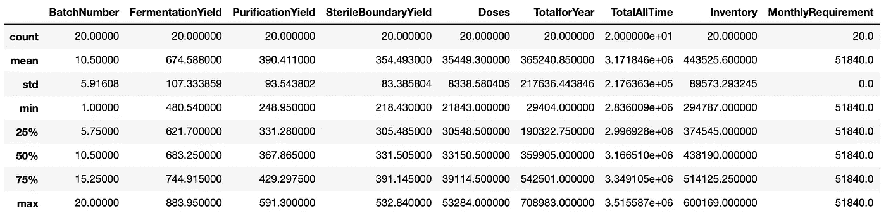

2018 年业绩数据表

这里汇集了我们对未来几年的一些早期假设。根据我们早期的模型，我们可以假设我们的性能随着时间线性下降。在这个实验中，我们还可以假设(尽管每年有 20 个以上的数据点也不错)每年的产量呈正态分布。这个钟形曲线将有助于我们的模型编程，现实生活中的模型可能会显示这个或其他分布，就像故障事件的二项式分布，甚至三角形、常数或威布尔分布等等。

检查我们不同操作收益之间的关系，我们还可以注意到一些趋势。

```
fig = px.scatter(data, x="FermentationYield", y='PurificationYield', trendline="ols",title='Fermentation vs Purification Yields')
fig.show()
```

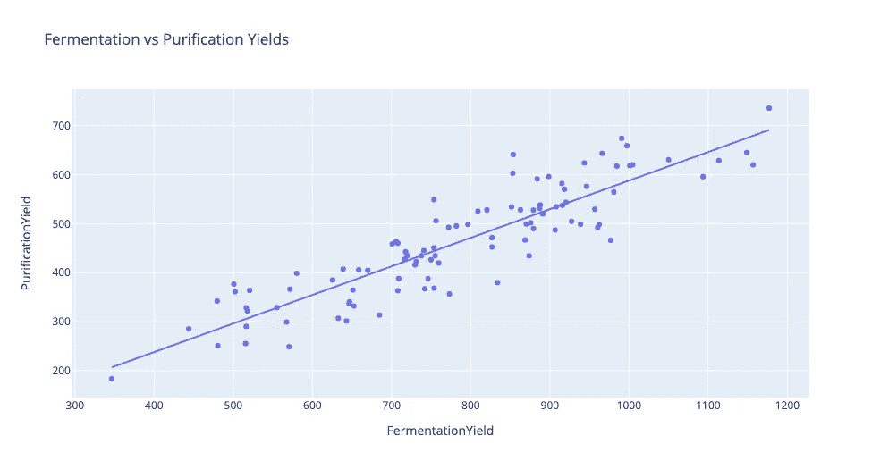

```
fig = px.scatter(data, x="PurificationYield", y='SterileBoundaryYield', trendline="ols",title='Purification vs Sterile Boundary Yields')
fig.show()
```

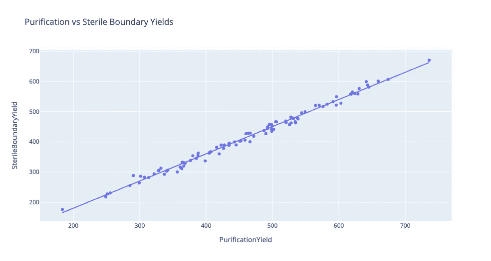

```
fig = px.scatter(data, x="SterileBoundaryYield", y='Doses', trendline="ols",title='Sterile Boundary Yield vs Doses')
fig.show()
```

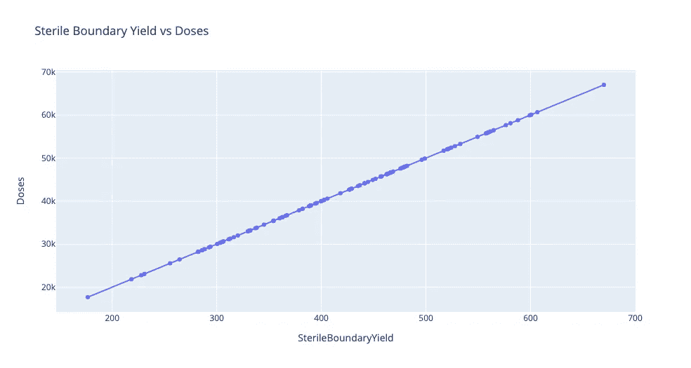

对于这些图表中的每一个，Plotly 还绘制了一个普通的最小二乘趋势线。后两个图表的点更接近趋势线，也意味着在它们的正态分布中有更低的变化，或更紧密的钟形曲线。

创建正态分布点只需要标准偏差、平均值和随机生成值。生成这些数字的实际函数如下，但是 Python 中有一些函数可以为我们计算这些数字。

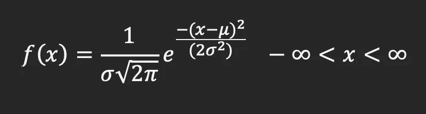

为了生成一个模拟的年度绩效，我们将首先为一年的 20 个批次设定一个索引号。我们有一个来自发酵对指数的第一个回归模型的函数，其中我们的平均值是指数(101 到 120)，发酵产量的标准偏差每年约为 100g。我们的纯化产率的平均值是以前的发酵产率乘以我们上面的发酵与纯化图的斜率，或者大约为 0.6 (10 克发酵导致 6 克纯化)。这里的标准偏差约为 75。无菌边界产量几乎是恒定的:发酵过程中产生的 90%，最终剂量数是无菌边界产量的 100 倍。执行这些计算 1000 次，将产生我们下一个制造年度的可能年度绩效的总体范围。

```
batchNumberFromIndex = list(range(101,121))def FermRandom(index):
    x = index*(-5.0)+1025
    return np.random.normal(x,100)
def PurRandom(ferm):
    x = ferm*0.6
    return np.random.normal(x,75)
def SBRandom(pur):
    return pur*0.9
def DosesRandom(SB):
    return SB*100newYearRandom = pd.DataFrame({'batchNumberFromIndex': batchNumberFromIndex})
def generateRandomOutcomes(df1,populationSize):
    dosesList = []
    for i in range(0,populationSize):
        df = df1.copy()
        df = df.assign(Ferm = lambda x: FermRandom(df['batchNumberFromIndex']))
        df = df.assign(Pur = lambda x: PurRandom(df['Ferm']))
        df = df.assign(SB = lambda x: SBRandom(df['Pur']))
        df = df.assign(Doses = lambda x: DosesRandom(df['SB']))
        dosesList.append(df.sum()['Doses'])
    return dosesListdistOfYearDoseSums = generateRandomOutcomes(newYearRandom,1000)
distOfYearDoseSumsDF = pd.DataFrame(distOfYearDoseSums,columns=['DosesForYear'])
distOfYearDoseSumsDF
```

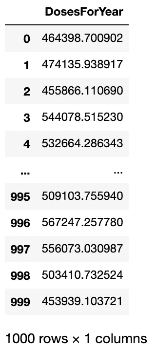

现在我们的蒙特卡罗模拟已经完成，我们可以开始分析结果了。

```
fig = px.histogram(distOfYearDoseSumsDF, x='DosesForYear', title = 'Distribution of Likely Doses Manufactured Next Year')
fig.show()
```

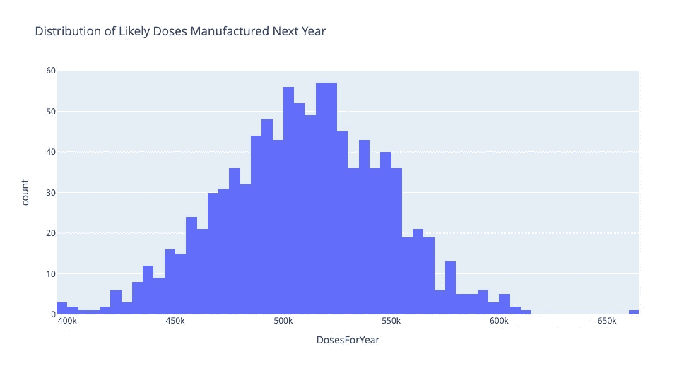

```
distOfYearDoseSumsDF.describe()
```

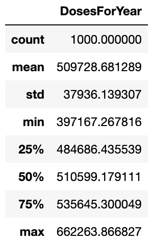

我们可以看到结果的接近正态分布，平均集中在明年生产的 510，000 剂左右。使用在 SciPy 的统计库中计算的 Z 分数和概率函数，我们还可以计算我们有多大可能达到制造的剂量的某些里程碑，例如 400k、500k 和 600k。

```
z = (400000.00-distOfYearDoseSumsDF.mean()[0])/(distOfYearDoseSumsDF.std()[0])
1-st.norm.cdf(z)
OUT: 0.9980887972401362z = (500000.00-distOfYearDoseSumsDF.mean()[0])/(distOfYearDoseSumsDF.std()[0])
1-st.norm.cdf(z)
OUT: 0.6011978843565298z = (600000.00-distOfYearDoseSumsDF.mean()[0])/(distOfYearDoseSumsDF.std()[0])
1-st.norm.cdf(z)
OUT: 0.008666661053801317
```

我们可以看到，1000 次试验中约有 60.1%生产了 50 万剂或更多，因此我们可以推断，明年的表现有 60%的机会满足 50 万剂的需求。也分别有 99.8%和 0.9%的机会满足 40 万和 60 万剂的需求。

我们可以使用这些模型来帮助我们的制造工厂做出决策，并寻求我们的合同。例如，如果我们正在生产 COVID 疫苗，我们只想在我们的生产能力范围内接受合同，在这种情况下，我们认为并能够证明这几乎是我们能够满足需求的保证。或者，如果我们有足够的谈判时间，我们可以使用这些数据来建立产能模型，以启动多条生产线来支持对制造基础设施的进一步资本投资。

请让我知道您的想法，并随时通过 LinkedIn 联系我，向我提供反馈，提出问题，或者看看我们如何将这些工具和思维方式引入您的组织！点击[这里](https://medium.com/@willkeefe)查看我的其他一些关于数据分析和生产计划的文章！