# Streamlit 蒙特卡洛模拟网络应用程序

> 原文：<https://towardsdatascience.com/monte-carlo-simulation-web-app-using-python-e92780800a2?source=collection_archive---------35----------------------->

## 用 Python 和 Streamlit 构建概率内在价值计算器

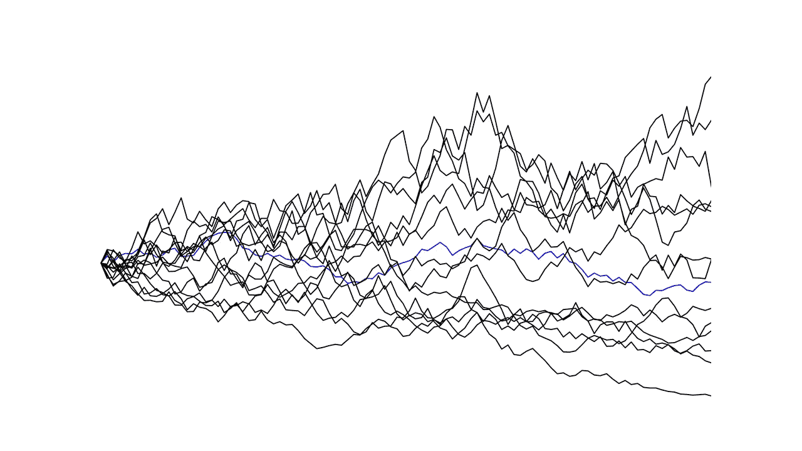

***注来自《走向数据科学》的编辑:*** *虽然我们允许独立作者根据我们的* [*规则和指导方针*](/questions-96667b06af5) *发表文章，但我们不认可每个作者的贡献。你不应该在没有寻求专业建议的情况下依赖一个作者的作品。详见我们的* [*读者术语*](/readers-terms-b5d780a700a4) *。*

评估一家企业本身就是一项概率性的工作:

"预计的收入增长实现的可能性有多大？"
“即将到来的后台运营数字化将在多大程度上提高利润率？”明年联邦税率会提高吗？如果会，会提高多少？

对大量此类公司和市场相关问题的回答，对作为估值模型输入变量的关键指标有着直接的影响。处理这种不确定性的一种方法是将对内在价值计算有影响的财务指标视为随机分布的变量。通过反复从指定的随机分布中抽取变量实例，并通过几次迭代使用这些抽取来计算公平的公司价值，投资者可以对公司价值的内在可变性有一个印象。

这种方法也被称为蒙特卡罗模拟，这是一种将公司估值的概率性质纳入计算的有力工具。为了尝试利用蒙特卡罗模拟，我使用 Python 和 Streamlit 创建了一个简单的 web 应用程序。这篇短文将突出基础金融理论并讨论应用程序设计。

# 金融理论

公司的内在价值或公允价值是企业产生的未来自由现金流的总和，按风险调整率贴现。用更多的数学术语来说，这可以归结为以下等式:

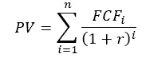

其中，FCF 是公司在第一年产生的自由现金流，r 是风险调整后的贴现率。自由现金流是通过从公司运营产生的现金流中扣除公司的资本支出(如设备投资)来确定的。然后使用风险调整贴现率 r 对这一指标进行贴现，以说明现金流的风险和投资于公司的资金的时间价值。

由于预测未来五年以上的自由现金流很困难，戈登增长模型通常用于计算终端公司价值，然后使用风险调整贴现率进行贴现。戈登增长模型将基础公司产生的现金流视为一种不断增长的永续性，而这种永续性又通过以下等式进行估值。

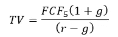

其中，FCF 是公司未来五年产生的自由现金流，g 是公司第六年及以后的恒定增长率。

虽然贴现率 r 和最终增长率 g 是内在价值计算的重要输入变量，但后续分析和 web 应用程序将它们视为给定变量，并关注与预测自由现金流相关的输入变量。因此，仔细看看自由现金流到底是如何确定的似乎是有希望的。

要获得公司产生的自由现金流，需要采取几个步骤:

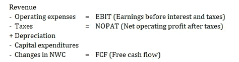

其中，NWC 代表净营运资本，等于流动资产头寸(扣除现金)减去流动负债头寸(扣除流动债务)。NWC 的变化从 NOPAT 中扣除，因为流动资产的增加会导致现金流出，但不会减少股东权益。

因此，给定要估值的公司的当前收入数字，投资者需要几个输入来预测 FCF。这些输入是(1)收入增长率，(2)EBIT 利润率，(3)公司税率，(4)净资本支出/销售额，以及(5)NWC/销售额。

所有这五个度量都不能提前确定地知道，因此它们非常适合作为蒙特卡罗模拟中的输入变量。在获得这五个随机变量的实例后，我们可以使用这些数字来计算每次迭代的公司总价值的一个实例。由于随后将更详细地处理模拟的机制，我将首先更详细地解释应用程序如何计算自由现金流。

给定输入值，前五年的收入计算如下:

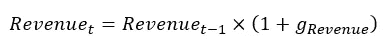

使用其他四个输入值，自由现金流可以简单地按照上面的推理来确定。然后使用适当的贴现因子对 t 年的最终自由现金流进行贴现，随后对这些现值求和。此外，将使用上述等式确定的终端公司价值的现值相加，得到总公司价值，也称为企业价值。

由于企业价值是公司对权益和债务持有人的价值，我们需要扣除净债务头寸(总债务减去现金)来得出公司的权益价值。按照这个过程，Python 脚本生成了一个 pandas 数据帧，如下所示，很好地总结了所需的所有步骤:

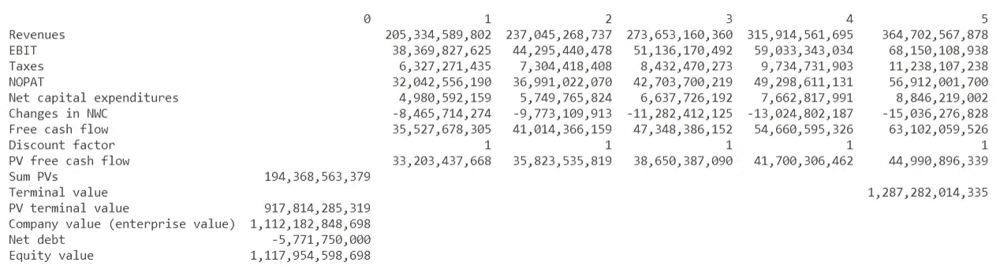

表 1: DCF 模型输出(由于输出四舍五入，贴现因子等于 1)

前面的步骤描述了在给定一组全部五个随机输入变量的情况下确定公司内在价值所需的过程。下一节中描述的 web 应用程序遵循这种方法多达 1000 次，使用稍微不同的输入数据集来获得多达 1000 个潜在的内在公司价值。

# Web 应用程序概述

当点击 web 应用程序的[链接](https://share.streamlit.io/julianmarx/mcvaluation/main/mc_valuation.py)时，用户会看到以下屏幕:

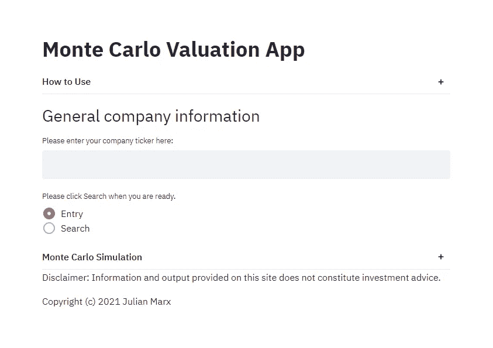

图 web 应用程序的初始屏幕

进入公司股票市场并点击“搜索”后，该应用程序从雅虎财经获取所需的财务数据，并以熊猫数据框架的形式返回。在这一点上，需要注意的是，股票代码必须采用 Yahoo Finance 使用的形式。例如，当查找戴姆勒公司时，用户必须输入戴。德，不仅仅是戴。

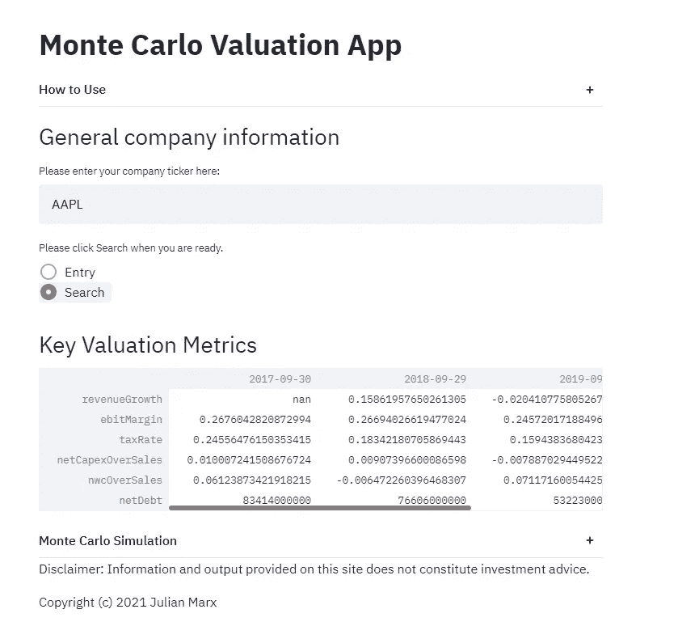

图 2:评估指标输出

在指定五个随机变量时，可以随后使用关键评估指标(如收入增长率)的历史信息。

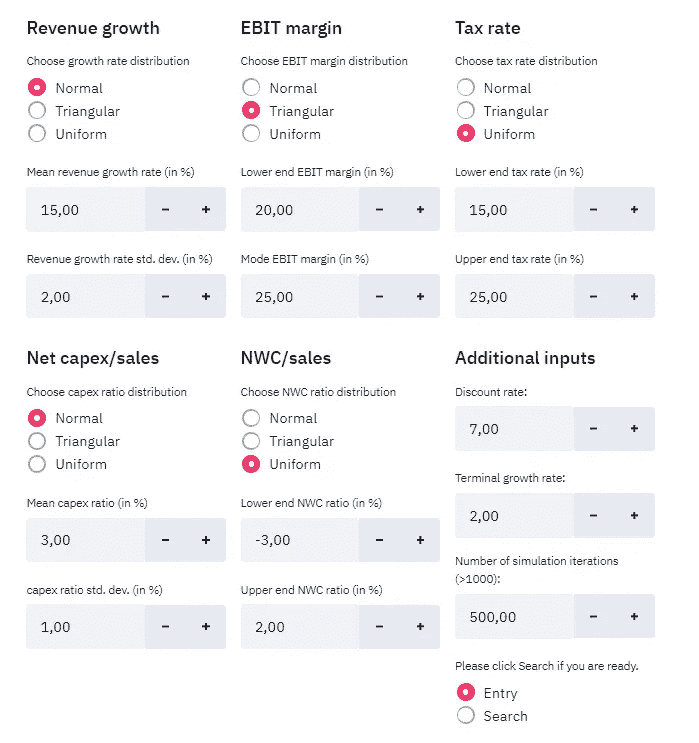

图 3:随机变量输入

在指定输入变量时，应用程序提供了三种随机分布供选择。在本例中，假设收入增长呈正态分布，平均增长率为 15%，标准差为 2%。公司 EBIT 保证金按三角形分布，低端 20%，众数 25%。此外，假设模拟的任何迭代中的税率是从 15%至 25%范围内的均匀分布中随机抽取的。类似地，分配规定为净资本支出/销售和 NWC/销售比率。

最后，用户需要提供公司的折扣率和终端增长率，以及期望的模拟迭代次数。

单击“搜索”后，应用程序进行蒙特卡罗模拟，并提供几个输出。除了平均股权价值及其标准差，该程序还显示一个直方图，提供股权价值分布的概述。此外，收入和 EBIT 预测数字以折线图形式提供。

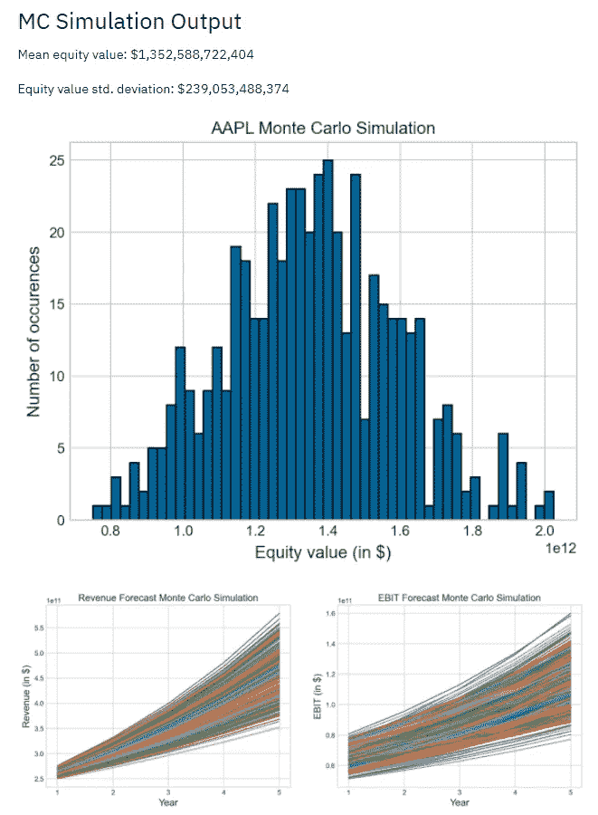

图 4:蒙特卡罗模拟输出

# 使用 Python 进行应用程序设计

这一节将更详细地介绍应用程序使用的 Python 代码，这些代码可以在我的 [GitHub](https://github.com/julianmarx/mcvaluation/tree/main) 上找到。

每当用户输入公司股票并点击“Search”按钮时，脚本就会创建一个 company 类的实例。公司对象具有以下属性:

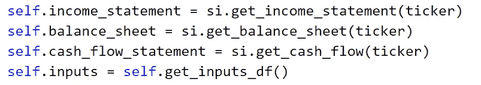

此外，Company 类有三个方法。

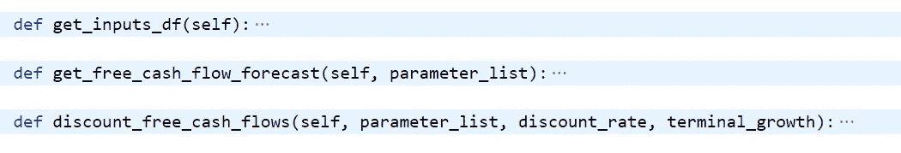

get_inputs_df 方法计算关键评估指标，并以熊猫数据帧的形式返回它们，然后显示给用户(如图 2 所示)。

get_free_cash_flow_forecast 方法将七个参数列表作为输入(最新收入、收入增长率、EBIT 利润率、税率、净资本支出/销售额、NWC/销售额和净债务)，并返回包含自由现金流预测的数据帧(如表 1 顶部所示)。

discount _ free _ cash _ flows 方法将参数列表、贴现率和终端增长率作为输入变量，并调用 get_free_cash_flow_forecast 方法来获得自由现金流预测。随后，贴现自由现金流，计算公司权益价值，得到表 1 所示的数据框架。

总的来说，给定所需的参数，在蒙特卡洛模拟中，每次迭代都会调用一次 discount _ free _ cash _ flows 方法。虽然假设公司的贴现率和终端增长率不会从一次迭代到下一次迭代发生变化，但包括收入增长率等变量的参数列表是使用以下函数确定的。

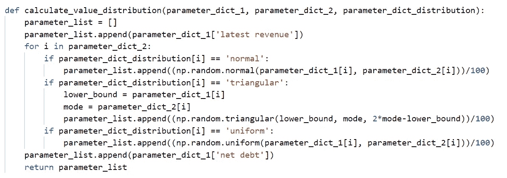

最后，下面这段代码将不同的方法和函数联系在一起，进行模拟并返回收入和 EBIT 预测的列表，以及在模拟的每次迭代中计算的股票价值的列表。

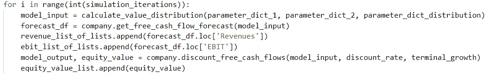

应用程序的整个用户界面都是使用 Streamlit 库创建的，这使得创建 web 应用程序变得非常容易。Streamlit 的共享服务极大地方便了应用程序的公开发布。关于如何整合 Streamlit 的更详细的解释，你可以看看我的 [GitHub](https://github.com/julianmarx/mcvaluation/tree/main) ，我上个月发表的另一篇[文章](/creating-a-financial-dashboard-using-python-and-streamlit-cccf6c026676)，或者 [Streamlit 网站](https://www.streamlit.io/)。

# 结束语

总的来说，我认为将概率因素纳入公司估值有助于调整公司未来固有的不确定性。虽然蒙特卡洛模拟有一定的局限性，但它们可能因此成为投资者的有用工具。我希望上面描述的 web 应用程序可以帮助进行这样的模拟，帮助用户做出更明智的决策。

# 放弃

上面提供的代码只是将 Python 编程应用于金融领域的一个练习。本文和 web 应用程序网站中包含的信息不应用于投资决策。