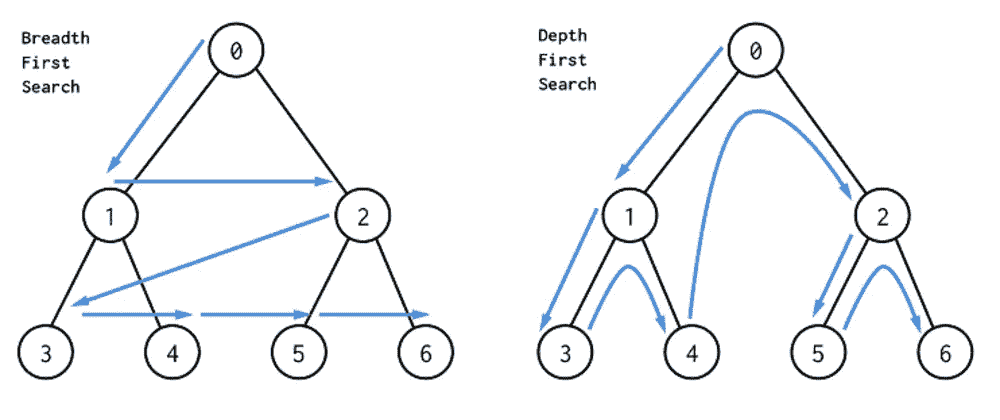
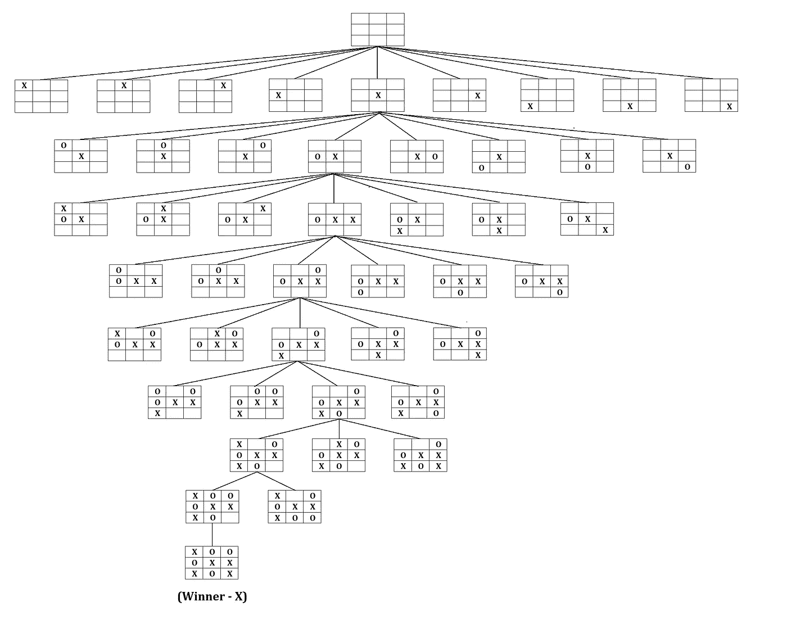
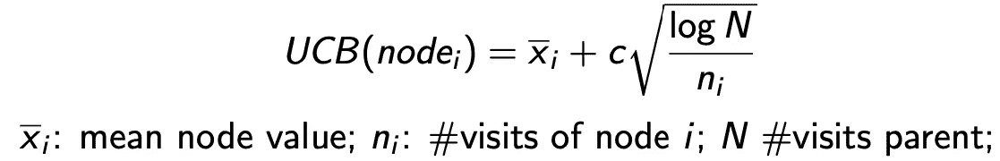
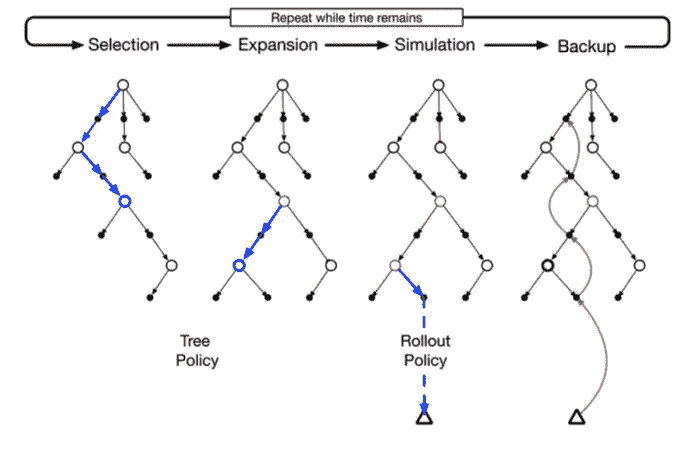
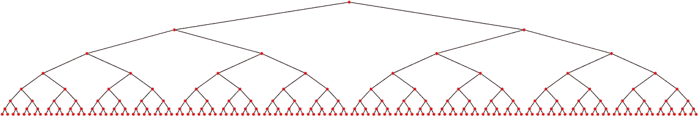

# 蒙特卡罗树搜索:简介

> 原文：<https://towardsdatascience.com/monte-carlo-tree-search-an-introduction-503d8c04e168?source=collection_archive---------1----------------------->

## MCTS 是 AlphaGo 和许多人工智能应用的基石。我们的目标是建立一些直觉，并在此过程中弄脏我们的手。


蒙特卡洛(图片来自 [Unsplash](https://unsplash.com/photos/1CkSNmbT7J0)

蒙特卡罗树搜索(MCTS)是近期人工智能应用许多重大成功背后的重要算法，如 AlphaGo 在 2016 年的惊人对决。

在这篇博客中，我们将首先从*不知情搜索*开始，在这个过程中，我们简单地遍历整个搜索空间来找到最优解。它包括**深度优先搜索**和**广度优先搜索**。

然后我们接着描述 MCTS 算法是如何工作的。最后，我们将它应用于一个玩具示例问题，寻找二叉树的最有价值的叶节点。

# 不知情的搜索

无信息搜索，顾名思义，是一种通用的搜索算法，除了一个抽象的问题定义之外，没有给出任何额外的信息。尽管通过正确的问题抽象，它们可以被普遍应用，但是当问题变大时，它们通常会遇到效率问题。



DFS 和 BFS ( [图片来源](https://dev.to/danimal92/difference-between-depth-first-search-and-breadth-first-search-6om))。我自己的 Github repo[wlong Xiang/mcts](https://github.com/wlongxiang/mcts/blob/main/uninformed_tree_search.py)中的直观实现。

分支因子为 *b* 且深度为 *d* 的树将具有 b^d(读作 *b* 的 *d* 次方)个叶节点。

在游戏中，我们使用所谓的游戏树，其中每个节点代表一个游戏的状态，其子节点代表玩家可以采取的所有可能行动的可能下一个状态。



井字游戏树([图片来源](https://www.ques10.com/p/12787/draw-game-tree-for-a-tic-tac-toe-problem-1/))。注意，由于空间原因，它没有完全展开。

根据维基百科[和](https://en.wikipedia.org/wiki/Branching_factor)，Go 的平均分支因子为 250。信封计算的一些背面将很快显示在 Go 中使用不知情的搜索是多么禁止:

*   在步骤 1: 250
*   在第 2 步:250 = 62500
*   在第 3 步:250 = 15，625，000
*   在第 4 步:250⁴= 3906250000
*   在第 5 步:250⁵ = 976，562，500，000
*   …
*   在第 10 步:250⁰= 95367431640625000000000

经过 10 步之后，我们已经看到了一系列可能的游戏状态。这也在一定程度上解释了为什么 AlphaGo 的胜利是人类的一个里程碑。

# 蒙特卡罗树搜索

现在，我们明白了这样一个事实，我们需要比不知情的搜索更聪明的东西来浏览像围棋这样的巨大国家空间。MCTS 就是这样一种智能算法，它给我们提供了一条出路。

从本质上来说， **MCTS 使用蒙特卡罗模拟来累积价值估计，以引导搜索树中高回报的轨迹**。换句话说，MCTS 更关注那些更有前途的节点，因此它避免了不得不强行尝试所有不切实际的可能性。

在其核心，MCTS 由 4 个步骤的重复迭代组成(理想情况下是无限的，实际上受计算时间和资源的限制):**选择、扩展、模拟和备份。**

## 选择

在这一步，我们使用*树策略*来构建从根到最有希望的*叶节点*的路径。

叶节点是具有未探索的子节点的节点。

树策略是用于*雪盖*中动作(节点)选择的明智策略(游戏树中探索过的部分，而不是大量未探索的底部)。这种策略的一个重要考虑是**探索与利用的平衡，**这是人工智能中反复出现的话题，尤其是在强化学习中。

在 AlphaGo 背后的算法中，使用了基于 UCB 的策略。更具体地说，每个节点都有一个关联的 UCB 值，在选择过程中，我们总是选择具有最高 UCB 值的子节点。



如我们所见，节点 *i* 被访问得越多，UCB 的第二任期就变得越低，从而降低了其再次被选中的概率。因此，UCB 算法天生就具有探索和利用的特性。聪明利落！

关于探索与开发(包括 UCB)的更严谨但仍易于理解的叙述，请阅读 [Lilian Weng 关于这个主题的博客](https://lilianweng.github.io/lil-log/2018/01/23/the-multi-armed-bandit-problem-and-its-solutions.html)。

最后，在选择步骤中，我们可以遍历雪盖或探索树的一部分，直到到达一个叶节点。

## 膨胀

还记得我们在选择结束时到达一个叶节点吗？

在扩展步骤中，我们简单地随机选取一个叶节点的未探索节点。

## 模拟(或推广)

在此步骤中，我们推出一个或多个模拟，每个模拟都会累积奖励。推出策略通常是简单的，甚至是完全随机的，因此执行起来很快。例如，一场胜利可能导致+1 的奖励，0 的平局和-1 的失败。

有人可能会问，何必呢？

在围棋比赛中，这一步就像算法，就像围棋大师可能会在他/她的脑海中做的那样，玩很多次游戏，直到它结束。真正的天才不仅能看到未来，还能看到未来的许多版本。

## 支持

现在我们已经完成了许多模拟，我们可以用它来通知最佳的下一步行动？

我们使用模拟的累积奖励来备份和更新*雪盖*中节点的值。

注意:在推出步骤中，我们不更新节点的值！这样做是因为我们需要关注根节点(雪盖)的附近，基于此我们需要做出下一步行动的决策。而雪盖之外的值与这种决策无关，存储和计算起来也没有计算效率。

## 放在一起



简介中的图片:萨顿和巴尔托的《强化学习》

伪代码可能如下所示:

```
def run(node, num_rollout):
    *"one iteration of select->expand->simulation-> backup"* path = select(node)
    leaf = path[-1]
    expand(leaf)
    reward = 0
    for i in range(num_rollout):
        reward += simulate(leaf)
    backup(path, reward)
```

注意，这是给定特定根节点(例如游戏树中的节点)的 MCTS 的一次迭代。在实践中，我们可以对这 4 个步骤进行尽可能多的迭代，在此期间，在模拟步骤中可以进行多次部署。在计算时间或资源耗尽后，我们停止迭代循环，并决定下一步采取什么行动，然后我们以一个新的根节点结束，并再次运行迭代，等等…

# 一个简单但不简单的例子

(代码可从 [git repo](https://github.com/wlongxiang/mcts) 获得)

让我们假设，我们有一棵深度为 7 的二叉树，它的所有叶节点都带有一个从 0 到 100 之间的奖励，这个奖励来自均匀分布。我们的任务是在 2⁷叶节点中找到最高的回报(注意:这里使用的叶节点是它的基本含义，即树中没有孩子的节点，不像在 MCT 中我们使用叶节点来表示具有未探索的孩子的节点)。



深度= 7 的示例二叉树，按照[指令](https://tex.stackexchange.com/questions/203399/drawing-binary-trees-with-latex-labels)创建

读者可以检查我的 [git repo](https://github.com/wlongxiang/mcts) ，并运行`find_max_leaf_binary_tree.py`。该代码方便地包含了几个参数:

*   `numb_iter`改变 MCTS 迭代次数
*   `num_rollout`在模拟过程中更改展开次数
*   控制勘探和开采之间的平衡

够玩！

默认运行显示以下结果:

```
Expected (max) leaf node: node@7_53, value: 99.16984625936269
Expected (min) leaf node: node@7_121, value: 1.2521064278136151
Found optimal (max) leaf node: node@7_104, value: 95.8546572417074
```

不算太坏，找到的最优节点非常接近它的期望值(注意，由于它的概率性质，您可能不会得到精确的结果)。

# 结论

许多人工智能问题都源于搜索问题。毕竟，生活就是寻找。希望你们都找到自己的最优路径:)。